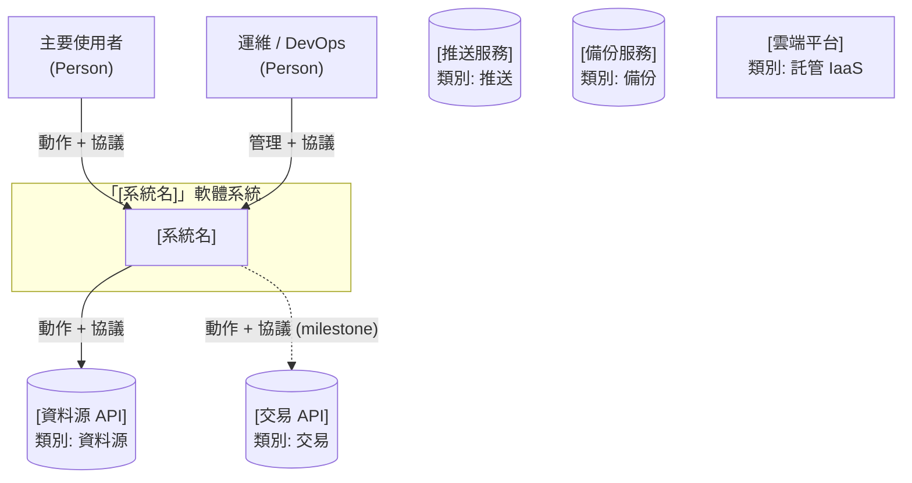
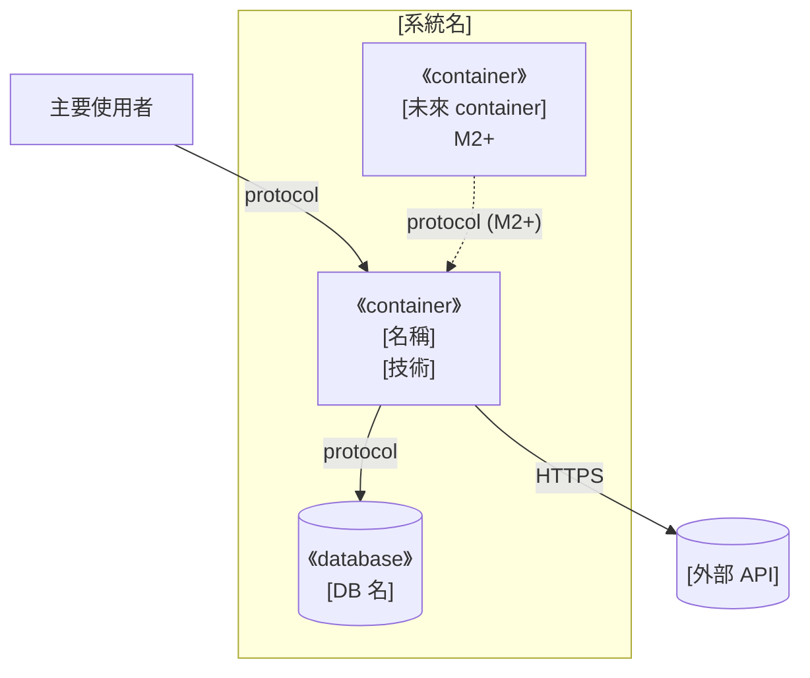
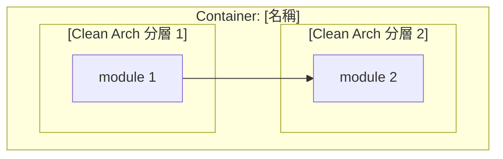
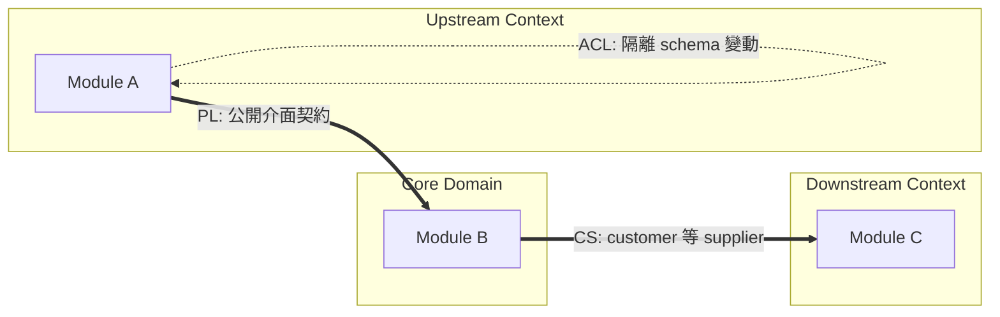
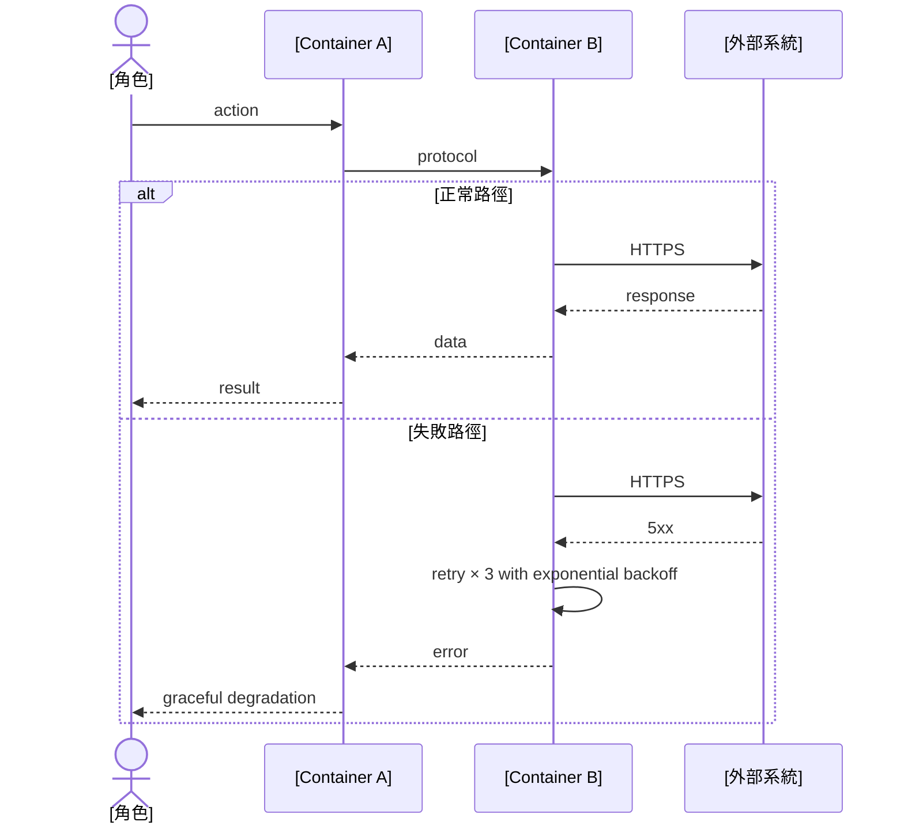
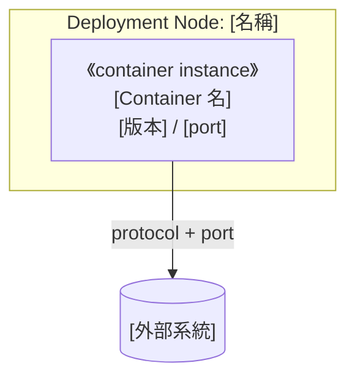

# 架構與設計文件 - [專案名稱]

> **版本:** v3.0 | **更新:** YYYY-MM-DD | **狀態:** 草稿/審核中/已批准
>
> **v3.0 重大修訂（2026-05-26）**：v2.0 的 C4 嚴格 + DDD 雙層 + 跨檔一致性已穩定，
> v3.0 補齊「可驗證 / 可演進 / 組織映射」三維度：Quality Attribute Scenarios、
> Architecture Fitness Functions、Resilience Patterns、Anti-Decisions、Threat Model
> (STRIDE)、Observability 3 pillars + RED/USE、Team Topology（Conway's Law）、
> Migration Path、Cross-Cutting Concerns 專節、Data Lifecycle、Capacity Planning、
> Tech Radar lifecycle、Diagram-as-Code 工具、C4 supplementary diagrams。

---

## ⚠️ 使用前須讀：常見地雷（13 個）

新手套用本模板最常踩的坑（按嚴重程度排序）：

1. **C4 L1–L4 與業務 layer 撞名** — 業務有「四層計分」也叫 L1–L4 → 自動撞名。**解法**：§1.1.0 命名防呆表強制區分
2. **L2 把 module 當 Container** — 把 `scoring.py` 畫成 Container。**Container = runtime / process，不是 module**
3. **L3 跨 Container** — 一張 L3 混 Application + DB + 外部 API。**鐵律：一張 L3 圖對應且僅對應一個 L2 Container**
4. **Partial Disclosure** — L1 缺 Telegram / 雲端 / 備份。**解法**：§1.1.2 強制列五大類外部系統
5. **DDD 限界上下文圖箭頭畫成 data flow** — 應是 Strategic Relationship（CS / ACL / SK / PL）
6. **缺 Sequence Diagram** — 文字流程不算 Dynamic Diagram
7. **Deployment 與 L2 混用** — Deployment 是 L2 的「實體化」，含 Node 屬性與 instance 標記
8. **箭頭無 protocol 標籤** — 看不出 HTTPS / SQL / file I/O
9. **跨文件不一致** — 08 結構文件有 live/、05 沒畫 → 文件互相打臉
10. **沒有 future state** — 只畫當前。看不出 milestone 終點
11. **NFR 太抽象** — 「P95 < 200ms」沒情境，無法測。**解法**：用 QAS（§2.3）
12. **架構規則只在文字** — 應該變成 fitness function（§9）
13. **忘記寫「不做什麼」** — 沒有 Anti-Decisions（§3.7）導致重複爭辯已決事項

---

# 第 1 部分：架構總覽

## 1.1 C4 模型（嚴格版）

### 1.1.0 命名防呆（必填）

| 術語 | 指什麼 | 勿混淆 |
| :--- | :--- | :--- |
| **C4 L1–L4** | 架構圖縮放層級（情境 → 容器 → 元件 → 程式碼） | ≠ 業務分層、≠ Clean Architecture 層 |
| **C4 Context（L1）** | 整個軟體系統相對外界 | ≠ DDD「限界上下文」 |
| **C4 Container（L2）** | 可獨立部署 / 執行的 runtime 單位 | ≠ Python package、≠ Clean Architecture 分層 |
| **C4 Component（L3）** | **單一** L2 容器內的模組 | 禁止跨容器畫在同一張 L3 |

> **規則**：業務名詞撞名 C4（如「v2 L1–L4 計分」），C4 章節**強制用全稱** `Container` / `System Context`。

### 1.1.1 層級規則

| 層級 | 英文名 | 一張圖只回答 | 方塊必須是 | 禁止 |
| :---: | :--- | :--- | :--- | :--- |
| **L1** | System Context | 誰用？與哪些外部系統互動？ | 人、本系統（**一個**）、外部系統 | 內部模組、檔名、GitHub/IDE |
| **L2** | Container | 系統內有哪些 **runtime**？ | Process、DB、檔案儲存、排程、UI | 把 module 當 container |
| **L3** | Component | 某一個 L2 容器內部怎麼拆？ | 模組 / package | 跨容器；一張圖混多容器 |
| **L4** | Code | 類別 / 函式（可選） | class、function | 小專案可省略 |

**層級關係**：樹狀 zoom-in，**不是執行序列**。

### 1.1.2 Container 清單（必填）

| Container | 類型 | 技術 | 何時啟用 | L3 圖 |
| :--- | :--- | :--- | :---: | :---: |
| | | | | |

**規則**：
- 每個 Container 都標 L3 揭露狀態（✅ 有圖 / 表代圖 / 略 + 理由）
- 未來啟用的 Container 用**虛線**畫進 L2，並在表中標 milestone
- **外部系統清單**獨立列出，**強制覆蓋五類**：資料源、交易、推送、備份、雲端 IaaS（缺一視為 partial disclosure）

### 1.1.2.5 Future State（必填）

當系統有明顯 milestone，**必須**有一張獨立 L2 圖呈現 future state，**全部實線**。

### 1.1.3 C4 Supplementary Diagrams

C4 原始定義除了 L1–L4 還有「補充圖」，依需求選用：

| 補充圖 | 何時必須 | 何時可選 |
| :--- | :--- | :--- |
| **Dynamic Diagram (Sequence)** | 跨多 Container 的主要 use case | 單 container 內流程可省 |
| **Deployment Diagram** | 任何將上 production 的系統 | M0–M1 純研究可延後 |
| **System Landscape** | 多系統互動的組織內 | 單系統可省 |
| **Filtered View** | 系統複雜需聚焦特定 concern 時（如「只看安全相關」）| 小系統可省 |

### L1 — System Context



**L1 檢查清單**：
- [ ] 邊界內**僅一個**系統節點
- [ ] 無 GitHub / IDE / CI runner
- [ ] 所有箭頭標**協議 + 動詞 + 目的**
- [ ] 虛線 = 尚未啟用 milestone
- [ ] 外部系統覆蓋五類（資料源 / 交易 / 推送 / 備份 / 雲端 IaaS）

### L2 — Container（Current）



**L2 檢查清單**：
- [ ] 邊界內所有 runtime container 都呈現（虛線含 M2+/M5）
- [ ] 跨 Container 箭頭都標 protocol
- [ ] Domain / Application / Infrastructure 分層**不畫進** L2 subgraph（寫 §1.3）
- [ ] 不出現 module 名（那是 L3）

### L2 — Container（Target / Future State）

必填，所有 milestone 完成後完整視野，**全部實線**。

### L3 — Component（zoom: [Container Name]）



**L3 檢查清單**：
- [ ] 標題含父 Container
- [ ] 不出現其他 Container 內部（DB schema 改去 §4.1 ER）
- [ ] Domain layer 無箭頭指向 Infrastructure layer
- [ ] 箭頭語意明說（import / data flow / call）
- [ ] 虛線 = 該模組尚未實作

### 1.1.4 C4 完整審查 Checklist

**結構**：
- [ ] L1–L3 各至少一張圖，且 **一圖一層級**
- [ ] L3 每張圖對應 **且僅對應** 一個 L2 Container
- [ ] 每個 L2 Container 都有對應 L3（或明說跳過理由）
- [ ] 補充圖：≥ 1 張 Sequence Diagram（跨 Container use case）
- [ ] 補充圖：Deployment Diagram 含 Node 屬性

**完整性**：
- [ ] L1 含**所有**外部系統（五大類）
- [ ] L2 含**所有**規劃 Container（虛線標 milestone）
- [ ] 獨立 **future state** 圖
- [ ] L2 Container 與 §1.1.2 表雙向核對

**命名與語意**：
- [ ] 無 C4 與業務層級名稱混用
- [ ] DDD 限界上下文圖箭頭採 Strategic Relationship
- [ ] DDD 戰術元素有對應表

**箭頭規範**：
- [ ] 所有跨 Container / Node 箭頭標 **protocol + 動詞**
- [ ] L3 內部箭頭明說語意

**演進規則**：
- [ ] 新增模組：先決定屬哪個 Container → 再畫進對應 L3
- [ ] 拆出新 process → **先改 L2**，再新增 L3
- [ ] 任何架構變動 → 同步更新 08（結構）、09（依賴）、10（類別）、14（部署）

---

## 1.2 DDD 戰略設計

> DDD **限界上下文** ≠ C4 **System Context（L1）**。

### C4 Container ↔ DDD 限界上下文對應

| DDD 限界上下文 | 主要落在 C4 Container | 備註 |
| :--- | :--- | :--- |
| | | |

### 通用語言（術語詞彙表，必填）

| 術語 | 定義 |
| :--- | :--- |
| | |

### 限界上下文圖（Strategic Context Map）

> **強制**：箭頭採 DDD Strategic Relationship。



**Strategic Relationship 縮寫**：
- **PL** = Published Language
- **CS** = Customer-Supplier
- **ACL** = Anti-Corruption Layer
- **CF** = Conformist
- **SK** = Shared Kernel
- **OHS** = Open Host Service
- **SP** = Separate Ways（明確不整合）

### 1.2.5 DDD 戰術設計（必填）

| DDD 元素 | 程式碼位置 | 說明 |
| :--- | :--- | :--- |
| **Entity** | | mutable state + identity |
| **Value Object** | | immutable + 相等性以值定 |
| **Aggregate Root** | | 一致性邊界 + invariants |
| **Domain Service** | | 不屬於單一 Entity 的純邏輯 |
| **Domain Event** | | 業務發生的事實（不可變） |
| **Repository** | | Aggregate 持久化介面 |
| **Anti-Corruption Layer** | | 隔離外部 schema |
| **Specification** | | 集中的業務規則判斷 |

**規則**：缺席的元素**明確說明為什麼**（如「state 由值物件 + 事件驅動，無 mutable entity」）。

### 1.2.6 Event Storming 產出對接（可選）

若做過 Event Storming workshop，應有：
- Domain Events 清單（過去式動詞）
- Commands 清單（命令式動詞）
- Aggregates 邊界（基於 events 聚類）
- Bounded Contexts 邊界（基於 ubiquitous language 變化）

對接到本文件：Events → §1.2.5 Domain Event 列、Commands → 07 模組 API、Aggregates → §1.2.5 Aggregate Root 列。

---

## 1.3 分層架構（Clean Architecture）

| 層 | 程式碼位置 | 職責 |
| :--- | :--- | :--- |
| **Domain Layer** | | 核心業務規則 |
| **Application Layer** | | 應用邏輯 |
| **Infrastructure Layer** | | 外部互動實現 |

**關係與 C4**：Clean Arch 是**邏輯分層**，C4 Container 是**物理 runtime** — 不要混畫。

---

## 1.4 技術選型 + Tech Radar Lifecycle

每個技術標 lifecycle status：

| 分類 | 選用 | 狀態 | 選擇理由 | 備選 | ADR |
| :--- | :--- | :---: | :--- | :--- | :--- |
| 後端框架 | | Adopt | | | |
| 資料庫 | | Adopt | | | |
| 快取 | | Trial | | | |
| 訊息佇列 | | Assess | | | |
| 容器編排 | | Adopt | | | |
| 可觀測性 | | Adopt | | | |
| CI/CD | | Adopt | | | |

**Lifecycle 定義**（依 ThoughtWorks Tech Radar）：
- **Adopt**：核心、已用於 production
- **Trial**：小規模試用、評估中
- **Assess**：在追蹤、尚未實際使用
- **Hold**：避免新採用、規劃淘汰

---

## 1.5 架構決策日誌（ADR Log）

所有重大架構決策必須有對應 ADR（見 `04_architecture_decision_record_template.md`）。

| ADR # | 標題 | 狀態 | 影響範圍（C4 元素） |
| :---: | :--- | :---: | :--- |
| ADR-001 | | 已接受 | L2 Container X |
| ADR-002 | | 已接受 | L3-A Component Y |

**規則**：
- L2 Container 新增 / 拆分 / 合併 → 必有 ADR
- 跨多個 L3 component 的設計模式選擇 → 必有 ADR
- 技術選型（Tech Radar Adopt） → 必有 ADR

---

# 第 2 部分：需求與品質屬性

## 2.1 ASRs（Architecturally Significant Requirements）

驅動架構決策的關鍵需求。**非每個需求都是 ASR**，挑會「逼架構長這樣」的：

| ID | ASR | 驅動的架構決策 | 對應 ADR |
| :--- | :--- | :--- | :---: |
| ASR-1 | 必須支援台股 T+1 交易規則 | 自訂回測 mod（不能用通用引擎） | ADR-001 |
| ASR-2 | 100 檔 portfolio 10 年回測 < 30 min | 雙引擎（事件驅動 + 向量化） | ADR-001 |
| ASR-3 | 訊號邏輯單一真相 | Pure function 設計 | ADR-003 |

## 2.2 功能性需求

| ID | 功能 | 對應 PRD US |
| :--- | :--- | :--- |
| FR-1 | | US-xxx |

## 2.3 Quality Attribute Scenarios（QAS，必填）

> **取代**「P95 < 200ms」這種抽象 NFR。QAS 是可測場景，格式：Source-Stimulus-Artifact-Environment-Response-Measure。

### QAS 範本

| 欄位 | 內容 |
| :--- | :--- |
| **品質屬性** | Performance / Availability / Security / Modifiability / ... |
| **來源 (Source)** | 誰 / 什麼觸發？（user / system / time / fault） |
| **刺激 (Stimulus)** | 觸發內容（request type / event） |
| **產物 (Artifact)** | 哪個元件被影響？（component / connector / data） |
| **環境 (Environment)** | 何種狀態？（normal / overload / degraded / fault） |
| **回應 (Response)** | 系統應該做什麼？ |
| **測量 (Measure)** | 量化驗收條件 |

### QAS 範例

#### QAS-Performance-1：高峰期回測響應

| 欄位 | 內容 |
| :--- | :--- |
| 品質屬性 | Performance |
| 來源 | 策略研究者 |
| 刺激 | 提交 100 檔 × 10 年 portfolio 回測 |
| 產物 | rqalpha_runner + TimescaleDB |
| 環境 | Normal load |
| 回應 | 完成回測 + 產出 quantstats 報表 |
| 測量 | **P95 < 30 分鐘，P99 < 45 分鐘** |

#### QAS-Availability-1：資料源中斷

| 欄位 | 內容 |
| :--- | :--- |
| 品質屬性 | Availability |
| 來源 | FinMind API |
| 刺激 | API 持續回 5xx 達 5 分鐘 |
| 產物 | finmind_etl |
| 環境 | Production |
| 回應 | 切備用源 OR 標記訊號暫停 + 發 Telegram 告警 |
| 測量 | 切換時間 < 60 秒；不損失 audit trail |

#### QAS-Security-1：API token 洩漏

| 欄位 | 內容 |
| :--- | :--- |
| 品質屬性 | Security |
| 來源 | Attacker（or 內部誤操作） |
| 刺激 | 嘗試 commit token 進 git |
| 產物 | Pre-commit hook |
| 環境 | Dev / Production |
| 回應 | 阻擋 commit + log 警示 |
| 測量 | 100% 攔截率（測試集 50 個 fake token） |

## 2.4 SLI / SLO / SLA Framework

| 服務 | SLI | SLO（內部目標） | SLA（對外承諾） | 違反處理 |
| :--- | :--- | :--- | :--- | :--- |
| 訊號生成 | P95 延遲 | < 30 sec after 資料齊 | — | Page on-call |
| Paper trading | 訊號重現率 | > 99% | — | 阻擋上 production |
| Backup | 成功率 | > 99.9% | — | 自動 retry × 3 |

**Error Budget**：SLO 99% → 月可容忍宕機 ~7 hours。超過 → 凍結 feature，專注修復。

---

# 第 3 部分：系統設計

## 3.1 架構模式

- **主模式**: [Modular Monolith / Microservices / Event-Driven / Hexagonal / Clean / ...]
- **次模式**: [CQRS / Event Sourcing / Saga / Pipe-Filter / ...]
- **選擇理由**: [簡述，連結 ADR]

## 3.2 系統元件圖

引用 §1.1 的 C4 圖。

## 3.3 元件職責

| 元件 | 核心職責 | 技術 | 依賴 |
| :--- | :--- | :--- | :--- |
| | | | |

## 3.4 關鍵使用者旅程（Dynamic Diagrams，必填）



**規則**：每個 use case 一張圖；標 protocol、actor；失敗分支用 `alt`。

## 3.5 Resilience Patterns（必填）

針對每個外部依賴與跨服務呼叫，明確記錄套用的 resilience pattern：

| 連線 | 失敗模式 | 套用 pattern | 參數 |
| :--- | :--- | :--- | :--- |
| App → FinMind API | rate limit / 5xx | Timeout + Retry + Circuit Breaker | timeout=30s / 3 retries with exponential backoff / break after 5 failures in 1 min |
| App → TimescaleDB | connection refused | Connection Pool + Timeout | pool=10, timeout=5s |
| App → Shioaji | order failure | Idempotency Key + Retry + Manual Fallback | key=order_uuid / 3 retries / 失敗 → Telegram 通知人工 |
| Telegram Bot → Telegram API | rate limit | Queue + Throttle | 60 msg/min, drop excess with log |

**Pattern 速查**：
- **Timeout**：每個外部呼叫**必須**有 timeout（無 timeout = 死等 = 隱形 bug）
- **Retry**：冪等操作可 retry；非冪等需 idempotency key
- **Circuit Breaker**：連續失敗 N 次 → 短路一段時間（避免雪崩）
- **Bulkhead**：隔離資源池（一個慢呼叫不影響其他）
- **Fallback**：失敗時的降級行為（cached / default / manual）
- **Idempotency Key**：避免重複執行
- **Rate Limit**：保護下游與自己（避免被封）

## 3.6 Cross-Cutting Concerns（必填專節）

| 關注點 | 實作位置 | 工具 |
| :--- | :--- | :--- |
| **Logging** | 全層級 | Loguru / structured JSON / 接 ELK / Loki |
| **Authentication** | 進入點 | OAuth 2.1 / OIDC / JWT |
| **Authorization** | Service 層 | RBAC / ABAC |
| **Caching** | Application 層 | Redis / in-memory LRU |
| **Rate Limiting** | API Gateway / Decorator | token bucket |
| **Tracing** | 跨服務 | OpenTelemetry + Jaeger |
| **Correlation ID** | 進入點注入 | UUID v4 in header `X-Request-ID` |
| **Configuration** | 全層級 | Pydantic Settings + .env + Vault（M5） |
| **Secrets** | 全層級 | .env + KMS / Vault |
| **i18n / l10n** | UI / 訊息 | gettext / icu |
| **Feature Flags** | Application 層 | LaunchDarkly / Unleash / 自寫 |

## 3.7 Anti-Decisions（必填，我們**不**做什麼）

明確記錄「曾考慮但拒絕」的決策，避免重複爭辯：

| 決策 | 為何拒絕 | 重新評估觸發 |
| :--- | :--- | :--- |
| 不採用微服務 | 單人 / 單機，拆分增加複雜度無收益 | 團隊 ≥ 3 人或 TPS > 100 |
| 不用 ORM（SQLAlchemy） | 直接 psycopg2 + execute_values 效能 + 控制度更好 | 需頻繁 schema 變更 |
| 不用 GraphQL | RESTful + Click CLI 足夠 | 前端需 ad-hoc query |
| 不用 Kubernetes | 單 VM 足以 | 月 active stocks > 1000 或需 HA |
| 不做即時 streaming | T+1 開盤即可下單，無高頻需求 | 改做高頻策略 |
| 不寫自家回測引擎 | rqalpha + vectorbt 成熟 | 兩者都不滿足需求 |

**規則**：每個 Anti-Decision 必填「重新評估觸發」— 否則就是「永遠不做」。

---

# 第 4 部分：資料架構

## 4.1 資料模型（ER 圖）

```mermaid
erDiagram
    %% 表結構 + 關係
```

**重要**：DB 內部 table 細節**只**畫在這裡，**不要**在 L3 重複。

## 4.2 一致性策略（CAP / PACELC 取捨）

| 場景 | CAP 選擇 | PACELC 取捨 | 實作 |
| :--- | :--- | :--- | :--- |
| trades 表 | CP（強一致） | PC/EC | Postgres ACID |
| daily_bars | AP（最終一致） | PA/EL | ON CONFLICT DO UPDATE |
| equity_snapshots | CP | PC/EC | TimescaleDB hypertable |

**CAP 提醒**：Network partition 時必須二選一（C 或 A）；沒有 partition 時可 PACELC（L 延遲 vs C 一致）。

## 4.3 資料分類與合規

| 類別 | 範例 | 處理 |
| :--- | :--- | :--- |
| 公開 | | |
| 個人 / PII | | |
| Secret | | |
| Audit | | 不可刪除 |

## 4.4 Data Lifecycle（必填）

### 4.4.1 資料流向（CDC / Event Streaming / Batch ETL）

| 來源 | 機制 | 目標 | 頻率 |
| :--- | :--- | :--- | :--- |
| FinMind | Batch ETL（pull） | TimescaleDB | 每日 17:00 |
| trades | Direct write | TimescaleDB + audit log | 即時 |
| equity_snapshots | Batch | TimescaleDB | 每日 14:00 |

### 4.4.2 OLTP vs OLAP

- **OLTP**：trades、equity_snapshots（高頻寫 + 點查）
- **OLAP**：歷史回測（讀重，TimescaleDB continuous aggregates）
- **分離策略**：M5 後評估是否拆 read replica

### 4.4.3 資料保留策略

| 資料 | 保留 | 歸檔 |
| :--- | :--- | :--- |
| daily_bars | 永久 | — |
| trades | 永久 | 5 年後壓縮 |
| equity_snapshots | 3 年 | 3 年後 daily → monthly aggregation |
| logs | 90 天 | 90 天後刪 |
| backups | 30 天 | 月度快照保留 1 年 |

---

# 第 5 部分：部署與基礎設施

## 5.1 部署視圖（C4 Deployment Diagram）

> Deployment = L2 Container 的**物理實體化**。

### 5.1.1 [當前環境] Deployment



| 屬性 | 值 |
| :--- | :--- |
| Deployment 模式 | |
| 高可用 | |
| Backup | |
| 監控 | |

### 5.1.2 [目標環境] Deployment

對應 §1.1.2.5 future state。

### 5.1.3 環境策略

| 環境 | Deployment | 用途 | 資料 |
| :--- | :--- | :--- | :--- |
| Dev | | | synthetic |
| Staging | | | anonymized snapshot |
| Production | | | live |

## 5.2 CI/CD 流程

| 階段 | 步驟 | Gate |
| :--- | :--- | :--- |
| Build | | 無編譯錯誤 |
| Test | unit + integration | 覆蓋率 > 80% |
| Security Scan | dep audit + SAST | 0 high CVE |
| Deploy | | smoke test 通過 |

## 5.3 成本估算 + Capacity Planning（必填）

### 5.3.1 成本 vs 架構決策

| 決策 | 月成本 | 替代方案的成本差 |
| :--- | :---: | :--- |
| 採用 TEJ 含下市股 | NT$ 5,000 | 若改 FinMind sponsor 省 NT$ 4,700/月，但缺資料 |
| 雲端 GCP e2-small | NT$ 800 | 升 e2-medium NT$ 1,600 / 自架 NT$ 0 + 維運成本 |
| 月度 backup → GCS | NT$ 50 | 不 backup = 災難恢復 0 |

### 5.3.2 Capacity Planning

| 維度 | 當前 | 6 月後預估 | 觸發升級閾值 |
| :--- | :---: | :---: | :--- |
| Universe 檔數 | 100 | 300 | > 500 升 e2-medium |
| 歷史資料量 | 10 年 | 11 年 | DB > 100GB 啟用壓縮 |
| Backtest 並行 | 1 | 3 | > 5 拆 worker |
| 每日訊號量 | 5 | 30 | > 100 評估 message queue |

---

# 第 6 部分：跨領域考量

## 6.1 可觀測性（Three Pillars + RED/USE）

### 6.1.1 三支柱

| 支柱 | 工具 | 採樣率 | 保留 |
| :--- | :--- | :---: | :--- |
| **Logs** | Loguru + Loki | 100% | 90 天 |
| **Metrics** | Prometheus + Grafana | 100% | 1 年（降採樣後） |
| **Traces** | OpenTelemetry + Jaeger | 10%（normal） / 100%（error） | 7 天 |

### 6.1.2 Correlation

- **Correlation ID**：進入點注入 UUID v4，跨服務帶在 header `X-Request-ID`
- **Log fields**：每條 log 含 `request_id`、`user_id`、`trade_id`（如適用）
- **Trace 連結**：log 的 `trace_id` 可跳到 Jaeger UI

### 6.1.3 RED Method（服務監控）

每個服務都看：
- **R**ate：每秒請求數
- **E**rrors：錯誤率
- **D**uration：延遲分布（P50 / P95 / P99）

### 6.1.4 USE Method（資源監控）

每個資源（CPU / RAM / 磁碟 / network）：
- **U**tilization：使用率
- **S**aturation：飽和度（queue 長度）
- **E**rrors：錯誤數

### 6.1.5 告警分級

| 級別 | 條件 | 通知 |
| :--- | :--- | :--- |
| **P1** | 服務全掛 / 資料遺失 | Page on-call |
| **P2** | 部分功能異常 / SLO 違反 | Slack + Email |
| **P3** | 趨勢警告 | Slack |

## 6.2 安全性

### 6.2.1 Threat Model（STRIDE，必填）

對每個 L2 Container 跑 STRIDE：

| 元件 | S（偽冒）| T（竄改） | R（否認） | I（資訊洩漏） | D（拒絕服務） | E（特權提升） |
| :--- | :--- | :--- | :--- | :--- | :--- | :--- |
| Application | JWT auth | input validation + checksum | audit log | secrets in env | rate limit | 無 admin path |
| TimescaleDB | password + IP whitelist | ACID | wal 不可改 | 加密 at rest | connection limit | least privilege role |
| Shioaji Executor | mTLS to Shioaji | order signing | trade audit | secrets in vault | order rate limit | 獨立 IAM role |

### 6.2.2 認證 / 授權

- **認證**: [OAuth 2.1 / OIDC / API Key / mTLS]
- **授權模型**: [RBAC / ABAC / ReBAC]

### 6.2.3 Secrets Management

- Dev: `.env` + git ignore
- Prod: KMS / Vault / Doppler / 1Password CLI
- Rotation: 季度自動輪換 API token

### 6.2.4 Compliance

| 法規 | 適用 | 處理 |
| :--- | :---: | :--- |
| 個資法 | | |
| GDPR | | |
| SOC2 | | |

## 6.3 i18n / l10n（如適用）

| 維度 | 處理 |
| :--- | :--- |
| 文字 | gettext / icu |
| 日期 / 數字 | Locale-aware |
| 時區 | 全內部用 UTC，邊界 convert |

## 6.4 Accessibility（如有 UI）

- WCAG 2.1 AA 為最低標準
- 鍵盤導航
- screen reader 友善

---

# 第 7 部分：風險、組織與演進

## 7.1 風險登記

| 風險 | 可能性 | 影響 | 緩解 | 負責 |
| :--- | :---: | :---: | :--- | :--- |
| | | | | |

## 7.2 演進路線

| Phase | 目標 | 退出條件（晉升下階段） |
| :--- | :--- | :--- |
| Phase 1 (MVP) | | |
| Phase 2 | | |
| Phase 3 | | |

## 7.3 Team Topology（Conway's Law mapping，必填）

> Conway's Law：「組織的通訊結構決定了系統架構」。架構與團隊邊界不對齊 → 隱形 bug。

### 7.3.1 團隊類型（依 Team Topologies 書）

| 團隊類型 | 範例 | 本專案 |
| :--- | :--- | :--- |
| **Stream-Aligned** | 對齊一個業務流的全功能團隊 | 策略開發團隊 |
| **Enabling** | 幫其他團隊建能力 | DevOps |
| **Complicated-Subsystem** | 需專家的子系統 | 量化模型 / 統計驗證 |
| **Platform** | 提供內部服務平台 | 資料平台 |

### 7.3.2 互動模式

- **Collaboration**：兩團隊密集合作
- **X-as-a-Service**：一團隊提供服務給另一團隊
- **Facilitating**：一團隊幫助另一團隊一段時間

### 7.3.3 本專案映射

| 團隊 / 角色 | 類型 | 負責 C4 元素 | 與其他互動 |
| :--- | :--- | :--- | :--- |
| Self（單人） | Stream-Aligned + Enabling + ... | 全部 | — |

**規則**：團隊邊界**應該**對齊 C4 Container 邊界（如 1 個團隊負責 1 個 Container）。錯位 = 高溝通成本。

## 7.4 Migration Path（必填）

從當前架構走到目標架構的可執行步驟：

| 步驟 | 從 | 到 | 觸發條件 | 風險 |
| :---: | :--- | :--- | :--- | :--- |
| 1 | 單 process | 拆 Shioaji executor 獨立 container | M5 上實盤 | 進程間通訊複雜度 |
| 2 | TimescaleDB 單實例 | 加 read replica | 月查詢 > 1M | 一致性延遲 |
| 3 | 本機 | 雲端 GCP | M5 | 網路成本 + 維運 |
| 4 | Streamlit | React + FastAPI | M6+ | 重寫成本 |

每步驟需有對應 ADR + Runbook + Rollback plan。

---

# 第 8 部分：模組詳細設計

詳見 `07_module_specification_and_tests.md`。

### NFR 實現策略

- 性能: [策略]
- 安全: [策略]
- 可擴展: [策略]

---

# 第 9 部分：Architecture Fitness Functions（必填）

> Neal Ford《Building Evolutionary Architectures》核心概念：**架構規則應該變成 code，不是文字**。

## 9.1 為何需要

| 文字規則 | Fitness Function |
| :--- | :--- |
| 「Domain 不依賴 Infrastructure」 | `import-linter` 自動 fail PR |
| 「每個 service 必有 timeout」 | `ast-grep` 掃所有 HTTP call |
| 「不准 print，用 Loguru」 | `ruff` rule |
| 「測試覆蓋 > 80%」 | `pytest-cov --cov-fail-under=80` |

文字規則靠 review，會漏；fitness function 是 CI gate，不會漏。

## 9.2 本專案 Fitness Functions

| Function | 工具 | 規則 | CI 觸發 |
| :--- | :--- | :--- | :--- |
| 依賴方向 | `import-linter` | strategy/ 不可 import data/ | PR |
| 循環依賴 | `pydeps --no-show` | 無 cycle | PR |
| 測試覆蓋 | `pytest-cov` | > 80% | PR |
| 型別 | `mypy --strict` | 0 error | PR |
| 依賴安全 | `pip-audit` | 無 high CVE | nightly |
| 程式碼風格 | `ruff check` | 過全部 rule | PR |
| 訊號重現 | 對齊測試 | 兩 engine 差 < 0.1% | PR + nightly |
| Performance regression | benchmark suite | 不退化 > 10% | nightly |

## 9.3 import-linter 範例（Python）

```ini
# .importlinter
[importlinter]
root_package = backtest_platform

[importlinter:contract:domain-no-infra]
name = Domain must not depend on Infrastructure
type = forbidden
source_modules = backtest_platform.strategy
forbidden_modules =
    backtest_platform.data
    psycopg2
    requests

[importlinter:contract:layers]
name = Layered architecture
type = layers
layers =
    backtest_platform.pipeline
    backtest_platform.engines
    backtest_platform.strategy
    backtest_platform.config
```

## 9.4 Fitness Function 也是 living documentation

PR review 時看 fitness function 全綠 = 架構規則沒違反 = 不用 reviewer 手動檢查。

---

# 第 10 部分：工具與自動化

## 10.1 Diagram-as-Code 選型

| 工具 | 適用 | 優點 | 缺點 |
| :--- | :--- | :--- | :--- |
| **Mermaid** | 嵌 markdown / 簡單圖 | 廣泛支援、Github 原生渲染 | 複雜圖難看；無正規 C4 標記 |
| **Structurizr DSL** | 正規 C4 | 官方 C4 工具、自動產 L1–L4 多視圖 | 需獨立 render |
| **PlantUML** | UML 全套 | 完整 UML 規範 | 語法繁複 |
| **diagrams.net (drawio)** | 手繪精修 | WYSIWYG | 不是 code |
| **d2** | 現代簡潔 | 自動 layout 好 | 生態還新 |

**建議**：
- 主用 **Mermaid**（嵌 markdown）— 大多數圖夠用
- 複雜 C4 用 **Structurizr DSL** export 到 PNG 引用
- 手繪精修圖用 **drawio** 但 XML 也存進 git

## 10.2 文檔自動化 pipeline

| 步驟 | 工具 |
| :--- | :--- |
| Mermaid render check | `mermaid-cli` PR gate |
| ADR 索引生成 | `adr-tools` |
| Dead link check | `markdown-link-check` |
| 術語表交叉檢查 | 自寫 script |
| 文檔覆蓋率 | 對照 §1.1.2 Container 表 vs 實際 L3 圖數 |

## 10.3 ADR 工具

- `adr-tools` (Nat Pryce) — `adr new "決策標題"`
- `log4brains` — 把 ADR 變成可瀏覽網站

---

## 變更紀錄

| 版本 | 日期 | 變更 |
| :--- | :--- | :--- |
| v3.0 | 2026-05-26 | 加 QAS / Fitness Functions / Resilience / Anti-Decisions / STRIDE / Team Topology / Migration Path / Capacity / Tech Radar / Diagram-as-Code |
| v2.0 | 2026-05-26 | 從實戰回灌：C4 嚴格 + DDD 雙層 + 跨檔一致性 |
| v1.0 | YYYY-MM-DD | 初版 |

---

# 附錄

## A. 跨文件一致性檢查表

本文件變更後，**強制**檢查以下文件是否同步：

| 異動類型 | 應同步更新 |
| :--- | :--- |
| 新增 Container | 08（結構）、09（依賴）、14（部署）、ADR |
| 新增 module | 07（模組規格）、08（結構）、09（依賴）、10（類別） |
| 新增外部系統 | 06（API）、13（安全）、14（部署）、L1 圖 |
| 變更 protocol | 06（API）、13（安全）、14（部署） |
| 變更 DDD 限界上下文 | 02（PRD - Epic）、07（模組規格） |
| 新增 ASR | 02（PRD）、§2.3 QAS、ADR |
| 新增 Fitness Function | CI 設定檔、§9 |
| Anti-Decision 加入 | §3.7、可能新增 ADR（rejected status）|
| 新外部依賴 | §1.4 Tech Radar、§3.5 Resilience、§4.4 Lifecycle |

**鐵律**：05 是架構契約 — **任何下游有 / 05 沒有 = 05 有 bug**。

## B. PR Checklist 完整版（19 條）

**C4 結構（5）**：
- [ ] L1–L3 各至少一張圖
- [ ] L3 對應且僅對應一個 L2 Container
- [ ] 每個 L2 Container 有對應 L3（或明說跳過）
- [ ] 至少一張 Sequence Diagram
- [ ] Deployment 含 Node 屬性

**完整性（4）**：
- [ ] L1 含五大類外部系統
- [ ] L2 含所有規劃 Container
- [ ] 有獨立 Future State 圖
- [ ] §1.1.2 Container 表與圖雙向核對

**命名 / DDD（3）**：
- [ ] C4 與業務層級無命名混用
- [ ] DDD 限界上下文圖箭頭採 Strategic Relationship
- [ ] DDD 戰術元素表已填

**現代架構（5，v3.0 新增）**：
- [ ] ASRs 已列且連結 ADR
- [ ] QAS 至少覆蓋 Performance + Availability + Security
- [ ] 每個外部依賴有對應 Resilience Pattern
- [ ] Anti-Decisions 有「重新評估觸發」
- [ ] Fitness Functions 至少含依賴方向 + 覆蓋率

**跨文件 / 演進（2）**：
- [ ] 異動已對照附錄 A 同步檢查
- [ ] Migration Path 含 rollback plan

## C. 縮寫對照表

| 縮寫 | 全名 |
| :--- | :--- |
| ADR | Architecture Decision Record |
| ASR | Architecturally Significant Requirement |
| ACL | Anti-Corruption Layer |
| CDC | Change Data Capture |
| CF | Conformist |
| CS | Customer-Supplier |
| DbC | Design by Contract |
| DDD | Domain-Driven Design |
| OHS | Open Host Service |
| PACELC | Partition tolerance: Availability vs Consistency; Else: Latency vs Consistency |
| PL | Published Language |
| QAS | Quality Attribute Scenario |
| RED | Rate / Errors / Duration |
| SK | Shared Kernel |
| SLI / SLO / SLA | Indicator / Objective / Agreement |
| SP | Separate Ways |
| STRIDE | Spoofing / Tampering / Repudiation / Info disclosure / DoS / Elevation of privilege |
| USE | Utilization / Saturation / Errors |
