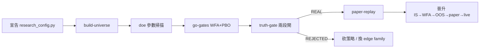

# 開發流程手冊 — backtest_platform

本手冊描述現行開發工作流：**研究迴圈**（策略如何被審判）+ **工程流程**（分支 / TDD / CI / PR）。里程碑現況以 [16 WBS](./16_wbs_development_plan.md) 為單一狀態真相源，本手冊只講「怎麼做」，不記錄「做到哪」。

---

## 1. 產品定位（一句話）

個人量化 **edge 驗證工廠 + 晉升管線**：single-user、standalone、台股專用。策略是消耗品、審判庭是資產、連續 NO-GO 是產品正常運作的證據。完整定位見 [02 PRD](./02_project_brief_and_prd.md)。

---

## 2. 研究迴圈（策略審判流程）

新增或驗證一隻策略，只寫一個 `strategies/<name>/research_config.py` 宣告參數，即可參與所有標準化工作流（ADR-029）。工作流本身與策略無關，全走 registry dispatch（`get_strategy(name).run()`，ADR-028），絕不直接 import 策略的 backtest 函式（AST 測試守門）。

| 步驟 | CLI | 做什麼 | 判準 |
| :--- | :--- | :--- | :--- |
| 宣告 | 寫 `research_config.py` | 宣告 UNIVERSE / DOE / GO_GATES / TRUTH_GATE / PAPER_REPLAY | frozen Pydantic，作者只填參數不寫工作流邏輯 |
| 建 universe | `research build-universe --strategy <name>` | FinLab 全史 survivorship-clean universe（季度 rebalance）+ manifest 血統 | ADR-032 |
| DOE | `research doe --strategy <name>` | 系統化掃描參數空間（非手敲）| 全網格輸出，防 cherry-pick |
| GO 閘 | `research go-gates --strategy <name>` | WFA OOS 廣度 + PBO | 過擬合初篩 |
| 真偽閘 | `research truth-gate --strategy <name>` | 兩段閘：真偽閘（PBO/DSR/WFA/survivorship-clean，hard-fail）+ 配置閘（sizing） | REAL / REJECTED（ADR-025） |
| paper 重放 | `research paper-replay --strategy <name>` | 過真偽閘的候選逐日跑 ETL→signals→risk→orders→log | 接真 daemon 前先驗晉升鏈 |
| 晉升 | `research validate` / `promote-check` | IS→WFA→OOS 不可逆 gate + 晉升資格查詢 | OOS sealed vault，狀態不可回退 |

### 鐵律

- **OOS 用過一次就燒掉**：前置 gate 未過前 OOS 封存不可讀；OOS 失敗即淘汰，不允許「再調一次」。
- **hypothesis 預先註冊**：run 強制填 `--hypothesis`；違反預註冊紀律 → 強制重跑該階段。
- **試驗計數進 DSR**：所有參數測試計入 n_trials，DSR deflate（防過擬合稅被低估）。
- **審判庭優先於策略**：gate 門檻不因單一策略瓶頸放寬（ADR-023）。策略死於閘 = 產品在工作，不是專案失敗。

---

## 3. 工程流程

### 3.1 分支

- 保護分支 `main` 禁止直接改碼，一律開 `<type>/<desc>` 分支走 PR。
- 一個分支只做一件事；多 session 並行用 git worktree 隔離。
- 操作細節見 `.claude/rules/development-workflow.md` + `git-workflow.md`。

### 3.2 TDD（強制）

先寫測試 (RED) → 跑（失敗）→ 最小實作 (GREEN) → 跑（通過）→ 重構 → 驗覆蓋率（≥ 80%）。**審判庭級變更**（gate / DSR / oracle）的判決測試必須先 RED 釘住已知期望（含已知 REJECTED 案例），再改實作。

### 3.3 CI（三 job）

每個 PR 由 GitHub Actions 守門：

1. **後端** — `uv run pytest`（`--cov-fail-under`）
2. **前端** — `tsc` + `vitest`
3. **契約 drift** — `app.openapi()` vs `frontend/openapi.json` diff、`init.sql` ↔ `db_writer` 欄位對齊

### 3.4 PR

前置條件：測試全綠、commit 歷史 WHY/WHAT/IMPACT 完整、自我 review diff、無殘留 debug code、已對映 `code-doc-sync.md` 觸發表更新受影響 dev_docs（含 16 WBS 進度）。Body 四區段：Background / Changes / Impact / Test Plan。

### 3.5 程式碼 ↔ 文件同步

實作 code 與更新 dev_docs 屬同一 PR，禁止「以後再補」。觸發對映表見 `.claude/rules/code-doc-sync.md`。

---

## 4. 里程碑現況一覽

目標與 Gate 如下；**實際進度以 [16 WBS](./16_wbs_development_plan.md) 為單一真相源**，本表不寫狀態欄。

| 里程碑 | 目標 | Gate |
| :--- | :--- | :--- |
| M1 | 資料層 + 策略契約 + 端到端 smoke | 單元測試全綠、端到端跑通 |
| M2 | IS 回測（zipline-reloaded 引擎）| 引擎整合 + 研究迴圈可跑 |
| M3 | 統計驗證（審判庭）+ 研究工作流 | PBO/DSR/WFA/兩段閘 + doe/truth-gate/paper-replay |
| M4 | Paper trading 3 個月收 live OOS | after-close 排程器 + 觀察期倒數 + 退化偵測 |
| M5 | 小倉位實盤（1/4 倉位）| paper live OOS + 配置閘 sign-off（不可逆晉升）|

**下一個價值里程碑**：修好審判庭（ADR-030）→ 用可信的閘重驗 inst_flow → after-close 排程器收 live OOS。

---

## 5. 每階段檢查清單

### 通用
- [ ] 對應 dev_docs 已更新（code-doc-sync 觸發表）
- [ ] 重大決策已寫 ADR 或 cross-ref
- [ ] 測試覆蓋率 ≥ 80%、CI 三 job 綠
- [ ] 無 hardcoded secrets

### 研究迴圈
- [ ] 新策略只透過 `research_config.py` 宣告，未新增一次性腳本
- [ ] 工作流走 `get_strategy(name).run()`，未直接 import 策略 backtest 函式（AST 測試守門）
- [ ] hypothesis 已預先註冊、n_trials 計入 DSR
- [ ] OOS 未被 post-hoc 污染
