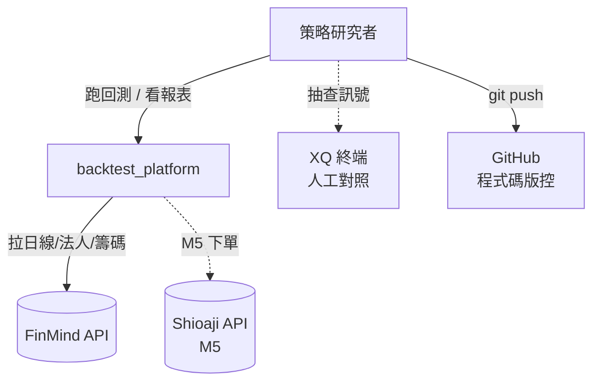
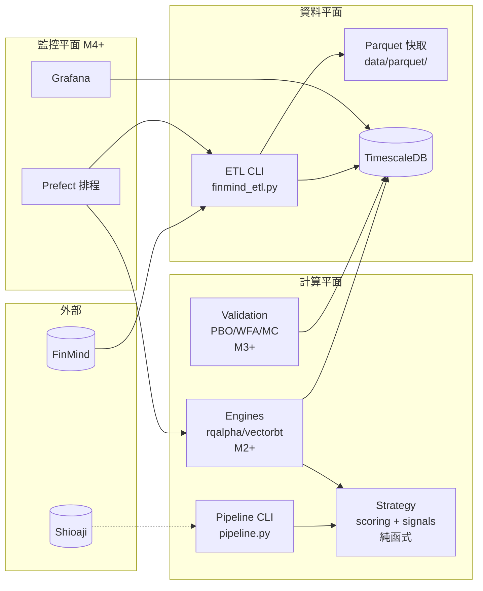
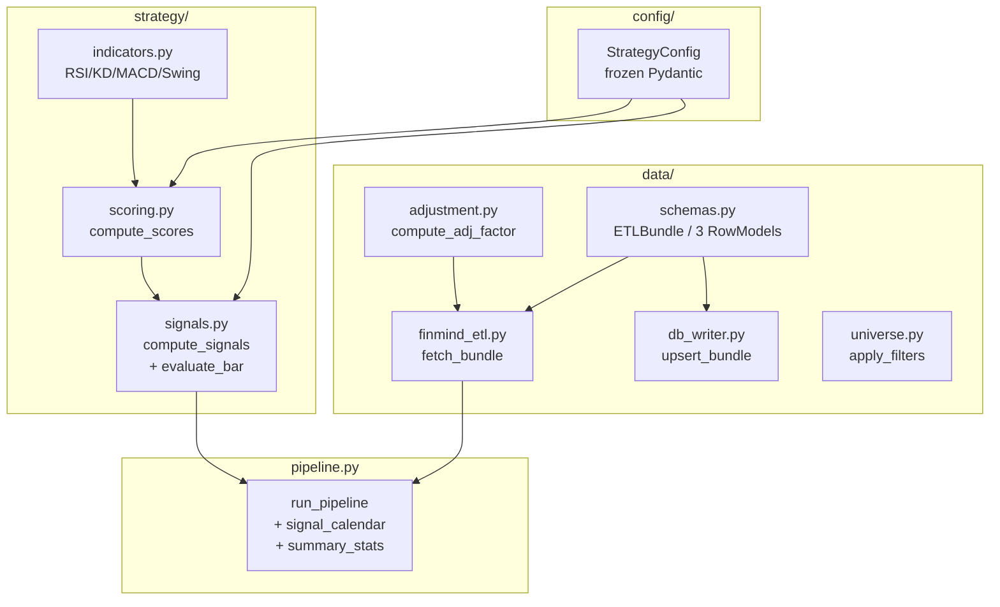
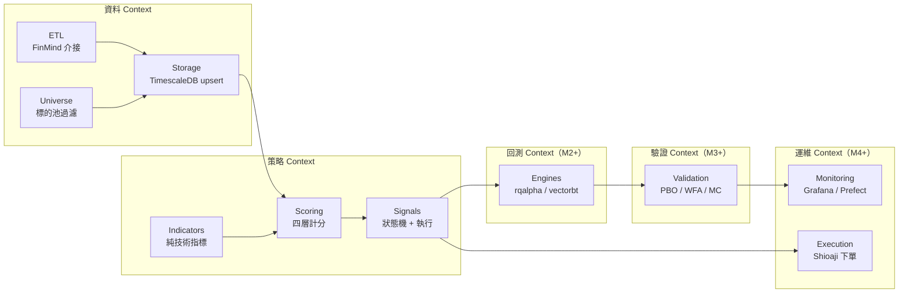
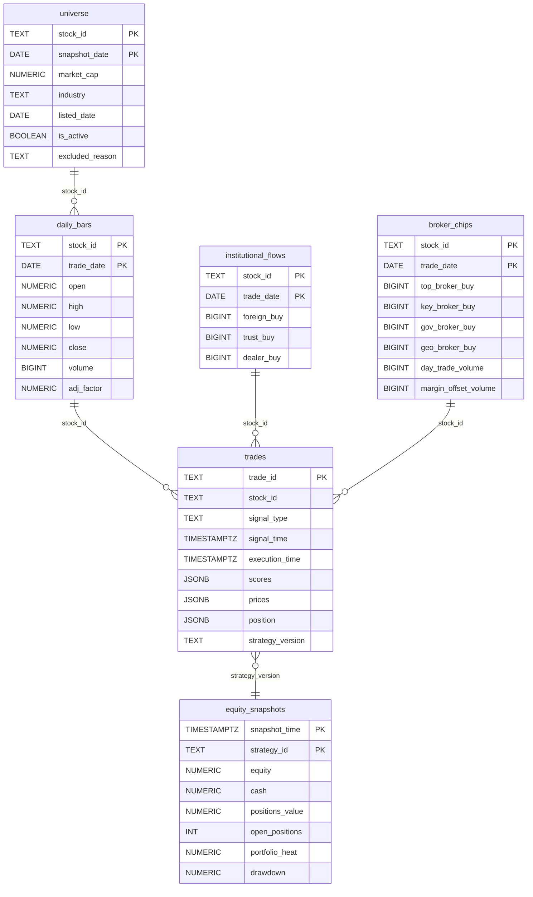
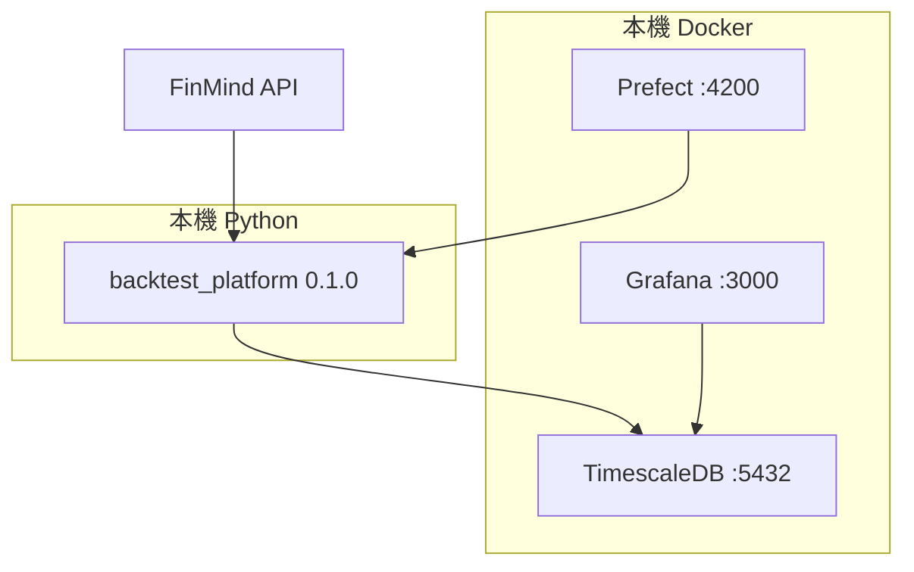

# 架構與設計文件 — backtest_platform

> **版本：** v1.0 | **更新：** 2026-05-26 | **狀態：** M1 已實作 / M2-5 待擴充

---

## 第 1 部分：架構總覽

### 1.1 C4 模型

#### L1 系統情境圖



#### L2 容器圖



#### L3 元件圖（核心策略容器）



### 1.2 DDD 戰略設計

#### 通用語言（術語詞彙表）

對齊 `strategy/v2.md` 6.1：

| 術語 | 定義 |
| :--- | :--- |
| L1 結構分 | 突破/中線/中線下三檔（0/1/2） |
| L2 法人方向 | 外資+投信買進共識度（-1/0/1/2） |
| L3 籌碼強度 | chip_total / net_volume 比例分級 |
| L4 動能分 | 三陽開泰 / 四大金叉 / 熄火（-1/0/1/2） |
| 強多 (strong_buy) | 四項都 ≥ 1 且至少一項 = 2 |
| 熄火 (flameout) | momentum=-1 或 close < box_lower |
| ETLBundle | 一檔股票一次 ETL 的輸出 |
| Heat | portfolio 假設全部停損的總虧損占帳戶比例 |
| R | risk unit = 進場價 - 停損價的絕對值 |

#### 限界上下文



### 1.3 分層架構

| 層 | 程式碼位置 | 職責 |
| :--- | :--- | :--- |
| **Domain** | `strategy/`、`config/strategy_config.py` | 四層計分邏輯、訊號優先序、策略參數模型 — 不依賴任何外部 IO |
| **Application** | `pipeline.py`、`engines/`（M2+） | 編排 ETL → 計分 → 回測流程 |
| **Infrastructure** | `data/finmind_etl.py`、`data/db_writer.py` | FinMind API、TimescaleDB、Parquet IO |

### 1.4 技術選型

| 分類 | 選用 | 理由 | 備選 | ADR |
| :--- | :--- | :--- | :--- | :--- |
| 語言 | Python 3.10+ | 量化生態最成熟 | — | — |
| 資料 schema | Pydantic v2 | 宣告式 + 邊界驗證 | dataclass / attrs | ADR-004 |
| Time-series DB | TimescaleDB 2.14 | Postgres-相容 + 時間優化 | InfluxDB | ADR-002 |
| 資料源 | FinMind | 免費 + Python API | TEJ（付費）、自爬 | — |
| Cache | Parquet | 列式壓縮，DuckDB 友善 | CSV、HDF5 | — |
| 回測（主） | rqalpha | 事件驅動 + Portfolio | backtrader | ADR-001 |
| 回測（副） | vectorbt | 向量化參數網格 | bt | ADR-001 |
| 統計驗證 | quantstats + pypbo | 業界標準報表 + PBO 演算法 | pyfolio | — |
| 排程 | Prefect 2 | Python-native、UI 好用 | Airflow | — |
| 監控 | Grafana | TimescaleDB 原生整合 | Superset | — |
| CLI | Click | 標準、subcommand 友善 | argparse、Typer | — |
| Logging | Loguru | 簡潔、無 boilerplate | stdlib logging | — |
| Lint/Type | ruff + mypy strict | 快、整合度高 | flake8 + pylint | — |

---

## 第 2 部分：需求摘要

### 功能性需求（對應 PRD US-xxx）

- **FR-1** ETL：拉 FinMind 三表 + 驗證 + 寫 parquet/DB（US-002）
- **FR-2** Scoring：給含 14 欄位 DataFrame 算出四層分 + total_score（US-001）
- **FR-3** Signals：給 scored DataFrame 算出 4 狀態 + 7 執行訊號 + action（US-001）
- **FR-4** Pipeline：CLI 一行跑完 ETL → Scoring → Signals → Calendar CSV（US-001）
- **FR-5** Universe：套用 v2.md 2.2 過濾規則，回傳 survivors（M2）
- **FR-6** Backtest：rqalpha portfolio 級回測（US-003，M2）
- **FR-7** Statistical Validation：PBO / WFA / MC（US-004，M3）
- **FR-8** Paper Trading：每日 signal 對比實際成交（US-005，M4）
- **FR-9** Live：Shioaji 下單 + Grafana 監控（US-006，M5）

### 非功能性需求

| 分類 | 需求 | 目標值 |
| :--- | :--- | :--- |
| 性能 | 單檔 10 年 pipeline | < 60 秒 |
| 性能 | 100 檔 portfolio 回測 | < 30 分鐘 |
| 一致性 | 兩引擎訊號差異 | < 0.1% |
| 一致性 | 與 XQ XScript 差異 | < 0.5% |
| 可靠性 | ETL idempotent | 重跑結果一致 |
| 可觀測性 | Trade audit | 100% trade 含 scores/prices/position |
| 安全 | Secrets | .env + 不入 git |
| 可維護 | Lint/Type | ruff + mypy strict 過 |
| 測試覆蓋 | 單元測試 | > 80% |

---

## 第 3 部分：系統設計

### 3.1 架構模式

**模式**：**模組化單體（Modular Monolith）+ Pure Function 核心**

**選擇理由**：
- 單人 / 單機開發，微服務拆分增加複雜度無收益
- 策略邏輯為純函式，易測試 / 易重用
- 未來實盤可獨立拆出 `execution` 服務（保留模組邊界）

### 3.2 系統元件圖

見 1.1 L2/L3 圖。

### 3.3 元件職責

| 元件 | 核心職責 | 技術 | 依賴 |
| :--- | :--- | :--- | :--- |
| `config/strategy_config.py` | 策略參數模型 | Pydantic v2 | — |
| `data/schemas.py` | ETL 物件定義 | Pydantic v2 + pandas | — |
| `data/finmind_etl.py` | 拉 FinMind 三表 + normalize | FinMind, pandas, click | schemas |
| `data/adjustment.py` | 前復權因子計算 | pandas | — |
| `data/db_writer.py` | TimescaleDB idempotent upsert | psycopg2 | schemas |
| `data/universe.py` | 標的池過濾 | pandas | — |
| `strategy/indicators.py` | 技術指標純函式 | numpy, pandas | — |
| `strategy/scoring.py` | 四層計分 | pandas, numpy | indicators, config |
| `strategy/signals.py` | 狀態機 + 執行訊號 | pandas, numpy | scoring, config |
| `pipeline.py` | 端到端 CLI 編排 | click, loguru | 全部 |

### 3.4 關鍵使用者旅程

#### 場景 1：策略研究者跑單檔 pipeline

```
1. User → CLI: python -m backtest_platform.pipeline run --stock-id 2330 ...
2. pipeline.run_pipeline:
   2.1 → data.finmind_etl.fetch_bundle  (拉三表)
   2.2 → data.adjustment.apply_adjustment (前復權)
   2.3 → ETLBundle.merged()  (join 三表)
   2.4 → strategy.scoring.compute_scores  (四層分)
   2.5 → strategy.signals.compute_signals  (狀態 + 訊號)
3. pipeline.signal_calendar → calendar CSV
4. pipeline.summary_stats → console summary
```

#### 場景 2：M2 跑 portfolio 回測（待實作）

```
1. User → CLI: python -m backtest_platform.engines.rqalpha_runner --universe data/universe.parquet ...
2. engines.rqalpha_runner:
   2.1 → 載入 universe + ETL data
   2.2 → init rqalpha context
   2.3 → 每 bar 呼叫 strategy.signals.evaluate_bar
   2.4 → 處理 stoploss > exit > ... > buy 優先序
   2.5 → 寫 trade log → TimescaleDB
3. validation.metrics → quantstats 報表
```

---

## 第 4 部分：資料架構

### 4.1 資料模型（TimescaleDB Schema）



### 4.2 一致性策略

- **強一致**：trades 表（audit trail，不能丟）— 直接 Postgres ACID
- **最終一致**：daily_bars / institutional / broker_chips（ETL 重跑會修正） — 用 ON CONFLICT DO UPDATE

### 4.3 資料分類

| 類別 | 範例 | 處理 |
| :--- | :--- | :--- |
| 公開（市場資料） | 股價、法人籌碼 | 不需加密 |
| 個人（帳戶 + token） | FinMind token、Shioaji 帳號 | .env + 不入 git，KMS（M5） |
| Audit | trades、equity_snapshots | 永久保留 |

---

## 第 5 部分：部署與基礎設施

### 5.1 部署視圖（當前 M1）



### 5.2 CI/CD 流程

當前無 CI/CD（單人專案）。M3 開始引入：

| 階段 | 步驟 |
| :--- | :--- |
| Lint | ruff check |
| Type | mypy --strict |
| Test | pytest tests/ |
| Coverage | pytest-cov，閾值 80% |

### 5.3 環境策略

| 環境 | 用途 |
| :--- | :--- |
| Dev | 本機開發、unit test |
| Staging | M4 paper trading 用 |
| Production | M5 小倉位實盤、全倉 |

### 5.4 成本估算

| 項目 | 月成本 | 備註 |
| :--- | :---: | :--- |
| FinMind sponsor（可選） | NT$ 99–300 | M2 需要時 |
| TEJ（可選） | NT$ 3,000–10,000 | 含下市股 + 券商分點 |
| 雲端主機（M5） | NT$ 500–2,000 | 實盤 24x7 |
| 證券手續費 | 浮動 | 取決於倉位 |

---

## 第 6 部分：跨領域考量

### 6.1 可觀測性

| 維度 | 工具 | 當前狀態 |
| :--- | :--- | :--- |
| 日誌 | Loguru → stdout / 檔案 | ✅ |
| 指標（M4+） | Grafana → TimescaleDB | 規劃中 |
| 追蹤 | — | 不適用（無 distributed call） |
| 告警（M5） | Telegram bot | 規劃中 |

### 6.2 安全性

| 維度 | 處理 |
| :--- | :--- |
| Secrets | `.env` + gitignore + `os.environ.get` |
| API token | FinMind / Shioaji 各自獨立 |
| DB password | .env，預設值 `change_me_in_production` 防忘改 |
| 程式碼安全 | ruff + mypy + bandit（M3） |

---

## 第 7 部分：風險與演進

### 7.1 風險登記

| 風險 | 可能性 | 影響 | 緩解 |
| :--- | :--- | :--- | :--- |
| FinMind 免費版缺券商分點 → L3 計分不完整 | 高 | 中 | 升級 sponsor / 切 TEJ / 砍 L3 |
| 下市股資料源未解 → 生存者偏誤 | 高 | 高 | 早期 POC 評估 |
| rqalpha 對台股 T+1 支援不完整 | 中 | 高 | 自寫 mod_taiwan_stock |
| 訊號邏輯與 XQ 差異 > 0.5% | 中 | 高 | 100 訊號抽樣對照 |
| 策略本身無 Edge | 高 | 致命 | 接受 → 砍策略 |

### 7.2 演進路線

| Phase | 目標 |
| :--- | :--- |
| Phase 1 (M1)| 資料 + 計分 + 訊號 + 端到端 smoke |
| Phase 2 (M2) | rqalpha IS 回測通過 |
| Phase 3 (M3) | vectorbt 參數網格 + PBO/DSR 驗證 |
| Phase 4 (M4) | Paper trading 3 個月 |
| Phase 5 (M5) | 小倉位實盤 + Shioaji + Grafana |
| Phase 6 (M6+) | React UI、多策略 |

---

## 第 8 部分：模組詳細設計

詳見 `07_module_specification_and_tests.md`。M1 範圍：

- `config/strategy_config.py`
- `data/schemas.py`、`data/finmind_etl.py`、`data/adjustment.py`、`data/db_writer.py`、`data/universe.py`
- `strategy/indicators.py`、`strategy/scoring.py`、`strategy/signals.py`
- `pipeline.py`

### NFR 實現

- **性能**：純 numpy/pandas vectorize，避免逐 row iter（除了 signals 必須的）
- **安全**：所有外部輸入用 Pydantic 驗證；secrets 從 env 讀
- **可擴展**：純函式設計，易加 cache layer 或 parallel
