# 架構與設計文件 — backtest_platform

> **版本：** v1.4 | **更新：** 2026-05-31 | **狀態：** M1 已實作 / **M2+ 路線變更**
> **v1.4 變更 (2026-05-31)**：M2 啟動前重大架構變更，原 L2 Container 圖中的 `engines/rqalpha_runner` 替換為 `TQuant-Lab (Zipline)` 主骨架；新增 `adapters/` 層（data_bundle/data_feed/brokers）、`monitoring/`、`dashboard/`、`orchestration/` 模組。詳見下方 v1.4 變更通告。
> **v1.3 修正**：補齊 partial disclosure（Telegram / TWSE / UI / live container）、L3-A 補 live+engines 子模組、新增 M5 Target State、L3-B 改寫、補 Sequence Diagram、箭頭加 protocol、DDD 戰術 + 限界上下文 Strategic Relationship、§5.1 重畫成 C4 Deployment

---

## 🚨 v1.4 架構變更通告（2026-05-31）

下列原文段落需對齊新架構，**完整新架構請見 [17_m2_to_m5_master_plan.md](./17_m2_to_m5_master_plan.md) §3-5**：

| 本文段落 | 狀態 | 對應新文檔 |
| :--- | :--- | :--- |
| §1.1.2 Container 表 | ⚠️ 缺新模組 | [17 §5 目錄結構](./17_m2_to_m5_master_plan.md) + [23 deployment topology](./23_deployment_topology.md) |
| §1.4 技術選型表（回測主 rqalpha） | ⚠️ 過時 | [ADR-005](./adrs/ADR-005-mainframe-tquant-lab-zipline-fork.md) |
| §3.3 元件職責（缺 adapters/validation/orchestration/monitoring/dashboard） | ⚠️ 缺新模組 | [17 §5](./17_m2_to_m5_master_plan.md) |
| §4.1 ER 圖（6 表） | ⚠️ 缺 6 張新表 | [21 data_contract §4](./21_data_contract.md) |
| §5.1 Deployment Diagram | ⚠️ M5 需加 Streamlit/InfluxDB/Telegram bot | [23 deployment_topology](./23_deployment_topology.md) |
| §6.1 可觀測性 | ⚠️ 過於簡略 | [20 dashboard_specification](./20_dashboard_specification.md) |
| §7.2 演進路線（Phase 2-5 寫 rqalpha） | ⚠️ 過時 | [17 §7 M2-M5 排程](./17_m2_to_m5_master_plan.md) |
| §1.1 C4 規則、§1.2 DDD、§1.3 分層 | ✅ 仍有效 | — |
| §4.2 一致性策略、§4.3 資料分類 | ✅ 仍有效 | — |

### 新增 Container 速覽（將於 v2.0 完整重畫 C4 圖）

| 容器 / 模組 | 啟用 M | 用途 |
| :--- | :---: | :--- |
| TQuant-Lab (Zipline) | M2 | 主骨架，取代 rqalpha |
| `adapters/data_bundle/` | M2 | FinLab/FinMind → Zipline bundle ingester |
| `adapters/data_feed/` | M4 | 即時資料 polling |
| `adapters/brokers/` | M4/M5 | PaperBroker + ShioajiBroker |
| `validation/` | M3 | PBO/DSR/WFA/metrics |
| `orchestration/` | M4 | 每日排程 daily_flow |
| `monitoring/` | M4 | metrics emitter + Telegram alerter |
| `dashboard/` | M3/M5 | Streamlit 5 面板 + Grafana 4 面板 |
| InfluxDB / Prometheus | M4 | 系統 metric 時序儲存 |
| Streamlit Container | M3 | 策略績效 dashboard |

下方原 §1-§8 內容**保留作 v1.3 基線**，新讀者請優先閱讀新 plan + ADR-005~009。

---

---

## 第 1 部分：架構總覽

### 1.1 C4 模型（嚴格版）

#### 1.1.0 命名防呆

| 術語 | 指什麼 | 勿混淆 |
| :--- | :--- | :--- |
| **C4 L1–L4** | 架構圖縮放層級（情境 → 容器 → 元件 → 程式碼） | ≠ `strategy/v2.md` 的 v2 L1–L4 計分 |
| **C4 Context（L1）** | 整個軟體系統相對外界 | ≠ DDD「限界上下文」 |
| **C4 Container（L2）** | 可獨立部署 / 執行的 runtime 單位 | ≠ Python package、≠ Clean Architecture 分層 |
| **C4 Component（L3）** | **單一** L2 容器內的模組 | 禁止跨容器畫在同一張 L3 |

策略四層計分請寫 **「v2 L1–L4」** 或 **「結構分 / 法人分…」**；C4 章節禁止用裸的 L1–L4。

#### 1.1.1 層級規則

| 層級 | 英文名 | 一張圖只回答 | 方塊必須是 | 禁止 |
| :---: | :--- | :--- | :--- | :--- |
| **L1** | System Context | 誰在用系統？與哪些外部系統互動？ | 人、本軟體系統（**一個**邊界）、外部系統 | 內部模組、Python 檔名、GitHub 等開發工具 |
| **L2** | Container | 系統內有哪些 **runtime**？ | Process、DB、檔案儲存、排程服務 | 把 `scoring.py` 當容器；用「資料平面」當 C4 元素 |
| **L3** | Component | **某一個** L2 容器內部怎麼拆？ | 模組 / package（對應 repo 路徑） | 跨容器 zoom；一張圖混 ETL + 策略 + DB schema |
| **L4** | Code | 類別 / 函式（可選） | class、function | 單體 Python 可省略，改連結 `10_class_relationships_template.md` |

**層級關係**：樹狀 zoom-in（父 → 子），**不是** ETL → 計分 → 回測的執行串序。

#### 1.1.2 Container 清單（Modular Monolith）

> M1 一個 Python process 跑完全部 CLI；對齊 §3.1 模組化單體決策。

| Container | 類型 | 技術 | 何時獨立 | L3 圖 |
| :--- | :--- | :--- | :--- | :---: |
| **Application** | 應用程式 | `python -m backtest_platform.*` | M1 起 | L3-A ✅ |
| **TimescaleDB** | 資料庫 | Docker `timescaledb:2.14` | M1 起 | L3-B（表代圖）|
| **Parquet Cache** | 檔案儲存 | `data/parquet/` | M1 起 | 略（純檔案，無 internal component）|
| **Streamlit UI** | UI Phase 1 | `streamlit` | M4+（虛線） | M4 補 |
| **Prefect Worker** | 排程 | Docker Prefect 2.x | M4+（虛線） | M4 補 |
| **Grafana** | 監控 UI | Docker Grafana | M4+（虛線） | M4 補 |
| **Telegram Bot** | 告警通道 | `python-telegram-bot` 服務 | M4+（虛線） | M4 補 |
| **Shioaji Executor** | 下單 wrapper | Docker（Shioaji SDK + risk wrapper） | M5（虛線） | M5 補 |
| **FastAPI** | HTTP API | `uvicorn` | M5（虛線） | M5 補 |
| **React Frontend** | UI Phase 2 | Node + Vite | M6+（虛線） | M6 補 |

- **L3 Component（非 Container）**：`strategy/scoring.py`、`data/finmind_etl.py`、`pipeline.py` ...
- **外部系統（邊界外）**：
  - 資料源：FinMind API、TWSE 公開資訊（下市股 / 券商分點 backup）、TEJ（M3 評估）
  - 交易：Shioaji API（M5）
  - 對照：XQ 終端（人工抽查）
  - 推送：Telegram API（M4+ 告警接收方）
  - 備份：GCS / S3（M5 災難恢復）
  - 雲端：GCP Compute Engine（M5 託管平台）

#### L1 — System Context

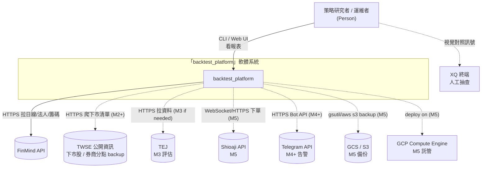

- **邊界內**：本 repo 實作的軟體（CLI + 函式庫 + UI + 排程 + DB），自己 deploy 的所有東西。
- **邊界外**：所有第三方服務 / SaaS / IaaS。
- **不含**：GitHub（版控屬開發流程，見 `01_workflow_manual.md`）、IDE、CI runner（無自動 CI runner，個人專案）。

**L1 檢查**：邊界內僅一個系統節點 · 無 GitHub/IDE · 箭頭標協議+目的非 import 路徑 · 虛線 = 尚未啟用

#### L2 — Container（M1 Current State）

> 僅呈現 M1 已啟用 + 已規劃的 Container（虛線 = M4+/M5 尚未啟用）。M5 完整視野見 §1.1.2.5。

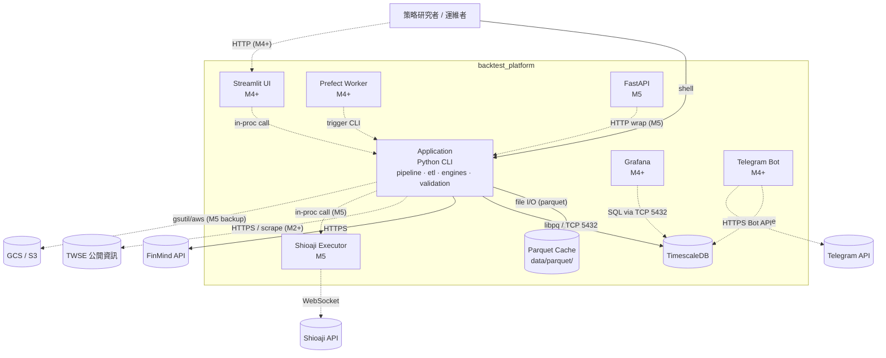

| Container | 對應執行方式 | 啟用時機 | 備註 |
| :--- | :--- | :---: | :--- |
| **Application** | `python -m backtest_platform.pipeline` 等 | M1 | `strategy/`、`data/`、`engines/` 皆為**同進程模組** |
| **Parquet Cache** | 本機 `data/parquet/` | M1 | 列式快取 |
| **TimescaleDB** | `docker-compose` | M1 | 持久化時序資料 |
| **Streamlit UI** | `streamlit run` | M4+ | Phase 1 視覺化 |
| **Prefect Worker** | Docker | M4+ | 排程 ETL / 訊號 |
| **Grafana** | Docker | M4+ | 監控儀表板 |
| **Telegram Bot** | Python 常駐 | M4+ | 告警推送 |
| **Shioaji Executor** | Docker | M5 | 含風控 wrapper |
| **FastAPI** | `uvicorn` | M5 | HTTP API |

**L2 檢查**：邊界內僅 Application + Datastore + UI + 排程/監控/告警 + Live ·  M4+/M5 用虛線 · 每條跨 Container 箭頭標 protocol · Domain/Infrastructure 分層寫 §1.3 不在 L2 subgraph

#### 1.1.2.5 L2 — Container（M5 Target State，全部啟用）

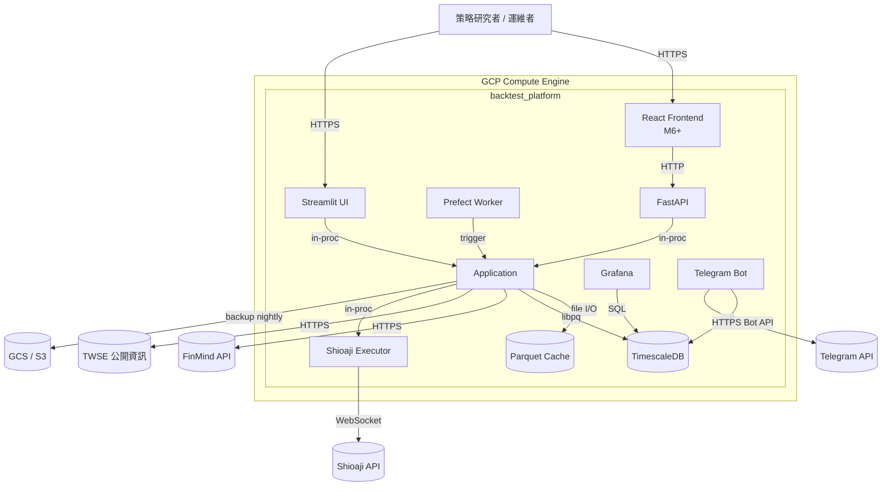

**差異**：M5 沒有任何虛線 — 全部啟用、託管於 GCP Compute Engine 單 VM（M6+ 再考慮 K8s 拆分）。

#### L3-A — Component（zoom: Application）

> 僅展開 L2 **Application**。Clean Architecture 分層標籤供對照 §1.3，**非** C4 元素。
> 箭頭表 **Python import dependency**（不是執行順序也不是資料流）。

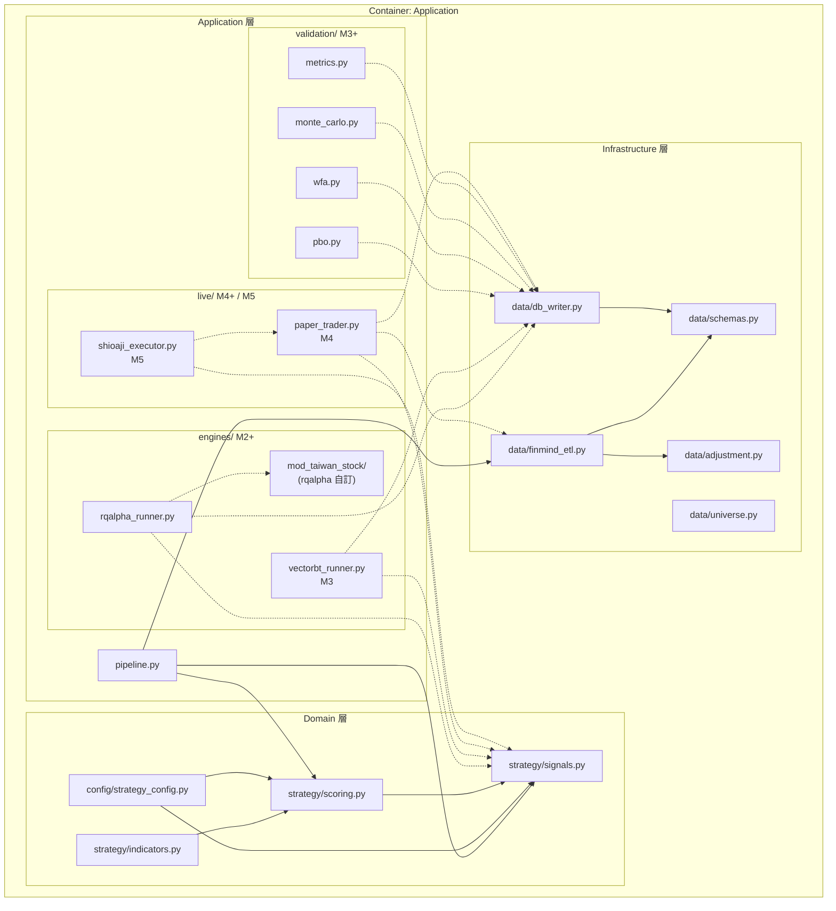

**L3-A 檢查**：
- 標題含父 Container ✅
- 不出現 DB 內部 table（改 §4.1 ER）✅
- Domain 無箭頭指向 FinMind ✅（Domain 不依賴 Infrastructure）
- 虛線 = 未實作（M2+/M3+/M4+/M5）✅
- 同一張圖內所有元件都屬同一 L2 Container（Application）✅

#### L3-B — Component（zoom: TimescaleDB）

> **設計決定**：TimescaleDB 的「component」對映到 **table + extension**。
> 完整 ER 圖（含欄位與關係）放在 §4.1 避免重複；此圖只呈現 runtime element 與 Application 互動。

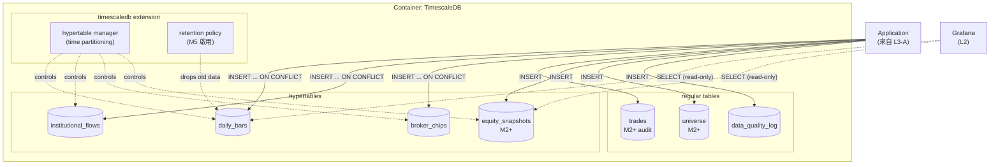

**L3-B 檢查**：
- 標題含父 Container ✅
- 內部元件 = hypertables + regular tables + extension features ✅
- 跨 Container 邊界（Application、Grafana 來自 L2）以單獨節點呈現並標 protocol ✅
- 欄位細節 / 關係（PK / FK / ER）不在此圖，見 §4.1 ✅

#### L4 — Code

省略（單體 Python）；類別關係見 `10_class_relationships_template.md`。

#### 1.1.3 C4 審查 Checklist（PR / milestone gate）

**結構**：
- [ ] L1–L3 各至少一張圖，且 **一圖一層級**
- [ ] L3 每張圖對應 **且僅對應** 一個 L2 Container
- [ ] 每個 L2 Container 都有對應 L3（或在 §1.1.2 Container 表明確說明跳過理由）
- [ ] 補充圖：至少一張 Dynamic / Sequence Diagram（跨多 Container 的主要 use case）
- [ ] 補充圖：Deployment Diagram 含 Node 屬性（OS、規格、port）

**完整性**：
- [ ] L1 含**所有**外部系統（資料源、交易、推送、備份、雲端 IaaS）— partial disclosure 是 bug
- [ ] L2 含**所有**規劃中的 Container（虛線標 milestone）
- [ ] 有獨立的 **future state（M5 Target）** 圖呈現完整視野

**命名與語意**：
- [ ] 無「v2 L1–L4」與「C4 L1–L4」混用
- [ ] DDD 限界上下文圖箭頭採 Strategic Relationship（PL / CS / ACL / CF / SK），不是 data flow
- [ ] DDD 戰術元素（Entity / Value Object / Aggregate / Service / Repository）有對應表

**箭頭規範**：
- [ ] 所有跨 Container / 跨 Node 箭頭標 **protocol + 動詞**（HTTPS / SQL / file I/O / in-proc）
- [ ] L3 內部箭頭明說語意（import / data flow / call）

**演進規則**：
- [ ] 新增模組：先決定屬哪個 Container → 再畫進對應 L3
- [ ] 若拆出新 process（例如獨立 Execution Service）→ **先改 L2**，再新增 L3
- [ ] 任何架構變動 → 同步更新 08（結構）、09（依賴）、10（類別）、14（部署）

### 1.2 DDD 戰略設計

> DDD **限界上下文** ≠ C4 **System Context（L1）**。

#### C4 Container ↔ DDD 限界上下文

| DDD 限界上下文 | 主要落在 C4 | 備註 |
| :--- | :--- | :--- |
| 資料 | Application（infra 模組）+ Parquet + TimescaleDB | DB 為獨立 Container |
| 策略 | Application（domain 模組） | 非獨立 Container，除非未來拆微服務 |
| 回測 | Application（`engines/`） | M2+ |
| 驗證 | Application（`validation/`） | M3+ |
| 運維 | Prefect + Grafana +（M5）Shioaji | M4+ 出現在 L2 |

#### 通用語言（術語詞彙表）

對齊 `strategy/v2.md` 6.1（以下 **v2 L1–L4** 為策略計分層，非 C4 層級）：

| 術語 | 定義 |
| :--- | :--- |
| v2 L1 結構分 | 突破/中線/中線下三檔（0/1/2） |
| v2 L2 法人方向 | 外資+投信買進共識度（-1/0/1/2） |
| v2 L3 籌碼強度 | chip_total / net_volume 比例分級 |
| v2 L4 動能分 | 三陽開泰 / 四大金叉 / 熄火（-1/0/1/2） |
| 強多 (strong_buy) | 四項都 ≥ 1 且至少一項 = 2 |
| 熄火 (flameout) | momentum=-1 或 close < box_lower |
| ETLBundle | 一檔股票一次 ETL 的輸出 |
| Heat | portfolio 假設全部停損的總虧損占帳戶比例 |
| R | risk unit = 進場價 - 停損價的絕對值 |

#### 限界上下文（Strategic Context Map）

> 箭頭採 DDD **Strategic Relationship** 標記（非 data flow / 非 import）。
> 縮寫：CS = Customer-Supplier · ACL = Anti-Corruption Layer · SK = Shared Kernel · CF = Conformist · PL = Published Language

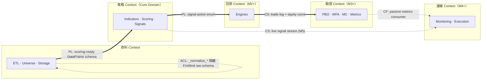

| 上下文 | 角色 | 與其他 context 關係 |
| :--- | :--- | :--- |
| **資料 Context** | Upstream Supplier | 對 FinMind 用 **ACL**（`_normalize_*` 屏蔽外部 schema 變動）；對策略 Context 用 **Published Language**（`REQUIRED_COLUMNS` 14 欄位契約） |
| **策略 Context** | Core Domain | 不依賴下游；產出 `action` enum 為 PL |
| **回測 Context** | Customer of 策略 | 用策略產出 + 自管 portfolio state，回給驗證 |
| **驗證 Context** | Conformist | 接受回測格式不要求變動 |
| **運維 Context** | Downstream Consumer | 對策略 / 驗證 / 回測都 read-only |

#### 1.2.5 DDD 戰術設計（Tactical Design）

對應 §3.3 元件職責 + `10_class_relationships_template.md`：

| DDD 元素 | 程式碼 | 說明 |
| :--- | :--- | :--- |
| **Value Object** | `StrategyConfig` | 不可變、相等性以值定 |
| Value Object | `UniverseConfig` | 同上 |
| Value Object | `DBConfig` / `ETLConfig` | 同上 |
| Value Object | `EvaluateBar` | per-bar 上下文，evaluate 後即丟 |
| **Aggregate Root** | `ETLBundle` | 一次 ETL 的三表 + invariants (`merged()`) |
| **Domain Service（純函式）** | `compute_scores` | 給 DataFrame 回 DataFrame |
| Domain Service | `compute_signals` / `evaluate_bar` | 狀態機 + 訊號優先序 |
| Domain Service | indicators 內所有函式 | RSI / KD / MACD 等 |
| **Domain Event（規劃）** | `SignalEmitted` / `PositionChanged`（M4+） | 目前直寫 DB；M5 才考慮 event bus |
| **Repository（規劃）** | `IBarRepository`（M2 引入） | `ParquetBarRepository` / `TimescaleBarRepository` 實作 |
| **Anti-Corruption Layer** | `data/_normalize_*` 系列 | 隔離 FinMind raw schema 變動 |
| **Specification（規劃）** | `UniverseConfig.apply_filters`（已部分實作） | 集中過濾規則 |

**為何沒有 Entity？**
本系統的 state 主要由**值物件 + 事件**驅動（trade log、equity snapshot 都是 immutable record）。
傳統意義的 mutable entity（如 User、Account）不在 domain 內 — Portfolio state 由引擎持有，不是 domain object。

### 1.3 分層架構

| 層 | 程式碼位置 | 職責 |
| :--- | :--- | :--- |
| **Domain** | `strategy/`、`config/strategy_config.py` | 四層計分邏輯、訊號優先序、策略參數模型 — 不依賴任何外部 IO |
| **Application** | `pipeline.py`、`engines/`（M2+） | 編排 ETL → 計分 → 回測流程 |
| **Infrastructure** | `data/finmind_etl.py`、`data/db_writer.py` | FinMind API、TimescaleDB、Parquet IO |

### 1.4 技術選型

| 分類 | 選用 | 理由 | 備選 | ADR |
| :--- | :--- | :--- | :--- | :--- |
| 語言 | Python 3.10+ | 量化生態最成熟 | — | — |
| 資料 schema | Pydantic v2 | 宣告式 + 邊界驗證 | dataclass / attrs | ADR-004 |
| Time-series DB | TimescaleDB 2.14 | Postgres-相容 + 時間優化 | InfluxDB | ADR-002 |
| 資料源 | FinMind | 免費 + Python API | TEJ（付費）、自爬 | — |
| Cache | Parquet | 列式壓縮，DuckDB 友善 | CSV、HDF5 | — |
| 回測（主） | rqalpha | 事件驅動 + Portfolio | backtrader | ADR-001 |
| 回測（副） | vectorbt | 向量化參數網格 | bt | ADR-001 |
| 統計驗證 | quantstats + pypbo | 業界標準報表 + PBO 演算法 | pyfolio | — |
| 排程 | Prefect 2 | Python-native、UI 好用 | Airflow | — |
| 監控 | Grafana | TimescaleDB 原生整合 | Superset | — |
| CLI | Click | 標準、subcommand 友善 | argparse、Typer | — |
| Logging | Loguru | 簡潔、無 boilerplate | stdlib logging | — |
| Lint/Type | ruff + mypy strict | 快、整合度高 | flake8 + pylint | — |

---

## 第 2 部分：需求摘要

### 功能性需求（對應 PRD US-xxx）

- **FR-1** ETL：拉 FinMind 三表 + 驗證 + 寫 parquet/DB（US-002）
- **FR-2** Scoring：給含 14 欄位 DataFrame 算出四層分 + total_score（US-001）
- **FR-3** Signals：給 scored DataFrame 算出 4 狀態 + 7 執行訊號 + action（US-001）
- **FR-4** Pipeline：CLI 一行跑完 ETL → Scoring → Signals → Calendar CSV（US-001）
- **FR-5** Universe：套用 v2.md 2.2 過濾規則，回傳 survivors（M2）
- **FR-6** Backtest：rqalpha portfolio 級回測（US-003，M2）
- **FR-7** Statistical Validation：PBO / WFA / MC（US-004，M3）
- **FR-8** Paper Trading：每日 signal 對比實際成交（US-005，M4）
- **FR-9** Live：Shioaji 下單 + Grafana 監控（US-006，M5）

### 非功能性需求

| 分類 | 需求 | 目標值 |
| :--- | :--- | :--- |
| 性能 | 單檔 10 年 pipeline | < 60 秒 |
| 性能 | 100 檔 portfolio 回測 | < 30 分鐘 |
| 一致性 | 兩引擎訊號差異 | < 0.1% |
| 一致性 | 與 XQ XScript 差異 | < 0.5% |
| 可靠性 | ETL idempotent | 重跑結果一致 |
| 可觀測性 | Trade audit | 100% trade 含 scores/prices/position |
| 安全 | Secrets | .env + 不入 git |
| 可維護 | Lint/Type | ruff + mypy strict 過 |
| 測試覆蓋 | 單元測試 | > 80% |

---

## 第 3 部分：系統設計

### 3.1 架構模式

**模式**：**模組化單體（Modular Monolith）+ Pure Function 核心**

**選擇理由**：
- 單人 / 單機開發，微服務拆分增加複雜度無收益
- 策略邏輯為純函式，易測試 / 易重用
- 未來實盤可獨立拆出 `execution` 服務（保留模組邊界）

### 3.2 系統元件圖

見 §1.1：**L2 Container**、**L3-A Application Component**、**L3-B TimescaleDB**。

### 3.3 元件職責

| 元件 | 核心職責 | 技術 | 依賴 |
| :--- | :--- | :--- | :--- |
| `config/strategy_config.py` | 策略參數模型 | Pydantic v2 | — |
| `data/schemas.py` | ETL 物件定義 | Pydantic v2 + pandas | — |
| `data/finmind_etl.py` | 拉 FinMind 三表 + normalize | FinMind, pandas, click | schemas |
| `data/adjustment.py` | 前復權因子計算 | pandas | — |
| `data/db_writer.py` | TimescaleDB idempotent upsert | psycopg2 | schemas |
| `data/universe.py` | 標的池過濾 | pandas | — |
| `strategy/indicators.py` | 技術指標純函式 | numpy, pandas | — |
| `strategy/scoring.py` | 四層計分 | pandas, numpy | indicators, config |
| `strategy/signals.py` | 狀態機 + 執行訊號 | pandas, numpy | scoring, config |
| `pipeline.py` | 端到端 CLI 編排 | click, loguru | 全部 |

### 3.4 關鍵使用者旅程（Dynamic Diagrams）

#### 場景 1：策略研究者跑單檔 pipeline（M1 已實作）

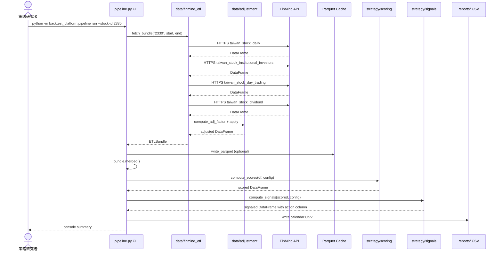

**重點觀察**：
- 4 次 FinMind HTTPS 呼叫之間 sleep `rate_limit_seconds` 避免封鎖
- Parquet 寫入是 optional（dry-run 不寫）
- Score / Sig 為純函式呼叫，無 IO

#### 場景 2：M2 portfolio 回測 + M3 統計驗證（規劃中）

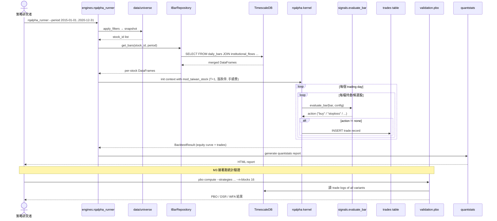

**重點觀察**：
- IBarRepository 抽象（M2 引入）讓 rqalpha / vectorbt 都能切 Parquet 或 TimescaleDB
- 每個 action 即時寫 trades 表 → audit trail 完整
- 統計驗證階段只讀 TimescaleDB，不重跑回測（DSR N 完整記錄）

---

## 第 4 部分：資料架構

> **v1.4 補註（2026-05-31）**：以下 §4.1 ER 圖為 M1 階段 6 表基線。
> M2-M5 完整 schema（13 表 DDL + 三層資料流 + DQ rules + retention policy + 跨源 ACL）詳見 **[21_data_contract.md](./21_data_contract.md)**。本節保留作 M1 baseline 視覺參考，不再擴充。

### 4.0 M2+ 資料層快覽（指向 21 號文件）

| 維度 | M1 (本節) | M2+ (見 21 號文件) |
| :--- | :--- | :--- |
| 表數 | 6 表 | 13 表（4 新增 + 9 新增） |
| 資料源 | FinMind 單源 | FinLab 主 + FinMind fallback + Shioaji live |
| 儲存 | TimescaleDB only | TimescaleDB + Zipline bundle + Parquet cache |
| 一致性 | ACID for trades | + ACL 三邊界 + 跨源 cross-check |
| 備份 | 無 | M5 daily pg_dump → GCS |
| Retention | 永久 | 13 個 retention policy |

### 4.1 資料模型（TimescaleDB Schema）

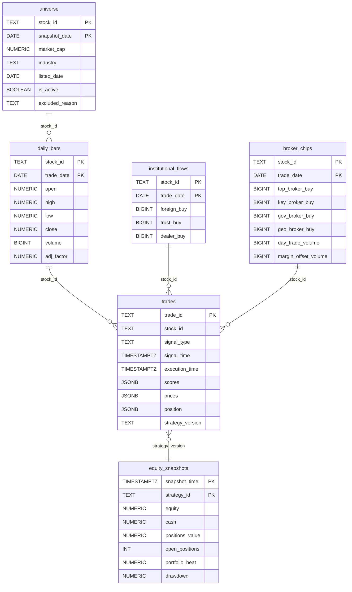

### 4.2 一致性策略

- **強一致**：trades 表（audit trail，不能丟）— 直接 Postgres ACID
- **最終一致**：daily_bars / institutional / broker_chips（ETL 重跑會修正） — 用 ON CONFLICT DO UPDATE

### 4.3 資料分類

| 類別 | 範例 | 處理 |
| :--- | :--- | :--- |
| 公開（市場資料） | 股價、法人籌碼 | 不需加密 |
| 個人（帳戶 + token） | FinMind token、Shioaji 帳號 | .env + 不入 git，KMS（M5） |
| Audit | trades、equity_snapshots | 永久保留 |

---

## 第 5 部分：部署與基礎設施

### 5.1 部署視圖（C4 Deployment Diagram）

> C4 Deployment = L2 Container 的**物理實體化**：把每個 logical Container instantiate 到具體 Node（PC / VM / Container Engine）。

#### 5.1.1 M1 Deployment（當前）

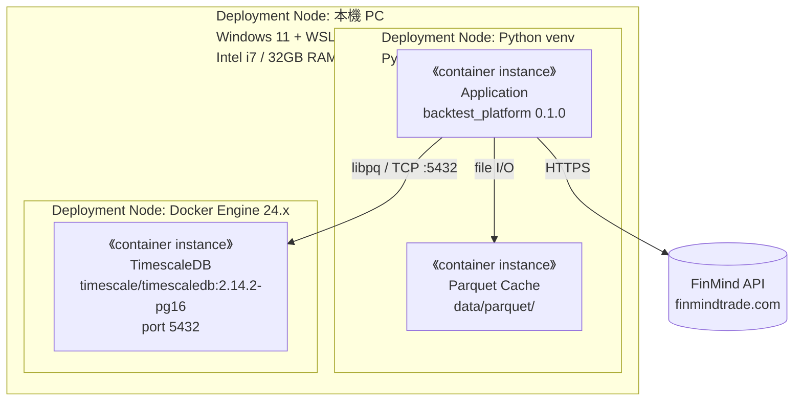

| 屬性 | 值 |
| :--- | :--- |
| Deployment 模式 | 單機 |
| 高可用 | 無 |
| Backup | 無（M1 是研究階段） |
| 監控 | 無（log to file） |

#### 5.1.2 M5 Deployment（Target）

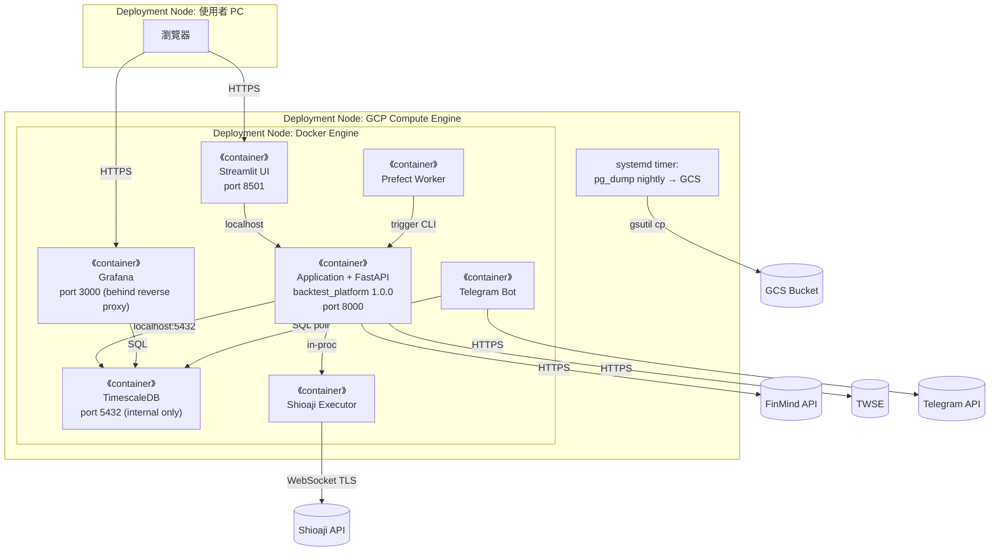

| 屬性 | M5 值 |
| :--- | :--- |
| Deployment 模式 | 單 VM（M6+ 評估 K8s） |
| Backup | 每日 pg_dump → GCS（保留 30 天） |
| RPO / RTO | 24h / 1h |
| 監控 | Grafana + Telegram |
| TLS | reverse proxy（Caddy / Nginx）終止 TLS |

#### 5.1.3 環境策略

| 環境 | Deployment | 用途 |
| :--- | :--- | :--- |
| Dev | 本機 PC + WSL2 + Docker | 開發、unit test、M1–M3 回測 |
| Staging | 同 Dev | M4 paper trading（同機跑模擬 = 排程觸發 paper_trader） |
| Production | GCP Compute Engine（5.1.2） | M5 小倉位實盤、全倉 |

### 5.2 CI/CD 流程

當前無 CI/CD（單人專案）。M3 開始引入：

| 階段 | 步驟 |
| :--- | :--- |
| Lint | ruff check |
| Type | mypy --strict |
| Test | pytest tests/ |
| Coverage | pytest-cov，閾值 80% |

### 5.3 環境策略

| 環境 | 用途 |
| :--- | :--- |
| Dev | 本機開發、unit test |
| Staging | M4 paper trading 用 |
| Production | M5 小倉位實盤、全倉 |

### 5.4 成本估算

| 項目 | 月成本 | 備註 |
| :--- | :---: | :--- |
| FinMind sponsor（可選） | NT$ 99–300 | M2 需要時 |
| TEJ（可選） | NT$ 3,000–10,000 | 含下市股 + 券商分點 |
| 雲端主機（M5） | NT$ 500–2,000 | 實盤 24x7 |
| 證券手續費 | 浮動 | 取決於倉位 |

---

## 第 6 部分：跨領域考量

### 6.1 可觀測性

| 維度 | 工具 | 當前狀態 |
| :--- | :--- | :--- |
| 日誌 | Loguru → stdout / 檔案 | ✅ |
| 指標（M4+） | Grafana → TimescaleDB | 規劃中 |
| 追蹤 | — | 不適用（無 distributed call） |
| 告警（M5） | Telegram bot | 規劃中 |

### 6.2 安全性

| 維度 | 處理 |
| :--- | :--- |
| Secrets | `.env` + gitignore + `os.environ.get` |
| API token | FinMind / Shioaji 各自獨立 |
| DB password | .env，預設值 `change_me_in_production` 防忘改 |
| 程式碼安全 | ruff + mypy + bandit（M3） |

---

## 第 7 部分：風險與演進

### 7.1 風險登記

| 風險 | 可能性 | 影響 | 緩解 |
| :--- | :--- | :--- | :--- |
| FinMind 免費版缺券商分點 → v2 L3 籌碼分不完整 | 高 | 中 | 升級 sponsor / 切 TEJ / 砍 v2 L3 |
| 下市股資料源未解 → 生存者偏誤 | 高 | 高 | 早期 POC 評估 |
| rqalpha 對台股 T+1 支援不完整 | 中 | 高 | 自寫 mod_taiwan_stock |
| 訊號邏輯與 XQ 差異 > 0.5% | 中 | 高 | 100 訊號抽樣對照 |
| 策略本身無 Edge | 高 | 致命 | 接受 → 砍策略 |

### 7.2 演進路線

| Phase | 目標 |
| :--- | :--- |
| Phase 1 (M1)| 資料 + 計分 + 訊號 + 端到端 smoke |
| Phase 2 (M2) | rqalpha IS 回測通過 |
| Phase 3 (M3) | vectorbt 參數網格 + PBO/DSR 驗證 |
| Phase 4 (M4) | Paper trading 3 個月 |
| Phase 5 (M5) | 小倉位實盤 + Shioaji + Grafana |
| Phase 6 (M6+) | React UI、多策略 |

---

## 變更紀錄

| 版本 | 日期 | 變更 |
| :--- | :--- | :--- |
| v1.2 | 2026-05-26 | 將 C4 模板（規則、Container 清單、Checklist）整合進 §1.1；移除獨立模板檔 |
| v1.1 | 2026-05-26 | C4 改嚴格版（L2 單一 Application、L3 按 Container zoom）；術語表改 v2 L1–L4 |
| v1.0 | 2026-05-26 | 初版（M1） |

---

## 第 8 部分：模組詳細設計

詳見 `07_module_specification_and_tests.md`。M1 範圍：

- `config/strategy_config.py`
- `data/schemas.py`、`data/finmind_etl.py`、`data/adjustment.py`、`data/db_writer.py`、`data/universe.py`
- `strategy/indicators.py`、`strategy/scoring.py`、`strategy/signals.py`
- `pipeline.py`

### NFR 實現

- **性能**：純 numpy/pandas vectorize，避免逐 row iter（除了 signals 必須的）
- **安全**：所有外部輸入用 Pydantic 驗證；secrets 從 env 讀
- **可擴展**：純函式設計，易加 cache layer 或 parallel
