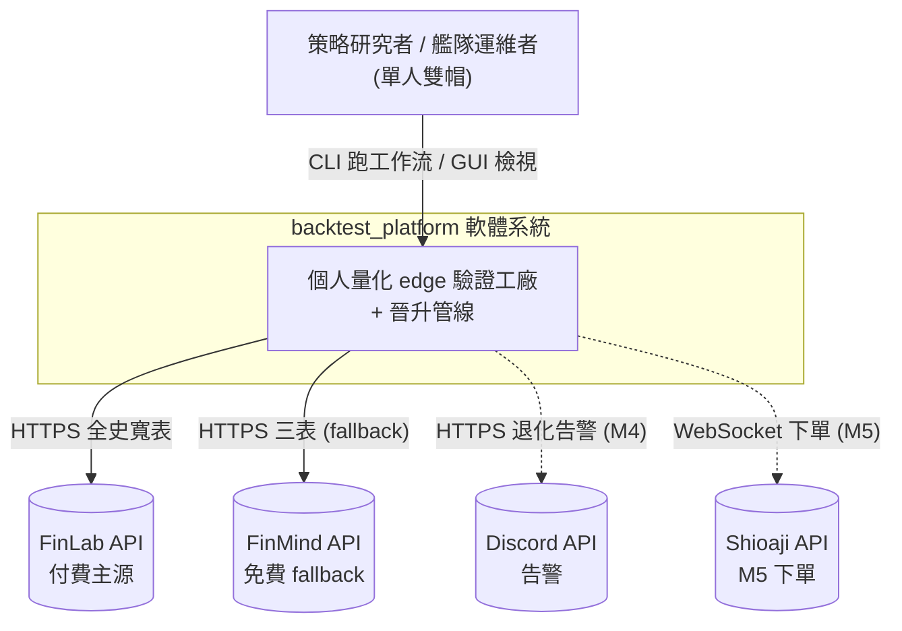
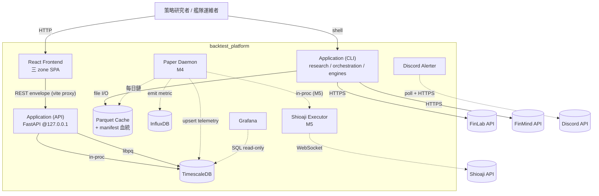
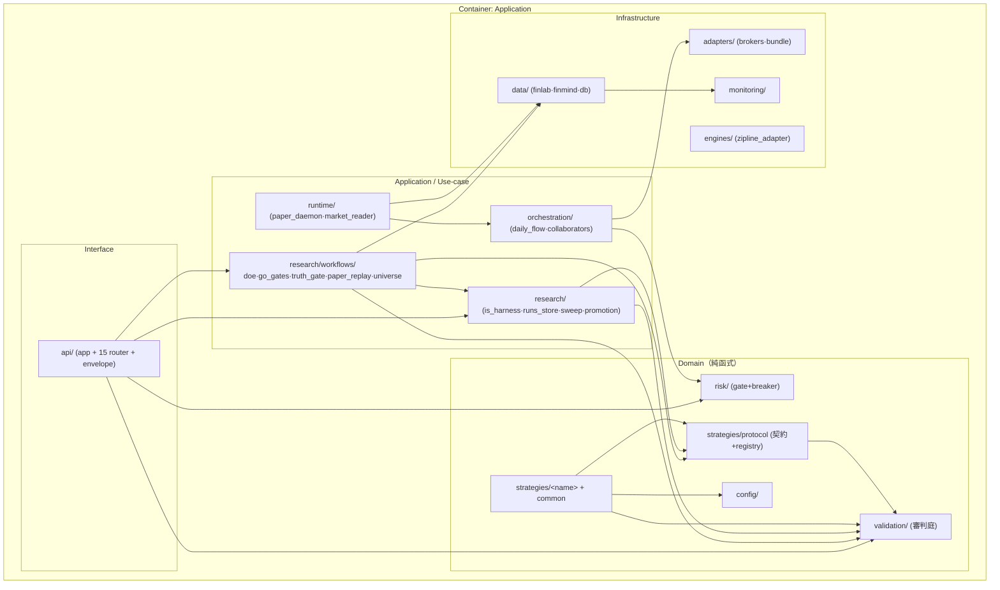
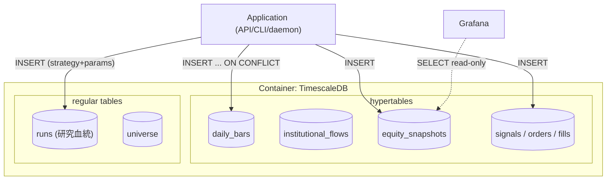
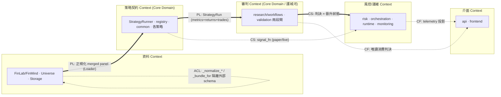
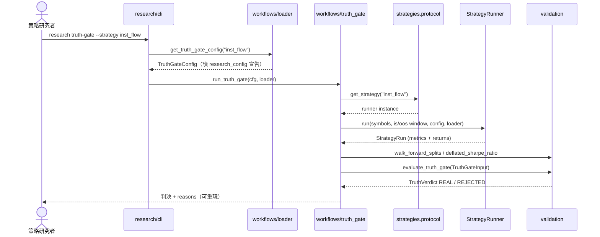
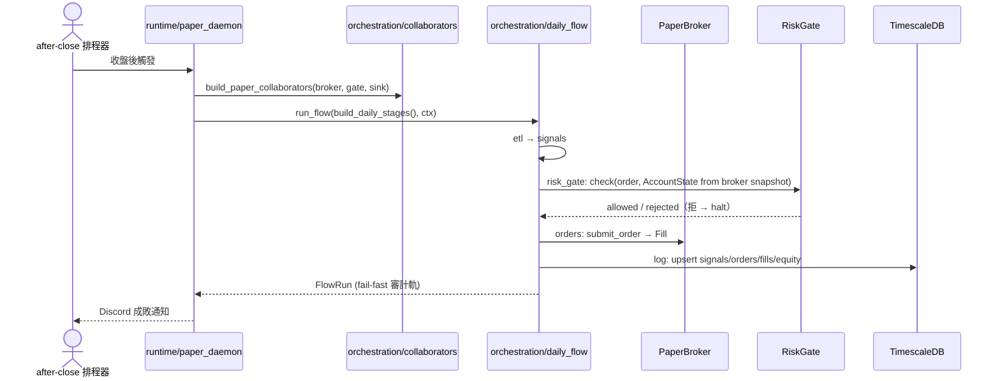

# 架構與設計文件 — backtest_platform

> C4（Context / Container / Component）+ DDD 分層描述現行系統。目錄結構真相源見 [08](./08_project_structure_guide.md)、依賴 DAG 見 [09](./09_file_dependencies_template.md)、類別關係見 [10](./10_class_relationships_template.md)、資料契約見 [21](./21_data_contract.md)、REST 契約見 [25](./25_fe_be_rest_contract.md)、部署見 [23](./23_deployment_topology.md)。

## 產品定位

backtest_platform 是一座 **個人量化 edge 驗證工廠 + 晉升管線**：single-user、standalone（單機自託管、localhost-only 綁定，[ADR-031](./adrs/ADR-031-standalone-auth-decision.md)）、台股專用。策略是消耗品、審判庭（PBO/DSR/WFA/survivorship-clean 兩段驗證閘）是核心資產、連續 NO-GO 是平台正常運作的證據。本文件的架構決策全部服務這個定位：**上層依賴穩定的策略契約、審判庭純函式可稽核、風控前置**。完整敘事見 [02 PRD v4.0](./02_project_brief_and_prd.md)。

---

## 第 1 部分：架構總覽

### 1.1 C4 模型

#### 1.1.0 命名防呆

| 術語 | 指什麼 | 勿混淆 |
| :--- | :--- | :--- |
| **C4 L1–L4** | 架構圖縮放層級（情境 → 容器 → 元件 → 程式碼）| ≠ DDD 限界上下文 |
| **C4 Container（L2）** | 可獨立部署 / 執行的 runtime 單位 | ≠ Python package、≠ Clean Architecture 分層 |
| **C4 Component（L3）** | **單一** L2 容器內的模組 | 禁止跨容器畫在同一張 L3 |

#### 1.1.1 層級規則

| 層級 | 一張圖只回答 | 方塊必須是 |
| :---: | :--- | :--- |
| **L1** Context | 誰在用？與哪些外部系統互動？ | 人、本軟體系統（一個邊界）、外部系統 |
| **L2** Container | 系統內有哪些 runtime？ | Process、DB、檔案儲存、排程服務 |
| **L3** Component | 某一個 L2 容器內部怎麼拆？ | 模組 / package（對應 repo 路徑）|
| **L4** Code | 類別 / 函式（可選） | 連結 [10](./10_class_relationships_template.md) |

#### 1.1.2 Container 清單（模組化單體）

| Container | 類型 | 技術 | 啟用 | 備註 |
| :--- | :--- | :--- | :---: | :--- |
| **Application (API)** | Process | `uvicorn ...api.app:app`（綁 `127.0.0.1`）| ✅ | FastAPI 15 router；同進程掛載 research/validation/risk/strategies |
| **Application (CLI)** | Process | 3 組 Click（research / orchestration / engines）| ✅ | 與 API 共用同一份 src；研究時段主入口 |
| **React Frontend** | Process / 靜態 | Vite + React 19 | ✅ | 三 zone SPA，經 REST 契約耦合 |
| **TimescaleDB** | DB | `timescale/timescaledb` | ✅ | telemetry + bundle cache |
| **Parquet Cache** | 檔案 | `data/parquet/` + `*_manifest.json` | ✅ | 不可變快照 + 血統 |
| **InfluxDB** | DB | InfluxDB | ✅（M4 producer）| 系統 metric 時序（`monitoring/influx_writer`）|
| **Paper Daemon** | Process | `runtime/paper_daemon` | 🔸 M4 | after-close 排程器接線中 |
| **Discord** | 外部 | httpx REST（[ADR-010](./adrs/ADR-010-discord-alerter-supersedes-telegram.md)）| ✅ | 告警主通道 |
| **Grafana** | UI | Docker | 🔸 | 系統面板輔（read-only TSDB）|
| **Shioaji Executor** | Process | Shioaji SDK | 🔸 M5 | 實盤下單 |

外部系統：FinLab API（付費主源）、FinMind API（免費 fallback）、Discord API、Shioaji API（M5）。

#### L1 — System Context



- **邊界內**：本 repo 實作的一切（API + CLI + 前端 + 排程 + DB + 告警）。
- **邊界外**：第三方資料源 / 券商 / 推送。不含 GitHub / CI runner（開發流程）。

#### L2 — Container（現況，虛線 = M4/M5 尚未啟用）



#### L3-A — Component（zoom: Application）

> 展開 Application 容器；箭頭 = Python import。Clean Architecture 分層標籤供對照 §1.3，非 C4 元素。完整依賴見 [09](./09_file_dependencies_template.md)。



**L3-A 檢查**：Domain 無箭頭指向外部 IO ✅；`validation` 不被 `strategies` 之外循環 import ✅；`engines/protocol` 已 DEPRECATED（幻影 stub，不畫為活躍依賴）✅。

#### L3-B — Component（zoom: TimescaleDB）

TimescaleDB 的 component = table + extension。完整 DDL 見 [21](./21_data_contract.md)；此圖只呈現 runtime element 與 Application 互動。



### 1.2 DDD 戰略設計

> DDD 限界上下文 ≠ C4 System Context（L1）。

#### 限界上下文（Strategic Context Map）



| 上下文 | 角色 | 關係 |
| :--- | :--- | :--- |
| **資料 Context** | Upstream Supplier | 對 FinLab/FinMind 用 **ACL**（`_normalize_*` / `_bundle_for` 屏蔽外部 schema）；對策略用 **PL**（`Loader = Callable[[str], DataFrame]` 單一資料接縫）|
| **策略契約 Context** | Core Domain | 產出 `StrategyRun` 為 PL；平台只認契約，不綁具體策略 |
| **審判 Context** | Core Domain / 護城河 | 消費 `StrategyRun`，經 registry dispatch 判每隻策略；產出 REAL/REJECTED + 晉升狀態 |
| **風控/運維 Context** | Customer + Downstream | 消費策略 signal_fn + 判決；pre-trade 風控 + 熔斷 + Discord |
| **介面 Context** | Conformist | 對審判 / 運維 read-only（唯一耦合 = REST 契約）|

#### 1.2.5 DDD 戰術設計

| DDD 元素 | 程式碼 | 說明 |
| :--- | :--- | :--- |
| **Port / Protocol** | `strategies.protocol.StrategyRunner`、`Loader`、`data.finlab_source.Getter` | 平台↔策略、平台↔資料的接縫 |
| **Registry** | `strategies.protocol` name→runner | 輕量 dispatch |
| **Value Object** | `RunConfig`、workflow configs、`Criterion`、`TruthGateInput`/`SizingInput`、`Order`/`Position`/`AccountState`、`StrategyConfig` | frozen，相等性以值定 |
| **Aggregate** | `StrategyRun`（策略輸出聚合）、`ETLBundle`（一次 ETL 三表 + `merged()`）| 帶不變式 |
| **Domain Service（純函式）** | `evaluate_truth_gate` / `compute_position_size` / `evaluate_gate` / `RiskGate.check` / 各 strategy runner | 給資料回判決 / 回報酬 |
| **State Machine** | `validation.gate_machine.ValidationGate`、`risk.circuit_breaker.CircuitBreaker` | 單向晉升 + OOS sealed vault；熔斷 latch |
| **Anti-Corruption Layer** | `data._normalize_*` / `finlab_source._bundle_for` | 隔離外部 raw schema |

**為何 Core Domain 是「審判 Context」而非策略**：策略是消耗品，會被砍。平台的護城河是能誠實判決任意策略的**審判庭**——所以審判 Context 與策略契約 Context 都列 Core Domain，且兩者以 `StrategyRun` PL 解耦。

### 1.3 分層架構

| 層 | 程式碼位置 | 職責 |
| :--- | :--- | :--- |
| **Interface** | `api/` | HTTP envelope、路由 |
| **Application** | `research/`、`orchestration/`、`runtime/`、`jobs/` | 編排研究工作流 / 每日鏈 / 非同步 job |
| **Domain** | `strategies/`、`validation/`、`risk/`、`config/` | 策略契約 + 純邏輯、審判庭、風控 — 零外部 IO |
| **Infrastructure** | `data/`、`adapters/`、`engines/`、`monitoring/` | 資料源、券商、引擎、DB IO、監控 |

### 1.4 技術選型

| 分類 | 選用 | 理由 | ADR |
| :--- | :--- | :--- | :--- |
| 語言 | Python 3.10+ | 量化生態最成熟 | — |
| 資料 schema | Pydantic v2 | 宣告式 + 邊界驗證 | [ADR-004](./adrs/ADR-004-pydantic-frozen-config.md) |
| Time-series DB | TimescaleDB | Postgres 相容 + 時間優化 | [ADR-002](./adrs/ADR-002-timescaledb-for-time-series.md) |
| 資料源 | FinLab 主 + FinMind fallback | 全史 + 原生 survivorship-clean | [ADR-006](./adrs/ADR-006-data-source-finlab-paid.md) |
| 快取 | Parquet + manifest | 列式壓縮 + 不可變血統 | [ADR-032](./adrs/ADR-032-survivorship-universe-workflow.md) |
| 回測（主） | zipline-reloaded | event-driven + 台股日曆、0 商業綁定 | [ADR-013](./adrs/ADR-013-mainframe-zipline-reloaded-supersedes-tquant-lab.md) |
| 回測（副） | vectorbt | 向量化參數網格 | [ADR-007](./adrs/ADR-007-dual-engine-zipline-vectorbt.md) |
| 統計驗證 | 自寫 PBO/DSR/WFA | 避 AGPL、對論文範例可驗 | [ADR-018](./adrs/ADR-018-monitoring-to-research-loop-pivot.md) |
| HTTP API | FastAPI | envelope + OpenAPI 機器真相 | [ADR-021](./adrs/ADR-021-unify-rest-contract-into-single-doc-and-openapi.md) |
| 前端 | React 19 + TS strict + Tailwind | 三 zone SPA | [ADR-015](./adrs/ADR-015-dashboard-design-system-and-react-upgrade.md) |
| 排程 | cron / systemd timer（Prefect optional）| standalone 剛需，非企業 scheduler | — |
| 告警 | Discord | 單通道 | [ADR-010](./adrs/ADR-010-discord-alerter-supersedes-telegram.md) |
| 套件管理 | uv | lock 快 | [ADR-012](./adrs/ADR-012-adopt-uv-package-manager.md) |

---

## 第 2 部分：需求摘要

### 功能性需求（對應 PRD Epic）

- **FR-1 資料層**：FinLab 全史寬表 → survivorship-clean universe → parquet + manifest；FinMind fallback（Epic 3 / US-002）。
- **FR-2 策略契約**：任意策略實作 `StrategyRunner` + `research_config.py` 即參與所有工作流（ADR-027/029）。
- **FR-3 研究工作流**：`doe` / `go_gates` / `truth_gate` / `paper_replay` / `build_universe`，CLI + HTTP 非同步（Epic 3）。
- **FR-4 審判庭**：兩段閘（真偽閘 hard-fail + 配置閘 sizing），可重現判決（Epic 4）。
- **FR-5 晉升**：IS→WFA→OOS 不可逆 gate + OOS sealed vault + 晉升狀態機（Epic 4 / US-011/012）。
- **FR-6 Paper 鏈**：ETL→signals→risk→orders→log 每日鏈 + pre-trade 風控 + 熔斷（Epic 5）。
- **FR-7 監控**：Fleet telemetry + Discord 告警（Epic 5 / US-006）。

### 非功能性需求

| 分類 | 需求 | 目標值 |
| :--- | :--- | :--- |
| 性能 | 單檔 10 年回測 | < 60 秒 |
| 性能 | 100 檔 portfolio 回測 | < 30 分鐘 |
| 可重現性 | zipline & vectorbt 訊號 | 差異 < 0.1% |
| 可稽核性 | run 血統 | 每 run 記 strategy+params / bundle hash / git_sha |
| 判決可信度 | 審判庭自身 | truth gate 三缺陷修復（ADR-030）為所有策略 KPI 前提 |
| 測試覆蓋 | 全量 | ≥ 80%（現況 ~92.6%，CI hard gate）|
| 安全 | secrets | 後端獨佔、不入 git、不出前端 bundle |

---

## 第 3 部分：系統設計

### 3.1 架構模式

**模組化單體（Modular Monolith）+ Pure Function 核心**。單人單機，微服務拆分無收益；策略 / validation / risk 為純函式，易測、可跨 backtest/paper/live 重用。未來實盤可獨立拆 `runtime` execution（保留模組邊界）。

### 3.2 元件職責

| 元件 | 核心職責 | 依賴 |
| :--- | :--- | :--- |
| `strategies/protocol` | 策略契約 + registry | validation |
| `strategies/<name>/runner` | 實作契約、宣告 gate | protocol, common, validation |
| `research/workflows/*` | 泛用工作流 dispatch | protocol, validation, is_harness |
| `validation/*` | 審判庭統計檢驗（純函式）| — |
| `risk/risk_gate` | 12 pre-trade 檢查 | risk.types |
| `orchestration/daily_flow` | staged 每日鏈引擎 | （注入 collaborators）|
| `orchestration/collaborators` | 接線 broker+risk+sink | adapters.brokers, risk |
| `runtime/paper_daemon` | after-close 逐日跑 chain | orchestration, data, strategies |
| `data/finlab_source` | FinLab 主源 + universe 建構 | （lazy finlab）|
| `api/` | REST envelope + 15 router | research, validation, risk, data |

### 3.3 關鍵使用者旅程

#### 場景 1：策略研究者跑 truth-gate（審判庭主線）



**重點**：步驟 `run(...)` 只經契約 dispatch，絕不 import 策略 backtest 函式（AST 測試守）——判決可重現的結構保證。

#### 場景 2：Paper daemon 每日鏈（M4）



#### 場景 3：GUI/HTTP 觸發研究工作流（非同步）

```
POST /research/workflows/{workflow} {strategy, overrides}
  → 驗證 overrides（model_validate，非 model_copy）→ 202 {job_id, status}
  → 背景 job 跑 run_<workflow>(cfg) → 寫 job_store
GET /research/workflows/{strategy}     → 列該策略宣告的工作流
輪詢 job 狀態 → 完成取結果（研究迴圈永不阻塞）
```

---

## 第 4 部分：資料架構

完整 schema（TimescaleDB DDL + 三層資料流 + DQ rules + 跨源 ACL）以 [21_data_contract.md](./21_data_contract.md) 為真相源。核心：

- **三層儲存**：FinLab/FinMind 拉取 → Parquet cache（不可變 + `*_manifest.json` 血統）→ TimescaleDB（telemetry + universe + runs 血統）。
- **runs 血統**：`runs` 表以 `strategy + params`（非舊 preset）記錄，每 run 可稽核；`test_init_sql_schema.py` 守 DDL↔`db_writer` 欄位不漂移。
- **一致性**：telemetry（signals/orders/fills/equity）強一致 ACID；市場資料 `ON CONFLICT DO UPDATE` idempotent。
- **資料分類**：公開市場資料（不加密）／秘密（`FINLAB_API_TOKEN`/`DISCORD_*` 後端獨佔）／audit（runs / trades 永久保留）。

---

## 第 5 部分：部署與基礎設施

拓撲真相源見 [23_deployment_topology.md](./23_deployment_topology.md)。摘要：

- **現況（dev / paper）**：單機（WSL2 + Docker）；API 綁 `127.0.0.1`、前端 vite proxy 同機；TimescaleDB / InfluxDB / Grafana 走 docker-compose。邊界 = loopback bind（[ADR-031](./adrs/ADR-031-standalone-auth-decision.md)），無 app 層 auth。
- **M5 target**：小倉位實盤上單機自託管（或單 VM）；Shioaji executor + 每日 pg_dump 備份；若需遠端存取，於 M5 重開 auth 決策。
- **CI/CD**：GitHub Actions 三 job hard gate——後端 `uv run pytest`（`--cov-fail-under=80`）／前端 tsc+vitest／contract-drift（`app.openapi()` vs `frontend/openapi.json` diff + `init.sql`↔`db_writer` 欄位對齊）。

---

## 第 6 部分：跨領域考量

### 6.1 可觀測性

| 維度 | 工具 | 狀態 |
| :--- | :--- | :--- |
| 日誌 | Loguru → stdout / 檔案 | ✅ |
| 系統指標 | InfluxDB（`monitoring/influx_writer`）+ Grafana | ✅（M4 producer 餵入即點亮）|
| 研究血統 | runs ledger（JSONL + TimescaleDB）| ✅ |
| 告警 | Discord（`monitoring/discord_notifier` + `alert_rules`）| ✅ |

### 6.2 安全性

| 維度 | 處理 |
| :--- | :--- |
| 邊界 | loopback bind（`127.0.0.1`），無公網暴露（[ADR-031](./adrs/ADR-031-standalone-auth-decision.md)）|
| Secrets | `.env` + gitignore；`FINLAB_API_TOKEN`/`DISCORD_*`/`INFLUX_*` 後端獨佔，不出回應 / 前端 bundle |
| 輸入驗證 | 系統邊界 Pydantic `model_validate`（HTTP overrides 走驗證非 `model_copy`）|
| 錯誤訊息 | 全域 fallback 不洩漏 stack / 秘密 |

---

## 第 7 部分：風險與演進

### 7.1 風險登記

| 風險 | 可能性 | 影響 | 緩解 |
| :--- | :--- | :--- | :--- |
| 審判庭自身不可信（DSR 單位 / OOS holdout / survivorship）| — | 致命（護城河級）| ADR-030 修復 + 判決級 oracle 測試 |
| 策略本身無 edge | 高 | 常態（非失敗）| 接受 → 砍策略換 family（連續 NO-GO = 平台工作證據）|
| FinLab 倒閉 / 漲價 | 中 | 中 | FinMind bundle fallback（已驗證可用）|
| paper/live 即時資料中斷 | 中 | 高 | 中斷觸發 Discord Critical |
| 台股微結構偏樂觀（漲跌停 / 停牌）| 中 | 中 | Phase 3 補 `TradingControl` + leak detector |

### 7.2 演進路線

現況 → 剩餘里程碑以 [17_m2_to_m5_master_plan.md](./17_m2_to_m5_master_plan.md) 為準：研究迴圈 + 審判庭 + 前端三 zone 已完成 → 重驗 inst_flow → after-close 排程器收 live OOS → 3 個月 paper → M5 小倉位實盤（2027-Q2）。里程碑狀態單一真相源為 [16 WBS](./16_wbs_development_plan.md)。
