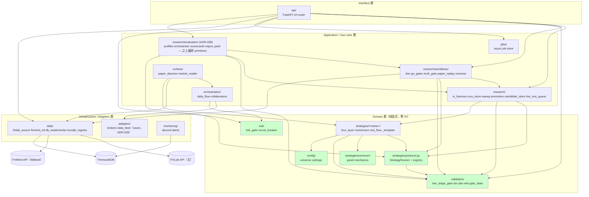

# 模組依賴關係 — backtest_platform

> **本檔為 Clean Architecture 分層依賴（Python import 方向）**，不是 C4 Container 圖。部署 / runtime 邊界見 [05 §1](./05_architecture_and_design_document.md)；目錄結構真相源見 [08](./08_project_structure_guide.md)。

## 產品定位

backtest_platform 是 **個人量化 edge 驗證工廠 + 晉升管線**（single-user、standalone、台股專用）。審判庭是核心資產。本檔的依賴紀律直接服務這個定位：**上層依賴穩定的策略契約，永不硬綁具體策略**——這是「新增策略只碰 2-3 檔、平台判每隻策略用同一套 plumbing」的結構前提。

---

## 依賴原則

| 原則 | 要點 |
| :--- | :--- |
| **依賴倒置（DIP）** | 上層（research / orchestration / api）依賴策略**契約** `strategies.protocol.StrategyRunner`，經 `get_strategy(name)` dispatch，不 import 任何具體策略的 backtest 函式（AST 測試守門，[ADR-028](./adrs/ADR-028-strategy-dispatch-contract.md)）|
| **無循環依賴（ADP）** | 依賴形成 DAG；關鍵不變式：`validation` 不 import `strategies`，故 `strategies → validation` 無循環（已驗證）|
| **穩定依賴（SDP）** | 依賴朝更穩定模組：`config` > `strategies.protocol`/`validation`/`risk` > `research` > `orchestration`/`api` |
| **策略間零互賴** | 策略之間不互相 import；共用回測機制走中立層 `strategies.common`（[ADR-026](./adrs/ADR-026-extract-shared-backtest-mechanics-from-momentum.md)）|

---

## 架構分層依賴圖



- 綠色 = 零外部 IO 的 Domain 核心，最穩定、可放心 import。
- `strategies.protocol` 是**平台↔策略的唯一接縫**：上層只認 `StrategyRunner` 契約 + registry。
- **engines/ 已移除（ADR-037）**：舊 `engines/protocol.py` 的 `Engine` Protocol + zipline/vectorbt stub 全刪；sim 為唯一引擎，經 `research.is_harness` 的 loader seam 運作。

---

## 層級職責

| 層級 | 職責 | 程式碼路徑 |
| :--- | :--- | :--- |
| **Interface** | HTTP 邊界、envelope、路由 | `api/` |
| **Application** | 編排研究工作流 / 每日鏈 / 非同步 job | `research/`、`orchestration/`、`runtime/`、`jobs/` |
| **Domain** | 策略契約 + 純邏輯、審判庭、風控、參數 | `strategies/`、`validation/`、`risk/`、`config/` |
| **Infrastructure** | 外部資料源、券商、DB IO、監控 | `data/`、`adapters/`、`monitoring/` |

---

## 關鍵依賴路徑

### 場景 A：`research truth-gate --strategy inst_flow`（審判庭主線）

```
1. research/cli.py  →  research/workflows/loader.get_truth_gate_config("inst_flow")
2.   → 動態 import strategies/inst_flow/research_config.py（讀 TRUTH_GATE 宣告）
3. research/workflows/truth_gate.run_truth_gate(cfg, loader)
4.   → strategies.protocol.get_strategy("inst_flow")   ← registry dispatch
5.   → runner.run(symbols, start, end, config, loader) → StrategyRun（絕不 import backtest 函式）
6.   → validation.wfa.walk_forward_splits / validation.dsr.deflated_sharpe_ratio
7.   → validation.two_stage_gate.evaluate_truth_gate（真偽閘）→ REAL / REJECTED
```

**紀律**：步驟 5 只透過契約 dispatch，讓 truth_gate 對任意策略同構——這是「判決可重現」的結構保證。

### 場景 B：`paper_daemon` 每日鏈（Paper 運維）

```
runtime/paper_daemon
  → orchestration.collaborators.build_paper_collaborators
      → adapters.brokers.paper_broker.PaperBroker（撮合 + 成本模型）
      → risk.risk_gate.RiskGate（12 pre-trade 檢查，注入 AccountState 快照）
  → orchestration.daily_flow.run_flow（ETL→signals→risk→orders→log，fail-fast）
```

---

## Import 規則

### 允許的方向

```python
# 上層（api / research / orchestration）→ 依賴契約，經 registry dispatch
from backtest_platform.strategies.protocol import get_strategy, get_strategy_gate
runner = get_strategy(name)            # ✅ 不 import 具體策略 backtest 函式

# 每隻策略的 runner.py 實作契約，依賴中立層 + validation
from backtest_platform.strategies.protocol import StrategyRunner, register_strategy
from backtest_platform.strategies.common.panel import column_panel, panel_metrics
from backtest_platform.validation.gate_state import PANEL_GATE

# research_config.py 依賴中立 universe，不拉引擎（WP6 解纏後）
from backtest_platform.config.universe import DEFAULT_UNIVERSE   # ✅ 零依賴葉節點，不 import finmind_bundle
```

### 嚴禁

```python
# ❌ 上層直接 import 具體策略的 backtest 函式（繞過 dispatch）
# from backtest_platform.strategies.inst_flow.strategy import backtest_inst_flow

# ❌ 策略之間互相 import，更不可挖對方私有函式（ADR-026）
# from backtest_platform.strategies.momentum.strategy import _rebalance_dates
#   → 一律走中立層 strategies.common

# ❌ Domain 依賴 Infrastructure
# strategies/*/strategy.py 內 from backtest_platform.data import ...

# ❌ validation import strategies（會造成 strategies → validation 循環）
```

### 策略註冊聚合點

`import backtest_platform.strategies`（`strategies/__init__.py`）import 四隻 runner，觸發 `@register_strategy` 填 registry。註冊聚合住在**策略層自身**（非 research 上層），任何 entry point 不需知道該 import 哪個模組即可 `get_strategy(name)`。`research/runners.py` 降為薄 back-compat re-export。

### Lazy import

- `data/finlab_source.py`：`finlab` 僅在 `getter=None`（真呼叫 API）時 lazy import，頂層零依賴（[ADR-032](./adrs/ADR-032-survivorship-universe-workflow.md)）。
- `data/finmind_etl.py` / `data/db_writer.py`：`FinMind` / `psycopg2` lazy import，測試環境免裝即可 unit test。
- `orchestration/daily_flow.py`：`prefect` 為 optional extra，缺席時 fallback 至 inline runner。

---

## 依賴風險管理

| 風險 | 解決策略 |
| :--- | :--- |
| 上層繞過契約直呼策略 | AST 測試守 dispatch invariant（`tests/research/workflows/`）；conformance gate 驗每隻策略滿足契約 |
| `strategies → validation` 循環 | `validation` 保持不 import `strategies`（測試 `test_dependency_untangle.py` 守）|
| FinLab / FinMind schema 變動 | `finlab_source._bundle_for` / `finmind_etl._normalize_*` 集中處理 + Pydantic 邊界驗證 |
| 未來重加 event 引擎 | 在 `research.is_harness` 的 loader seam 後新增 adapter（ADR-037；不復活已刪的 engines/ 樹）|

---

## 外部依賴清單（核心）

| 依賴 | 用途 | 風險 |
| :--- | :--- | :--- |
| pandas / numpy | 資料運算核心 | 低 |
| pydantic ≥2 / pydantic-settings | schema 邊界驗證 + env 配置 | 低 |
| exchange-calendars | 精確 XTAI 交易日曆（`calendar` extra；after-close 排程閘門，[ADR-037](./adrs/ADR-037-remove-zipline-engine-remnants.md)）| 低 |
| finlab | 付費主資料源（lazy） | 中 |
| FinMind | 免費 fallback 資料源（lazy） | 中 |
| scipy | PBO/DSR/WFA 統計 | 低 |
| fastapi / uvicorn | HTTP API | 低 |
| psycopg2 | TimescaleDB driver（lazy） | 低 |
| click / loguru | CLI / logging | 低 |
| prefect | 排程（optional extra） | 低 |
| shioaji | 永豐金下單（M5） | 高（二進制） |

版本鎖定於 `uv.lock`（[ADR-012](./adrs/ADR-012-adopt-uv-package-manager.md)）。依賴檢查建議：`import-linter`（強制 import 規則）、`pydeps`（視覺化）。
