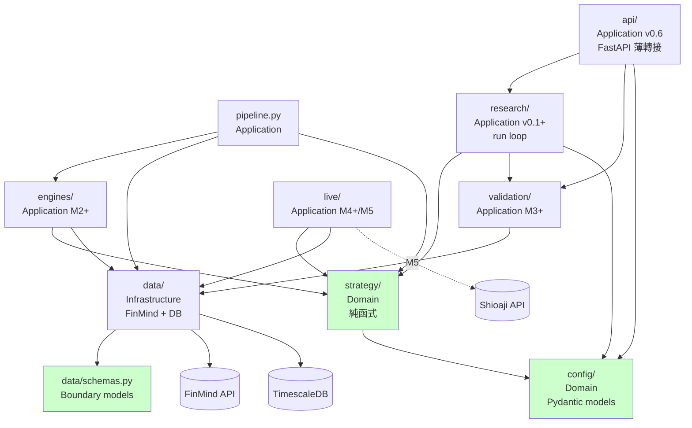
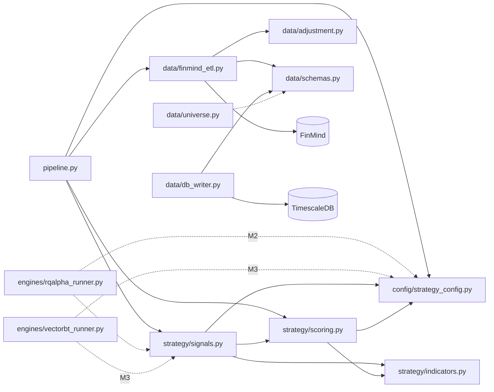

# 模組依賴關係分析 — backtest_platform

> **版本：** v1.1 | **更新：** 2026-05-31 | **狀態：** M1 已實作 / M2 重組已完成
> **與 C4 的關係**：本檔為 **Clean Architecture 分層依賴**（模組 import），不是 C4 Container 圖。部署 / runtime 邊界見 `05_architecture_and_design_document.md` §1.1（C4 嚴格版）。
>
> **v1.1 註記（2026-05-31）**：本檔下方圖表多處以 `strategy/`、`engines/` 等 M1 名稱呈現概念依賴關係。實際 M2 重組後（commit `ae869f5`）對應如下，請讀者自行 substitute：
>
> | 本檔提及 (M1 概念) | M2 實際路徑 |
> | :--- | :--- |
> | `strategy/` | `strategies/four_layer_resonance/`（多策略 namespace，ADR-008）|
> | `engines/rqalpha_runner` | 廢止（ADR-001 superseded by ADR-005）|
> | `engines/vectorbt_runner` | `engines/vectorbt_adapter.py`（M3）|
> | `live/paper_trader` | `adapters/brokers/paper_broker.py` |
> | `live/shioaji_executor` | `adapters/brokers/shioaji_broker.py` |
> | （新增）`adapters/` | data_bundle / data_feed / brokers — 視為 Infrastructure 層 |
> | （新增）`orchestration/` | 視為 Application 層（取代 pipeline.py 為 M2+ 主入口）|
> | （新增）`monitoring/`、`dashboard/` | 側邊掛接 read-only 消費者，不被上游 import |
>
> **新層依賴規則**：
> - `adapters/` 依賴 `config/` + `strategies/`（為使其可注入）；不依賴 `data/`（FinMind ETL 是 fallback adapter 之一）
> - `orchestration/` 可 import 任何下層
> - `monitoring/` / `dashboard/` 只 read TimescaleDB / InfluxDB，不被任何業務模組 import
>
> 完整目錄結構詳見 [08_project_structure_guide.md](./08_project_structure_guide.md) v1.1。
>
> 待完整重寫的依賴圖排程：M2 Sprint 1 結束後（屆時 `adapters/`、`engines/` 有實際程式碼可畫）。

---

## 依賴原則

| 原則 | 要點 |
| :--- | :--- |
| **依賴倒置 (DIP)** | `strategy/` 為 domain，不依賴 `data/` 的具體實現；ETL 用 `Protocol` 抽象 FinMind interface |
| **無循環依賴 (ADP)** | 依賴形成 DAG，禁止雙向 import |
| **穩定依賴 (SDP)** | 依賴方向朝向更穩定的模組（`config/` > `strategy/` > `engines/`） |

---

## 架構分層依賴圖



**規則**：
- Domain（`strategy/`、`config/`） → 不依賴任何下層
- Application（`pipeline.py`、`engines/`、`validation/`） → 依賴 Domain + Data
- Infrastructure（`data/`） → 依賴 Schemas 與外部
- 顏色（綠）標示零外部 IO 依賴 — 最穩定，可放心 import

---

## 層級職責

| 層級 | 職責 | 程式碼路徑 |
| :--- | :--- | :--- |
| **Application** | 編排業務流程、CLI 入口 | `pipeline.py`、`engines/*.py`、`validation/*.py`、`live/*.py` |
| **Domain** | 業務邏輯（策略計算、參數模型） | `strategy/`、`config/` |
| **Infrastructure** | 外部 API、DB IO | `data/finmind_etl.py`、`data/db_writer.py` |
| **Boundary** | 跨層資料契約 | `data/schemas.py` |

---

## 檔案級依賴圖



---

## 關鍵依賴路徑

### 場景：執行 `pipeline run --stock-id 2330`

```
1. CLI 進入 pipeline.run_pipeline (Application)
2. → data.finmind_etl.fetch_bundle (Infrastructure)
     → FinMind API（外部）
     → data.schemas.ETLBundle (Boundary)
     → data.adjustment.compute_adj_factor / apply_adjustment (Infrastructure)
3. → ETLBundle.merged() (Boundary)
4. → strategy.scoring.compute_scores (Domain)
     → strategy.indicators.* (Domain)
     → config.strategy_config.StrategyConfig (Domain)
5. → strategy.signals.compute_signals (Domain)
     → strategy.signals._evaluate_priority (Domain 內部)
6. → 寫 calendar CSV / print summary (Application)
```

**注意**：Domain 層（步驟 4–5）完全不知道資料來自哪裡，純函式接收 DataFrame、回傳 DataFrame。

---

## 依賴風險管理

| 風險 | 解決策略 |
| :--- | :--- |
| 循環依賴 | `strategy/` 內 `scoring.py` ↔ `signals.py` 嚴禁 — 兩者用 indicator + config |
| FinMind API 改 schema | `_normalize_*` 函式集中處理 + Pydantic 驗證 |
| rqalpha vs vectorbt 訊號分歧 | 共用 `_evaluate_priority`（pure function），加對齊測試 |
| Pydantic v1 → v2 升級 | 已用 v2，不混用 v1 syntax |
| pandas 版本破壞變更 | 限定 `>= 2.2`，CI 鎖定 lock file（M2 引入） |

---

## 外部依賴清單

| 依賴 | 版本 | 用途 | 風險 |
| :--- | :--- | :--- | :--- |
| pandas | >= 2.2 | 資料運算核心 | 低（穩定） |
| numpy | >= 1.26 | 向量運算 | 低 |
| pyarrow | >= 15.0 | parquet IO | 低 |
| duckdb | >= 1.0 | 快速查詢（M2 EDA） | 低 |
| psycopg2-binary | >= 2.9 | TimescaleDB driver | 低 |
| sqlalchemy | >= 2.0 | （備用） | 低 |
| FinMind | >= 1.7 | 資料源 | **中**（API 可能變動、免費版功能變） |
| scipy | >= 1.12 | 統計檢驗 | 低 |
| pydantic | >= 2.6 | 驗證 | 低 |
| pydantic-settings | >= 2.2 | env 配置 | 低 |
| loguru | >= 0.7 | logging | 低 |
| click | >= 8.1 | CLI | 低 |
| python-dotenv | >= 1.0 | .env 載入 | 低 |
| rqalpha | >= 5.4 | 回測引擎 | 中（社群維護） |
| vectorbt | >= 0.26 | 參數網格 | 中 |
| quantstats | >= 0.0.62 | 報表 | 中 |
| pyfolio-reloaded | >= 0.9.6 | 績效分析 | 中 |
| empyrical-reloaded | >= 0.5.10 | 績效指標 | 中 |
| hmmlearn | >= 0.3 | regime 偵測（M3+） | 中 |
| ruptures | >= 1.1 | 變點偵測（M3+） | 中 |
| fastapi | >= 0.110 | API（M5） | 低 |
| streamlit | >= 1.32 | UI Phase 1 | 中 |
| shioaji | >= 1.2 | 永豐金下單（M5） | 高（官方但二進制） |
| pytest | >= 8.0 | 測試 | 低 |
| pytest-cov | >= 4.1 | 覆蓋率 | 低 |
| ruff | >= 0.3 | lint | 低 |
| mypy | >= 1.9 | 型別檢查 | 低 |

### 更新策略

- **每月**：`pip list --outdated` 檢查
- **變更前**：跑完整 test suite
- **重大變更**：M2 引入 lock file `uv.lock`（ADR-012）

---

## Import 規則

### 允許的 import 方向

```python
# orchestration/cli.py 或 pipeline.py（最上層）可 import 所有東西
from backtest_platform.data import ...
from backtest_platform.strategies.four_layer_resonance import ...
from backtest_platform.adapters.data_bundle.finlab_bundle import ...
from backtest_platform.config import ...

# strategies/four_layer_resonance/signals.py 可 import（intra-package 用 relative）
from backtest_platform.config import ...
from .scoring import ...
from .indicators import ...

# 嚴禁
# strategies/four_layer_resonance/scoring.py 不可
# from backtest_platform.data import ...  ❌ Domain 不依賴 Infrastructure
# from backtest_platform.adapters import ...  ❌ Domain 不依賴 Adapter

# 嚴禁
# adapters/data_bundle/finlab_bundle.py 不可
# from backtest_platform.adapters.brokers import ...  ❌ Adapter 互不依賴
```

**M2 重組後（2026-05-31）import path 變更**：
| 舊 (M1) | 新 (M2+) |
| :--- | :--- |
| `backtest_platform.strategy.scoring` | `backtest_platform.strategies.four_layer_resonance.scoring` |
| `backtest_platform.strategy.signals` | `backtest_platform.strategies.four_layer_resonance.signals` |
| `backtest_platform.strategy.indicators` | `backtest_platform.strategies.four_layer_resonance.indicators` |

### Lazy import（延遲載入）

部分模組用 lazy import 減少測試環境壓力：

```python
# data/finmind_etl.py
def _build_loader(token):
    from FinMind.data import DataLoader  # lazy
    ...

# data/db_writer.py
@contextmanager
def _connection(cfg):
    import psycopg2  # lazy
    ...
```

理由：測試環境不需裝 FinMind / psycopg2 也能 import 模組做 unit test。

---

## 依賴檢查工具（建議）

| 工具 | 用途 |
| :--- | :--- |
| `ruff check --select TID` | 偵測絕對 / 相對 import 規範 |
| `pydeps` | 視覺化依賴圖 |
| `import-linter` | 強制執行 import 規則（M3 引入） |
