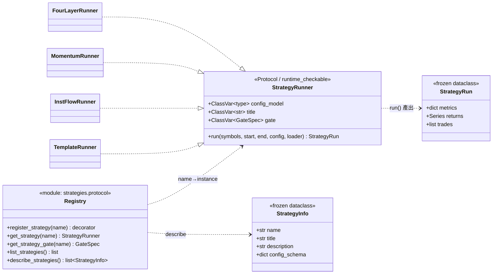
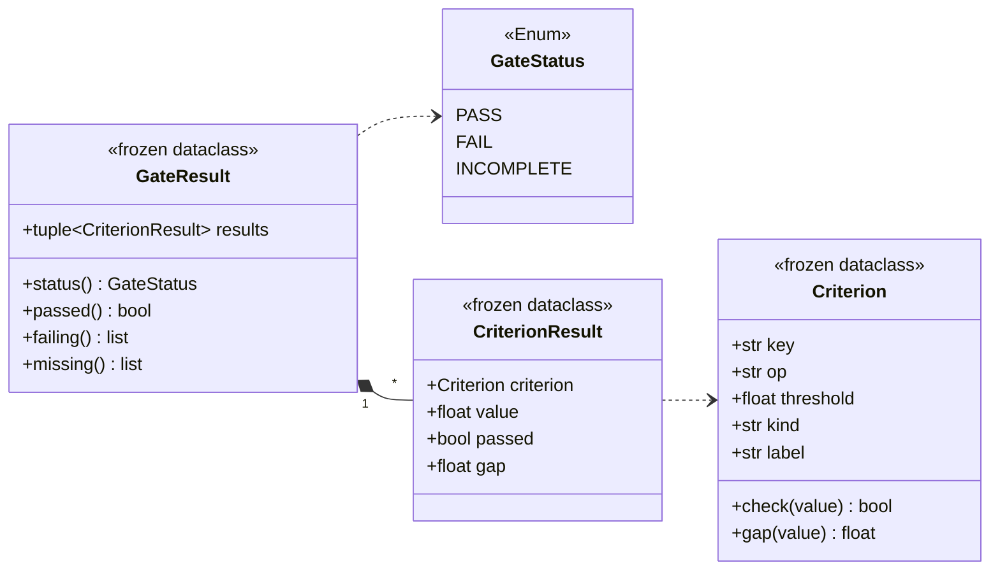
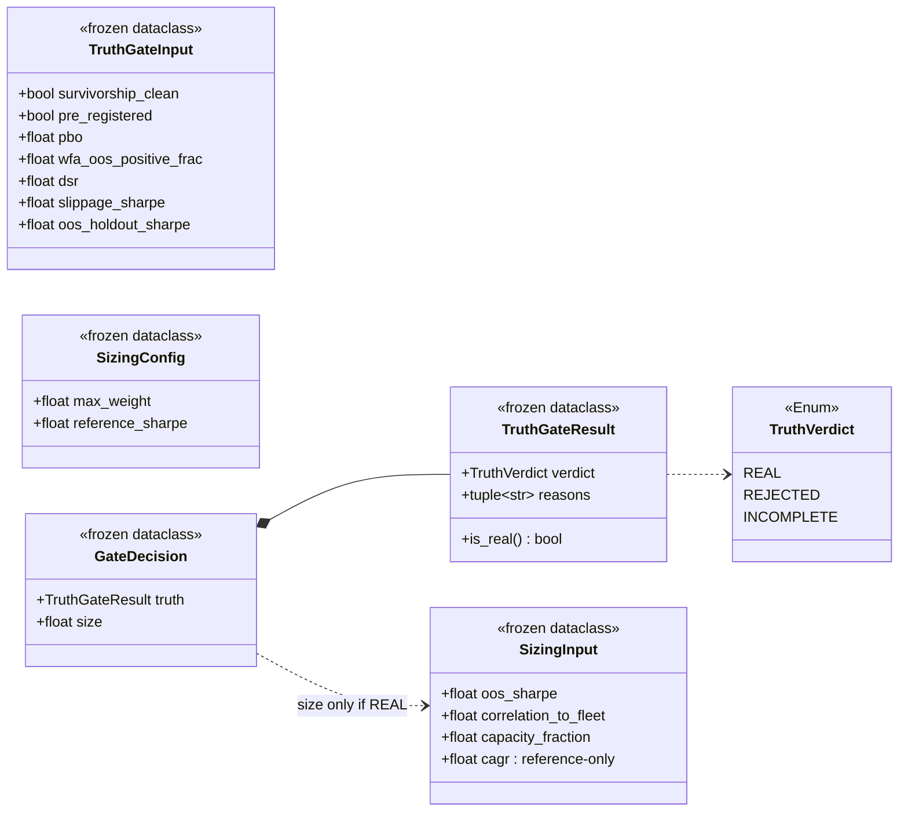
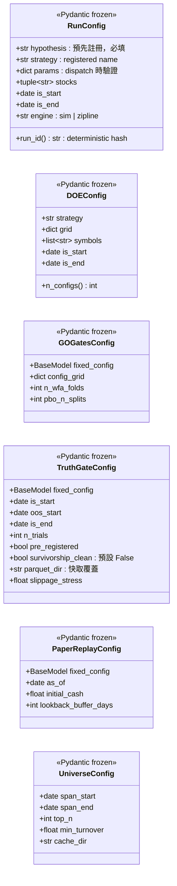
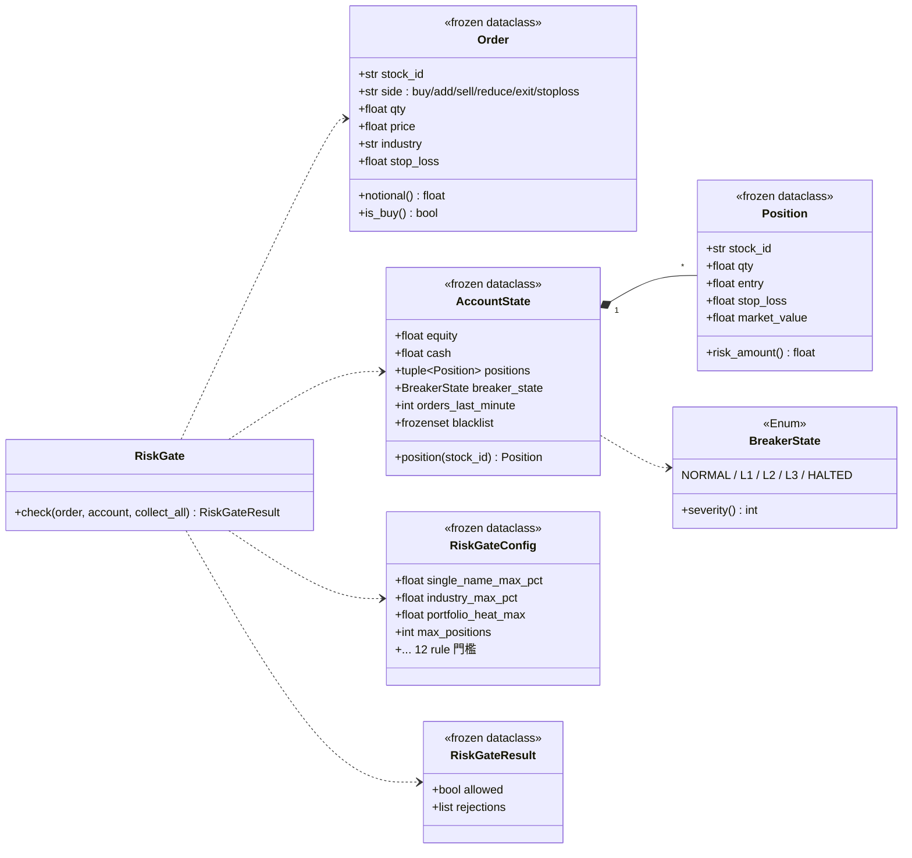
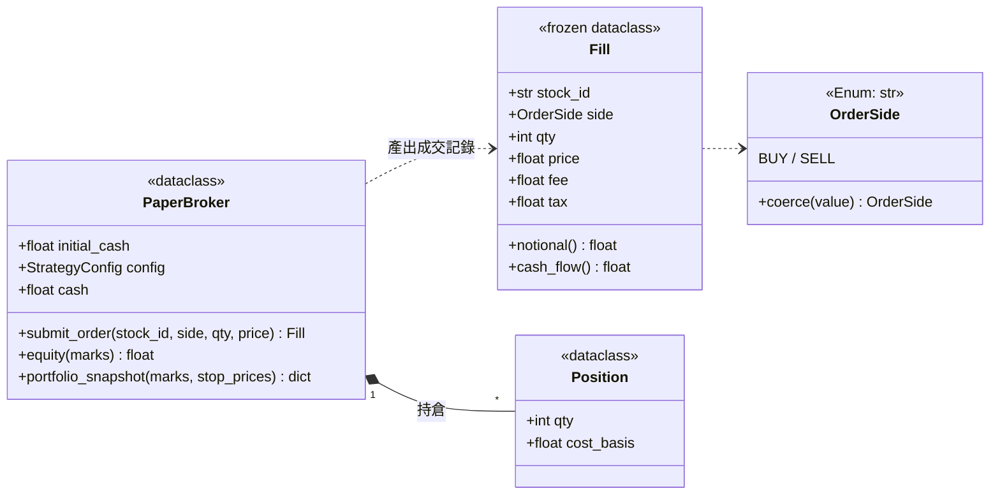
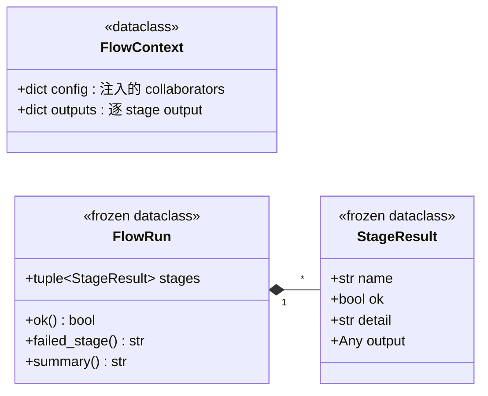

# 類別 / 元件關係 — backtest_platform

> 對應架構文件 [05](./05_architecture_and_design_document.md)、模組規格 [07](./07_module_specification_and_tests.md)。本檔聚焦定義平台骨幹的核心類別與其關係，全部對應 `backtest_platform/src/backtest_platform/` 現行程式碼。

## 產品定位

backtest_platform 是 **個人量化 edge 驗證工廠 + 晉升管線**。核心資產是審判庭。以下類別圖的重心正是這個資產：**策略契約**（讓平台判任意策略）、**審判庭資料模型**（兩段閘）、**風控值物件**。策略是消耗品，這些骨幹類別是資產。

---

## 1. 策略契約 + registry（平台↔策略接縫，ADR-027/028）

接縫畫在**輸出**：策略輸入天生不同（four_layer 逐股事件驅動、momentum/inst_flow 橫斷面 panel），但都產出同一個 `StrategyRun`。上層只依賴此契約。

**契約不變式**（conformance gate 強制，`strategies/conformance.py`）：

| 不變式 | 說明 |
| :--- | :--- |
| `config_model()` 無參可建 | 所有欄位有預設或無欄位 |
| `run(...)` 不 raise on synthetic data | 合成資料下不炸 |
| `metrics ⊇ {cagr, sharpe, slippage_sharpe, maxdd, trades, bars}` | 空結果亦須全填 0，讓 gate 不 INCOMPLETE |
| `gate` 必宣告且其 criterion key ⊆ 產出 metrics | 平台拒絕用別人的尺判這隻策略 |

> `GateSpec = tuple[Criterion, ...]`：策略宣告自己的審判閘（見 §2）。dispatch 用 `get_strategy_gate(name)` 解析——four_layer 的 entry-quality 檢查對 panel 策略無意義，故每隻策略自帶尺，缺席即 hard error（審查缺陷 #8 修正）。

---

## 2. 審判庭資料模型（validation，ADR-025/030）

審判庭是核心資產。gate-as-code：門檻是**資料**（`Criterion` / 模組常數），調門檻是可見、可記錄的決策，不是靜默 edit。

### 2.1 gate_state — 泛用逐 criterion 判決

`evaluate_gate(metrics, gate)`：缺 metric → `INCOMPLETE`（絕不假 PASS）。內建閘：`DEFAULT_GATE`（four_layer entry-quality）、`PANEL_GATE`（橫斷面分散度）、`MOMENTUM_GATE`（PANEL 別名）。

### 2.2 two_stage_gate — 真偽閘 + 配置閘（ADR-025）

- **真偽閘** `evaluate_truth_gate(TruthGateInput)`：binary hard-fail。`pre_registered=True` 用 WFA OOS 廣度 + trials-deflated DSR（不用 landscape PBO）；`False` 用 PBO。survivorship 不 clean / 滑價崩 / OOS holdout 負 = REJECTED。
- **配置閘** `compute_position_size(SizingInput)`：連續映射 `size = max_weight × conviction × diversification × capacity`。絕對 CAGR 降為 reference，永不 size。
- **兩段編排** `evaluate_two_stage(...)`：truth 非 REAL → `size == 0.0`。

---

## 3. Run 物件化 + 研究工作流 config（research，ADR-029/032）

`RunConfig` 是一個 IS run 的一級物件；工作流 config 是各策略以 `research_config.py` 宣告「怎麼被研究」的契約。

> 工作流 config 全 `frozen + extra=forbid`；window validator 守 `is_start < oos_start < is_end`。`TruthGateConfig.survivorship_clean` 預設 `False`——ADR-025 的 hard precondition 是待證明的主張，不是硬編碼綠燈（ADR-030 反自欺原則）。

---

## 4. 風控值物件（risk，spec 24）

pre-trade 風控純函式化：12 個 `check_exNNN(order, account, cfg) -> reason | None`，`RiskGate` 依 spec §2.2 優先序 wire。所有狀態注入，零 IO。

`CircuitBreaker.evaluate` 產生瞬態 `L3`，機器立即 latch 進終端 `HALTED`；`risk_gate.check_ex012` 對 `L3`/`HALTED` 皆 reject（單一 `BreakerState` 於 `risk/types.py`，避免 per-module enum 分岔讓 halted 單漏過）。

---

## 5. Paper 撮合器（adapters.brokers）

`PaperBroker` 是 M4 paper daemon 的 in-process 撮合引擎，strategy-agnostic 純簿記（無 order book / partial fill / 網路），成本模型單一來源 `StrategyConfig`。

`portfolio_snapshot` 回 `{positions, cash, equity, heat}`（EX-004 heat 公式，stop 注入式）——正是 `orchestration.collaborators` 建 `AccountState` 餵風控閘的來源。無賣空（賣超持有量 raise `InsufficientPositionError`）。

---

## 6. 每日鏈 staged engine（orchestration.daily_flow）

`run_flow(stages, ctx)`：依序跑 `etl → signals → risk_gate → orders → log`，**fail-fast**（首個 `ok=False` 或 raise 即停，raise 被捕捉成失敗 stage，永不 crash 排程器）。collaborators 從 `ctx.config` 注入，stage body 只編排。

---

## 設計模式與 SOLID

| 模式 | 應用 | 目的 |
| :--- | :--- | :--- |
| **Protocol（結構型）** | `StrategyRunner`、`engines.Engine`（DEPRECATED） | 平台依賴契約非具體策略 |
| **Registry** | `strategies.protocol` name→runner dict | 輕量 dispatch（[ADR-022](./adrs/ADR-022-multi-strategy-fleet-operations.md) 拒重量級 registry）|
| **Gate-as-code / 資料驅動** | `Criterion` 元組、two_stage 門檻常數 | 調門檻 = 可見可記錄決策 |
| **Frozen Value Object** | `RunConfig`、workflow configs、`Order`/`Position`/`AccountState` | 不可變，避免狀態洩漏 |
| **Pure Function 核心** | 策略計分、validation、risk 12 檢查 | 零 IO、易測、可跨 backtest/paper/live 重用 |
| **Staged Pipeline** | `daily_flow.run_flow` | fail-fast + 完整審計軌 |

- **S 單一職責**：`validation/` 每檔一種統計檢驗、`risk_gate` 只做 pre-trade、`paper_broker` 只做簿記。
- **O 開放封閉**：新增策略 = 複製 `_template/` 填 alpha + registry 註冊一行，不改上層。
- **L 里氏替換**：任何 `StrategyRunner` 實作可經 registry 互換。
- **I 介面隔離**：`Loader = Callable[[str], DataFrame]` 是唯一資料存取接縫。
- **D 依賴反轉**：上層依賴 `strategies.protocol` 抽象；`validation` 不依賴 `strategies`（無循環）。
