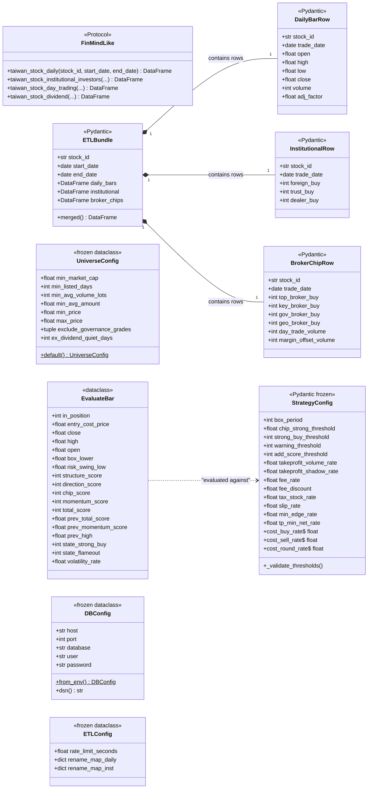
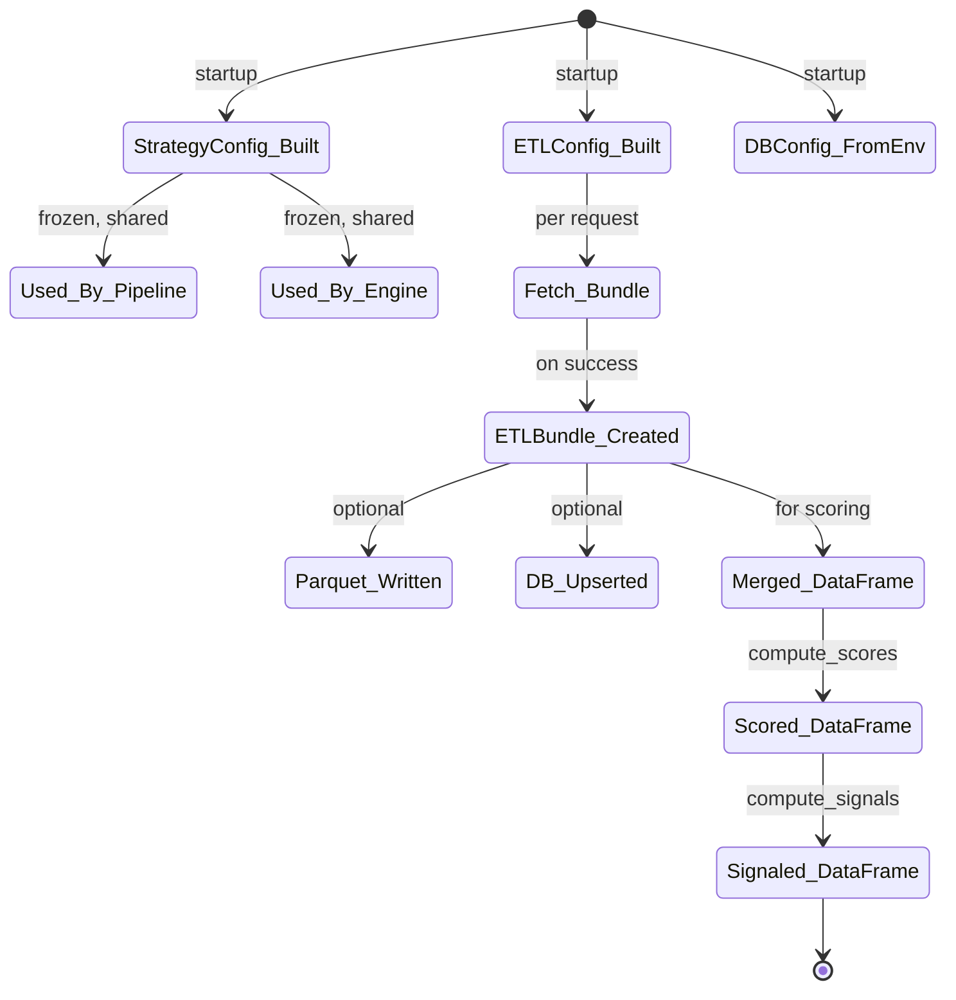
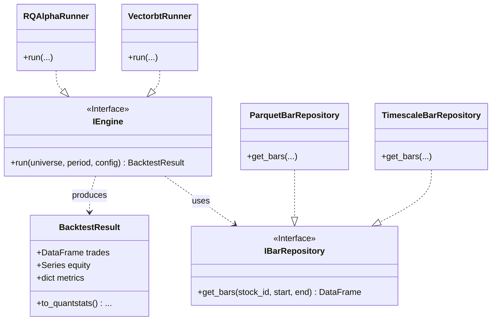

# 類別 / 元件關係文件 — backtest_platform

> **版本：** v1.0 | **更新：** 2026-05-26 | **狀態：** M1 已實作

---

## 核心類別圖

---

## 類別職責

| 類別 | 核心職責 | 協作者 | 所屬層 |
| :--- | :--- | :--- | :--- |
| `StrategyConfig` | 持有所有策略參數 + 衍生 cost rate + 交叉驗證 | 全部 strategy 函式 | Domain |
| `FinMindLike` (Protocol) | 定義 ETL 對 FinMind 的最小介面契約 | `fetch_bundle` 與測試 stub | Infrastructure boundary |
| `ETLBundle` | 一次 ETL 的三表打包 + merge helper | `fetch_bundle`、`upsert_bundle`、`run_pipeline` | Boundary |
| `DailyBarRow` / `InstitutionalRow` / `BrokerChipRow` | 單列資料驗證模型（schemas） | `_normalize_*`、`upsert_*` | Boundary |
| `UniverseConfig` | 標的池過濾門檻參數 | `apply_filters` | Domain |
| `EvaluateBar` | rqalpha 引擎 per-bar 上下文 | `evaluate_bar` | Domain |
| `DBConfig` | TimescaleDB 連線參數 | `upsert_bundle` | Infrastructure |
| `ETLConfig` | ETL rate-limit / rename map（M2 才用） | （預留） | Infrastructure |

---

## 關係說明

| 關係類型 | UML 符號 | 範例 |
| :--- | :--- | :--- |
| 組合 (composition) | `*--` | ETLBundle *-- DailyBarRow（生命週期綁定） |
| 依賴 (uses) | `..>` | EvaluateBar ..> StrategyConfig |
| 實現 (implements) | `..\|>` | `FinMind.DataLoader` ..\|> FinMindLike |

---

## 設計模式

| 模式 | 應用 | 目的 |
| :--- | :--- | :--- |
| **Pure Function** | `compute_scores`、`compute_signals`、`evaluate_bar`、所有 indicators | 同樣 input 同樣 output、易測 / 易並行 |
| **Frozen Value Object** | `StrategyConfig`、`UniverseConfig`、`DBConfig`、`ETLConfig` | 不可變 = 避免狀態洩漏 |
| **Protocol（鴨子型別）** | `FinMindLike` | 解耦真實 FinMind 與測試 stub |
| **Strategy Pattern** | （隱含）兩個引擎 wrapper 都吃 `evaluate_bar` | 引擎可替換 |
| **Repository Pattern** | （未實作）M2 引入 `IBarRepository` 給 rqalpha 注入 | DB / parquet 可切換 |
| **CLI Command Pattern** | Click groups（`pipeline run`、`pipeline replay`） | CLI subcommand 組織 |
| **Builder（隱含）** | `ETLBundle.merged()` build 出最終 scoring-ready DataFrame | 隱藏 join 細節 |
| **Context Manager** | `_connection(cfg)` in db_writer | 自動 commit / rollback / close |

---

## SOLID 檢核

- [x] **S 單一職責**
  - `scoring.py` 只做四層計分
  - `signals.py` 只做狀態 + 訊號
  - `finmind_etl.py` 只做拉取 + normalize
  - `db_writer.py` 只做 upsert
- [x] **O 開放封閉**
  - 新加因子 → 加 score 計算函式，不改既有
  - 新加引擎 → 加 wrapper 呼叫既有 `evaluate_bar`
- [x] **L 里氏替換**
  - `FinMindLike` Protocol 任何實作（真實 FinMind / 測試 stub）可互換
- [x] **I 介面隔離**
  - `FinMindLike` 只暴露 ETL 用到的 4 個方法，不繼承 FinMind 全部 API
- [x] **D 依賴反轉**
  - `fetch_bundle(loader: FinMindLike | None)` 依賴抽象不依賴具體
  - `strategy/` 純函式不依賴 IO 模組

---

## 介面契約

### `FinMindLike` Protocol

| 方法 | 前置條件 | 後置條件 |
| :--- | :--- | :--- |
| `taiwan_stock_daily(stock_id, start_date, end_date)` | stock_id 非空、date 格式 `YYYY-MM-DD` | 回 DataFrame 含 columns: date, open, max, min, close, Trading_Volume, ...；空回應允許 |
| `taiwan_stock_institutional_investors(...)` | 同上 | 回 long-format DataFrame 含 columns: date, stock_id, name (institution), buy, sell |
| `taiwan_stock_day_trading(...)` | 同上 | 回 DataFrame 含 Volume（當沖量） |
| `taiwan_stock_dividend(...)` | 同上 | 回 DataFrame 含 CashExDividendTradingDate / CashEarningsDistribution 等 |

### `StrategyConfig` 不變性

| 約束 | 驗證點 |
| :--- | :--- |
| 所有 Field 範圍 | Pydantic Field 驗證 |
| `warning < strong_buy` | `_validate_thresholds` |
| `add >= strong_buy` | `_validate_thresholds` |
| frozen | `model_config = {"frozen": True}` |
| extra 拒絕 | `model_config = {"extra": "forbid"}` |
| 衍生 cost > 0 | 隱含於各 Field `ge=0` 限制 |

### `EvaluateBar` 完整性

呼叫 `evaluate_bar(bar, config)` 前，引擎必須填滿所有 21 個欄位：
- 21 個欄位若缺一，`_evaluate_priority` 會用 `pd.notna` / `bool()` 防呆但結果可能不正確
- 引擎責任：每 bar 開始時 build 完整的 `EvaluateBar`

---

## 物件生命週期

關鍵性質：
- `StrategyConfig` / `DBConfig` 為應用 lifetime 內常駐
- `ETLBundle` 為 per-request 物件，可序列化（parquet / JSON）
- `EvaluateBar` 為 per-bar 物件，evaluate 完即丟棄

---

## 未來擴展（M2+）

預留設計：M2 開始實作 `IEngine` 與 `IBarRepository`，雙引擎共用同一資料源抽象。
