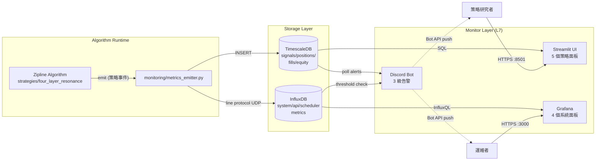
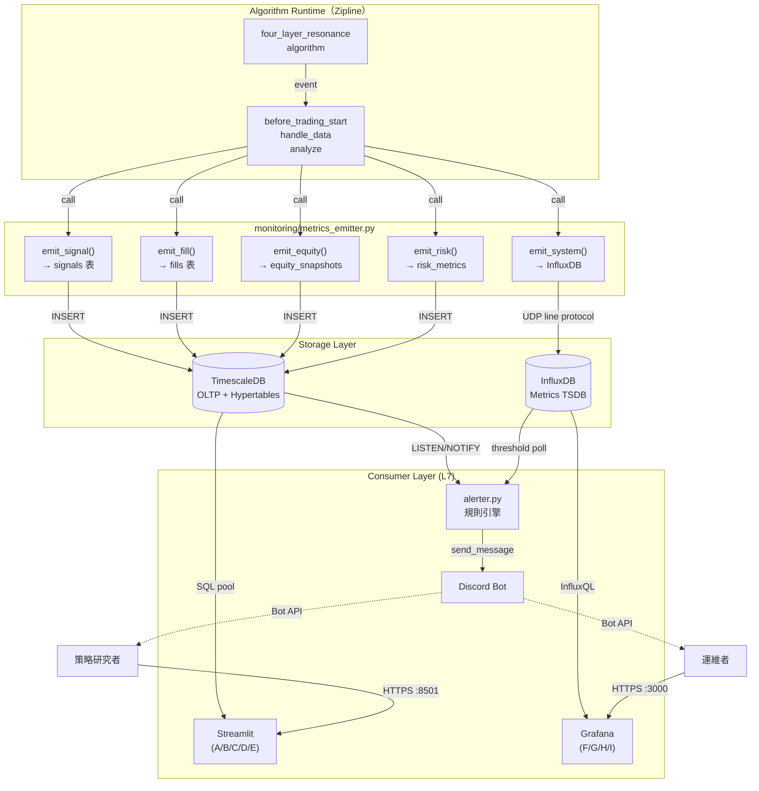

# 儀表板規格 — backtest_platform

> **版本：** v1.0 | **更新：** 2026-05-31
> **適用 M**：M3 MVP（Streamlit A+B+C）/ M4 加 Grafana + Discord / M5 補 D+E
> **進度**：見 [`16_wbs_development_plan.md §8`](./16_wbs_development_plan.md)（單一狀態真相源）
> **適用範圍：** L7 監控與歸因層（對應 `05_architecture_and_design_document.md` §1.1.2）
> **關聯文件：** `21_data_contract.md`（資料 schema）、`23_deployment_topology.md`（部署）、`14_deployment_and_operations_guide.md` §5（告警分級）

---

## 1. 儀表板架構總覽

### 1.1 三層分工

L7 監控由三個獨立元件組成，各自負責不同時間尺度與使用者旅程：

| 層 | 工具 | 時間尺度 | 主要使用者旅程 | 容器（C4 L2） |
| :--- | :--- | :--- | :--- | :--- |
| **策略績效層** | Streamlit | 日/週/月 | 「我這支策略賺不賺？」 — 互動式深度分析 | `Streamlit UI` |
| **系統健康層** | Grafana + InfluxDB | 秒/分鐘 | 「系統現在活著嗎？」 — 即時 metrics 巡檢 | `Grafana` |
| **主動告警層** | Discord Bot | 即時 | 「出事了快通知我」 — 推播而非拉取 | `Discord Bot` |

### 1.2 為什麼這樣分

| 維度 | Streamlit | Grafana | Discord |
| :--- | :--- | :--- | :--- |
| **資料源類型** | TimescaleDB（OLTP + 時序） | InfluxDB / Prometheus（純時序 metrics） | 兩者皆讀（規則引擎觸發） |
| **資料粒度** | 日線 / 訊號 / 部位 | 秒級系統 metrics | 事件級（trigger-based） |
| **存取模式** | Pull（人主動開頁） | Pull（dashboard 自動 refresh） | Push（被動接收） |
| **互動性** | 高（filter、drill-down、quantstats embed） | 中（time range、variable） | 無 |
| **適合內容** | 策略邏輯結果、視覺驗證 | CPU/RAM/quota/排程狀態 | Critical/High 異常 |
| **誰看** | 策略研究者（每日 1-2 次） | 運維者（隨時） | 任何人（被動推送） |

**反例：為什麼不把這三件事塞進一個 Streamlit？**
- Streamlit 重新整理需要重跑整個 script，不適合秒級 metrics
- Grafana 無法 embed quantstats HTML 報表
- 告警若仰賴使用者開頁面，等於沒告警

### 1.3 高階資料流（Mermaid）



---

## 2. Streamlit 策略績效 Dashboard

### 2.1 技術選型

| 項目 | 選用 | 理由 |
| :--- | :--- | :--- |
| 框架 | Streamlit 1.32+ | 純 Python、單檔起跑、無前端工程負擔 |
| 圖表 | Plotly 5.x | 互動性強、可 embed iframe；K 線、heatmap、treemap 一站到位 |
| 報表 | quantstats 0.0.62 | 業界標準 HTML tear sheet，可 embed |
| 表格 | st.dataframe（內建 AgGrid backend） | 排序/過濾原生支援 |
| 連線池 | SQLAlchemy + `st.cache_resource` | 避免每次 rerun 重建連線 |
| 快取 | `st.cache_data(ttl=300)` | 5 分鐘快取，避開重複 query |
| 主題 | Dark mode（`.streamlit/config.toml`） | 盤後長時間檢視友善 |

### 2.2 面板總覽

| ID | 面板 | M3 MVP | M5 完整版 | 主要資料表 |
| :---: | :--- | :---: | :---: | :--- |
| **A** | 績效總覽 | ✅ | — | `equity_snapshots` |
| **B** | 部位狀態 | ✅ | — | `positions` |
| **C** | 訊號日誌 | ✅ | — | `signals` + `fills` |
| **D** | 風控指標 | — | ✅ | `risk_metrics` |
| **E** | 統計驗證 | — | ✅ | `validation_runs` |

### 2.3 面板 A — 績效總覽（M3）

#### 線框圖

```
┌──────────────────────────────────────────────────────────────────┐
│ [Strategy: four_layer_resonance v0.2.0 ▼]   [日期區間 ▼]   [↻] │
├──────────────────────────────────────────────────────────────────┤
│  Total Return  CAGR    Sharpe   MDD    Win Rate   Trades         │
│   +47.2%      18.3%    1.62    -12.4%   58.3%      243           │
├──────────────────────────────────────────────────────────────────┤
│  Equity Curve（含 benchmark 0050 對照）                          │
│  ┌────────────────────────────────────────────────────────────┐  │
│  │              ╱╲   ╱╲╱╲                                     │  │
│  │           ╱╲╱   ╲╱     ╲╱╲                                 │  │
│  │   ╱╲  ╱╲╱                  ╲╱╲                            │  │
│  │ ╱╱  ╲╱                       ╲╱╲╱─── strategy             │  │
│  │═══════════════════════════════════── benchmark            │  │
│  └────────────────────────────────────────────────────────────┘  │
├──────────────────────────────────────────────────────────────────┤
│  Drawdown                          │  Rolling Sharpe (60D)       │
│  ┌─────────────────────────────┐   │  ┌─────────────────────┐   │
│  │ 0│─────────────────────────│   │  │                     │   │
│  │  │  ▽   ▽▽    ▽   ▽▽▽▽    │   │  │  ╱╲╱╲      ╱╲╱╲     │   │
│  │-5│   ▽▽         ▽         │   │  │       ╲╱╲╱        │   │
│  │  │      ▽                  │   │  │                     │   │
│  └─────────────────────────────┘   │  └─────────────────────┘   │
├──────────────────────────────────────────────────────────────────┤
│  Monthly Returns Heatmap                                         │
│  ┌──────────────────────────────────────────────────────────┐    │
│  │      Jan Feb Mar Apr May Jun Jul Aug Sep Oct Nov Dec     │    │
│  │ 2023 +2 -1  +3  +5  -2  +1  +4  +2  -1  +3  +2  +1       │    │
│  │ 2024 +1 +2  -3  +4  +1  +2  +5  -1  +2  +3  +1  +2       │    │
│  └──────────────────────────────────────────────────────────┘    │
└──────────────────────────────────────────────────────────────────┘
```

#### 元件清單

| 元件 | Plotly 類型 | 互動 |
| :--- | :--- | :--- |
| KPI cards | `st.metric` x 6 | hover 顯示同期變化 |
| Equity curve | `go.Scatter` x 2（strategy + benchmark） | zoom / pan / hover tooltip |
| Drawdown | `go.Scatter` (filled area) | linked time axis with equity |
| Rolling Sharpe | `go.Scatter` | window size 可調（30/60/90） |
| Monthly heatmap | `go.Heatmap` | hover 顯示精確報酬率 |

#### 資料來源

| 元件 | 表 | 欄位 | 計算 |
| :--- | :--- | :--- | :--- |
| KPI cards | `equity_snapshots` | `equity`, `snapshot_time` | quantstats `stats.smart_sharpe()` 等 |
| Equity curve | `equity_snapshots` | `equity`, `cash` | 直接 plot |
| Benchmark | `daily_bars` (stock_id='0050') | `close` | normalize to same start |
| Drawdown | `equity_snapshots` | `drawdown` | 已預計算 |
| Rolling Sharpe | `equity_snapshots` | `equity` | pandas `.rolling(60).apply(sharpe)` |
| Heatmap | `equity_snapshots` | `equity` | resample monthly, pct_change |

#### 互動行為

- **Strategy selector**：下拉式 `strategy_id`（從 `equity_snapshots` distinct）
- **Date range**：`st.date_input` 雙日期，default `[end - 1y, end]`
- **Manual refresh**：`st.button("↻")` 清空快取後 rerun
- **Drill-down**：點 equity curve 上某點 → jump to 該日的面板 C 訊號日誌

#### 刷新節奏

- 自動：`st.cache_data(ttl=300)` 5 分鐘
- 手動：右上角刷新按鈕
- 即時觸發：page load + filter change

### 2.4 面板 B — 部位狀態（M3）

#### 線框圖

```
┌──────────────────────────────────────────────────────────────────┐
│ Current Positions (as of 2026-05-30 13:30 TWT)                  │
├──────────────────────────────────────────────────────────────────┤
│ Portfolio Heat: 4.2% / 6%        Cash: NT$ 1,250,000 (12.5%)    │
│ Open: 12 / 15                    Equity: NT$ 10,420,000          │
├──────────────────────────────────────────────────────────────────┤
│ Symbol  Industry   Qty    Entry   Current  P&L%   Days  StopLoss│
│ 2330    Semi       1000   542     578      +6.6%   12    520    │
│ 2454    Semi       500    910     895      -1.6%    8    870    │
│ 2317    Electronic 800    103     108      +4.8%   15     98    │
│ ...                                                              │
├──────────────────────────────────────────────────────────────────┤
│ Industry Allocation                │ Concentration Risk           │
│ ┌──────────────────────────────┐  │ Top 1: 18% (2330)            │
│ │ Semi      ████████████ 42%   │  │ Top 3: 47%                   │
│ │ Electronic ████████ 28%      │  │ Top 5: 68%                   │
│ │ Finance   ███ 12%            │  │ HHI: 0.18 (低集中)            │
│ │ Others    █████ 18%          │  │                              │
│ └──────────────────────────────┘  │                              │
└──────────────────────────────────────────────────────────────────┘
```

#### 元件清單

| 元件 | Plotly 類型 | 互動 |
| :--- | :--- | :--- |
| Heat/Cash/Open KPIs | `st.metric` x 4 | — |
| Positions table | `st.dataframe` | 排序、過濾、column resize |
| Industry pie | `go.Pie` | hover 顯示金額 |
| Concentration | `st.metric` x 3 + HHI | — |

#### 資料來源

| 欄位 | 表 | 計算 |
| :--- | :--- | :--- |
| `qty`, `entry_price`, `stop_loss` | `positions` | latest snapshot |
| `current_price` | `daily_bars` 或 live feed | latest |
| `pnl_pct` | derived | `(current - entry) / entry` |
| `industry` | `universe` | join on stock_id |
| HHI | derived | `Σ(market_value_i / total)^2` |

#### 互動行為

- 點 row → drill-down 該股訊號歷史（面板 C with filter）
- Industry pie 點扇區 → 過濾表格

#### 刷新節奏

- TTL 60 秒（部位變化頻繁）
- Live mode：WebSocket subscribe（M5）

### 2.5 面板 C — 訊號日誌（M3）

#### 線框圖

```
┌──────────────────────────────────────────────────────────────────┐
│ Signal Log    [Date: 2026-05-30 ▼]    [Action: All ▼]            │
├──────────────────────────────────────────────────────────────────┤
│ Today's Signals (15)                                             │
│ Time     Symbol  Action      Reason                  Status      │
│ 09:01:23 2330    buy         strong_buy + sector ok  FILLED      │
│ 09:01:25 2454    add         momentum +1             FILLED      │
│ 09:01:30 2317    hold        no change               -           │
│ 09:15:42 3008    stoploss    close < entry - 1R      FILLED      │
│ ...                                                              │
├──────────────────────────────────────────────────────────────────┤
│ Signal Timeline (30 days)                                        │
│ ┌──────────────────────────────────────────────────────────┐    │
│ │ buy      ▌▌▌  ▌    ▌▌  ▌▌▌    ▌▌  ▌                     │    │
│ │ add        ▌▌    ▌▌▌    ▌  ▌▌                            │    │
│ │ reduce      ▌      ▌▌       ▌                             │    │
│ │ exit              ▌▌    ▌      ▌▌                         │    │
│ │ stoploss     ▌            ▌▌                              │    │
│ └──────────────────────────────────────────────────────────┘    │
├──────────────────────────────────────────────────────────────────┤
│ Signal → Fill Rate (30D)                                         │
│ Generated: 187  →  Submitted: 184 (98.4%)  →  Filled: 176 (94.1%)│
│ Avg latency: signal→submit 0.8s / submit→fill 2.3s               │
└──────────────────────────────────────────────────────────────────┘
```

#### 元件清單

| 元件 | 類型 | 互動 |
| :--- | :--- | :--- |
| Today's signals | `st.dataframe` | 過濾 action 類型 |
| Timeline | `go.Scatter` (multi-track) | hover 顯示訊號詳情 |
| Fill rate funnel | `go.Funnel` | — |

#### 資料來源

| 元件 | 表 | 欄位 |
| :--- | :--- | :--- |
| Signals | `signals` | `signal_time`, `stock_id`, `action`, `reason_json` |
| Fills | `fills` | `fill_time`, `signal_id`, `fill_price`, `status` |
| Latency | derived join | `fills.submit_time - signals.signal_time` |

#### 互動行為

- 點訊號 row → 展開 JSON reason（scores、prices、context）
- Timeline 點某 dot → jump to signal 詳情

#### 刷新節奏

- 即時面板：TTL 30 秒
- 歷史面板：TTL 5 分鐘

### 2.6 面板 D — 風控指標（M5）

#### 線框圖

```
┌──────────────────────────────────────────────────────────────────┐
│ Risk Metrics              Status: 🟢 NORMAL                       │
├──────────────────────────────────────────────────────────────────┤
│ Current DD: -3.2% / Limit -15%      ████░░░░░░░░░░░ 21%          │
│ Daily PnL: -0.8% / VaR(95%) -2.1%   ██████░░░░░░░░ 38%           │
│ Heat:      4.2% / 6%                ███████░░░░░░░ 70%           │
├──────────────────────────────────────────────────────────────────┤
│ MDD Trend (90 days)                                              │
│ ┌──────────────────────────────────────────────────────────┐    │
│ │  0%─────────────────────────────────────────             │    │
│ │      ╲    ╱╲╱╲                                            │    │
│ │ -5%   ╲╱╲╱   ╲    ╱╲                                      │    │
│ │           ╲╱╲╱  ╲╱   ╲╱╲                                  │    │
│ │ -10%── L1 暫停 ──────────────────────────                 │    │
│ │ -15%── L2 減倉 ──────────────────────────                 │    │
│ │ -20%── L3 全停 ──────────────────────────                 │    │
│ └──────────────────────────────────────────────────────────┘    │
├──────────────────────────────────────────────────────────────────┤
│ Recent Risk Events (7D)                                          │
│ 2026-05-28 14:23  HEAT_WARN   Heat 5.8% near limit               │
│ 2026-05-27 09:45  CONCENT     Top 3 = 52% > 45% threshold        │
└──────────────────────────────────────────────────────────────────┘
```

#### 元件清單

| 元件 | 類型 | 互動 |
| :--- | :--- | :--- |
| Status badge | 彩色 `st.markdown` | NORMAL / WARN / CRITICAL |
| Progress bars | `st.progress` x 3 | 顏色依百分比 |
| MDD trend | `go.Scatter` + 3 條 hline | hover 顯示熔斷層級 |
| Risk events | `st.dataframe` | drill-down 事件 context |

#### 資料來源

| 欄位 | 表 |
| :--- | :--- |
| `current_dd`, `var_95`, `heat`, `concentration` | `risk_metrics` |
| Risk events log | `risk_metrics` where `event_type IS NOT NULL` |

### 2.7 面板 E — 統計驗證（M5）

#### 線框圖

```
┌──────────────────────────────────────────────────────────────────┐
│ Statistical Validation                                           │
├──────────────────────────────────────────────────────────────────┤
│ Latest WFA Run: 2026-05-15  | Windows: 12 | IS/OOS: 24m/6m       │
│ ┌──────────────────────────────────────────────────────────┐    │
│ │  IS Sharpe vs OOS Sharpe (scatter)                       │    │
│ │  3 ┤                                                      │    │
│ │  2 ┤             ●●  ●                                    │    │
│ │  1 ┤        ●  ●     ●                                    │    │
│ │  0 ┤    ●                                                 │    │
│ │ -1 ┤                                                      │    │
│ │    └────────────────────                                  │    │
│ │      -1   0   1   2   3                                   │    │
│ │     OOS Sharpe                                            │    │
│ └──────────────────────────────────────────────────────────┘    │
├──────────────────────────────────────────────────────────────────┤
│ PBO: 0.18 (低過擬合風險)        DSR: 0.82 (顯著)                  │
│ Min Track Record Length: 14 months                               │
├──────────────────────────────────────────────────────────────────┤
│ Rolling 30D PBO / DSR                                            │
│ ┌──────────────────────────────────────────────────────────┐    │
│ │  PBO  ─────────                                           │    │
│ │  DSR  ─────────                                           │    │
│ └──────────────────────────────────────────────────────────┘    │
└──────────────────────────────────────────────────────────────────┘
```

#### 元件清單

| 元件 | 類型 |
| :--- | :--- |
| WFA scatter | `go.Scatter` mode='markers' |
| PBO/DSR KPI | `st.metric` |
| Rolling metrics | `go.Scatter` x 2 |

#### 資料來源

| 欄位 | 表 |
| :--- | :--- |
| WFA windows | `validation_runs` where `method='WFA'` |
| PBO/DSR latest | `validation_runs` where `method IN ('PBO', 'DSR')` order by run_time desc |

### 2.8 Streamlit 共用設定

```toml
# .streamlit/config.toml
[theme]
base = "dark"
primaryColor = "#00d4ff"
backgroundColor = "#0e1117"

[server]
port = 8501
headless = true
enableCORS = false

[browser]
gatherUsageStats = false
```

```python
# dashboard/streamlit_app.py 骨架
import streamlit as st
from sqlalchemy import create_engine

st.set_page_config(page_title="Quant Dashboard", layout="wide", page_icon="📊")

@st.cache_resource
def get_engine():
    return create_engine(os.environ["DATABASE_URL"], pool_size=5)

@st.cache_data(ttl=300)
def load_equity(strategy_id: str, start: date, end: date) -> pd.DataFrame:
    ...

page = st.sidebar.selectbox("Panel", ["A. 績效總覽", "B. 部位狀態", ...])
```

---

## 3. Grafana 系統健康 Dashboard

### 3.1 技術選型

| 項目 | 選用 | 理由 |
| :--- | :--- | :--- |
| Dashboard | Grafana 10.4 | 業界標準、Plugin 生態完整 |
| Metrics DB | **InfluxDB 2.7**（首選） | Line protocol UDP 寫入低延遲 |
| 備選 | Prometheus 2.51 + `node_exporter` | 若已有 pull 模型偏好 |
| Alert routing | Grafana Unified Alerting → webhook → Discord | 集中告警規則 |

**為何 InfluxDB 而非 Prometheus**：應用內 emit metrics 為 push 模型，InfluxDB UDP 寫入比 Prometheus pull 更貼合 Algorithm 事件節奏；TimescaleDB 已扛 OLTP/時序，加 Prometheus 等於再養一套 time-series 重複。

### 3.2 面板總覽

| ID | 面板 | M4 必須 | 主要 metric |
| :---: | :--- | :---: | :--- |
| **F** | ETL 健康 | ✅ | `etl_*` measurements |
| **G** | API quota | ✅ | `api_*` measurements |
| **H** | 排程作業 | ✅ | `scheduler_*` measurements |
| **I** | 系統資源 | ✅ | `node_exporter` / `cAdvisor` |

### 3.3 面板 F — ETL 健康

| Metric | 來源 measurement | Tag | Field | 告警閾值 |
| :--- | :--- | :--- | :--- | :--- |
| 每日 ETL 成功率 | `etl_run` | `source=finlab\|finmind`, `status` | `count` | < 95% / 7D |
| 拉取延遲 | `etl_run` | `source`, `endpoint` | `duration_ms` | p95 > 60000 |
| 缺資料筆數 | `data_quality` | `stock_id`, `table` | `missing_rows` | > 0 / day |
| 異常值偵測 | `data_quality` | `check_type` | `violation_count` | > 5 / day |
| 最後一筆資料 timestamp | `etl_run` | `source` | `last_data_ts` | now - val > 25h |

### 3.4 面板 G — API quota

| Metric | measurement | Field | 告警閾值 |
| :--- | :--- | :--- | :--- |
| FinLab 流量剩餘 | `api_quota` (tag: provider=finlab) | `remaining_mb` | < 500MB |
| FinLab 流量速率 | `api_quota` | `mb_per_hour` | > 200MB/h |
| Shioaji 連線狀態 | `api_health` (tag: provider=shioaji) | `connected` (0/1) | 0 持續 60s |
| Shioaji heartbeat | `api_health` | `latency_ms` | > 1000ms p95 |
| 404/429/500 計數 | `api_error` | `count` | > 10 / 5min |

### 3.5 面板 H — 排程作業

| Metric | measurement | 顯示 | 告警 |
| :--- | :--- | :--- | :--- |
| `daily_flow` 狀態 | `scheduler_run` | 最近 7 天 grid（綠/紅） | 任一紅 → Critical |
| 每階段耗時 | `scheduler_step` (tag: step) | bar chart | step > 預期 2x |
| 下次執行時間 | `scheduler_schedule` | text panel | overdue → Warning |
| Prefect worker live | `prefect_heartbeat` | up/down | down 30s |

### 3.6 面板 I — 系統資源

| Metric | exporter | 告警 |
| :--- | :--- | :--- |
| CPU 使用率 | `node_exporter` | > 80% / 5min |
| RAM 使用率 | `node_exporter` | > 85% |
| Disk 使用率 | `node_exporter` (`/`, `/data`) | > 80% |
| Disk I/O wait | `node_exporter` | > 30% |
| DB 連線池 | `pg_exporter` | active > 80% pool size |
| Container restart | `cAdvisor` | restart_count > 0 / day |

### 3.7 Dashboard JSON 結構

```
dashboard/grafana_dashboards/
├── 01_etl_health.json
├── 02_api_quota.json
├── 03_scheduler.json
└── 04_system_resources.json
```

---

## 4. Discord Bot 告警規格

### 4.1 等級定義

對齊 `14_deployment_and_operations_guide.md` §5 告警分級：

| 等級 | Icon | 觸發類別 | SLA |
| :--- | :--- | :--- | :--- |
| **Critical** | 🚨 | 實盤下單失敗、Shioaji 斷線、熔斷觸發、Container down | 即時推播，5 秒內 |
| **High** | ⚠️ | ETL 失敗、訊號缺漏、部位偏離 > 5%、API quota < 500MB | 5 分鐘內 |
| **Info** | ℹ️ | 每日收盤後績效摘要、buy/sell 訊號日誌 | 每日 14:35 digest |

### 4.2 觸發規則表

| Rule ID | 等級 | 條件 | 來源 |
| :--- | :--- | :--- | :--- |
| `CRIT-001` | 🚨 | `fills.status='REJECTED'` 連續 3 筆 | TimescaleDB poll |
| `CRIT-002` | 🚨 | `api_health.shioaji.connected=0` 持續 60s | InfluxDB |
| `CRIT-003` | 🚨 | `risk_metrics.event_type='L2_CUT'` 或 `L3_HALT` | TimescaleDB trigger |
| `CRIT-004` | 🚨 | Container restart_count > 0 | cAdvisor |
| `HIGH-001` | ⚠️ | `etl_run.status='FAIL'` | InfluxDB |
| `HIGH-002` | ⚠️ | 14:30 訊號數 = 0（預期 > 0） | TimescaleDB |
| `HIGH-003` | ⚠️ | 任一部位 `|qty_actual - qty_expected| / qty_expected > 5%` | TimescaleDB |
| `HIGH-004` | ⚠️ | `api_quota.finlab.remaining_mb < 500` | InfluxDB |
| `INFO-001` | ℹ️ | 每日 14:35 digest（績效 + 訊號摘要） | scheduled |
| `INFO-002` | ℹ️ | 每筆 buy/sell 成交 | TimescaleDB trigger |

### 4.3 訊息模板

#### Critical 範例（CRIT-002 Shioaji 斷線）

```
🚨 *CRITICAL: Shioaji 斷線*

⏰ 2026-05-31 13:42:18 TWT
🔌 Provider: shioaji
⌛ 斷線時長: 90s
📊 影響: 即時報價中斷、無法下新單

🛡️ 自動處置:
  ✅ 停止新訊號 submit
  ✅ 切備援 FinLab quote
  ⚠️ 既有持倉照常持有

📋 Runbook: dev_docs/14 §7.2
🔧 立即動作: 檢查 shioaji status
```

#### High 範例（HIGH-001 ETL 失敗）

```
⚠️ *HIGH: FinLab ETL 失敗*

⏰ 2026-05-31 08:45:12 TWT
📡 Endpoint: price
❌ Error: HTTP 429 Too Many Requests
🔁 Retry: 3/3 失敗

📊 影響: 今日盤前 universe 可能延遲
🛡️ 自動處置: 切 FinMind fallback

🔧 動作: 確認 FinLab quota dashboard
```

#### Info 範例（INFO-001 每日 digest）

```
ℹ️ *Daily Digest — 2026-05-31*

📈 *績效（今日）*
  Return: +0.42% | Equity: NT$ 10,462,840
  Sharpe(60D): 1.58 | DD: -3.2%

💼 *部位*
  Open: 12/15 | Heat: 4.2%/6%
  Top3: 2330 (18%), 2454 (12%), 2317 (10%)

📊 *訊號*
  Buy: 2 | Add: 1 | Reduce: 0
  Exit: 1 | Stoploss: 0 | Hold: 11

🎯 Fill rate: 100% (3/3)

🔗 Dashboard: http://host:8501
```

### 4.4 排程：即時 vs digest

| 類型 | 觸發 | 實作 |
| :--- | :--- | :--- |
| **即時** | event-driven，TimescaleDB LISTEN/NOTIFY + InfluxDB threshold | `alerter.py` daemon loop |
| **Digest** | cron 14:35（每日） | Prefect flow `daily_digest_flow` |
| **去重** | 同 rule_id 30 分鐘內只發 1 次 | Redis SETEX 或 in-memory dict |
| **靜默時段** | 22:00–08:00 只推 Critical | 規則內判斷 |

### 4.5 技術實作

| 項目 | 選用 | 理由 |
| :--- | :--- | :--- |
| Bot 框架 | `httpx` direct REST（ADR-010） | 純發訊不需要 event loop；可在 Prefect sync task 直呼 |
| 規則引擎 | 自寫（~150 LOC） | 規則少於 30 條，無需 Drools |
| 訊息格式 | Discord Embed（顏色 + 欄位 + 時戳） | 結構化警報視覺穩定，避免 MarkdownV2 跳脫 |
| 加密 | HTTPS（Discord API 強制） | — |

```python
# monitoring/alerter.py 骨架（M4 W3 實作；底層 notifier 已在 M2 落地）
from datetime import datetime, UTC
from backtest_platform.monitoring import DiscordNotifier, DiscordEmbed

class AlertRouter:
    def __init__(self) -> None:
        self.notifier = DiscordNotifier()  # 讀 DISCORD_* env
        self.dedupe: dict[str, datetime] = {}

    def fire(self, rule_id: str, level: str, title: str, message: str) -> None:
        if self._is_duplicated(rule_id):
            return
        color = {"CRITICAL": 0xB71C1C, "HIGH": 0xFFA000, "INFO": 0x1976D2}[level]
        embed = DiscordEmbed(title=f"[{level}] {title}", description=message, color=color)
        self.notifier.send(embed=embed)
        self.dedupe[rule_id] = datetime.now(UTC)
```

---

## 5. 完整資料管線



---

## 6. MVP vs 完整版交付計畫

| Milestone | Streamlit | Grafana | Discord | 驗收 |
| :--- | :--- | :--- | :--- | :--- |
| **M3** | A/B/C（MVP） | — | — | 本機 `streamlit run` 開頁 < 2s、3 個面板可互動 |
| **M4** | A/B/C 穩定 | F/G/H/I 全建 | 3 級告警全部接通 | 模擬 ETL 失敗 → Discord 收到 HIGH；ShioajiSandbox 斷線 → Critical |
| **M5** | + D/E | + 熔斷面板 | + 熔斷推播 | DD 模擬觸發 L2/L3，Discord 收到 CRIT-003 |

---

## 7. 驗收 Checklist

### M3 MVP

- [ ] `streamlit run dashboard/streamlit_app.py` 啟動成功
- [ ] 面板 A：equity curve + drawdown + heatmap 顯示正確
- [ ] 面板 B：positions table + industry pie 顯示
- [ ] 面板 C：今日訊號 + 30D timeline
- [ ] 首頁載入 < 2 秒（local TimescaleDB）
- [ ] Cache 機制驗證（同樣 query 第二次無 DB hit）

### M4 完整版

- [ ] InfluxDB 寫入正常（`influx query` 驗證）
- [ ] Grafana 4 個 dashboard 全部 import 成功
- [ ] Prefect daily_flow 觸發 → Grafana H 面板顯示 run record
- [ ] 模擬 FinLab 429 → Discord 收到 HIGH-001
- [ ] 手動斷 Shioaji → Discord 收到 CRIT-002
- [ ] 每日 14:35 digest 自動發送

### M5 完整版

- [ ] 面板 D：risk_metrics 即時顯示，熔斷三層 hline 可見
- [ ] 面板 E：WFA scatter + PBO/DSR rolling
- [ ] 手動模擬 DD = 16%（限額 15%）→ Discord 收到 CRIT-003
- [ ] 完整 24h soak test 無漏告警

---

## 8. 變更紀錄

| 版本 | 日期 | 變更 |
| :--- | :--- | :--- |
| v1.0 | 2026-05-31 | 初版（對應 plan v1.0 §4） |
