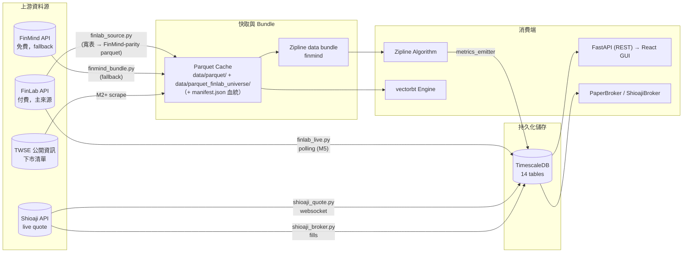

# 資料契約 — backtest_platform

> **版本：** v2.0 | **更新：** 2026-07-02
> **適用 M**：M1 既有四表 + M2-5 新增九表（共 13 表 + runs = 14）
> **進度**：見 [`16_wbs_development_plan.md`](./16_wbs_development_plan.md)（單一狀態真相源）
> **適用範圍：** L1 資料層（DDL 真相源 = `docker/timescaledb/init.sql`；本檔為其規格說明）
> **關聯文件：** `25_fe_be_rest_contract.md`（REST 契約，消費端）、`20_dashboard_specification.md`（面板 data-needs）、`23_deployment_topology.md`（DB 部署）、[ADR-006](./adrs/ADR-006-data-source-finlab-paid.md)（FinLab 主源）、[ADR-032](./adrs/ADR-032-survivorship-universe-workflow.md)（survivorship-clean universe）。

---

## 1. 資料層架構

### 1.1 三層資料流總覽



### 1.2 三角色定位

| 角色 | 載體 | 適用場景 | RPO |
| :--- | :--- | :--- | :--- |
| **Zipline bundle** | 檔案系統（`.zipline/data/`） | Backtest 歷史回測（讀取效能優先） | 不適用（rebuilt） |
| **TimescaleDB cache** | TimescaleDB hypertables | OLTP（部位/訊號/audit） + dashboard 查詢 | 24h |
| **Live feed buffer** | TimescaleDB regular tables | Paper / Live 即時資料 | 5 分鐘 |

### 1.3 為何 bundle 與 TimescaleDB 並存

| 維度 | Bundle | TimescaleDB |
| :--- | :--- | :--- |
| 讀取模式 | Zipline 順序 scan 全市場 | 點查詢、aggregation |
| 寫入頻率 | 一次性 ingest + 日增量 | 高頻寫入（每訊號/每 fill） |
| 跨機共享 | 否（本機檔案） | 是（DB 連線） |
| 結構 | 固定（OHLCV + adjustment）| 自定義 schema |
| 規模 | 100 檔 10 年 ~ 200MB | 同樣資料 + 全部 metrics ~ 2GB |

---

## 2. 資料源 Schema

### 2.1 FinLab Schema（主來源，真相源 `data/finlab_source.py`）

> `finlab.data.get(key)` 回傳**寬表**（columns = stock_id、index = trade_date）；一次 `get` 回全市場，故 universe ingest 是幾個 batch fetch 而非 per-symbol loop，對 quota 遠比 FinMind 溫和。
> dataset keys 為 `finlab_source.py` 實際驗證（2026-06-15，付費 token：全史 2007→今、2753 檔含下市）。`getter` 注入使測試 mock `finlab.data.get` 不打真 API。
> FinLab 的 `etl:adj_*` 已**前復權**（adj_factor 記 1.0），無需自行 adjustment。

#### 2.1.1 Price / market cap（`finlab_source._ADJ` / `_VOLUME` / `_TURNOVER` / `_MARKET_VALUE`）

| FinLab key | 對應 | 用途 |
| :--- | :--- | :--- |
| `etl:adj_open` / `etl:adj_high` / `etl:adj_low` / `etl:adj_close` | OHLC（前復權）| daily_bars |
| `price:成交股數` | volume | daily_bars |
| `price:成交金額` | turnover | 流動性篩選（`min_turnover`）|
| `etl:market_value` | 市值 | survivorship universe 選股排序 |

#### 2.1.2 法人籌碼（`institutional_investors_trading_summary:*`）

淨買賣超股數（正=買超），寬表；`finlab_source` **加總對齊 FinMind 三桶**（`_normalize_institutional` 慣例）：

| FinMind 桶 | FinLab keys（加總）|
| :--- | :--- |
| foreign（外資）| `外陸資買賣超股數(不含外資自營商)` + `外資自營商買賣超股數` |
| trust（投信）| `投信買賣超股數` |
| dealer（自營商）| `自營商買賣超股數(自行買賣)` + `自營商買賣超股數(避險)` |

> FinLab 進階分點（day-trading chips）不在資料層 sub-project 範圍 → broker_chips 欄位 zero-fill（對齊 FinMind M1）。

#### 2.1.3 籌碼 / 券商分點：`broker_transactions`（FinLab 進階方案）

| 欄位 | 型別 | 範例 | 說明 |
| :--- | :--- | :--- | :--- |
| `stock_id` | `str` | `'2330'` | — |
| `date` | `date` | `2024-05-30` | — |
| `broker` | `str` | `'9A95'` | 券商代號 |
| `branch` | `str` | `'板橋'` | 分點 |
| `buy_volume` | `int` | `10000` | — |
| `sell_volume` | `int` | `5000` | — |

#### 2.1.4 財報：`fundamental_features` / `financial_statements`

| 欄位 | 型別 | 範例 |
| :--- | :--- | :--- |
| index (date) | `pd.Timestamp` | `2024Q1` 公告日 |
| columns | `str (stock_id)` | `'2330'` |
| values | `float` | EPS、ROE、毛利率 |

### 2.2 FinMind Schema（fallback）

> 來自 `FinMindApi.get_data()`；長表格式（每 row = 一個 stock + date）。

#### 2.2.1 `TaiwanStockPrice`

| 欄位 | 型別 | 範例 | 與 FinLab 對應 |
| :--- | :--- | :--- | :--- |
| `date` | `str (YYYY-MM-DD)` | `'2024-05-30'` | index |
| `stock_id` | `str` | `'2330'` | column header |
| `Trading_Volume` | `int` | `12345678` | `volume` |
| `Trading_money` | `int` | `7000000000` | `turnover` |
| `open` | `float` | `540.0` | open |
| `max` | `float` | `545.0` | high（**注意命名差異**）|
| `min` | `float` | `538.0` | low（**注意命名差異**）|
| `close` | `float` | `542.0` | close（**未復權**，需自行 adjustment）|
| `spread` | `float` | `2.0` | 漲跌幅（FinLab 無此欄）|

#### 2.2.2 `TaiwanStockInstitutionalInvestorsBuySell`

| 欄位 | 型別 | 範例 | 與 FinLab 對應 |
| :--- | :--- | :--- | :--- |
| `date` | `str` | `'2024-05-30'` | — |
| `stock_id` | `str` | `'2330'` | — |
| `name` | `str` | `'Foreign_Investor'` | tag 而非欄位 |
| `buy` | `int` | `100000` | 拆出 buy/sell |
| `sell` | `int` | `80000` | — |

**關鍵差異**：FinMind 把三大法人 + 自營商自行/避險拆成 5 個 `name`，需 group_by 才能對齊 FinLab 的「外資/投信/自營商」三欄。

#### 2.2.3 `TaiwanStockDividend`（FinLab 已內建調整，本表僅 fallback）

| 欄位 | 型別 |
| :--- | :--- |
| `date` | `str` |
| `stock_id` | `str` |
| `CashEarningsDistribution` | `float` |
| `StockEarningsDistribution` | `float` |

### 2.3 Shioaji Schema（Live）

#### 2.3.1 Tick（即時逐筆）

```python
# shioaji Quote.Tick (簡化版)
{
    "code": "2330",
    "datetime": "2026-05-31 09:01:23.456",
    "open": 542.0,
    "high": 545.0,
    "low": 540.0,
    "close": 543.0,
    "volume": 100,
    "bid_price": [543.0, 542.5, 542.0],
    "bid_volume": [50, 100, 200],
    "ask_price": [543.5, 544.0, 544.5],
    "ask_volume": [80, 150, 200],
    "tick_type": 1,  # 1=Bid, 2=Ask
    "amount": 54300.0,
}
```

#### 2.3.2 Snapshot（5 秒快照）

```python
{
    "code": "2330",
    "datetime": "2026-05-31 09:01:25",
    "open": 542.0,
    "high": 545.0,
    "low": 540.0,
    "close": 543.5,
    "volume": 12345,
    "amount": 6700000.0,
    "total_volume": 1234567,
    "total_amount": 670000000.0,
    "average_price": 542.8,
}
```

#### 2.3.3 Order Fill（成交回報）

```python
{
    "trade_id": "TXN-20260531-001",
    "order_id": "ORD-20260531-001",
    "code": "2330",
    "action": "Buy",
    "price": 543.0,
    "quantity": 1000,
    "ts": "2026-05-31 09:01:23.789",
    "exchange_ts": "2026-05-31 09:01:23.812",
    "status": "Filled",  # Filled / PartFilled / Cancelled / Rejected
}
```

---

## 3. Zipline Bundle 格式

> **實作狀態**：只有一個 zipline bundle — `finmind`（`engines/zipline_adapter/bundles/finmind_bundle.py`）。**FinLab 主源不另建 zipline bundle**：`data/finlab_source.py` 把 FinLab 寬表寫成**與 FinMind 完全相同的 parquet schema**（`data/schemas.py::ETLBundle → write_parquet`），因此 FinLab 與 FinMind 兩條 ingest 路徑落地到同一份 parquet cache，被同一個 `finmind` bundle 與所有下游（`load_merged_parquet` / 驗證 / replay）零差異消費。差別只在資料來源與 quota，不在 schema。

### 3.1 Bundle 結構（Zipline 標準）

```
~/.zipline/data/finmind/                # 唯一 zipline bundle（FinLab / FinMind 兩源共用同一 parquet cache）
├── 2026-06-01T08;00;00.000000/
│   ├── assets-7.sqlite                 # 標的元資料（sid, symbol, asset_name, start/end_date, exchange=XTAI）
│   ├── daily_equities.bcolz/           # OHLCV 列式儲存
│   │   ├── close/ open/ high/ low/ volume/ day/
│   ├── adjustments.sqlite              # split / dividend（空 table — M1 ETL 已 cash-dividend-adjusted）
│   └── minute_equities.bcolz/          # M5 加入 minute bar 才有
```

### 3.2 Ingest 規格（finmind bundle）

| 項目 | 實際規格（`engines/zipline_adapter/bundles/finmind_bundle.py`）|
| :--- | :--- |
| 寫入函式 | `finmind_to_bundle(environ, asset_db_writer, minute_bar_writer, daily_bar_writer, adjustment_writer, calendar, start_session, end_session, cache, show_progress, output_dir)` |
| 註冊位置 | 模組 import 時 `register("finmind", finmind_to_bundle, calendar_name="XTAI")`（透過 `engines/zipline_adapter/__init__.py` auto-load）|
| Calendar | `XTAI`（`exchange-calendars 4.13.2` 提供，zipline-reloaded 直接引用，見 ADR-013）|
| Frequency | `daily`（M2-M4）；`minute` 為 M5 規劃 |
| Universe 解析 | 三層 fallback：`UNIVERSE_FINMIND` env (csv) → `UNIVERSE_FILE` env (path) → `DEFAULT_UNIVERSE` 10 檔常數（TSE 大中型權值代表）|
| Missing session 處理 | XTAI session 在範圍內但 FinMind 沒資料 → **OHLC ffill + volume=0**（zipline `BcolzDailyBarWriter` 嚴格要求每 session 有 row，不補會 AssertionError 阻塞 ingest）|
| Calendar 溢出處理 | FinMind 給的日期不在 XTAI session 上 → drop |
| 前導 NaN | 最早幾天 FinMind 無資料 → ffill 後仍 NaN，dropna |
| Adjustments | 寫空 table（`splits=pd.DataFrame()`、`dividends=pd.DataFrame()`）— M1 ETL `db_writer.py` 已套用 cash dividend，bundle 不重複處理 |
| 漲跌停 | 不在 bundle 處理，於 broker 模組（`PaperBroker._apply_price_limit()`，M4 實作）|

### 3.3 Asset Metadata（finmind bundle 寫入規格）

zipline-reloaded 3.x `asset_db_writer.write()` 要求的欄位（`_build_asset_metadata()` 產出）：

| 欄位 | 內容 | 備註 |
| :--- | :--- | :--- |
| `sid` | 從 0 遞增的整數 | universe 排序後 enumerate |
| `symbol` | 股票代碼字串（如 `"2330"`） | 主要 lookup key |
| `asset_name` | M2 暫等同 symbol | M3 enrich with company names |
| `start_date` | `bundle.start_date` `Timestamp` | ETLBundle 內最早 bar |
| `end_date` | `bundle.end_date` `Timestamp` | ETLBundle 內最晚 bar |
| `first_traded` | 同 `start_date` | — |
| `auto_close_date` | `end_date + 1 day` | zipline 必填 |
| `exchange` | 固定 `"XTAI"` | — |

### 3.4 Parquet Cache（FinMind API 短路）

`engines/zipline_adapter/bundles/parquet_cache.py` 在 ingest 上游攔截 FinMind API 呼叫，緩解 Plan v3.0 R2 風險（FinMind 免費版 API 配額有限）：

| 項目 | 規格 |
| :--- | :--- |
| 類別 | `ParquetCache(root: Path)` |
| 入口函式 | `cached_or_fetch(stock_id, start, end, cache, fetch_fn=None) -> ETLBundle` |
| 檔案佈局 | 每檔三個檔：`{root}/daily_bars__{stock_id}.parquet`、`institutional__…`、`broker_chips__…`；另有 `{root}/manifest.json` 血緣側車 |
| 完全命中 | `cached.start ≤ start ≤ end ≤ cached.end` → 直接回傳快取，零 API 呼叫 |
| 部分命中（day-incremental）| **只抓缺口區間**（head / tail），與既有快取 concat → 依 `(stock_id, trade_date)` 去重（`keep='last'`，新資料勝）→ 排序 → **原子寫回**（temp + `os.replace`）。已修正舊 bug：部分覆蓋時整檔覆寫會毀掉歷史（付費資料丟失） |
| 血緣 manifest | 每次 ingest 更新 `manifest.json`：`{schema_version, stock_count, coverage{start,end}, data_hash, generated_at, stocks{<id>:{start,end,rows,data_hash}}}`；讀-改-寫累積整個 universe，供 `runs.bundle_ref` 記錄該 run 消費的資料版本 |
| 預期 API 量降幅 | 100 stocks × 7 年 = 2100 API request → **< 7 / day**（首次後幾乎全 cache hit） |
| 失敗策略 | 寫 cache 失敗不阻塞 ingest（log warning，下次重試）；原子寫入確保中途崩潰不留半截檔 |

### 3.5 Ingest 模式

| 模式 | 觸發 | 行為 |
| :--- | :--- | :--- |
| **Initial backfill** | `zipline ingest -b finmind`（首次跑）| Universe 全歷史拉取；parquet cache miss → FinMind API ×N |
| **Re-ingest (cache hit)** | 同上重跑 | parquet cache hit；零 API 呼叫，純本機 IO |
| **Daily incremental** | after-close 排程（cron / systemd timer，盤後；下一步）| 拉當日 universe；缺口 fetch+merge 寫回既有 cache |
| **Force refresh** | 手動刪 parquet cache | 下次 ingest 走 fresh API |

### 3.5.1 Batch Ingest API — `ingest_universe`

`finmind_bundle.py` 對外暴露的批次入口，給直接腳本與 `finmind_to_bundle` 共用：

```python
@dataclass(slots=True, frozen=True)
class UniverseIngestResult:
    bundles: dict[str, ETLBundle]      # 成功的 symbol → ETLBundle
    failed_symbols: list[str]          # 失敗 symbol 清單（不阻塞整批）

def ingest_universe(
    universe: list[str] | tuple[str, ...] | None = None,
    *,
    start: date,
    end: date,
    cache_dir: Path | None = None,
) -> UniverseIngestResult: ...
```

| 條件 | 行為 |
| :--- | :--- |
| `universe=None` | 使用 `DEFAULT_UNIVERSE`（10 檔 TSE 大型股）|
| 單檔失敗（FinMind 5xx、parse 錯）| log error，加入 `failed_symbols`，繼續下檔 |
| 全部失敗 | **raise `RuntimeError`** — 避免下游 zipline 寫入空 bundle 後混淆 |
| `cache_dir=None` | 使用 `DEFAULT_CACHE_DIR = data/parquet`，會自動 `mkdir(parents=True)` |

### 3.6 註冊 Wiring（auto-load）

```python
# engines/zipline_adapter/__init__.py
"""Import 此模組就會註冊 bundle，zipline ingest -b finmind 即可用。"""
from backtest_platform.engines.zipline_adapter.bundles import finmind_bundle  # noqa: F401 — side-effect import
```

```python
# engines/zipline_adapter/bundles/finmind_bundle.py 結尾
register("finmind", finmind_to_bundle, calendar_name="XTAI")
```

zipline 透過 `~/.zipline/extension.py` 找 bundle；本專案改採「import 時自動 register」，無需動 zipline 設定檔。

### 3.7 FinLab 主源 ingest + survivorship-clean universe cache（ADR-032）

FinLab（`data/finlab_source.py`）除了 batch ingest（`ingest_universe_finlab`）外，還承載 **survivorship-clean universe 建構**，作為 ADR-029 形狀的平台工作流（`research/workflows/universe.py::run_build_universe`）。

| 產物 | 路徑 | 內容 |
| :--- | :--- | :--- |
| 一般 parquet cache | `data/parquet/` | FinMind fallback ingest 落地（`zipline_adapter cli ingest`）|
| **survivorship-clean cache** | `data/parquet_finlab_universe/` | FinLab 主源、含下市股的乾淨 universe（inst_flow `UniverseConfig.cache_dir`）|
| **universe_manifest.json** | `<cache_dir>/universe_manifest.json` | 可重現血統：params（span / top_n / min_turnover / rebalance）/ symbols / n_symbols / n_alive / n_delisted / ingest ok·failed / generated_at |

- **建構流程**（`run_build_universe`）：fetch FinLab 寬表（market cap / adj-close / turnover）→ `select_survivorship_universe`（季度 rebalance、point-in-time、**保留下市股於其存活季度**）→ `ingest_universe_finlab` 寫專屬 cache → 寫 `universe_manifest.json`。回傳 frozen `UniverseBuildResult`。
- **反自欺（ADR-030/032）**：`survivorship_clean` 宣告跟著 cache 走——策略 `TRUTH_GATE` 掃到料才宣告 `True` 並把 `parquet_dir` 指向該 cache；缺席時退回 survivor-only fallback。**宣告、資料、判決三者對齊**，不是硬編常數。
- **入口**：CLI `research build-universe --strategy <name>`；HTTP `POST /research/workflows/build_universe` → 202（經 `jobs/` 非同步）。runbook 見 [`runbooks/m2_universe_ingest_runbook.md`](./runbooks/m2_universe_ingest_runbook.md)。
- finlab **僅在 `getter=None` 時** lazy import（模組頂層絕不 import finlab；CI 無此依賴，測試用 fake getter + 合成寬表）。ingest 失敗數 surface 到 result 與 manifest，絕不靜默吞錯。

---

## 4. TimescaleDB Schema（完整 DDL，真相源 `docker/timescaledb/init.sql`）

### 4.1 Schema 總表

| # | 表 | M1 | M2 | M3 | M4 | M5 | 類型 | 對應功能 |
| :---: | :--- | :---: | :---: | :---: | :---: | :---: | :--- | :--- |
| 1 | `daily_bars` | ✅ | | | | | hypertable | OHLCV cache |
| 2 | `institutional_flows` | ✅ | | | | | hypertable | 三大法人 |
| 3 | `broker_chips` | ✅ | | | | | hypertable | 籌碼 |
| 4 | `universe` | ✅ | | | | | regular | 篩選結果 |
| 5 | `equity_snapshots` | | ✅ | | | | hypertable | 帳戶權益曲線 |
| 6 | `positions` | | ✅ | | | | regular | 當前部位 |
| 7 | `signals` | | ✅ | | | | hypertable | 訊號日誌 |
| 8 | `fills` | | | | ✅ | | hypertable | 成交回報 |
| 9 | `orders` | | | | ✅ | | hypertable | 訂單記錄 |
| 10 | `risk_metrics` | | | ✅ | | | hypertable | 風控指標 |
| 11 | `validation_runs` | | | ✅ | | | regular | PBO/DSR/WFA |
| 12 | `data_quality_log` | ✅ | | | | | regular | DQ 異常 |
| 13 | `alerts` | | | | ✅ | | hypertable | 告警記錄 |
| 14 | `runs` | | | ✅ | | | regular | Run 主表（single source of truth）|

### 4.2 M1 既有四表（簡化引用，完整 DDL 見 `docker/timescaledb/init.sql`）

```sql
-- daily_bars (M1 已有)
CREATE TABLE daily_bars (
    stock_id    TEXT NOT NULL,
    trade_date  DATE NOT NULL,
    open        NUMERIC(12,4),
    high        NUMERIC(12,4),
    low         NUMERIC(12,4),
    close       NUMERIC(12,4),
    volume      BIGINT,
    adj_factor  NUMERIC(12,8) DEFAULT 1.0,
    PRIMARY KEY (stock_id, trade_date)
);
SELECT create_hypertable('daily_bars', 'trade_date', chunk_time_interval => INTERVAL '1 month');
CREATE INDEX ON daily_bars (stock_id, trade_date DESC);

-- institutional_flows, broker_chips, universe 略（M1 已存在）
```

### 4.2b 新增表 — runs（M3，8.G.1）

Run 作為一級物件的主表：把散落的 `reports/perf__/summary__` 報表與四張時序表上的孤兒 `run_id` 收口成單一具血緣的真相源。`run_id` = `research/run_config.py` 的決定性 12 字元 hash（非 wall-clock），同一 RunConfig 重跑可冪等 upsert（更新 status/metrics/trials，保留 run_id/created_at）。

```sql
CREATE TABLE runs (
    run_id            TEXT PRIMARY KEY,        -- 決定性 RunConfig hash
    hypothesis        TEXT NOT NULL,           -- 預先註冊（反過擬合）
    strategy          TEXT NOT NULL,           -- 註冊策略名稱 (ADR-028, 取代 preset)
    engine            TEXT NOT NULL DEFAULT 'sim',  -- sim | zipline | vectorbt
    stocks            JSONB NOT NULL,          -- 此 run 的 universe
    is_start          DATE NOT NULL,
    is_end            DATE NOT NULL,
    git_sha           TEXT,                    -- 程式碼血緣
    bundle_ref        TEXT,                    -- 資料 bundle 血緣（parquet manifest.json hash）
    cost_assumptions  JSONB,                   -- 手續費 / 稅 / 滑點
    params            JSONB,                   -- 策略 / 進出場參數快照
    metrics           JSONB,                   -- 結果摘要 (cagr / sharpe / ...)
    gate_status       TEXT,                    -- 審判庭判決 (PASS|FAIL|INCOMPLETE|...；enum 會演進，不設 CHECK — migration 004)
    gate_summary      TEXT,                    -- 逐條 gate 檢查摘要（人讀）
    status            TEXT NOT NULL DEFAULT 'created',  -- created|running|done|failed
    trials_count      INTEGER NOT NULL DEFAULT 0,
    created_at        TIMESTAMPTZ NOT NULL DEFAULT now(),
    CONSTRAINT runs_window_ck CHECK (is_start < is_end),
    CONSTRAINT runs_status_ck CHECK (status IN ('created','running','done','failed'))
);
CREATE INDEX ON runs (strategy, created_at DESC);
CREATE INDEX ON runs (status, created_at DESC);
```

> 欄位順序與 `data/db_writer.py:_RUNS_COLS`（+ DB 預設的 `created_at`）逐欄對齊；`tests/data/test_init_sql_schema.py::test_runs_table_columns_match_db_writer_cols` 為防漂移守門，任何一邊改欄位另一邊未跟上即紅燈。`params` 只出現一次（於 `cost_assumptions` 之後），承載策略／進出場參數快照。

> **v0.1-min 範圍（8.G.1）**：僅建表 + `db_writer.upsert_runs()`。四張時序表（equity_snapshots / positions / signals / risk_metrics）回補 `run_id → runs(run_id)` FK 屬 v0.2-full（需先 backfill 每個孤兒 run_id 對應的 `runs` 列），排入日後的 migration。寫入器見 `data/db_writer.py:upsert_runs`；建表 migration 見 `docker/timescaledb/migrations/002_add_runs_table.sql`，`preset → strategy` 欄位改名（ADR-028 對齊既有 DB）見 `003_rename_runs_preset_to_strategy.sql`。
>
> **A0（2026-07-02）— `upsert_runs` 接上生產呼叫者**：`research/run_persist.py::persist_run` = JSONL ledger append（真相源不變）+ best-effort DB 鏡射（DB 掛掉降級為 ledger-only，只 warning 不擋 run）。三個寫入點（`POST /runs`、`POST /runs/async`、CLI `run-is`）全數改走 `persist_run`；`run_record_to_db_row` 負責 `window → is_start/is_end` 拆欄與 NOT NULL 預設（`status='done'`、`trials_count=1`）。審判庭判決以 `gate_status`/`gate_summary` 兩個 nullable TEXT 欄隨行（migration `004_add_runs_gate_columns.sql`），供 run board 直接用 SQL badge。

### 4.3 新增表 — equity_snapshots（M2）

```sql
CREATE TABLE equity_snapshots (
    snapshot_time     TIMESTAMPTZ NOT NULL,
    strategy_id       TEXT NOT NULL,
    mode              TEXT NOT NULL,  -- 'backtest' | 'paper' | 'live'
    run_id            TEXT NOT NULL,  -- UUID per run
    equity            NUMERIC(18,4) NOT NULL,
    cash              NUMERIC(18,4) NOT NULL,
    positions_value   NUMERIC(18,4) NOT NULL,
    open_positions    INT NOT NULL,
    portfolio_heat    NUMERIC(6,4),
    drawdown          NUMERIC(6,4),
    daily_return      NUMERIC(8,6),
    cumulative_return NUMERIC(8,6),
    PRIMARY KEY (snapshot_time, strategy_id, run_id)
);
SELECT create_hypertable('equity_snapshots', 'snapshot_time', chunk_time_interval => INTERVAL '1 month');
CREATE INDEX ON equity_snapshots (strategy_id, snapshot_time DESC);

-- M5 retention：live 模式永久；backtest 90 天
SELECT add_retention_policy('equity_snapshots',
    INTERVAL '90 days',
    if_not_exists => TRUE
);
```

### 4.4 新增表 — positions（M2）

```sql
CREATE TABLE positions (
    position_id      UUID PRIMARY KEY DEFAULT gen_random_uuid(),
    strategy_id      TEXT NOT NULL,
    run_id           TEXT NOT NULL,
    stock_id         TEXT NOT NULL,
    opened_at        TIMESTAMPTZ NOT NULL,
    closed_at        TIMESTAMPTZ,  -- NULL = open
    entry_price      NUMERIC(12,4) NOT NULL,
    exit_price       NUMERIC(12,4),
    quantity         INT NOT NULL,
    stop_loss        NUMERIC(12,4),
    take_profit      NUMERIC(12,4),
    realized_pnl     NUMERIC(18,4),
    unrealized_pnl   NUMERIC(18,4),
    status           TEXT NOT NULL DEFAULT 'OPEN',  -- OPEN | CLOSED | LIQUIDATED
    UNIQUE (strategy_id, run_id, stock_id, opened_at)
);
CREATE INDEX ON positions (strategy_id, status) WHERE status = 'OPEN';
CREATE INDEX ON positions (stock_id, opened_at DESC);
```

### 4.5 新增表 — signals（M2）

```sql
CREATE TABLE signals (
    signal_id        UUID NOT NULL DEFAULT gen_random_uuid(),
    signal_time      TIMESTAMPTZ NOT NULL,
    strategy_id      TEXT NOT NULL,
    run_id           TEXT NOT NULL,
    stock_id         TEXT NOT NULL,
    action           TEXT NOT NULL,  -- buy/add/reduce/exit/stoploss/takeprofit/hold
    priority         INT NOT NULL,   -- 1=stoploss .. 7=hold
    reason_json      JSONB NOT NULL,  -- {scores, prices, context, gates}
    submitted        BOOLEAN DEFAULT FALSE,
    submitted_at     TIMESTAMPTZ,
    PRIMARY KEY (signal_time, signal_id)
);
SELECT create_hypertable('signals', 'signal_time', chunk_time_interval => INTERVAL '7 days');
CREATE INDEX ON signals (strategy_id, signal_time DESC);
CREATE INDEX ON signals (stock_id, signal_time DESC);
CREATE INDEX ON signals USING GIN (reason_json);
```

### 4.6 新增表 — orders（M4）

```sql
CREATE TABLE orders (
    order_id         UUID NOT NULL DEFAULT gen_random_uuid(),
    created_at       TIMESTAMPTZ NOT NULL,
    signal_id        UUID REFERENCES signals(signal_id),
    broker           TEXT NOT NULL,  -- paper | shioaji
    stock_id         TEXT NOT NULL,
    side             TEXT NOT NULL,  -- Buy | Sell
    order_type       TEXT NOT NULL,  -- Market | Limit | MOC | LOC
    quantity         INT NOT NULL,
    limit_price      NUMERIC(12,4),  -- NULL for Market
    status           TEXT NOT NULL,  -- PENDING | SUBMITTED | FILLED | PARTIAL | CANCELLED | REJECTED
    broker_order_id  TEXT,
    submitted_at     TIMESTAMPTZ,
    completed_at     TIMESTAMPTZ,
    error_msg        TEXT,
    PRIMARY KEY (created_at, order_id)
);
SELECT create_hypertable('orders', 'created_at', chunk_time_interval => INTERVAL '7 days');
CREATE INDEX ON orders (status) WHERE status IN ('PENDING', 'SUBMITTED', 'PARTIAL');
CREATE INDEX ON orders (signal_id);
```

### 4.7 新增表 — fills（M4）

```sql
CREATE TABLE fills (
    fill_id          UUID NOT NULL DEFAULT gen_random_uuid(),
    fill_time        TIMESTAMPTZ NOT NULL,
    order_id         UUID NOT NULL,
    signal_id        UUID,
    stock_id         TEXT NOT NULL,
    side             TEXT NOT NULL,
    fill_price       NUMERIC(12,4) NOT NULL,
    fill_quantity    INT NOT NULL,
    commission       NUMERIC(10,4),
    tax              NUMERIC(10,4),
    slippage_bps     NUMERIC(8,2),  -- (fill_price - expected) / expected * 10000
    broker           TEXT NOT NULL,
    broker_trade_id  TEXT,
    PRIMARY KEY (fill_time, fill_id)
);
SELECT create_hypertable('fills', 'fill_time', chunk_time_interval => INTERVAL '7 days');
CREATE INDEX ON fills (order_id);
CREATE INDEX ON fills (stock_id, fill_time DESC);
```

> **A0（2026-07-02）— fills 表開始有寫入者**：`db_writer.upsert_fills` 由「fill 只映射為 `orders` 的 `status='filled'` 列」改為**雙寫**：(1) `orders` filled 列（Monitor `/fills` 讀取路徑不變）+ (2) `fills` 列（承載 orders 沒有的成交經濟學欄位 commission / tax / slippage_bps）。兩列以 client 端 `uuid4` 產生的 `order_id` 互聯（`fills.order_id` NOT NULL，DB 端 `gen_random_uuid()` 無法跨兩個 INSERT 共享），同一 connection/commit 完成。

### 4.8 新增表 — risk_metrics（M3）

```sql
CREATE TABLE risk_metrics (
    metric_time      TIMESTAMPTZ NOT NULL,
    strategy_id      TEXT NOT NULL,
    run_id           TEXT NOT NULL,
    current_dd       NUMERIC(6,4),
    var_95           NUMERIC(8,4),
    cvar_95          NUMERIC(8,4),
    portfolio_heat   NUMERIC(6,4),
    concentration_top1 NUMERIC(5,4),
    concentration_top3 NUMERIC(5,4),
    hhi              NUMERIC(6,5),
    sharpe_30d       NUMERIC(6,3),
    sortino_30d      NUMERIC(6,3),
    event_type       TEXT,  -- NULL | HEAT_WARN | CONCENT | L1_PAUSE | L2_CUT | L3_HALT
    event_context    JSONB,
    PRIMARY KEY (metric_time, strategy_id, run_id)
);
SELECT create_hypertable('risk_metrics', 'metric_time', chunk_time_interval => INTERVAL '1 month');
CREATE INDEX ON risk_metrics (strategy_id, metric_time DESC);
CREATE INDEX ON risk_metrics (event_type, metric_time DESC) WHERE event_type IS NOT NULL;
```

### 4.9 新增表 — validation_runs（M3）

```sql
CREATE TABLE validation_runs (
    run_id           UUID PRIMARY KEY DEFAULT gen_random_uuid(),
    run_time         TIMESTAMPTZ NOT NULL,
    method           TEXT NOT NULL,  -- PBO | DSR | WFA | CPCV | MC
    strategy_id      TEXT NOT NULL,
    params_json      JSONB NOT NULL,
    result_json      JSONB NOT NULL,
    summary_metric   NUMERIC(10,6),
    pass_threshold   BOOLEAN
);
CREATE INDEX ON validation_runs (strategy_id, method, run_time DESC);
CREATE INDEX ON validation_runs USING GIN (result_json);
```

### 4.10 新增表 — data_quality_log（M1 既有結構增強）

> **遷移注意**：M1 原 schema 為 `PRIMARY KEY (check_time, check_name)` + `(check_name, target_date, passed, detail)`。M2 改為 `BIGSERIAL` PK + 新增 `source / check_type / stock_id / trade_date / severity / resolved / resolved_at` 欄位。fresh install（含 `init.sql` 改寫）直接套新 schema；既有 M1 部署需執行 migration（建議新表 + backfill + rename，保留 audit）。

```sql
CREATE TABLE data_quality_log (
    check_id         BIGSERIAL PRIMARY KEY,
    check_time       TIMESTAMPTZ NOT NULL DEFAULT NOW(),
    source           TEXT NOT NULL,  -- finlab | finmind | shioaji
    check_type       TEXT NOT NULL,  -- missing | outlier | mismatch | stale
    stock_id         TEXT,
    trade_date       DATE,
    severity         TEXT NOT NULL,  -- info | warn | error
    detail_json      JSONB NOT NULL,
    resolved         BOOLEAN DEFAULT FALSE,
    resolved_at      TIMESTAMPTZ
);
CREATE INDEX ON data_quality_log (check_time DESC);
CREATE INDEX ON data_quality_log (resolved, severity) WHERE resolved = FALSE;
```

### 4.11 新增表 — alerts（M4）

```sql
CREATE TABLE alerts (
    alert_id         UUID NOT NULL DEFAULT gen_random_uuid(),
    alert_time       TIMESTAMPTZ NOT NULL DEFAULT NOW(),
    rule_id          TEXT NOT NULL,
    level            TEXT NOT NULL,  -- critical | high | info
    title            TEXT NOT NULL,
    message          TEXT NOT NULL,
    context_json     JSONB,
    sent_to_discord BOOLEAN DEFAULT FALSE,
    sent_at          TIMESTAMPTZ,
    PRIMARY KEY (alert_time, alert_id)
);
SELECT create_hypertable('alerts', 'alert_time', chunk_time_interval => INTERVAL '7 days');
CREATE INDEX ON alerts (sent_to_discord, alert_time DESC) WHERE sent_to_discord = FALSE;
CREATE INDEX ON alerts (rule_id, alert_time DESC);
```

---

## 5. 資料一致性策略

### 5.1 三大 ACL（Anti-Corruption Layer）邊界

| ACL | 位置 | 職責 | 失敗處置 |
| :--- | :--- | :--- | :--- |
| **FinLab → Zipline bundle** | `finlab_bundle.py` `_normalize_*()` | 寬表轉長表、欄位 rename、補 timezone | log + skip bad rows，總 skip > 1% → fail bundle |
| **Live feed → TimescaleDB** | `data_feed/finlab_live.py` `_validate_tick()` | Pydantic schema 驗證、reject out-of-hours | drop + write data_quality_log |
| **Shioaji → fills** | `brokers/shioaji_broker.py` `_normalize_fill()` | 統一 trade_id、translate status enum | 拒寫 fills 表、Discord CRITICAL |

### 5.2 強一致 vs 最終一致

| 表 | 一致性 | 理由 | 機制 |
| :--- | :--- | :--- | :--- |
| `orders` / `fills` | 強一致 | audit trail，不能丟 | Postgres ACID transaction |
| `positions` | 強一致 | 即時狀態 | row-level lock + version |
| `signals` | 強一致 | 行為證據 | 直寫 |
| `daily_bars` | 最終一致 | ETL 重跑會修正 | `INSERT ... ON CONFLICT DO UPDATE` |
| `equity_snapshots` | 最終一致 | 可從 fills 重算 | append-only |
| `risk_metrics` | 最終一致 | 派生 | append-only |

### 5.3 跨源 cross-check

| 檢查 | 來源 A | 來源 B | 容忍 | 失敗動作 |
| :--- | :--- | :--- | :--- | :--- |
| OHLCV 對拍 | FinLab | FinMind | < 1% | log + warn |
| 法人金額 | FinLab | FinMind aggregated | < 5% | log（資料來源差異） |
| Live close vs daily close | Shioaji 收盤 tick | FinLab daily close | < 0.5% | data_quality_log |
| 持倉 reconciliation | TimescaleDB `positions` | Shioaji `list_positions()` | 0（精確） | Discord CRITICAL + 暫停下單 |

---

## 6. 資料品質檢查（DQ Rules）

### 6.1 規則表

| Rule ID | 類別 | 條件 | severity | 動作 |
| :--- | :--- | :--- | :--- | :--- |
| `DQ-001` | missing | 預期交易日 daily_bars 無記錄 | error | block downstream + alert |
| `DQ-002` | missing | 三大法人單日缺一檔 | warn | log，續跑 |
| `DQ-003` | outlier | 單日漲跌 > ±15%（非除權息） | warn | flag，人工確認 |
| `DQ-004` | outlier | volume > 30 天平均 × 10 | info | log |
| `DQ-005` | mismatch | adj_factor 跳變 > 50%（未公告除權） | error | block downstream |
| `DQ-006` | stale | 最新 trade_date < today - 2 trading days | error | alert |
| `DQ-007` | cross-source | FinLab vs FinMind close diff > 1% | warn | log，採 FinLab |
| `DQ-008` | live | tick 時間戳 < now - 5min（live mode） | error | 切備援 feed |
| `DQ-009` | reconciliation | positions count != Shioaji list | error | Discord CRITICAL |
| `DQ-010` | adjustment | 同股 close 前後日 diff > 30% 無對應 split/dividend | error | 暫停該股訊號 |

### 6.2 執行頻率

| 規則類 | 頻率 |
| :--- | :--- |
| ETL 後即時 | DQ-001~005, 007, 010 |
| Live polling | DQ-008 |
| 每 5 分鐘 | DQ-009（live mode） |
| 每日 14:35 | DQ-006 |

---

## 7. 資料保留與備份

### 7.1 Retention Policy

| 表 | 保留 | 機制 | 啟用 |
| :--- | :--- | :--- | :--- |
| `daily_bars` | 永久 | — | M1 |
| `institutional_flows` | 永久 | — | M1 |
| `broker_chips` | 永久 | — | M1 |
| `equity_snapshots` | live 永久 / backtest 90 天 | TimescaleDB retention policy | M2 |
| `positions` | closed 後 1 年 | scheduled job | M4 |
| `signals` | 永久 | — | M2 |
| `orders` / `fills` | 永久（audit） | — | M4 |
| `risk_metrics` | 1 年 | retention policy | M3 |
| `validation_runs` | 永久 | — | M3 |
| `data_quality_log` | 1 年 | retention policy | M1 |
| `alerts` | 90 天 | retention policy | M4 |

### 7.2 備份策略（單機，詳見 [14 §4](./14_deployment_and_operations_guide.md)）

三類不可再生資產：TimescaleDB telemetry、FinLab 付費 parquet cache（含 survivorship-clean）、研究血統 `reports/*.jsonl`。單機備份：

| 資產 | 工具 | 頻率 | RPO | RTO |
| :--- | :--- | :--- | :--- | :--- |
| TimescaleDB | `pg_dump -Fc` → 本機備份目錄 | 每日（cron）| 24h | < 1h |
| parquet cache + reports | `rsync` → 備份目錄 / 外接碟 | 每日 | 24h | < 1h |

> 無 GCS / WAL 連續歸檔 / 三環境（那是企業多實例做法，standalone 不需要，PRD v4.0 §5）。

### 7.3 災難恢復

| 情境 | 動作 | RTO |
| :--- | :--- | :--- |
| 單表 corruption | restore 該表 from 最新 dump | 30min |
| 整 DB 毀損 | `pg_restore` 最新 dump | < 1h |
| parquet cache 毀損 | 反向 rsync 備份；或重跑 `build-universe` / `ingest`（含拉資料）| 1–2h |

---

## 8. REST 契約（已移至 doc 25）

> 本節原描述面板 A–E 的唯讀 Dashboard REST API（`/api/dashboard`，ADR-015）。
> **前後端 REST 契約唯一真相源已合一至 [`25_fe_be_rest_contract.md`](./25_fe_be_rest_contract.md)**（ADR-021）：envelope / base-path（裸 root `/monitor/*`）/ offset 分頁 / TTL / 錯誤碼 / auth 一律以 25 為準。
> 各面板要哪張表 / 哪個欄 / 怎麼算（data-needs）見 [`20_dashboard_specification.md`](./20_dashboard_specification.md) §3（Monitor zone），該處為 25 §6.2 端點的上游 feeder。

---

## 9. 變更紀錄

| 版本 | 日期 | 變更 |
| :--- | :--- | :--- |
| v1.x | 2026-05~06 | 初版 + 13 表 DDL + §8 Dashboard REST API 契約（ADR-015）|
| v2.0 | 2026-07-02 | 消費端對齊 React/FastAPI；§2.1 FinLab schema 對齊 `finlab_source.py`（`etl:adj_*` / 三桶加總）；§3 釐清 FinLab 主源不另建 zipline bundle（共用 parquet cache）；新增 §3.7 survivorship-clean universe + `universe_manifest.json`（ADR-032）；§7 備份改單機（pg_dump + rsync）；**§8 整節降為指引，REST 契約以 doc 25 為準** |
