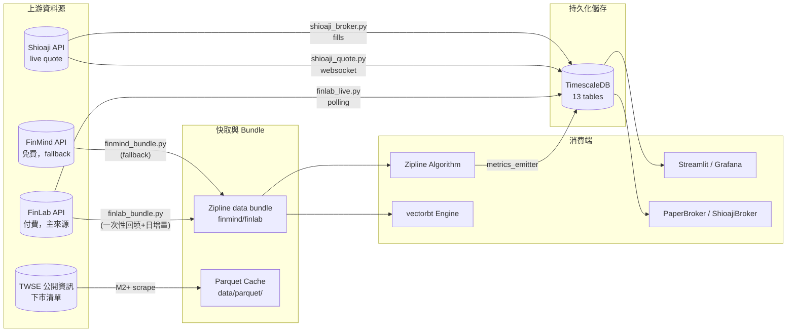

# 資料契約 — backtest_platform

> **版本：** v1.0 | **更新：** 2026-05-31
> **適用 M**：M1 既有四表 + M2-5 新增九表（共 13 表）
> **進度**：見 [`16_wbs_development_plan.md §3.D`](./16_wbs_development_plan.md)（單一狀態真相源）
> **適用範圍：** L1 資料層（對應 `05_architecture_and_design_document.md` §4）
> **關聯文件：** `20_dashboard_specification.md`（消費端）、`23_deployment_topology.md`（DB 部署）、ADR-006（FinLab 選型）

---

## 1. 資料層架構

### 1.1 三層資料流總覽



### 1.2 三角色定位

| 角色 | 載體 | 適用場景 | RPO |
| :--- | :--- | :--- | :--- |
| **Zipline bundle** | 檔案系統（`.zipline/data/`） | Backtest 歷史回測（讀取效能優先） | 不適用（rebuilt） |
| **TimescaleDB cache** | TimescaleDB hypertables | OLTP（部位/訊號/audit） + dashboard 查詢 | 24h |
| **Live feed buffer** | TimescaleDB regular tables | Paper / Live 即時資料 | 5 分鐘 |

### 1.3 為何 bundle 與 TimescaleDB 並存

| 維度 | Bundle | TimescaleDB |
| :--- | :--- | :--- |
| 讀取模式 | Zipline 順序 scan 全市場 | 點查詢、aggregation |
| 寫入頻率 | 一次性 ingest + 日增量 | 高頻寫入（每訊號/每 fill） |
| 跨機共享 | 否（本機檔案） | 是（DB 連線） |
| 結構 | 固定（OHLCV + adjustment）| 自定義 schema |
| 規模 | 100 檔 10 年 ~ 200MB | 同樣資料 + 全部 metrics ~ 2GB |

---

## 2. 資料源 Schema

### 2.1 FinLab Schema（主來源）

> 來自 `finlab.data.get()` 回傳的 DataFrame；以 stock_id 為 columns、trade_date 為 index 的寬表結構。
> 註：FinLab 預設股價已**前復權**，無需自行 adjustment。

#### 2.1.1 Price endpoint：`price:收盤價` / `price:開盤價` 等

| 欄位 | 型別 | 範例 | 說明 |
| :--- | :--- | :--- | :--- |
| index (date) | `pd.Timestamp` | `2024-05-30` | 交易日 |
| columns | `str (stock_id)` | `'2330'`, `'2454'` | 個股代號 |
| values | `float` | `542.0` | 前復權後價格 |

**完整 price 集合**：
| FinLab key | 對應 OHLCV |
| :--- | :--- |
| `price:開盤價` | open |
| `price:最高價` | high |
| `price:最低價` | low |
| `price:收盤價` | close |
| `price:成交股數` | volume |
| `price:成交金額` | turnover |

#### 2.1.2 法人籌碼：`institutional_investors_trading_summary:外陸資買賣超股數` 等

| 欄位 | 型別 | 範例 | 說明 |
| :--- | :--- | :--- | :--- |
| index (date) | `pd.Timestamp` | `2024-05-30` | — |
| columns | `str (stock_id)` | `'2330'` | — |
| values | `float` | `1234567.0` | 淨買賣超股數（正=買超） |

| FinLab key | 含義 |
| :--- | :--- |
| `institutional_investors_trading_summary:外陸資買賣超股數` | 外資 |
| `institutional_investors_trading_summary:投信買賣超股數` | 投信 |
| `institutional_investors_trading_summary:自營商買賣超股數(自行買賣)` | 自營商 |

#### 2.1.3 籌碼 / 券商分點：`broker_transactions`（FinLab 進階方案）

| 欄位 | 型別 | 範例 | 說明 |
| :--- | :--- | :--- | :--- |
| `stock_id` | `str` | `'2330'` | — |
| `date` | `date` | `2024-05-30` | — |
| `broker` | `str` | `'9A95'` | 券商代號 |
| `branch` | `str` | `'板橋'` | 分點 |
| `buy_volume` | `int` | `10000` | — |
| `sell_volume` | `int` | `5000` | — |

#### 2.1.4 財報：`fundamental_features` / `financial_statements`

| 欄位 | 型別 | 範例 |
| :--- | :--- | :--- |
| index (date) | `pd.Timestamp` | `2024Q1` 公告日 |
| columns | `str (stock_id)` | `'2330'` |
| values | `float` | EPS、ROE、毛利率 |

### 2.2 FinMind Schema（fallback）

> 來自 `FinMindApi.get_data()`；長表格式（每 row = 一個 stock + date）。

#### 2.2.1 `TaiwanStockPrice`

| 欄位 | 型別 | 範例 | 與 FinLab 對應 |
| :--- | :--- | :--- | :--- |
| `date` | `str (YYYY-MM-DD)` | `'2024-05-30'` | index |
| `stock_id` | `str` | `'2330'` | column header |
| `Trading_Volume` | `int` | `12345678` | `volume` |
| `Trading_money` | `int` | `7000000000` | `turnover` |
| `open` | `float` | `540.0` | open |
| `max` | `float` | `545.0` | high（**注意命名差異**）|
| `min` | `float` | `538.0` | low（**注意命名差異**）|
| `close` | `float` | `542.0` | close（**未復權**，需自行 adjustment）|
| `spread` | `float` | `2.0` | 漲跌幅（FinLab 無此欄）|

#### 2.2.2 `TaiwanStockInstitutionalInvestorsBuySell`

| 欄位 | 型別 | 範例 | 與 FinLab 對應 |
| :--- | :--- | :--- | :--- |
| `date` | `str` | `'2024-05-30'` | — |
| `stock_id` | `str` | `'2330'` | — |
| `name` | `str` | `'Foreign_Investor'` | tag 而非欄位 |
| `buy` | `int` | `100000` | 拆出 buy/sell |
| `sell` | `int` | `80000` | — |

**關鍵差異**：FinMind 把三大法人 + 自營商自行/避險拆成 5 個 `name`，需 group_by 才能對齊 FinLab 的「外資/投信/自營商」三欄。

#### 2.2.3 `TaiwanStockDividend`（FinLab 已內建調整，本表僅 fallback）

| 欄位 | 型別 |
| :--- | :--- |
| `date` | `str` |
| `stock_id` | `str` |
| `CashEarningsDistribution` | `float` |
| `StockEarningsDistribution` | `float` |

### 2.3 Shioaji Schema（Live）

#### 2.3.1 Tick（即時逐筆）

```python
# shioaji Quote.Tick (簡化版)
{
    "code": "2330",
    "datetime": "2026-05-31 09:01:23.456",
    "open": 542.0,
    "high": 545.0,
    "low": 540.0,
    "close": 543.0,
    "volume": 100,
    "bid_price": [543.0, 542.5, 542.0],
    "bid_volume": [50, 100, 200],
    "ask_price": [543.5, 544.0, 544.5],
    "ask_volume": [80, 150, 200],
    "tick_type": 1,  # 1=Bid, 2=Ask
    "amount": 54300.0,
}
```

#### 2.3.2 Snapshot（5 秒快照）

```python
{
    "code": "2330",
    "datetime": "2026-05-31 09:01:25",
    "open": 542.0,
    "high": 545.0,
    "low": 540.0,
    "close": 543.5,
    "volume": 12345,
    "amount": 6700000.0,
    "total_volume": 1234567,
    "total_amount": 670000000.0,
    "average_price": 542.8,
}
```

#### 2.3.3 Order Fill（成交回報）

```python
{
    "trade_id": "TXN-20260531-001",
    "order_id": "ORD-20260531-001",
    "code": "2330",
    "action": "Buy",
    "price": 543.0,
    "quantity": 1000,
    "ts": "2026-05-31 09:01:23.789",
    "exchange_ts": "2026-05-31 09:01:23.812",
    "status": "Filled",  # Filled / PartFilled / Cancelled / Rejected
}
```

---

## 3. Zipline Bundle 格式

### 3.1 Bundle 結構（Zipline 標準）

```
~/.zipline/data/finlab/
├── 2026-05-31T08;00;00.000000/
│   ├── assets-7.sqlite                # 標的元資料
│   ├── daily_equities.bcolz/           # OHLCV 列式儲存
│   │   ├── close/
│   │   ├── open/
│   │   ├── high/
│   │   ├── low/
│   │   ├── volume/
│   │   └── day/
│   ├── adjustments.sqlite              # split / dividend（FinLab 已預調整，本檔含空 table）
│   └── minute_equities.bcolz/          # (M5 加入 minute bar 才有)
```

### 3.2 Ingest 規格

| 項目 | 規格 |
| :--- | :--- |
| 寫入函式 | `adapters/data_bundle/finlab_bundle.py:register_finlab_bundle()` |
| 註冊 entry | `zipline_extension.py`（`~/.zipline/extension.py`） |
| Calendar | `XTAI`（`exchange-calendars` 套件提供，zipline-reloaded 引用；見 ADR-013）|
| Frequency | `daily`（M2-M4）/ `minute`（M5 視需要） |
| Asset universe | 一次性回填 = 上市/上櫃全部活躍標的；日增量 = 當日 universe.py 篩選結果 |
| 漲跌停 | 不在 bundle，於 broker 模組處理（`PaperBroker._apply_price_limit()`）|

### 3.3 增量更新策略

| 模式 | 觸發 | 行為 |
| :--- | :--- | :--- |
| **Initial backfill** | 手動 `zipline ingest -b finlab --start 2010-01-01` | 拉 FinLab 全歷史寫入 bundle |
| **Daily incremental** | Prefect cron 14:35 | 拉當日資料 append；bundle 新 timestamp 目錄 |
| **Repair** | 手動 `--start <date> --end <date>` | 覆蓋指定區間（FinLab 後修正資料） |

```python
# adapters/data_bundle/finlab_bundle.py 骨架
from zipline.data.bundles import register
import finlab

def finlab_bundle(environ, asset_db_writer, minute_bar_writer,
                  daily_bar_writer, adjustment_writer,
                  calendar, start_session, end_session,
                  cache, show_progress, output_dir):
    # 1. 拉 FinLab 全市場 OHLCV
    close = finlab.data.get("price:收盤價").loc[start_session:end_session]
    # 2. asset metadata
    asset_db_writer.write(equities=_build_metadata(close.columns))
    # 3. daily bars (generator pattern)
    daily_bar_writer.write(_iter_ohlcv(close, ...), show_progress=show_progress)
    # 4. adjustments (FinLab 已預調整，寫空 table)
    adjustment_writer.write(splits=pd.DataFrame(), dividends=pd.DataFrame())

register("finlab", finlab_bundle, calendar_name="XTAI")
```

---

## 4. TimescaleDB Schema（完整 DDL）

### 4.1 Schema 總表

| # | 表 | M1 | M2 | M3 | M4 | M5 | 類型 | 對應功能 |
| :---: | :--- | :---: | :---: | :---: | :---: | :---: | :--- | :--- |
| 1 | `daily_bars` | ✅ | | | | | hypertable | OHLCV cache |
| 2 | `institutional_flows` | ✅ | | | | | hypertable | 三大法人 |
| 3 | `broker_chips` | ✅ | | | | | hypertable | 籌碼 |
| 4 | `universe` | ✅ | | | | | regular | 篩選結果 |
| 5 | `equity_snapshots` | | ✅ | | | | hypertable | 帳戶權益曲線 |
| 6 | `positions` | | ✅ | | | | regular | 當前部位 |
| 7 | `signals` | | ✅ | | | | hypertable | 訊號日誌 |
| 8 | `fills` | | | | ✅ | | hypertable | 成交回報 |
| 9 | `orders` | | | | ✅ | | hypertable | 訂單記錄 |
| 10 | `risk_metrics` | | | ✅ | | | hypertable | 風控指標 |
| 11 | `validation_runs` | | | ✅ | | | regular | PBO/DSR/WFA |
| 12 | `data_quality_log` | ✅ | | | | | regular | DQ 異常 |
| 13 | `alerts` | | | | ✅ | | hypertable | 告警記錄 |

### 4.2 M1 既有四表（簡化引用，完整 DDL 見 `dashboard/db_schema.sql`）

```sql
-- daily_bars (M1 已有)
CREATE TABLE daily_bars (
    stock_id    TEXT NOT NULL,
    trade_date  DATE NOT NULL,
    open        NUMERIC(12,4),
    high        NUMERIC(12,4),
    low         NUMERIC(12,4),
    close       NUMERIC(12,4),
    volume      BIGINT,
    adj_factor  NUMERIC(12,8) DEFAULT 1.0,
    PRIMARY KEY (stock_id, trade_date)
);
SELECT create_hypertable('daily_bars', 'trade_date', chunk_time_interval => INTERVAL '1 month');
CREATE INDEX ON daily_bars (stock_id, trade_date DESC);

-- institutional_flows, broker_chips, universe 略（M1 已存在）
```

### 4.3 新增表 — equity_snapshots（M2）

```sql
CREATE TABLE equity_snapshots (
    snapshot_time     TIMESTAMPTZ NOT NULL,
    strategy_id       TEXT NOT NULL,
    mode              TEXT NOT NULL,  -- 'backtest' | 'paper' | 'live'
    run_id            TEXT NOT NULL,  -- UUID per run
    equity            NUMERIC(18,4) NOT NULL,
    cash              NUMERIC(18,4) NOT NULL,
    positions_value   NUMERIC(18,4) NOT NULL,
    open_positions    INT NOT NULL,
    portfolio_heat    NUMERIC(6,4),
    drawdown          NUMERIC(6,4),
    daily_return      NUMERIC(8,6),
    cumulative_return NUMERIC(8,6),
    PRIMARY KEY (snapshot_time, strategy_id, run_id)
);
SELECT create_hypertable('equity_snapshots', 'snapshot_time', chunk_time_interval => INTERVAL '1 month');
CREATE INDEX ON equity_snapshots (strategy_id, snapshot_time DESC);

-- M5 retention：live 模式永久；backtest 90 天
SELECT add_retention_policy('equity_snapshots',
    INTERVAL '90 days',
    if_not_exists => TRUE
);
```

### 4.4 新增表 — positions（M2）

```sql
CREATE TABLE positions (
    position_id      UUID PRIMARY KEY DEFAULT gen_random_uuid(),
    strategy_id      TEXT NOT NULL,
    run_id           TEXT NOT NULL,
    stock_id         TEXT NOT NULL,
    opened_at        TIMESTAMPTZ NOT NULL,
    closed_at        TIMESTAMPTZ,  -- NULL = open
    entry_price      NUMERIC(12,4) NOT NULL,
    exit_price       NUMERIC(12,4),
    quantity         INT NOT NULL,
    stop_loss        NUMERIC(12,4),
    take_profit      NUMERIC(12,4),
    realized_pnl     NUMERIC(18,4),
    unrealized_pnl   NUMERIC(18,4),
    status           TEXT NOT NULL DEFAULT 'OPEN',  -- OPEN | CLOSED | LIQUIDATED
    UNIQUE (strategy_id, run_id, stock_id, opened_at)
);
CREATE INDEX ON positions (strategy_id, status) WHERE status = 'OPEN';
CREATE INDEX ON positions (stock_id, opened_at DESC);
```

### 4.5 新增表 — signals（M2）

```sql
CREATE TABLE signals (
    signal_id        UUID NOT NULL DEFAULT gen_random_uuid(),
    signal_time      TIMESTAMPTZ NOT NULL,
    strategy_id      TEXT NOT NULL,
    run_id           TEXT NOT NULL,
    stock_id         TEXT NOT NULL,
    action           TEXT NOT NULL,  -- buy/add/reduce/exit/stoploss/takeprofit/hold
    priority         INT NOT NULL,   -- 1=stoploss .. 7=hold
    reason_json      JSONB NOT NULL,  -- {scores, prices, context, gates}
    submitted        BOOLEAN DEFAULT FALSE,
    submitted_at     TIMESTAMPTZ,
    PRIMARY KEY (signal_time, signal_id)
);
SELECT create_hypertable('signals', 'signal_time', chunk_time_interval => INTERVAL '7 days');
CREATE INDEX ON signals (strategy_id, signal_time DESC);
CREATE INDEX ON signals (stock_id, signal_time DESC);
CREATE INDEX ON signals USING GIN (reason_json);
```

### 4.6 新增表 — orders（M4）

```sql
CREATE TABLE orders (
    order_id         UUID NOT NULL DEFAULT gen_random_uuid(),
    created_at       TIMESTAMPTZ NOT NULL,
    signal_id        UUID REFERENCES signals(signal_id),
    broker           TEXT NOT NULL,  -- paper | shioaji
    stock_id         TEXT NOT NULL,
    side             TEXT NOT NULL,  -- Buy | Sell
    order_type       TEXT NOT NULL,  -- Market | Limit | MOC | LOC
    quantity         INT NOT NULL,
    limit_price      NUMERIC(12,4),  -- NULL for Market
    status           TEXT NOT NULL,  -- PENDING | SUBMITTED | FILLED | PARTIAL | CANCELLED | REJECTED
    broker_order_id  TEXT,
    submitted_at     TIMESTAMPTZ,
    completed_at     TIMESTAMPTZ,
    error_msg        TEXT,
    PRIMARY KEY (created_at, order_id)
);
SELECT create_hypertable('orders', 'created_at', chunk_time_interval => INTERVAL '7 days');
CREATE INDEX ON orders (status) WHERE status IN ('PENDING', 'SUBMITTED', 'PARTIAL');
CREATE INDEX ON orders (signal_id);
```

### 4.7 新增表 — fills（M4）

```sql
CREATE TABLE fills (
    fill_id          UUID NOT NULL DEFAULT gen_random_uuid(),
    fill_time        TIMESTAMPTZ NOT NULL,
    order_id         UUID NOT NULL,
    signal_id        UUID,
    stock_id         TEXT NOT NULL,
    side             TEXT NOT NULL,
    fill_price       NUMERIC(12,4) NOT NULL,
    fill_quantity    INT NOT NULL,
    commission       NUMERIC(10,4),
    tax              NUMERIC(10,4),
    slippage_bps     NUMERIC(8,2),  -- (fill_price - expected) / expected * 10000
    broker           TEXT NOT NULL,
    broker_trade_id  TEXT,
    PRIMARY KEY (fill_time, fill_id)
);
SELECT create_hypertable('fills', 'fill_time', chunk_time_interval => INTERVAL '7 days');
CREATE INDEX ON fills (order_id);
CREATE INDEX ON fills (stock_id, fill_time DESC);
```

### 4.8 新增表 — risk_metrics（M3）

```sql
CREATE TABLE risk_metrics (
    metric_time      TIMESTAMPTZ NOT NULL,
    strategy_id      TEXT NOT NULL,
    run_id           TEXT NOT NULL,
    current_dd       NUMERIC(6,4),
    var_95           NUMERIC(8,4),
    cvar_95          NUMERIC(8,4),
    portfolio_heat   NUMERIC(6,4),
    concentration_top1 NUMERIC(5,4),
    concentration_top3 NUMERIC(5,4),
    hhi              NUMERIC(6,5),
    sharpe_30d       NUMERIC(6,3),
    sortino_30d      NUMERIC(6,3),
    event_type       TEXT,  -- NULL | HEAT_WARN | CONCENT | L1_PAUSE | L2_CUT | L3_HALT
    event_context    JSONB,
    PRIMARY KEY (metric_time, strategy_id, run_id)
);
SELECT create_hypertable('risk_metrics', 'metric_time', chunk_time_interval => INTERVAL '1 month');
CREATE INDEX ON risk_metrics (strategy_id, metric_time DESC);
CREATE INDEX ON risk_metrics (event_type, metric_time DESC) WHERE event_type IS NOT NULL;
```

### 4.9 新增表 — validation_runs（M3）

```sql
CREATE TABLE validation_runs (
    run_id           UUID PRIMARY KEY DEFAULT gen_random_uuid(),
    run_time         TIMESTAMPTZ NOT NULL,
    method           TEXT NOT NULL,  -- PBO | DSR | WFA | CPCV | MC
    strategy_id      TEXT NOT NULL,
    params_json      JSONB NOT NULL,
    result_json      JSONB NOT NULL,
    summary_metric   NUMERIC(10,6),
    pass_threshold   BOOLEAN
);
CREATE INDEX ON validation_runs (strategy_id, method, run_time DESC);
CREATE INDEX ON validation_runs USING GIN (result_json);
```

### 4.10 新增表 — data_quality_log（M1 既有結構增強）

```sql
CREATE TABLE data_quality_log (
    check_id         BIGSERIAL PRIMARY KEY,
    check_time       TIMESTAMPTZ NOT NULL DEFAULT NOW(),
    source           TEXT NOT NULL,  -- finlab | finmind | shioaji
    check_type       TEXT NOT NULL,  -- missing | outlier | mismatch | stale
    stock_id         TEXT,
    trade_date       DATE,
    severity         TEXT NOT NULL,  -- info | warn | error
    detail_json      JSONB NOT NULL,
    resolved         BOOLEAN DEFAULT FALSE,
    resolved_at      TIMESTAMPTZ
);
CREATE INDEX ON data_quality_log (check_time DESC);
CREATE INDEX ON data_quality_log (resolved, severity) WHERE resolved = FALSE;
```

### 4.11 新增表 — alerts（M4）

```sql
CREATE TABLE alerts (
    alert_id         UUID NOT NULL DEFAULT gen_random_uuid(),
    alert_time       TIMESTAMPTZ NOT NULL DEFAULT NOW(),
    rule_id          TEXT NOT NULL,
    level            TEXT NOT NULL,  -- critical | high | info
    title            TEXT NOT NULL,
    message          TEXT NOT NULL,
    context_json     JSONB,
    sent_to_discord BOOLEAN DEFAULT FALSE,
    sent_at          TIMESTAMPTZ,
    PRIMARY KEY (alert_time, alert_id)
);
SELECT create_hypertable('alerts', 'alert_time', chunk_time_interval => INTERVAL '7 days');
CREATE INDEX ON alerts (sent_to_discord, alert_time DESC) WHERE sent_to_discord = FALSE;
CREATE INDEX ON alerts (rule_id, alert_time DESC);
```

---

## 5. 資料一致性策略

### 5.1 三大 ACL（Anti-Corruption Layer）邊界

| ACL | 位置 | 職責 | 失敗處置 |
| :--- | :--- | :--- | :--- |
| **FinLab → Zipline bundle** | `finlab_bundle.py` `_normalize_*()` | 寬表轉長表、欄位 rename、補 timezone | log + skip bad rows，總 skip > 1% → fail bundle |
| **Live feed → TimescaleDB** | `data_feed/finlab_live.py` `_validate_tick()` | Pydantic schema 驗證、reject out-of-hours | drop + write data_quality_log |
| **Shioaji → fills** | `brokers/shioaji_broker.py` `_normalize_fill()` | 統一 trade_id、translate status enum | 拒寫 fills 表、Discord CRITICAL |

### 5.2 強一致 vs 最終一致

| 表 | 一致性 | 理由 | 機制 |
| :--- | :--- | :--- | :--- |
| `orders` / `fills` | 強一致 | audit trail，不能丟 | Postgres ACID transaction |
| `positions` | 強一致 | 即時狀態 | row-level lock + version |
| `signals` | 強一致 | 行為證據 | 直寫 |
| `daily_bars` | 最終一致 | ETL 重跑會修正 | `INSERT ... ON CONFLICT DO UPDATE` |
| `equity_snapshots` | 最終一致 | 可從 fills 重算 | append-only |
| `risk_metrics` | 最終一致 | 派生 | append-only |

### 5.3 跨源 cross-check

| 檢查 | 來源 A | 來源 B | 容忍 | 失敗動作 |
| :--- | :--- | :--- | :--- | :--- |
| OHLCV 對拍 | FinLab | FinMind | < 1% | log + warn |
| 法人金額 | FinLab | FinMind aggregated | < 5% | log（資料來源差異） |
| Live close vs daily close | Shioaji 收盤 tick | FinLab daily close | < 0.5% | data_quality_log |
| 持倉 reconciliation | TimescaleDB `positions` | Shioaji `list_positions()` | 0（精確） | Discord CRITICAL + 暫停下單 |

---

## 6. 資料品質檢查（DQ Rules）

### 6.1 規則表

| Rule ID | 類別 | 條件 | severity | 動作 |
| :--- | :--- | :--- | :--- | :--- |
| `DQ-001` | missing | 預期交易日 daily_bars 無記錄 | error | block downstream + alert |
| `DQ-002` | missing | 三大法人單日缺一檔 | warn | log，續跑 |
| `DQ-003` | outlier | 單日漲跌 > ±15%（非除權息） | warn | flag，人工確認 |
| `DQ-004` | outlier | volume > 30 天平均 × 10 | info | log |
| `DQ-005` | mismatch | adj_factor 跳變 > 50%（未公告除權） | error | block downstream |
| `DQ-006` | stale | 最新 trade_date < today - 2 trading days | error | alert |
| `DQ-007` | cross-source | FinLab vs FinMind close diff > 1% | warn | log，採 FinLab |
| `DQ-008` | live | tick 時間戳 < now - 5min（live mode） | error | 切備援 feed |
| `DQ-009` | reconciliation | positions count != Shioaji list | error | Discord CRITICAL |
| `DQ-010` | adjustment | 同股 close 前後日 diff > 30% 無對應 split/dividend | error | 暫停該股訊號 |

### 6.2 執行頻率

| 規則類 | 頻率 |
| :--- | :--- |
| ETL 後即時 | DQ-001~005, 007, 010 |
| Live polling | DQ-008 |
| 每 5 分鐘 | DQ-009（live mode） |
| 每日 14:35 | DQ-006 |

---

## 7. 資料保留與備份

### 7.1 Retention Policy

| 表 | 保留 | 機制 | 啟用 |
| :--- | :--- | :--- | :--- |
| `daily_bars` | 永久 | — | M1 |
| `institutional_flows` | 永久 | — | M1 |
| `broker_chips` | 永久 | — | M1 |
| `equity_snapshots` | live 永久 / backtest 90 天 | TimescaleDB retention policy | M2 |
| `positions` | closed 後 1 年 | scheduled job | M4 |
| `signals` | 永久 | — | M2 |
| `orders` / `fills` | 永久（audit） | — | M4 |
| `risk_metrics` | 1 年 | retention policy | M3 |
| `validation_runs` | 永久 | — | M3 |
| `data_quality_log` | 1 年 | retention policy | M1 |
| `alerts` | 90 天 | retention policy | M4 |

### 7.2 備份策略

| 環境 | 工具 | 頻率 | 目的地 | RPO | RTO |
| :--- | :--- | :--- | :--- | :--- | :--- |
| Dev | 無 | — | — | N/A | N/A |
| Staging | `pg_dump` | 每週 | local disk | 7d | 4h |
| Prod | `pg_dump` + `pg_basebackup` | daily / hourly WAL | GCS | 1h | 1h |

```bash
# M5 production 備份 cron
0 2 * * * /opt/scripts/pg_backup.sh
# → pg_dump -Fc quant_trading | gzip | gsutil cp - gs://quant-backup/$(date +\%F).dump.gz
```

### 7.3 災難恢復

| 情境 | 動作 | RTO |
| :--- | :--- | :--- |
| 單表 corruption | restore 該表 from 最新 dump | 30min |
| 整 DB 毀損 | 開新 VM + restore + replay WAL | 1h |
| Bundle 毀損 | `zipline ingest -b finlab --start <full>` | 2h（含 FinLab 拉資料） |

---

## 8. 變更紀錄

| 版本 | 日期 | 變更 |
| :--- | :--- | :--- |
| v1.0 | 2026-05-31 | 初版（對應 plan v1.0 §3/§5；M1 4 表 + 新增 9 表 DDL） |
