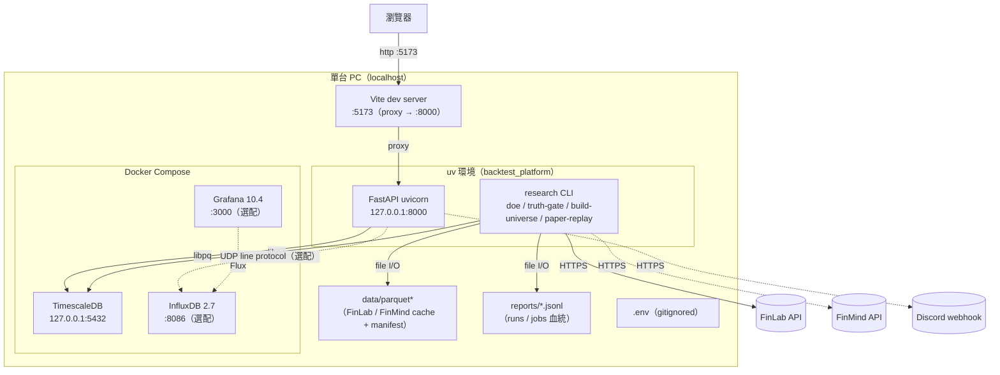
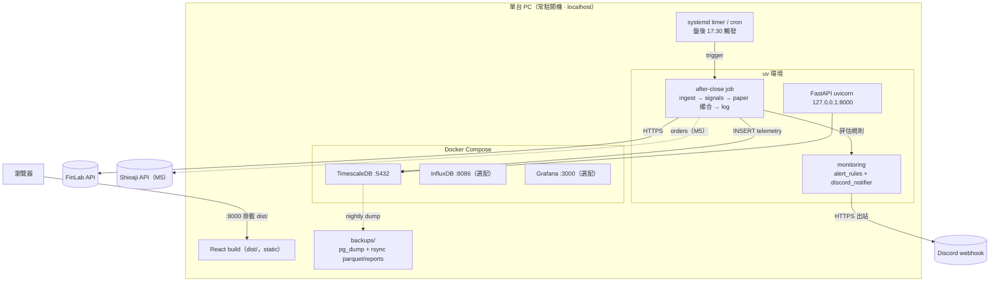

# 部署拓撲 — backtest_platform

> **版本：** v2.0 | **更新：** 2026-07-02
> **部署假設：** 單機自託管、內網 localhost、單人（[02 PRD v4.0 §2.3](./02_project_brief_and_prd.md)、[ADR-031](./adrs/ADR-031-standalone-auth-decision.md)）。
> **關聯：** [14_deployment_and_operations_guide.md](./14_deployment_and_operations_guide.md)（運維 SOP，本文不重複）、[20_dashboard_specification.md](./20_dashboard_specification.md)（監控元件）、[13_security_and_readiness_checklists.md](./13_security_and_readiness_checklists.md)（安全邊界）。

本文聚焦**拓撲與 docker-compose 設計**；運維 SOP（建置指令、備份、Runbook）在 14 號文件。

單機哲學：**沒有三環境企業拓撲**（無 staging VM、無 GCP、無 caddy 反向代理、無 K8s）。同一台機器上，「dev」與「常駐」的差別只是「API/前端跑不跑」與「排程器有沒有掛上」，不是不同主機。

---

## 1. 拓撲總覽

```
單台 PC（Linux / WSL2 · localhost-only）
├── 前端  React（Vite dev :5173  或  build → dist/ static）
│      └── vite proxy /runs /research /monitor /system /home … → 127.0.0.1:8000
├── 後端  FastAPI / uvicorn        綁 127.0.0.1:8000   ← 唯一安全邊界（loopback，ADR-031）
├── CLI    research / zipline_adapter（同一 uv 環境）
├── 排程   cron / systemd timer（after-close，下一步）
└── Docker Compose
       ├── TimescaleDB   127.0.0.1:5432   ← 必要
       ├── InfluxDB      127.0.0.1:8086   ← M4 選配（系統 metrics）
       └── Grafana       127.0.0.1:3000   ← M4 選配（系統面板）
出站（唯一對外）：FinLab / FinMind API（拉資料）、Discord webhook（推告警）、Shioaji（M5 下單）
```

> **loopback 綁定（ADR-031）**：後端 API MUST 綁 `127.0.0.1`；DB / 監控埠建議也綁 `127.0.0.1:<port>:<port>`（docker-compose 預設對 host 全介面開放，單機部署應收斂到 loopback，見 §5）。

---

## 2. Dev 拓撲（開發 / 研究）

研究時段的主路徑是 **CLI-first**（跑 DOE / truth-gate / build-universe），GUI 檢視 runs / 報告。API + 前端按需啟動。



| 元件 | Dev 必要 | 啟用時機 |
| :--- | :---: | :--- |
| TimescaleDB | ✅ | 一律 |
| FastAPI + Vite | 用 GUI 時 | 檢視 runs / 報告 / 比較 |
| InfluxDB + Grafana | 選配 | 開發系統面板時（M4）|

---

## 3. 常駐拓撲（收 live OOS / paper）

當 ≥1 策略過真偽閘、進 paper 收 live OOS 時，同一台機器加掛**排程器 + 告警常駐**。仍是單機、仍綁 loopback；唯一新增的是 after-close timer 與 Discord 出站。



- **無反向代理 / 無 TLS 前置**：單機 localhost 不需要（ADR-031）。若 M5 需遠端存取，才重開 auth + reverse-proxy 決策。
- **前端 prod**：`npm run build` 出 `dist/` 靜態資產，以 static server / uvicorn 掛載提供；不需獨立前端容器。

---

## 4. docker-compose 服務

`backtest_platform/docker-compose.yml`（單一檔，非三環境分檔）：

| 服務 | image | 埠 | 角色 |
| :--- | :--- | :--- | :--- |
| `timescaledb` | `timescale/timescaledb:2.14.2-pg16` | 5432 | **必要**：telemetry + runs + bundle cache；init.sql 首啟自動建 13 表 |
| `influxdb` | `influxdb:2.7` | 8086 | 選配（M4）：系統 metrics（`monitoring/influx_writer.py` push）|
| `grafana` | `grafana/grafana:10.4.2` | 3000 | 選配（M4）：4 個系統面板（provisioning 自動載入）|
| `prefect-server` | `prefecthq/prefect:2.19` | 4200 | **未使用殘留**：排程方向已改 cron/systemd（PRD v4.0），可不啟動 / 待移除 |

> 資料持久化於 named volume（`timescaledb_data` / `influxdb_data` / `grafana_data`）；`docker compose down` 保留，`down -v` 才清空。

---

## 5. 埠與 loopback 綁定

| 服務 | 現況 port mapping | 單機建議 |
| :--- | :--- | :--- |
| FastAPI | `uvicorn --host 127.0.0.1 --port 8000` | ✅ loopback（MUST，ADR-031）|
| Vite dev | `:5173`（proxy → 8000）| localhost |
| TimescaleDB | `"5432:5432"`（對 host 全介面）| 收斂 `"127.0.0.1:5432:5432"` |
| InfluxDB / Grafana | `"8086:8086"` / `"3000:3000"` | 同上收斂 loopback |

> 唯一對外流量是**出站**：FinLab / FinMind（拉資料）、Discord（推告警）、Shioaji（M5 下單）。無入站公網暴露。

---

## 6. Secrets 管理

單一機制：`.env`（gitignored）+ `pydantic-settings` 載入（`config/settings.py` / `monitoring` 的 `DISCORD_*`）。無 git-crypt、無 GCP Secret Manager（那是多環境企業做法，standalone 不需要）。

| Secret | 用途 |
| :--- | :--- |
| `FINLAB_API_TOKEN` | 主資料源（付費）|
| `FINMIND_TOKEN` | fallback 資料源 |
| `POSTGRES_PASSWORD` | TimescaleDB（部署時必改預設值）|
| `DISCORD_BOT_TOKEN` / `DISCORD_*_ID` | 告警 |
| `INFLUXDB_TOKEN` | 系統 metrics（選配）|
| `SHIOAJI_*` | 實盤下單（M5）|

防外洩規範見 [13 §B](./13_security_and_readiness_checklists.md)：秘密不進 git / log / Discord 訊息 / 前端 bundle；`/system/alerts/channels` 回應遮罩。

---

## 7. 災難復原

備份與恢復 SOP（pg_dump + rsync parquet/reports、恢復演練）見 [14 §4](./14_deployment_and_operations_guide.md)。拓撲層面的降級：

| 失效 | Fallback | 通知 |
| :--- | :--- | :--- |
| FinLab API | 切 FinMind bundle ingest | Discord HIGH |
| TimescaleDB | 無 fallback，停 paper 鏈 | Discord CRITICAL |
| InfluxDB / Grafana | 降級（系統 metrics 不寫，主流程照跑）| Discord HIGH |
| Discord | 寫本機 log（告警不阻塞主流程）| system log |

- **RPO** 24 小時（每日 dump）、**RTO** < 1 小時（單機 restore）。
- 機器壞掉：策略狀態（部位 / entry_price）存 DB，restore + 重灌 parquet 即可續跑。
