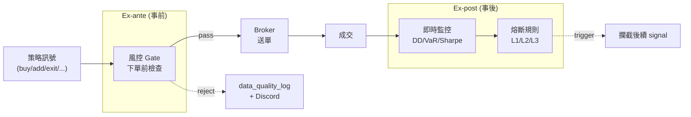
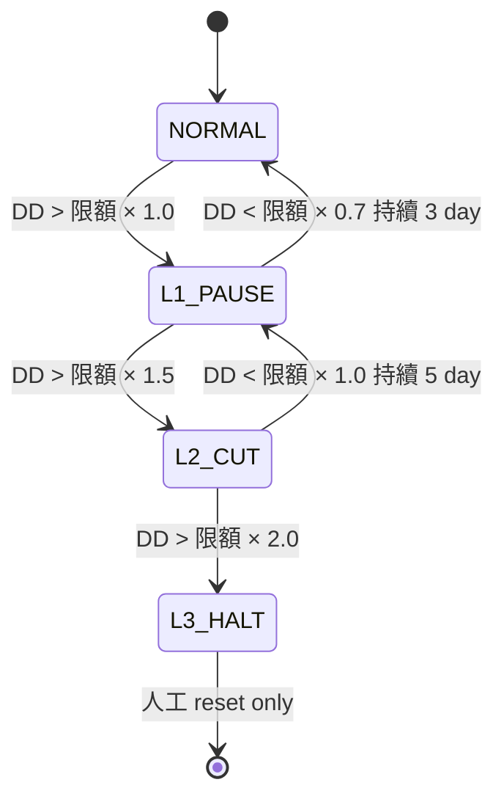
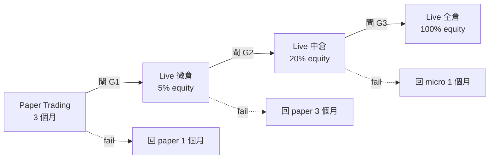

# 風險管理規範 — backtest_platform

> **版本：** v1.0 | **更新：** 2026-05-31
> **適用 M**：M1 universe + signal priority 既有 / M4-5 完整風控啟用
> **進度**：見 [`16_wbs_development_plan.md §7.C`](./16_wbs_development_plan.md)（單一狀態真相源）
> **適用範圍：** L5 風險管理層（對應 `05_architecture_and_design_document.md` §1.1.2）
> **關聯文件：** `13_security_and_readiness_checklists.md` §I（緊急狀況）、`14_deployment_and_operations_guide.md` §5/§7（告警與 Runbook）、`strategy/v2.md` §6（Heat 定義）

> 本文 **擴充** 既有 `13` §I（緊急狀況表）與 `14` §5（告警分級），聚焦 **風控規則本身的數學與執行邏輯**。

---

## 1. 風險管理框架

### 1.1 兩階段設計



| 階段 | 何時執行 | 失敗動作 |
| :--- | :--- | :--- |
| **Ex-ante** | 訊號 → broker submit 之前 | reject 訂單、寫 `data_quality_log`、Discord HIGH |
| **Ex-post** | 每筆 fill 後 + 每 5 分鐘 + 收盤 | 觸發熔斷 L1/L2/L3、Discord CRITICAL |

### 1.2 設計鐵律

1. **風控不可繞過**：所有 signal 必經 `risk_gate.evaluate()`；移除 gate = 改動 commit 需 2 人 review
2. **熔斷自動執行**：L2/L3 觸發 → 自動下單，不等人工確認
3. **保守優先**：拿不準時拒單，不冒險
4. **可追溯**：每次拒單寫 audit trail（rule_id + context_json）

---

## 2. Ex-ante Limits（下單前檢查）

### 2.1 規則表

| Rule ID | 名稱 | 閾值 | 來源 | M | 失敗動作 |
| :--- | :--- | :--- | :--- | :---: | :--- |
| `EX-001` | 單筆下單金額上限 | < NT$ 500,000（M5 小倉） / < 5% equity（全倉） | config | M4 | reject + log |
| `EX-002` | 單檔持倉比例上限 | < 8% equity（單股不超過） | config | M4 | reject |
| `EX-003` | 產業集中度上限 | < 35% equity（單一產業） | universe.industry | M4 | reject |
| `EX-004` | Portfolio Heat 上限 | < 6%（v2.md §6） | 即時計算 | M4 | reject |
| `EX-005` | 現金保留下限 | > 10% equity | account | M4 | reject buy/add |
| `EX-006` | 漲跌停價檢查 | 限價 ±10%（M5 改為 ±10% from prev_close） | daily_bars | M4 | reject 或改 MOC |
| `EX-007` | 最大同時持倉檔數 | ≤ 15（v2.md §2.2） | positions count | M4 | reject buy |
| `EX-008` | 最小停損距離 | stop_loss ≥ entry × 0.95（5% 之內） | strategy_config | M4 | reject |
| `EX-009` | 訂單頻率上限 | < 30 訂單 / minute（防 bug 暴衝） | rolling counter | M4 | reject + Critical alert |
| `EX-010` | 流動性檢查 | qty ≤ 20% × 20D 平均日成交量 | daily_bars | M5 | reject 或拆單 |
| `EX-011` | 黑名單檢查 | stock_id ∉ blacklist | runtime config | M4 | reject |
| `EX-012` | 風控熔斷狀態 | breaker.state != HALTED | risk_metrics latest | M4 | reject all |

### 2.2 Gate 評估順序

```python
# adapters/risk/risk_gate.py
class RiskGate:
    RULES_IN_ORDER = [
        "EX-012",  # 熔斷最先：HALTED 直接拒
        "EX-009",  # 頻率異常：防 bug
        "EX-011",  # 黑名單
        "EX-001", "EX-002", "EX-003", "EX-005", "EX-007",  # 額度類
        "EX-004",  # Heat（最貴的計算放後面）
        "EX-006", "EX-008", "EX-010",  # 訂單細節
    ]

    def evaluate(self, order: Order, context: Context) -> GateResult:
        for rule_id in self.RULES_IN_ORDER:
            result = self.rules[rule_id].check(order, context)
            if not result.passed:
                self._log_rejection(rule_id, order, result.reason)
                return GateResult(passed=False, rule_id=rule_id, reason=result.reason)
        return GateResult(passed=True)
```

### 2.3 規則細節

#### EX-004 Portfolio Heat（v2.md §6）

```
Heat = Σ_i [ qty_i × |entry_i - stop_loss_i| ] / equity
```

- 假設所有持倉同時停損的總虧損
- 6% 上限 = 一次 worst case 損失不超過帳戶 6%
- 新單會增加 Heat → 必檢

#### EX-006 漲跌停價

| 模式 | 規則 |
| :--- | :--- |
| Backtest | 跳空漲跌停：成交模擬於 ±10%；vectorbt 假設可成交 |
| Paper | 限價單超過 ±10% → reject；市價單照常 |
| Live | 限價單超過 ±10% → reject；市價單改為 MOC（避免追價） |

---

## 3. Ex-post Monitor（事後告警）

### 3.1 監控指標

對應 `21_data_contract.md` §4.8 `risk_metrics` 表：

| Metric | 計算頻率 | 警告 | 告警 |
| :--- | :--- | :--- | :--- |
| `current_dd` | 每筆 fill + 每 5 分鐘 | > 限額 × 0.7（暫定 10%） | > 限額 |
| `var_95` (daily) | 收盤後 | — | daily_pnl < var_95 × 1.5 |
| `cvar_95` | 收盤後 | — | — |
| `portfolio_heat` | 每筆 fill | > 5% | > 6% |
| `concentration_top1` | 每筆 fill | > 18% | > 25% |
| `concentration_top3` | 每筆 fill | > 45% | > 60% |
| `hhi` | 每筆 fill | > 0.20 | > 0.30 |
| `sharpe_30d` | 收盤後 | < 回測 × 0.7 | < 回測 × 0.5（連 30 天） |
| `signal_anomaly` | 每日 | 連 5 天無 buy | 連 10 天全 buy（黏住） |

### 3.2 告警分級對應

| Metric breach | 等級 | rule_id（20 號文件） |
| :--- | :--- | :--- |
| Heat > 6% | HIGH | 自訂 `HIGH-005` |
| current_dd > 限額 | CRITICAL | `CRIT-003` |
| concentration > 60% | HIGH | `HIGH-006` |
| sharpe_30d < 0.5x | HIGH | `HIGH-007`（內部 review） |
| signal 黏住 | HIGH | `HIGH-008` |

---

## 4. 熔斷規則（Circuit Breaker）

### 4.1 三級熔斷



### 4.2 觸發與動作矩陣

| 等級 | 觸發條件 | 自動動作 | 通知 | 恢復條件 |
| :--- | :--- | :--- | :--- | :--- |
| **L1 PAUSE** | DD ≥ 限額 × 1.0（DD 15%） | 暫停新加碼（buy/add reject）；既有 reduce/exit/stoploss 照常 | Discord CRIT-003 (L1) | DD < 限額 × 0.7 持續 3 trading day |
| **L2 CUT** | DD ≥ 限額 × 1.5（DD 22.5%） | 強制減半所有持倉（送 reduce 訂單）+ L1 限制 | Discord CRIT-003 (L2) | DD < 限額 × 1.0 持續 5 trading day |
| **L3 HALT** | DD ≥ 限額 × 2.0（DD 30%） | 全部出場 + 停止所有 algo + 鎖定 risk_gate | Discord CRIT-003 (L3) + email | **人工 reset only**（檢討會 → 改 config → 重啟） |

### 4.3 額外觸發條件（與 DD 並列任一觸發）

| 條件 | 等級 |
| :--- | :--- |
| 連虧 5 筆 | L1 PAUSE |
| 連虧 8 筆 | L2 CUT |
| 單日 DD > 10% | L2 CUT |
| Shioaji 異常 連續 5 次 | L3 HALT（執行系統壞了）|
| reconciliation 失敗 | L3 HALT（部位與券商不對）|
| 程式 exception 連 10 次/hr | L3 HALT |

### 4.4 熔斷實作

```python
# monitoring/circuit_breaker.py
from enum import Enum

class BreakerState(Enum):
    NORMAL = "normal"
    L1_PAUSE = "l1_pause"
    L2_CUT = "l2_cut"
    L3_HALT = "l3_halt"

class CircuitBreaker:
    def evaluate(self, metrics: RiskMetrics) -> BreakerState:
        dd_ratio = abs(metrics.current_dd) / self.dd_limit
        if dd_ratio >= 2.0:
            return BreakerState.L3_HALT
        if dd_ratio >= 1.5 or metrics.consecutive_losses >= 8:
            return BreakerState.L2_CUT
        if dd_ratio >= 1.0 or metrics.consecutive_losses >= 5:
            return BreakerState.L1_PAUSE
        return BreakerState.NORMAL

    def execute(self, state: BreakerState, portfolio: Portfolio) -> list[Order]:
        if state == BreakerState.L2_CUT:
            return [reduce_order(p, ratio=0.5) for p in portfolio.open]
        if state == BreakerState.L3_HALT:
            return [exit_order(p) for p in portfolio.open]
        return []
```

---

## 5. 訊號優先序執行（既有 + 風控 hook）

### 5.1 7 訊號優先序（M1 已實作於 `signals.py`）

| 優先 | 訊號 | 含義 | 風控攔截 |
| :---: | :--- | :--- | :--- |
| 1 | `stoploss` | 跌破停損 | 風控**不攔截**（救命單） |
| 2 | `exit` | 趨勢翻轉 | 不攔截 |
| 3 | `takeprofit` | 達目標獲利 | 不攔截 |
| 4 | `reduce` | 降低部位 | 不攔截（控風險）|
| 5 | `add` | 加碼 | **L1/L2/L3 都攔截** |
| 6 | `buy` | 開新倉 | **L1/L2/L3 都攔截** |
| 7 | `hold` | 不動 | — |

### 5.2 攔截邏輯

```python
# strategies/four_layer_resonance/__init__.py (Zipline algorithm)
def handle_data(context, data):
    raw_signal = compute_signal_for(bar)  # M1 既有純函式
    breaker_state = context.breaker.current_state

    # 風控 gate：buy/add 在熔斷時直接降為 hold
    if raw_signal.action in {"buy", "add"} and breaker_state != BreakerState.NORMAL:
        log_signal_intercepted(raw_signal, breaker_state)
        return  # skip ordering

    # 其餘訊號照常執行（含 stoploss/exit/reduce）
    order = build_order(raw_signal)
    gate_result = context.risk_gate.evaluate(order, context)
    if gate_result.passed:
        context.broker.submit(order)
    else:
        log_order_rejected(order, gate_result.rule_id)
```

### 5.3 風控與訊號交互範例

| 情境 | raw signal | 風控狀態 | 最終動作 |
| :--- | :--- | :--- | :--- |
| 正常加碼 | add | NORMAL | submit add order（如 gate 通過） |
| 加碼遇 L1 | add | L1_PAUSE | skip（hold） |
| 持倉停損 + L2 | stoploss | L2_CUT | submit stoploss（救命單不擋） |
| L3 觸發當下 | buy | L3_HALT | skip + breaker.execute() 全平 |
| Heat 6.5% 新買 | buy | NORMAL | gate EX-004 reject |

---

## 6. 股池風控（既有 universe.py + 動態調整）

### 6.1 13 個篩選條件（M1 既有，引自 `data/universe.py`）

| # | 條件 | 預設值 |
| :---: | :--- | :--- |
| 1 | 上市/上櫃滿 N 年 | 1 年 |
| 2 | 市值門檻 | ≥ 5 億 |
| 3 | 日成交量門檻 | ≥ 平均 1000 張 |
| 4 | 排除全額交割 | yes |
| 5 | 排除處置股 | yes |
| 6 | 排除注意股 | optional |
| 7 | 排除 DR（存託憑證） | yes |
| 8 | 排除特別股 | yes |
| 9 | 排除權證/ETN | yes |
| 10 | 排除暫停交易 | yes |
| 11 | 產業排除清單 | 可設定 |
| 12 | 黑名單（runtime） | 動態 |
| 13 | 白名單（runtime，覆蓋其他） | 動態 |

### 6.2 動態調整觸發

| 觸發 | 動作 |
| :--- | :--- |
| 個股出現 DQ-003 連續 3 天 | 加入 runtime 黑名單 |
| 個股下市公告 | 強制 exit + 黑名單 |
| 個股暫停交易 > 1 day | 暫時移除 universe |
| 個股恢復交易 | 經 1 週觀察期再回 universe |
| 產業重大事件（人工） | 加入產業排除 |

### 6.3 Universe rebuild 排程

- **頻率**：每日 09:00（盤前）
- **載入**：`data/universe.py:rebuild_universe()`
- **持久化**：寫入 `universe` 表（`snapshot_date` PK）
- **使用**：Zipline pipeline 每天 query 最新 snapshot

---

## 7. 資料品質風控

對應 `21_data_contract.md` §6（DQ rules），風控相關：

| DQ Rule | 風控動作 |
| :--- | :--- |
| DQ-001 missing daily_bars | block 該股當日所有訊號 |
| DQ-005 adj_factor 跳變 | 暫停該股 1 day，人工確認 |
| DQ-006 stale data | block 全部訊號 + Discord |
| DQ-008 tick stale (live) | 切備援 feed + 不下新單 |
| DQ-009 reconciliation 失敗 | L3 HALT |
| DQ-010 close 跳變 30% 無 split | 暫停該股，加入觀察 |

---

## 8. 實盤前驗證閘（Paper → Live）

### 8.1 三階段晉升標準



### 8.2 各閘標準

#### Gate G1：Paper → Live 5%

- [ ] Paper trading 連續 3 個月運行
- [ ] Sharpe(paper) ≥ Sharpe(回測) × 0.7
- [ ] 訊號重現率 ≥ 99%（vs 回測同期重算）
- [ ] 滑點實測 ≤ 預估 × 1.5
- [ ] 系統可用度 ≥ 99%（ETL/Algo/Broker 故障 < 1%）
- [ ] 無 CRIT 告警未解
- [ ] 13 號 P0 行動項全結案

#### Gate G2：5% → 20%

- [ ] Live 5% 跑 1 個月
- [ ] 實盤 Sharpe ≥ Paper Sharpe × 0.8
- [ ] MDD ≤ 限額 × 0.5
- [ ] 無熔斷 L1+ 觸發
- [ ] 對拍 R-007 reconciliation 精確
- [ ] 滑點與 paper 對拍 < 10bp 差

#### Gate G3：20% → 100%

- [ ] Live 20% 跑 2 個月
- [ ] 實盤 Sharpe ≥ 1.0
- [ ] MDD ≤ 限額 × 0.7
- [ ] 1 次 manual disaster drill 通過（拔網線、撤單、reconciliation 還原）
- [ ] 連續 30 trading day 無 Critical 告警

### 8.3 降級觸發

| 觸發 | 降級到 |
| :--- | :--- |
| Live 階段 L2_CUT 觸發 | 回前一階段 |
| Live 階段 L3_HALT | 強制回 Paper 3 個月 |
| 連續 2 個月績效 < paper × 0.7 | 回前一階段 |

### 8.4 配置閘 — 兩段驗證與目標倉位（[ADR-025](./adrs/ADR-025-two-stage-validation-gate-and-paper-promotion.md)）

§8.1–8.3 的升倉閘決定「**部署到目標倉位的多少比例**」（5%→20%→100% 的 ramp）。**目標倉位本身**由配置閘決定，位於升倉閘上游。實作見 `validation/two_stage_gate.py`（純函式，門檻為 data 常數）。

ADR-025 把單一 binary 通關拆成兩段，避免「部署閘與研究迭代閘混用」「絕對 CAGR 對市場中性策略錯配」「沒 edge 不准 paper／不 paper 拿不到 live OOS」三缺陷。

#### 第一段：真偽閘（Truth Gate）— binary hard-fail

防自欺，擋過擬合 / 生存者膨脹假陽性。**沒過 = 假的，目標倉位 0，配置閘不執行。**

| 判準 | 門檻（常數）| 適用 |
| :--- | :--- | :--- |
| survivorship-clean | 含下市股 point-in-time universe（強制）| 全部 |
| 選股過擬合 PBO | `PBO_MAX = 0.30`（CSCV）| 以 IS 從 sweep **選** config 的策略 |
| 單一 pre-registered config OOS | `WFA_OOS_POSITIVE_MIN = 0.60` + `DSR_MIN = 0.95` | hypothesis 預登記、**不重選** config 的策略 |
| K3 滑點穩健 | `SLIPPAGE_SHARPE_MIN = 0.0`（0.3% per-leg 下 OOS 不崩號）| 全部 |

> **關鍵**：landscape PBO 衡量「**選** config」的過擬合，**不適用於否定** pre-registered 單一 config（該用 OOS breadth + DSR 判）。這把資金流 fixed-config 的「WFA median OOS 1.30 但 landscape PBO 43%」正確拆開。

#### 真偽閘判決三態 → 倉位對映（[ADR-033](./adrs/ADR-033-paper-watch-tier.md)）

真偽閘 verdict 在 REAL/REJECTED 之間新增零資本 `PAPER_WATCH` 觀察艙態（`TruthVerdict`）：

| verdict | 進入條件 | 目標倉位 | 說明 |
| :--- | :--- | :--- | :--- |
| **REAL** | 全 hard-fail 過 **且** DSR ≥ `DSR_MIN`（0.95）| 配置閘連續 size（> 0）| 可部署 |
| **PAPER_WATCH** | 全 hard-fail 過 **且** DSR ∈ [`PAPER_WATCH_DSR_MIN`, `DSR_MIN`) 即 **[0.90, 0.95)** | **0.0（恆零資本）** | 觀察艙：零資本 paper 收 live OOS，上限 2 艙位 / 3 個月到期；晉升仍需重評後 DSR ≥ 0.95 |
| **REJECTED** | 任一 hard-fail 不過（含 DSR < 0.90）| 0.0 | 假 edge / 過擬合 / 生存者膨脹，不進艙 |
| **INCOMPLETE** | 必要指標缺失 | 0.0 | 無法完整評估，不得進艙（優先於 PAPER_WATCH）|

> **零資本 ≠ 放寬部署門檻**：DSR ≥ 0.95 仍 gate 每一分資本；PAPER_WATCH 是資訊收集通道（收 live OOS 補強證據），非門檻購物。band 下限 0.90 的獨立理由＝「90% 機率真 Sharpe 超越 max-of-N-trials 噪音基準」仍屬高證據水位。
>
> **觀察艙條款已 code enforcement（非自律）**：ADR-033 §3.3 的「上限 2 艙位 / 3 個月（90 日曆天）到期 / 一次性（無新證據不得再入）」由 `research/watch_registry.py`（append-only event-sourced JSONL，比照 `runs_store`/`promotion_store`）機器落地——進艙 `enroll` 驗 DSR band + 艙位上限 + 一次性 bar，`expire_due` 冪等到期，`active_watches`/`status` 為純讀取。after-close 排程整合（`orchestration/after_close.py`）把「誰可以跑 paper」變成守門：real session 執行前查艙位狀態，**未進艙 / 已到期 → 拒跑**（exit 1），成功後掃到期並推「觀察期滿，含 live 證據重評」Discord。CLI：`orchestration.cli watch enroll/status`（見 [14 §3.2](./14_deployment_and_operations_guide.md)）。
>
> **進艙改由「人為選取佇列」驅動（ADR-040，rebuild Goal 10）**：berth enrollment 的**主要自動入口**已從手動 `watch enroll` 改為**候選池勾選佇列消費**——`research/live_oos_consumer.consume_queue` 每 after-close tick 把 queued 的 `paper_watch_berth` 項送 `watch_registry.enroll`（band / ≤2 席 / one-shot **原封執行，不放寬**）→ berth 建立。**未被人為勾選的候選永不進艙、永不自動跑 paper**（驗收 #1）。`run_after_close` 的 berth 守門邏輯零改動——只改「berth 從哪來」；手動 `watch enroll` 保留為 ops override。細節見 [ADR-040](./adrs/ADR-040-live-oos-queue-consumption.md)。

#### 第二段：配置閘（Sizing Gate）— 連續，決定目標倉位

過真偽閘後，按風險預算映射到**目標權重**（非 yes/no）：

```
size = max_weight × conviction × diversification × capacity
  conviction      = min(OOS Sharpe / reference_sharpe, 1)   # 飽和於 reference
  diversification = 1 − max(0, correlation_to_fleet)         # 負相關 ≈ 零相關，不懲罰
  capacity        = clip(capacity_fraction, 0, 1)
```

- 預設 `max_weight = 0.25`、`reference_sharpe = 1.0`（`SizingConfig`，可調 data）。
- **絕對 CAGR 降為參考**（`SizingInput.cagr` 攜帶但不入計算）：市場中性策略以 OOS Sharpe + 對艦隊邊際貢獻配置，不被 standalone CAGR 懲罰。
- 0.9-Sharpe、零相關 sleeve → `0.25 × 0.9 × 1 × 1 = 0.225` 目標倉位（**真實小倉位，非淘汰**）。

#### 與升倉閘銜接

| 階段 | 倉位 |
| :--- | :--- |
| 配置閘輸出 | **目標** `max_weight`（如 0.225）|
| §8.1 G1 Paper→Live 5% | 部署目標的微倉位（5% equity 上限內）收 live OOS |
| §8.1 G2/G3 | ramp 至目標 `max_weight` × 升倉比例 |

paper 期 live OOS 回饋配置閘：實際摩擦吃掉 edge → conviction 下修或退回真偽閘重判。


### 8.5 外圈資本配置政策 — pod/sleeve 制（[ADR-036](./adrs/ADR-036-pod-sleeve-portfolio-gate.md)）

配置閘（§8.4）算出**單一艙位**的目標倉位；跨艙位的**資本再配置（季度）**由 `validation/portfolio_gate.py` 的三個純函式治理：

| 函式 | 規則 | 為什麼 |
| :--- | :--- | :--- |
| `sleeve_weights` | 權重 = `compute_position_size`（§8.4 同款公式），**hysteresis**：相對變化 < 20% 不動作 | 資本在策略層搬動必須慢——追近期 Sharpe 換倉 = 高買低賣 |
| `apply_stop_outs` | live 回撤 **超過** 15%（預設）→ 配額歸零、退回審判庭重驗 | pod 式離散停損：殘酷、規則式、可審計 |
| `portfolio_gate_report` | 候選 + 艦隊合成組合走同一條 DSR（`deflated_sharpe_from_returns`）→ 分散紅利 Δ 記錄進 metrics | 0.9 牆是單策略的；組合級正交紅利是**證據軸**，v1 不改寫 standalone verdict |

權重總和不歸一：餘額即現金（pod 語意）。跨艙 heat 聚合（EX-002/004/007 的跨策略版）為第二艙位前置項，見 ADR-036 §3.4。

---

## 9. 緊急應變 SOP

對應 `13` §I（簡表），本節提供 **完整操作步驟**：

### 9.1 Shioaji 斷線

```
觸發：CRIT-002（持續 60s）
1. 自動：alerter 推 Discord CRIT
2. 自動：app 停止 submit 新單（既有持倉照常）
3. 自動：切備援 shioaji_quote → 收 quote 不下單
4. 人工 (5min 內)：
   - 開 Shioaji 官方 status page 確認服務狀態
   - 重試 `shioaji.login()`
5. 若 10 min 內未恢復：
   - 手動執行 `scripts/kill_switch.sh --keep-positions`
   - 通知券商
6. 恢復後：
   - 跑 reconciliation：DB positions vs Shioaji `list_positions()`
   - 不一致 → CRIT 告警 → 人工修正
```

### 9.2 系統崩潰（VM down）

```
觸發：cAdvisor container down 或 GCP health check fail
1. 自動：GCP 嘗試 instance restart
2. 人工 (15 min 內)：
   - SSH 進 VM 確認 docker compose ps
   - 若 timescaledb 健康 → docker compose up -d 重啟其他
   - 若 timescaledb 毀損 → 走 8.災難復原
3. 復原後立即：
   - 全部容器 health 確認
   - reconciliation 跑一次
   - 補發過去區間缺漏的 metrics
4. 事後檢討：
   - 寫 incident report → dev_docs/incidents/YYYY-MM-DD.md
```

### 9.3 明顯虧損（單日 DD > 10%）

```
觸發：L2_CUT 自動執行
1. 自動：強制減半所有持倉（reduce orders）
2. 自動：Discord CRIT 推送
3. 人工 (30 min 內)：
   - 開 Streamlit 面板 D 看 dd trend + risk events
   - 排查原因：策略失效 / 市場異常 / bug / 資料錯
4. 若是策略失效：
   - 維持 L2，觀察 5 day → 若未回血 → 主動觸發 L3
5. 若是市場異常（如黑天鵝）：
   - 維持 L2，等市場恢復
6. 若是 bug：
   - 觸發 L3 HALT
   - 修 bug → paper 1 個月 → G1 再來
7. 若是資料錯：
   - 修資料 → reconciliation → 評估是否恢復
```

### 9.4 操作失誤（人工誤觸 / 配置錯誤）

```
1. 立即執行 scripts/kill_switch.sh（緊急停機）
2. 評估持倉影響：
   - 多買的 → 隔日盤前手動平倉
   - 漏單的 → 隔日跟單
3. 寫 incident report
4. 改 SOP 防呆（如：加 confirmation prompt、限制 root 操作）
```

### 9.5 Kill Switch 腳本

```bash
#!/bin/bash
# scripts/kill_switch.sh
set -euo pipefail

MODE="${1:---halt-all}"  # --halt-all | --keep-positions

echo "[$(date)] Kill switch triggered: $MODE"

# 1. 停止 algo（不再產新訊號）
docker compose stop app paper_broker shioaji_broker scheduler

# 2. 視 mode 決定平倉
if [[ "$MODE" == "--halt-all" ]]; then
    docker compose run --rm app python -m scripts.emergency_close_all
fi

# 3. 寫 alert
docker compose run --rm alerter python -c "
from monitoring.alerter import AlertRouter
import asyncio
asyncio.run(AlertRouter().fire('MANUAL-001', 'critical', 'Kill switch executed: $MODE'))
"

# 4. 留下 timestamp file
echo "$(date -Iseconds) $MODE" >> /var/log/quant/kill_switch.log

echo "[$(date)] Kill switch complete. Manual restart required."
```

---

## 10. 風控配置（Pydantic）

```python
# config/risk_config.py
from pydantic import BaseModel, Field

class RiskConfig(BaseModel, frozen=True):
    # Ex-ante
    max_order_value_pct: float = Field(0.05, ge=0.001, le=0.1)
    max_single_position_pct: float = Field(0.08, ge=0.01, le=0.2)
    max_industry_pct: float = Field(0.35, ge=0.1, le=0.5)
    max_portfolio_heat: float = Field(0.06, ge=0.01, le=0.1)
    min_cash_pct: float = Field(0.10, ge=0.05, le=0.5)
    max_concurrent_positions: int = Field(15, ge=1, le=50)
    max_orders_per_minute: int = Field(30, ge=1, le=100)
    max_position_pct_of_adv: float = Field(0.20, ge=0.01, le=1.0)

    # Circuit breaker
    dd_limit: float = Field(0.15, ge=0.05, le=0.5)
    l1_dd_multiplier: float = Field(1.0)
    l2_dd_multiplier: float = Field(1.5)
    l3_dd_multiplier: float = Field(2.0)
    l1_recovery_dd: float = Field(0.7)  # DD < 限額 × 0.7
    l1_recovery_days: int = Field(3)
    consecutive_loss_l1: int = Field(5)
    consecutive_loss_l2: int = Field(8)

    # Promotion gates
    paper_min_months: int = Field(3)
    micro_min_months: int = Field(1)
    mid_min_months: int = Field(2)
    paper_sharpe_pass: float = Field(0.7)  # paper_sharpe / backtest_sharpe
```

---

## 11. 驗收 Checklist

### M2 風控基礎

- [ ] `risk_gate.py` 完成 EX-001/002/004/005/007/008
- [ ] 風控 reject 寫入 `data_quality_log`
- [ ] M1 universe.py 整合到 Zipline pipeline

### M3 監控與指標

- [ ] `risk_metrics` 表寫入正常
- [ ] CircuitBreaker class + state machine 實作
- [ ] L1/L2 模擬觸發測試通過

### M4 完整風控

- [ ] EX-001 ~ EX-012 全部規則上線
- [ ] L3 HALT 模擬測試（手動 DD = 30%）
- [ ] Discord CRIT-003 三級訊息可正確發送
- [ ] kill_switch.sh 演練通過

### M5 實盤前

- [ ] reconciliation flow 自動化（每 5 min）
- [ ] Promotion gate G1 三項全通過
- [ ] disaster drill 通過
- [ ] 緊急 SOP 已演練（4 個場景各 1 次）

---

## 12. 變更紀錄

| 版本 | 日期 | 變更 |
| :--- | :--- | :--- |
| v1.0 | 2026-05-31 | 初版（對應 plan §1 L5；擴充 13/14 風控細節） |
| v1.1 | 2026-06-14 | 新增 §8.4 配置閘（真偽閘 + sizing 目標倉位，ADR-025 / `two_stage_gate.py`）；與 §8.1 升倉閘銜接 |
| v1.2 | 2026-07-02 | §8.4 新增「真偽閘判決三態 → 倉位對映」表：`PAPER_WATCH` 零資本觀察艙（DSR ∈ [0.90, 0.95)，ADR-033 / `TruthVerdict`）|
| v1.3 | 2026-07-03 | 新增 §8.5 外圈資本配置政策（ADR-036 / `portfolio_gate.py`：sleeve_weights hysteresis + pod 式停損 + 組合級 DSR 證據軸）|
