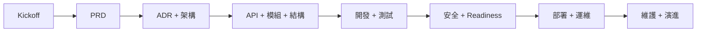

# 產品開發流程使用說明書 - 個人級 EOD 量化交易平台

> 版本: v1.0 | 日期: 2026-07-05 | 狀態: Golden baseline

## 1. 使用原則

- **文件即契約**：PRD、ADR、API、模組規格先於程式碼。
- **七層先行**：所有需求必須標明屬於 Data / Research / Governance / Strategy/Execution / Risk/Portfolio / Monitoring / Foundation 哪一層。
- **邊界不可繞過**：Research 不能下單；Execution 不能改寫研究邏輯；Risk 可阻擋交易。
- **個人級 right-size**：保留機構級紀律，不引入不必要的機構級基建。
- **可驗證架構**：關鍵規則必須轉成測試、CI gate 或 Architecture Fitness Function。
- **AI 研究撰寫 harness**：策略研究由 operator 驅動 Claude Code（dev-time）在 repo 內完成；agent 用 Python + finlab SDK + `research.cli` 自主跑 research 閉環（撰寫→conformance→回測→驗證→評估→候選），停在 governance 閘門前由人核准。無 MCP、非 runtime 引擎。見 ADR-009 / SPEC-03。
- **operator 角色轉移**：從「策略程式碼撰寫者」轉為「AI 監督者 + governance 核准者」——問對問題、審閱證據、把關閘門，比 agent 產出的答案更關鍵。

## 2. 模式選擇

本專案採完整流程，原因：

| 條件 | 判斷 |
| :--- | :--- |
| 涉及真實資金與券商 API | 必須完整流程 |
| 涉及財務資料、憑證、交易紀錄 | 必須完整流程 |
| Research / Execution / Risk 邊界高風險 | 必須完整流程 |
| 單人使用 | 允許 infra right-size，但不允許流程缺失 |

## 3. 完整流程

| 階段 | 目標 | 產出 | Gate |
| :--- | :--- | :--- | :--- |
| A0 啟動 | 對齊產品邊界 | `00_INDEX.md` | 七層定位清楚 |
| A1 規劃 | 需求、KPI、非目標 | `02`、`03` | KPI 可測，BDD 可執行 |
| A2 架構 | C4、DDD、ADR、NFR | `04`、`05` | ADR 完整，QAS 可測 |
| A3 詳細設計 | API、模組、目錄、依賴 | `06`-`10` | 契約穩定，依賴不倒置 |
| A4 開發品質 | Review、測試、重構；策略經 AI harness 撰寫（SPEC-03） | `11` | 測試綠燈，fitness functions 通過，agent 產出經人 review + conformance |
| A5 安全就緒 | 安全與交易準備 | `13` | High/Medium 風險已處理 |
| A6 上線運維 | 部署、監控、rollback | `14` | Runbook、告警、備份、回滾可用 |
| A7 維護 | 文件與 WBS 演進 | `15`、`16` | 文件與實作同步 |

## 4. RACI

| 活動 | Owner | Reviewer | 備註 |
| :--- | :--- | :--- | :--- |
| PRD / Scope | PM/Owner | TL | 單人專案仍需留簽核紀錄 |
| ADR | ARCH | TL | 任何跨層邊界改動必須 ADR |
| API Contract | TL | DEV/QA | contract-first |
| Risk Rule | Owner | ARCH | 預設 fail-closed |
| Deployment | SRE/OPS | TL | 生產前需 rollback rehearsal |
| Security | SEC | TL | Broker credential 為最高敏感度 |

## 5. Gate 度量

| Gate | 準出條件 |
| :--- | :--- |
| PRD Gate | Epic、非目標、KPI、風險、假設完整。 |
| Architecture Gate | C4 L1/L2/L3、QAS、ADR、anti-decisions 完整。 |
| Contract Gate | API/Event schema、錯誤碼、冪等策略、版本策略完整。 |
| Implementation Gate | 單元/整合/契約測試通過；架構依賴檢查通過。 |
| Trading Readiness Gate | Risk gate、kill switch、reconciliation、audit log 通過。 |
| Operations Gate | Dashboard、alert、backup、restore、rollback runbook 通過。 |

## 6. 變更流程

1. 任何需求改動先更新 `02`。
2. 任何架構改動先更新 `04` / `05`。
3. 任何跨系統契約改動先更新 `06`。
4. 任何模組邊界改動同步更新 `07` / `08` / `09` / `10`。
5. 任何部署、憑證、監控改動同步更新 `13` / `14`。

