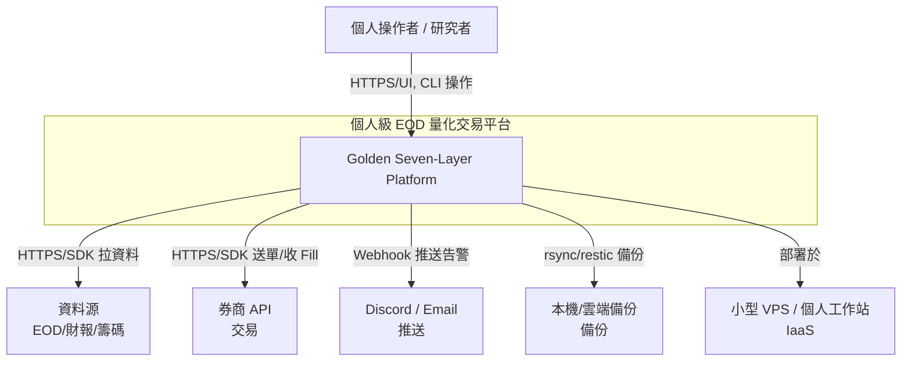
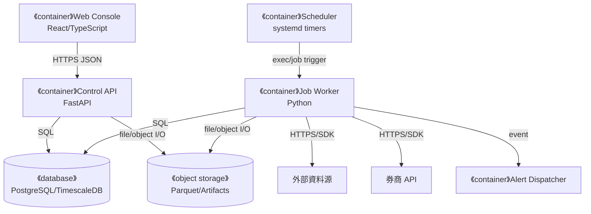
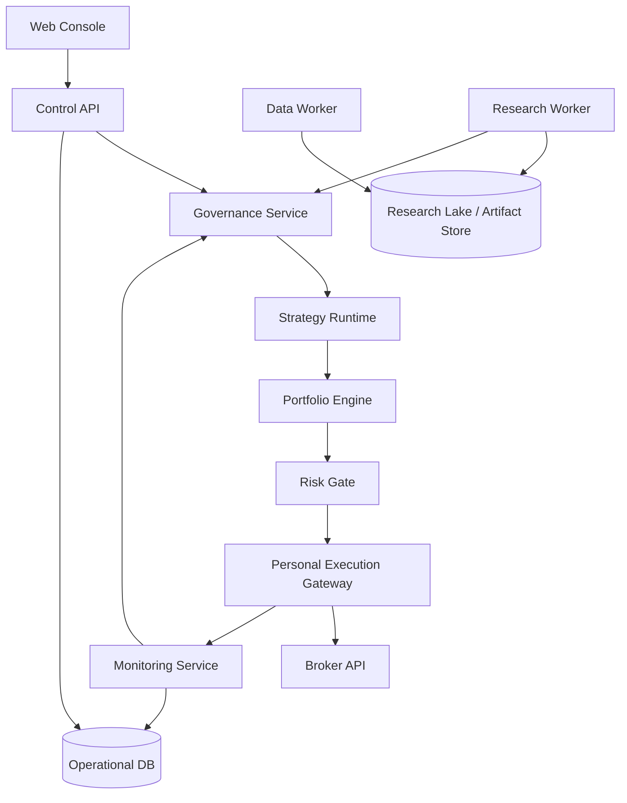
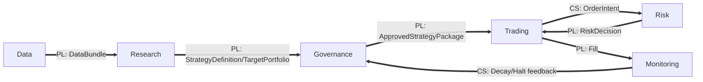
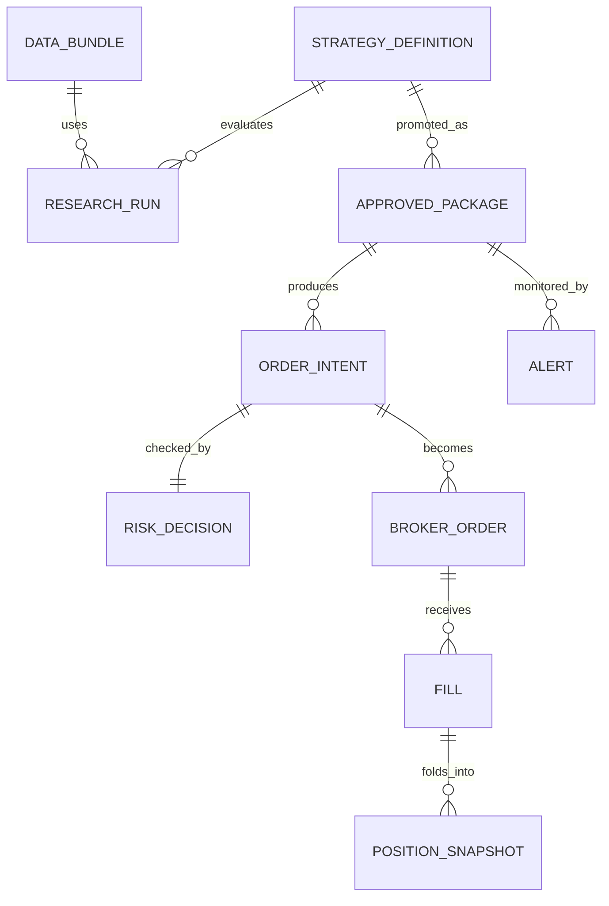
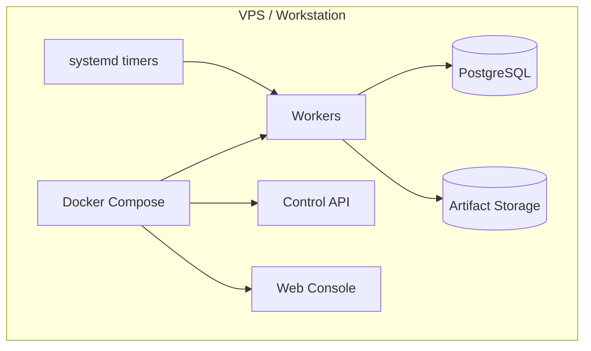

# 架構與設計文件 - 個人級 EOD 量化交易平台

> 版本: v1.0 | 日期: 2026-07-05 | 狀態: Golden baseline

## 1. C4 模型

### 1.1 命名防呆

| 術語 | 意義 |
| :--- | :--- |
| C4 System Context | 整個個人級 EOD 量化交易平台相對外界 |
| C4 Container | 可獨立執行的 runtime / DB / worker / UI |
| SAD 七層 | 業務與平台責任分層，不等於 C4 L1-L4 |
| Research & Validation | SAD 第 2 層，FinLab/backtest_platform 所在 |

### 1.2 L1 - System Context

### 1.3 L2 - Container Current

### 1.4 L2 - Target / Future State

### 1.5 Container 清單

| Container | 類型 | 啟用 | 對應 SAD 層 |
| :--- | :--- | :--- | :--- |
| Web Console | UI | M4 | Monitoring / Governance |
| Control API | API | M1 | Cross-layer control |
| Data Worker | Worker | M1 | Data |
| Research Worker | Worker | M2 | Research |
| Governance Service | Service | M3 | Governance |
| Strategy Runtime | Worker | M4 | Strategy / Execution |
| Portfolio Engine | Library/Service | M4 | Portfolio |
| Risk Gate | Service/Library | M4 | Risk |
| Personal Execution Gateway | Worker | M5 | Execution |
| Monitoring Service | Worker/API | M3 | Monitoring |

## 2. DDD 戰略設計

### 2.1 限界上下文

| Context | 職責 | Published Language |
| :--- | :--- | :--- |
| Data | 資料擷取、DQ、bundle、lineage | `DataBundle`, `DataQualityReport` |
| Research | 因子、策略定義、回測、WFA | `AlphaSignal`, `TargetPortfolio`, `BacktestReport` |
| Governance | approval、version、paper、rollback | `ApprovedStrategyPackage`, `ReleaseDecision` |
| Trading | Strategy runtime、portfolio、execution | `OrderIntent`, `BrokerOrder`, `Fill` |
| Risk | limit、pre-trade、halt、audit | `RiskDecision`, `RiskEvent` |
| Monitoring | PnL、health、alert、incident | `Alert`, `DailyOpsReport` |

### 2.2 Context Map

### 2.3 通用語言

| 術語 | 定義 |
| :--- | :--- |
| StrategyDefinition | 策略規則、參數、universe、成本假設的不可變定義 |
| AlphaSignal | Research 對標的與方向的訊號 |
| TargetPortfolio | 目標權重、現金、配置約束 |
| ApprovedStrategyPackage | 經 Governance 發布的可執行版本 |
| OrderIntent | 由目標部位推導出的交易意圖，不是 broker order |
| RiskDecision | Pass / Block / Reduce / Escalate |
| Fill | 實際成交回報，部位與 PnL 單一真相 |

## 3. Clean Architecture

| Layer | 內容 | 禁止 |
| :--- | :--- | :--- |
| Domain | Entities、Value Objects、Domain Services、Policies | import framework / DB / broker |
| Application | Use cases、commands、queries、orchestration | 寫入外部 SDK 細節 |
| Interface Adapters | REST controllers、repositories、presenters、ACL | domain 依賴 adapter |
| Infrastructure | DB、broker SDK、scheduler、filesystem、secrets | 業務規則散落 |

## 4. Quality Attribute Scenarios

| 屬性 | Scenario | 目標 |
| :--- | :--- | :--- |
| Reproducibility | 給定 strategy version + bundle_ref，可重跑報表 | 指標差異 <= tolerance |
| Safety | Risk Gate 不可用時送單 | 100% Block |
| Recoverability | VPS 壞掉後重建 | RTO <= 4h |
| Auditability | 任一 fill 追溯來源 | 追到 package、risk decision、broker report |
| Operability | CRIT incident | 5 分鐘內告警，預設 halt |

## 5. 資料架構

### 5.1 ER 概念

### 5.2 資料生命週期

| 資料 | 來源 | 保留 |
| :--- | :--- | :--- |
| Raw EOD | 資料源 | 永久或至少 7 年 |
| Bundle | Data Worker | 永久保留 hash/manifest |
| Research Run | Research Worker | 永久保留摘要與 artifacts |
| Approved Package | Governance | 永久 |
| Order / Fill | Broker | 永久 |
| Logs / Metrics | System | hot 30-90 days，archive 1 year |

## 6. Resilience Patterns

| Pattern | 用途 |
| :--- | :--- |
| Fail Closed | Risk/data/reconciliation 失敗預設 halt |
| Idempotency Key | order intent、broker order、fill ingestion |
| Circuit Breaker | broker/data source/API failure |
| Retry with Backoff | 外部資料與通知 |
| Append-only Audit | release、risk、manual override |
| Bulkhead | Research jobs 不影響 trading jobs |

## 7. Anti-Decisions

- 不做 Tick / Order Book。
- 不做 HFT / market making。
- 不做機構級 EMS / smart order routing。
- 不做 K8s / multi-region HA。
- 不讓 Research 直連 Broker API。
- 不把 backtest equity 當 live position。
- 不自建自然語言→code 編譯器（Claude Code 即是；ADR-009）。
- 不做「UI 背後起 headless agent 幫終端使用者寫策略」的 runtime 引擎，也不做多租戶 SaaS。
- 研究 agent 不接 MCP：用 Python + finlab SDK + `research.cli`；邊界靠 import-linter + 人 review，非 MCP sandbox。

## 8. Observability

| Pillar | 內容 |
| :--- | :--- |
| Logs | structured JSON，含 trace_id、strategy_id、package_id |
| Metrics | job status、PnL、drawdown、risk blocks、broker rejects |
| Traces | release → order intent → risk decision → broker order → fill |

告警等級：INFO daily summary、WARN drift、ERROR job failed、CRIT reconciliation mismatch / risk unavailable / kill switch。

## 9. Security / STRIDE

| Threat | 風險 | 緩解 |
| :--- | :--- | :--- |
| Spoofing | 假冒操作者或 broker callback | token、callback validation、IP allowlist |
| Tampering | 修改 package / fill | immutable hash、append-only audit |
| Repudiation | 否認 manual override | signed audit event |
| Information Disclosure | broker credential 洩漏 | env secrets、no git、rotation |
| Denial of Service | data/broker outage | circuit breaker、halt |
| Elevation of Privilege | UI 操作越權 | 單人仍用 role-scoped commands |

## 10. Deployment

個人級目標：單機或小型 VPS。

## 11. Team Topology

單人專案以角色分離取代多人團隊：

| 虛擬團隊 | 職責 |
| :--- | :--- |
| Stream-aligned | 產品與策略生命週期 |
| Platform | Data、Foundation、CI/CD |
| Complicated-subsystem | Research validation、Risk |
| Enabling | 文件、模板、runbook、skills + `strategies/CLAUDE.md` |

Claude Code（dev-time research harness）是 Stream-aligned 策略生命週期的加速器：agent 自主跑 research 閉環，operator 監督並在 governance 閘門核准。授權邊界（research 自主 / execution off-limits / governance 人審）見 ADR-009 / SPEC-03 §5。

## 12. Migration Path

| Milestone | 目標 |
| :--- | :--- |
| M0 | 文件、ADR、contract baseline |
| M1 | Data + Foundation |
| M2 | Research + Backtest + Report |
| M3 | Governance + Paper + Monitoring |
| M4 | Strategy/Portfolio/Risk |
| M5 | Personal Execution + Reconciliation |
| M6 | Hardening + backup/restore + runbook rehearsal |

## 13. Architecture Fitness Functions

| Rule | 驗證方式 |
| :--- | :--- |
| Domain 不 import infrastructure | import-linter |
| Research 不 import broker adapter | static import check |
| 所有 order intent 有 risk decision | integration test |
| Fill idempotent | contract test |
| API schema backward compatible | OpenAPI diff |
| ADR required for new container | CI docs check |

