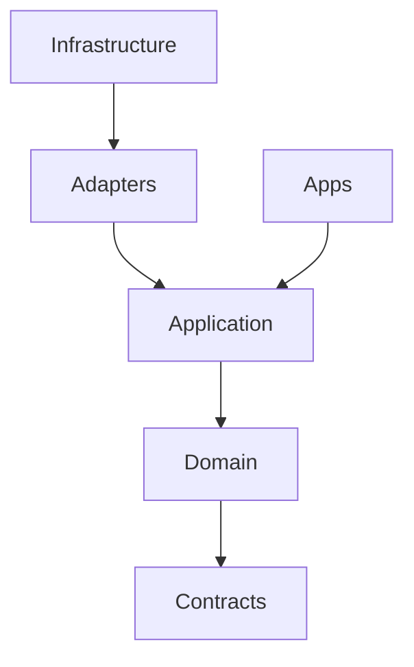
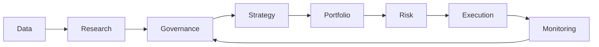

# 模組依賴關係分析 - 個人級 EOD 量化交易平台

> 版本: v1.0 | 日期: 2026-07-05 | 狀態: Golden baseline

## 1. 依賴原則

實際 import 方向只能往內。跨服務通訊走 contracts，不走內部 module import。

## 2. 七層依賴圖

Monitoring 回饋 Governance 是事件/決策回饋，不可直接改 StrategyDefinition。

## 3. 禁止依賴

| From | 禁止依賴 |
| :--- | :--- |
| Research | BrokerAdapter、ExecutionGateway、live order API |
| Data | Research strategy code |
| Domain | Infrastructure、framework |
| Risk | Research backtest internals |
| Execution | Research factor engine |
| UI | DB、broker SDK |

## 4. 外部依賴

| 類別 | 依賴 | 隔離方式 |
| :--- | :--- | :--- |
| 資料源 | EOD/財報/籌碼 provider | SourceAdapter + ACL |
| 券商 | Shioaji / broker SDK | BrokerAdapter interface |
| 推送 | Discord / Email | AlertPort |
| DB | PostgreSQL/TimescaleDB | Repository interface |
| 檔案 | local/object storage | ArtifactStore interface |

## 5. 依賴風險管理

- 所有外部 SDK 都在 `infrastructure`。
- 所有外部 schema 都經 ACL 轉成 domain value object。
- 對 broker/data source 的測試使用 contract fake，不打真實服務。

