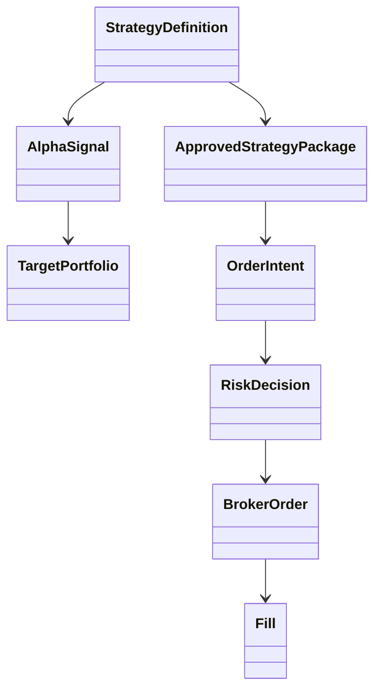

# 類別/元件關係文件 - 個人級 EOD 量化交易平台

> 版本: v1.0 | 日期: 2026-07-05 | 狀態: Golden baseline

## 1. 核心類別圖

## 2. 介面契約

| Interface | 方法 | 實作 |
| :--- | :--- | :--- |
| `MarketDataPort` | `load_bundle(bundle_ref)` | Parquet/DB adapter |
| `StrategyRunner` | `run(config)` | factor strategy implementations |
| `ReleaseRepository` | `save_package(package)` | PostgreSQL |
| `RiskPolicy` | `evaluate(intent, state)` | concentration/cash/halt policies |
| `BrokerAdapter` | `submit(order)` / `poll_fills()` | PaperBroker, ShioajiAdapter |
| `AlertPort` | `send(alert)` | Discord, Email |

## 3. 設計模式

| Pattern | 使用位置 |
| :--- | :--- |
| Hexagonal Architecture | ports/adapters 隔離外部依賴 |
| Strategy | factor rules、risk policies、sizing models |
| Specification | release criteria、risk limit checks |
| Repository | strategy package、fill、audit persistence |
| Unit of Work | package approval、order submission transactional boundary |
| Outbox | audit/event reliable publish |
| Circuit Breaker | data source、broker、alert sender |
| Adapter / ACL | broker SDK、data provider schema |

## 4. SOLID 檢核

- SRP：StrategyRunner 不負責 release 或 broker submit。
- OCP：新增 risk policy 不修改 RiskGate core。
- LSP：PaperBroker 與 ShioajiAdapter 都符合 BrokerAdapter。
- ISP：Research 不依賴 Execution interface。
- DIP：Application 依賴 port，不依賴 infrastructure。

