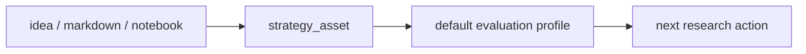
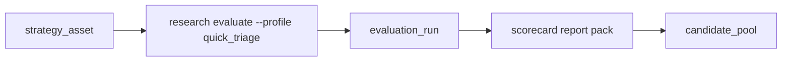
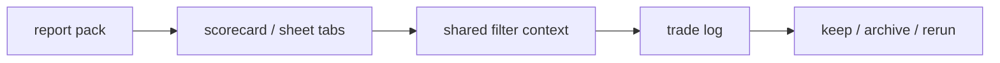
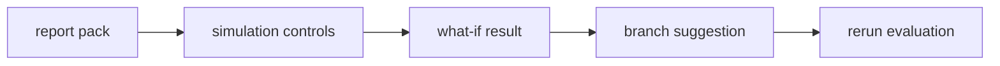
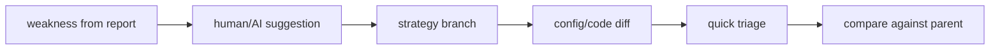
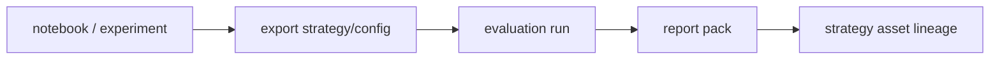
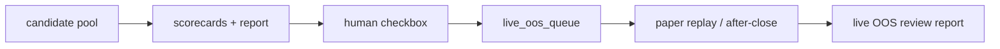

# 產品定位重構研究報告 — 從「審判庭」轉為「策略研究資產管理系統」

> **日期：** 2026-07-03  
> **觸發原因：** 現行系統體感上把策略研究流程規範得過死：策略是否保留、是否必跑參數網格、GO gate 是否依附參數掃描、truth gate 指標與門檻是否硬編，均與實務上的探索式策略研究不完全匹配。  
> **結論：** 需要產品定位大重構，但不需要推倒技術底座。現有 `StrategyRunner`、研究工作流、驗證函式、run ledger、paper replay、React 研究區都可保留；真正要重構的是**產品心智模型、工作流編排權、gate policy、候選池與報表層**。
> **執行規格：** 重構落地時請以 [前後端重構 Goal Spec](./rebuild_goal_spec_ai_requirements_2026-07-03.md) 作為 AI 代理任務拆解、邊界與驗收標準真相源。

---

## 1. Executive Summary

目前產品定位是：

> 一台判斷策略有沒有真 edge 的機器：策略是消耗品，審判庭是資產，連續 NO-GO 是正常運作。

這個定位有價值，因為它把 survivorship、PBO、DSR、WFA、滑價穩健等防自欺機制提升到核心。但它也造成四個產品層錯配：

1. **研究資產被誤當成可丟棄物。**  
   好策略、壞策略、未成熟策略、負向策略、教訓型策略都應該被保留，因為它們是研究資產與日後對照樣本，不只是部署候選。

2. **參數掃描被誤當成每個策略的標準前置流程。**  
   有些策略是 pre-registered fixed hypothesis，有些需要 DOE，有些只需要單點 sanity check，有些適合 random/Bayesian search，有些完全不應該優化參數。現行文件雖然在 `GOGatesConfig.config_grid=None` 支援不跑 PBO，但產品敘事仍把 DOE → GO gate → truth gate 描成主幹。

3. **gate policy 太像硬編規則，缺少使用者可配置性。**  
   `PBO<30% / DSR>=0.95 / WFA OOS breadth>=60% / 滑價穩健 / survivorship-clean` 是合理的預設 profile，但不應是唯一可用的初步策略評估標準。不同策略類型、研究階段、資金用途需要不同 metric set 與 threshold。

4. **Live OOS / paper replay 應是人工選擇的資源昂貴步驟，不該被自動管線默認消耗。**  
   合理互動應是：先粗掃與報表，看候選池；使用者勾選值得收 live OOS 的策略，再跑逐日重放或 paper watch。粗掃沒過或沒有研究價值者，不進昂貴驗證。

建議新定位：

> **個人量化策略研究資產管理系統**：保留每個策略假設與驗證證據，用可配置評估 profile 產生粗掃報表，讓使用者從候選池中半自動選擇哪些策略進入 Live OOS / paper / deployment。

簡化成一句話：

> **不是一台只會判死刑的審判庭，而是一個從假設、粗掃、報表、候選池、Live OOS 到部署的半自動研究工作台。**

---

## 2. 研究依據與現況觀察

本報告檢視了以下現有文件與實作：

- `dev_docs/system_context_and_dataflow.md`
- `dev_docs/02_project_brief_and_prd.md`
- `dev_docs/20_dashboard_specification.md`
- `dev_docs/adrs/ADR-025-two-stage-validation-gate-and-paper-promotion.md`
- `dev_docs/adrs/ADR-033-paper-watch-tier.md`
- `backtest_platform/src/backtest_platform/research/workflows/config.py`
- `backtest_platform/src/backtest_platform/research/workflows/doe.py`
- `backtest_platform/src/backtest_platform/research/workflows/go_gates.py`
- `backtest_platform/src/backtest_platform/research/workflows/truth_gate.py`
- `backtest_platform/src/backtest_platform/validation/two_stage_gate.py`
- `frontend/src/features/research/*`
- `frontend/src/features/monitor/pages/WatchPage.tsx`
- `dev_docs/web_design/finlab_studio_feature_teardown_2026-07-03.md`

使用者原提供的 Claude artifact 連結：

- `https://claude.ai/code/artifact/3ecd9ea3-dad2-46f8-9c61-73b243c0cbfa`

該連結無法從本環境直接讀取；使用者已補成 Markdown teardown，本輪以該 Markdown 作為 FinLab Studio 對標依據。Teardown 顯示 FinLab Studio 的核心不是單一 tear sheet，而是「五維計分卡 + 16 張分析 sheet + 交易明細連動 + 停損/停利互動模擬 + AI 優化 + 雲端 Notebook」的完整策略工作台。

---

## 3. 當前系統不是技術上綁死，而是產品語義綁死

### 3.1 技術層已具備可拆分條件

現有 code 已經把工作流拆成獨立模組：

| 模組 | 現況能力 | 評估 |
| :--- | :--- | :--- |
| `workflows/doe.py` | 參數網格掃描，輸出每組 metrics | 可保留，但應變成 optional workflow |
| `workflows/go_gates.py` | WFA + optional PBO；`config_grid=None` 時可跳過 PBO | 技術上已支持不跑參數 landscape，但產品文件未充分表達 |
| `workflows/truth_gate.py` | WFA breadth、DSR、OOS holdout、滑價、two-stage gate | 可改造成由 policy 驅動的 evaluator |
| `validation/two_stage_gate.py` | 純函式 hard-fail + sizing | 可保留為內建 `strict_deployability` profile |
| `watch_registry.py` / monitor watch | 已有候選進觀察艙的概念 | 可擴張成通用 Candidate Pool / Live OOS Queue |

換句話說，不需要重寫策略引擎；需要加一層**策略評估 profile 與候選池 orchestration**。

### 3.2 產品文件把「部署級嚴格驗證」前移到了「初步策略評估」

`system_context_and_dataflow.md` 把策略生命週期描述成：

1. 宣告策略
2. 建宇宙
3. 參數掃描
4. GO gate
5. truth gate
6. 逐日重放
7. validate
8. promote
9. monitor/live

這適合「已進入嚴格部署評估」的策略，不適合作為「所有策略發想」的一生。

實務上應該拆成兩條軌：

| 軌道 | 目的 | 應用對象 |
| :--- | :--- | :--- |
| **Research Triage** | 快速了解策略有沒有研究價值，保留證據與報表 | 所有策略：好、壞、未成熟、負向 |
| **Deployment Validation** | 嚴格防自欺，決定是否配置資本或收 live OOS | 人工挑選出的候選策略 |

現行系統把 Deployment Validation 的嚴格性套到 Research Triage 上，造成「還沒看懂策略，就被硬 gate 判掉」的體感。

---

## 4. 產品重定位

### 4.1 舊定位

> edge 驗證工廠 + 晉升管線。策略是消耗品，審判庭是資產。

優點：

- 嚴格防自欺。
- 對部署資本有保護作用。
- 能把 backtest overfitting 變成一等公民。

缺點：

- 策略研究過程過早被二元化。
- 壞策略與負向結果沒有被產品化保存。
- 使用者決策權不清楚，像是被管線拖著走。
- 初步報表與候選池不夠突出。

### 4.2 新定位

> **個人量化策略研究資產管理系統**：以策略假設為核心，保留每次粗掃、驗證與決策證據；使用者可用不同評估 profile 產出報表，從候選池中半自動選擇 Live OOS / paper / deployment。

### 4.3 新核心原則

| # | 原則 | 說明 |
| :-: | :--- | :--- |
| 01 | **策略是研究資產，不是消耗品** | 好策略、壞策略、負向策略、踩雷策略都保留，因為它們降低未來重複犯錯成本。 |
| 02 | **評估是 profile，不是硬編法條** | PBO/DSR/WFA 是內建 profile，不是所有策略的唯一評估宇宙。 |
| 03 | **參數掃描是選項，不是義務** | DOE 只在策略取得方式需要 landscape 時啟用；pre-registered 策略可以跳過 DOE/PBO。 |
| 04 | **粗掃先產報表，再人工選候選** | 粗掃目的不是部署，而是把策略放進研究地圖，產生可比較報表。 |
| 05 | **昂貴驗證需人工勾選** | Live OOS / paper replay / full WFA 是 scarce resource，應由候選池勾選觸發。 |
| 06 | **部署級 gate 只管資本，不管研究是否繼續** | 嚴格 gate 應保護資本與 live queue，不應刪除研究資產。 |

---

## 5. 目標系統資料流

### 5.1 新策略生命週期

```mermaid
graph LR
  H["Strategy Hypothesis<br/>策略假設 / 宣告"]
  R["Research Asset<br/>策略資產卡"]
  P["Evaluation Profile<br/>評估 profile"]
  S["Triage Run<br/>粗掃 / 單點 / DOE / WFA-lite"]
  REP["Report Pack<br/>報表包"]
  POOL["Candidate Pool<br/>候選池"]
  PICK["Human Selection<br/>勾選進 Live OOS"]
  LIVE["Live OOS / Paper Replay<br/>昂貴驗證"]
  DEP["Deployment Gate<br/>部署級嚴格 gate"]
  ARCH["Archive / Lessons<br/>封存與教訓"]

  H --> R
  R --> P
  P --> S
  S --> REP
  REP --> POOL
  POOL --> PICK
  PICK --> LIVE
  LIVE --> DEP
  DEP --> ARCH
  REP --> ARCH
```



### 5.2 新研究流程

1. **建立策略資產卡**
   - strategy id
   - hypothesis
   - intended mechanism
   - parameterization style: `fixed` / `grid` / `random` / `bayesian` / `none`
   - expected holding period
   - universe assumption
   - cost model
   - owner notes

2. **選評估 profile**
   - `quick_triage`
   - `fixed_hypothesis_oos`
   - `grid_search_selection`
   - `robustness_sanity`
   - `deployment_strict`
   - user-defined profile

3. **跑粗掃並產報表**
   - 即使 fail 也保留。
   - 即使 negative edge 也保留。
   - 報表是第一級產物，不是 gate 的副產品。

4. **策略進候選池**
   - 自動標籤：`promising` / `weak` / `negative` / `overfit_risk` / `needs_data` / `interesting_but_not_deployable`
   - 人工覆核：keep / archive / watch / rerun / promote to live-oos

5. **使用者勾選昂貴驗證**
   - 勾選後才跑 paper replay / live OOS / full strict gate。
   - 每次勾選都記錄理由與資源成本。

---

## 6. Evaluation Profile 設計

### 6.1 為什麼需要 profile

目前 `truth_gate` 的判斷條件是合理的部署級預設，但不應該硬套所有策略。

例子：

| 策略型態 | 是否需要 DOE | PBO 是否適用 | 初步評估重點 |
| :--- | :---: | :---: | :--- |
| pre-registered fixed hypothesis | 否 | 通常否 | OOS breadth、holdout、成本、穩定性 |
| 從參數網格挑最佳 | 是 | 是 | landscape PBO、deflated metrics、參數穩定區 |
| 純探索型 signal | 可選 | 可選 | signal monotonicity、turnover、IC decay、分層報酬 |
| 市場中性 / sleeve | 不一定 | 視選擇方式 | 相關性、組合邊際貢獻、capacity |
| 負向策略 / 反向教材 | 否 | 否 | 為何失敗、是否可反轉、是否作為避雷規則 |

### 6.2 建議 profile schema

```python
class EvaluationProfile(BaseModel):
    name: str
    stage: Literal["triage", "candidate", "deployment"]
    run_mode: Literal["single_config", "grid", "random", "bayesian", "none"]
    metrics: list[MetricSpec]
    gates: list[GateRule] = []
    report_pack: str
    live_oos_policy: LiveOOSPolicy
    persist_failed: bool = True
```

```python
class MetricSpec(BaseModel):
    id: str
    enabled: bool = True
    params: dict[str, Any] = {}
```

```python
class GateRule(BaseModel):
    metric: str
    op: Literal[">", ">=", "<", "<=", "between", "exists", "is_true"]
    threshold: Any
    severity: Literal["info", "warn", "block_live_oos", "block_deploy"]
    label: str
```

重點：`severity` 應取代單一 binary verdict。

| severity | 含義 |
| :--- | :--- |
| `info` | 只展示，不影響決策 |
| `warn` | 報表提醒，仍可進候選池 |
| `block_live_oos` | 不建議消耗 live OOS 資源，但可人工 override |
| `block_deploy` | 不得配置資本 |

### 6.3 內建 profile 建議

#### `quick_triage`

目的：初步看策略是否值得研究。

| 指標 | 預設 |
| :--- | :--- |
| CAGR / total return | enabled |
| Sharpe / Sortino | enabled |
| Max drawdown | enabled |
| turnover / trades | enabled |
| win rate / payoff ratio | enabled |
| exposure / avg holding days | enabled |
| cost impact | enabled |
| survivorship flag | warn |
| report pack | `triage_basic` |

不跑：

- full PBO
- DSR
- full WFA
- paper replay

#### `fixed_hypothesis_oos`

目的：評估事前鎖死假設。

| 指標 | 預設 |
| :--- | :--- |
| IS / OOS split | enabled |
| WFA-lite breadth | enabled |
| OOS holdout Sharpe | enabled |
| cost stress | enabled |
| DSR | optional |
| PBO | disabled |

#### `grid_search_selection`

目的：有參數選擇與多重試驗時使用。

| 指標 | 預設 |
| :--- | :--- |
| full grid CSV | required |
| heatmap / stability plateau | required |
| PBO | enabled |
| DSR with n_trials | enabled |
| top-N comparison | enabled |
| cherry-pick audit | enabled |

#### `deployment_strict`

目的：保護資本與正式部署。

保留現有嚴格規則作為預設，但門檻資料化：

```yaml
profile: deployment_strict
stage: deployment
rules:
  - metric: survivorship_clean
    op: is_true
    threshold: true
    severity: block_deploy
  - metric: pbo
    op: "<"
    threshold: 0.30
    severity: block_deploy
    applies_when: selected_from_grid
  - metric: dsr
    op: ">="
    threshold: 0.95
    severity: block_deploy
    applies_when: pre_registered
  - metric: wfa_oos_positive_frac
    op: ">="
    threshold: 0.60
    severity: block_deploy
  - metric: slippage_sharpe
    op: ">"
    threshold: 0
    severity: block_deploy
```

---

## 7. 報表層：粗掃後就該吐報表

### 7.1 報表應是主要產物

目前文件把報表列為 run 產物之一，但產品路徑中 gate 比報表更突出。新定位應反過來：

> 每次研究 run 的第一產物是 report pack；gate verdict 只是 report pack 中的一個 section。

### 7.2 FinLab Studio 對標後的報表原則

FinLab Studio teardown 顯示，一個能被研究者反覆使用的策略工作台，報表至少有三個層次：

1. **頭條指標層**：CAGR、MDD、Sharpe、勝率等快速判讀指標。
2. **多維計分層**：Profitability / Risk / Risk-Adjusted / Win Rate / Liquidity 五張 scorecard，各自有 KPI、門檻與分數。
3. **可互動證據層**：equity/drawdown、年度比較、滾動 Sharpe、波動、相關性、報酬分布、MAE/MFE、流動性容量、交易明細連動。

因此本產品的 Report Pack 不應只是一份 quantstats 類型靜態報告，也不應只是一張 gate verdict。它應該是「可追問的研究證據包」：

| FinLab 元件 | 本產品應吸收的設計 | 不照搬的部分 |
| :--- | :--- | :--- |
| 五維計分卡 | 內建 `scorecard_pack`，用 profile 定義 score categories 與 thresholds | 不使用單一 0-100 分數替代部署 gate |
| 16 張內層 sheet | Report Pack 以 tab/section 組織，每個 section 可單獨 lazy load | 不要求所有 profile 都產滿 16 張 |
| 交易明細連動 | 報表圖表與 trade log 共用 filter context | 不把交易覆盤塞成獨立孤島 |
| 停損/停利模擬 | 加入 `interactive_simulation` workflow，讓研究者試成本、停損、停利、容量變化 | 模擬結果只作研究，不自動覆寫策略參數 |
| AI 優化 | 加入 `branch_experiment` workflow：AI/人提出改動，產生 branch、跑 quick triage、比較 diff | 不讓 AI 直接改部署中策略 |
| Notebook | 加入 `notebook_provenance`：策略程式、研究筆記、版本、run lineage 串回策略資產卡 | 不把 Notebook 當唯一入口，仍保留 CLI/API |

這代表報表產品的 P0 不是「更多 KPI」，而是**把 KPI 組成可操作的 research workflow**。

### 7.3 Triage Report Pack

每個策略初步驗證後，至少產出：

1. **摘要卡**
   - verdict label: `Promising / Weak / Negative / Inconclusive / Data Issue`
   - recommended next action
   - confidence level
   - resource cost

2. **績效摘要**
   - CAGR / total return
   - Sharpe / Sortino
   - max drawdown
   - Calmar
   - volatility
   - hit rate
   - payoff ratio

3. **Equity / drawdown**
   - equity curve
   - drawdown curve
   - benchmark overlay
   - IS/OOS markers if applicable

4. **交易品質**
   - number of trades
   - avg holding period
   - turnover
   - cost paid
   - capacity proxy

5. **穩健性**
   - subperiod performance
   - bull/bear/regime split
   - symbol contribution
   - top/bottom contributors

6. **成本與滑價敏感度**
   - baseline vs stress
   - break-even cost
   - performance decay

7. **參數面，如果有跑 DOE**
   - all-grid CSV
   - heatmap
   - top-N table
   - plateau detection
   - overfit risk

8. **證據與缺口**
   - survivorship status
   - missing data
   - lookahead risk
   - data quality notes
   - not-yet-run checks

9. **決策紀錄**
   - user decision: keep / archive / rerun / live-oos
   - reason
   - next run profile

### 7.4 Scorecard Pack

參考 FinLab 的五維計分卡，新增 `scorecard_pack` 作為 `quick_triage` 的預設視圖。每張卡由 profile 定義 metrics、threshold 與權重，輸出時保留「達標/未達標」而非只給總分。

| Scorecard | 指標 | 初始來源 |
| :--- | :--- | :--- |
| Profitability | CAGR、Alpha、Beta、平均持有檔數、最多持有檔數 | `metrics.py` + benchmark returns |
| Risk | MDD、平均回檔、回檔修復天數、VaR、CVaR | equity series |
| Risk-Adjusted | Sharpe、Sortino、Calmar、Profit Factor、Tail Ratio | returns + trades |
| Win Rate | trade win rate、rolling 12M win rate、expectancy、MAE、MFE | trades |
| Liquidity / Capacity | turnover、成交量分桶、安全交易佔比、成本敏感度、容量 proxy | bars + trades |

Scorecard 的用途：

- 讓研究者快速看懂「策略弱在哪一類」。
- 讓壞策略也留下可比較的失敗形狀。
- 讓 Candidate Pool 能以多維分數排序，而不是只用 Sharpe 排序。

Scorecard 的限制：

- 不直接決定 deployment。
- 不取代 DSR/PBO/WFA。
- 不自動做參數優化。

### 7.5 Interactive Simulation Pack

FinLab teardown 裡最值得吸收的是「模擬停損 / 模擬停利」：它不是部署 gate，而是研究者用來理解 trade distribution 與風險報酬形狀的互動工具。

建議新增 `interactive_simulation` 報表 section：

| 模擬 | 輸入 | 輸出 | 用途 |
| :--- | :--- | :--- | :--- |
| stop-loss sweep | 停損比例 0-30% | 額外盈虧、勝率、MDD、MAE scatter | 看虧損尾巴是否可控 |
| take-profit sweep | 停利比例 0-60% | 額外盈虧、勝率、MFE scatter | 看獲利尾巴是否被過早截斷 |
| cost sweep | slippage/fee bps | Sharpe decay、break-even cost | 看策略對摩擦是否脆弱 |
| capacity sweep | 資金規模/成交量門檻 | 安全交易佔比、平均報酬衰減 | 看可承載資金 |
| rebalance cadence sweep | 日/週/月/季 | turnover、cost、Sharpe | 看策略是否靠過度交易 |

這些模擬不應自動改策略 config。它們只產生新的 branch suggestion，由使用者決定是否建立下一個 evaluation run。

### 7.6 Report Pack 檔案建議

每個 run 建議落地：

```text
reports/research_runs/<run_id>/
  manifest.json
  summary.json
  scorecards.json
  metrics.json
  gate_results.json
  simulations.json
  decision.json
  report.md
  equity.parquet
  trades.parquet
  figures/
    equity.png
    drawdown.png
    rolling_sharpe.png
    mae_mfe_scatter.png
    cost_sensitivity.png
    capacity_sensitivity.png
    parameter_heatmap.png
```

其中 `report.md` 是人讀入口，JSON/parquet 是 GUI 與後續比較入口。

---

## 8. Candidate Pool 設計

### 8.1 候選池目的

候選池不是 paper watch 的窄版，而是所有「值得使用者再次看」的策略集合。

候選池應支援：

- 保存所有粗掃結果。
- 標記策略狀態。
- 排序與篩選。
- 人工勾選昂貴驗證。
- 記錄為何進 live OOS、為何不進。

### 8.2 建議狀態

| 狀態 | 含義 |
| :--- | :--- |
| `DRAFT` | 策略假設剛建立，尚未跑 |
| `TRIAGED` | 已跑粗掃並有報表 |
| `PROMISING` | 粗掃值得後續研究 |
| `WEAK_BUT_KEEP` | 不部署，但保留作研究資產 |
| `NEGATIVE_CONTROL` | 負向或失敗教材 |
| `NEEDS_DATA` | 資料品質不足 |
| `LIVE_OOS_SELECTED` | 使用者勾選進 Live OOS |
| `LIVE_OOS_RUNNING` | 正在收 live OOS |
| `LIVE_OOS_DONE` | live OOS 完成，待重評 |
| `DEPLOY_BLOCKED` | 不可配置資本 |
| `DEPLOYABLE` | 通過部署級 gate |
| `ARCHIVED` | 封存，不再主動顯示 |

### 8.3 Candidate Pool UI

Research zone 應新增：

| 頁面 | 目的 |
| :--- | :--- |
| `/research/candidates` | 候選池表格、篩選、排序、批次勾選 |
| `/research/candidates/:id` | 策略資產卡、歷史 runs、報表、決策紀錄 |
| `/research/reports/:run_id` | 單次 report pack |
| `/research/profiles` | 評估 profile 管理 |

Candidate table 欄位：

- strategy
- hypothesis short name
- latest profile
- latest label
- Sharpe / MDD / trades / turnover
- survivorship flag
- overfit risk
- report link
- next action
- checkbox for Live OOS

### 8.4 Live OOS 勾選規則

預設邏輯：

- 系統給 recommendation：`eligible / not_recommended / blocked`
- 使用者可勾選 `eligible`
- `not_recommended` 可 override，但必須填 reason
- `blocked` 只能由 `admin_override` 或 profile 調整解除

這符合單人系統，不需要複雜 RBAC，但要留 audit trail。

---

## 9. FinLab Studio 對標後的 Workflows

使用者要求「用 workflows 做深度研究」後，產品不應只定義 pages / models，而要定義研究者每天實際會跑的 workflow。以下 workflows 是從 FinLab teardown 萃取後，套回本 repo 現有 `research/workflows/*` 與 React Research zone 的重構結果。

### 9.1 Workflow A — Strategy Intake

目的：把策略發想變成可追蹤研究資產，不論好壞都保留。



輸入：

- 策略說明。
- universe。
- fixed config 或 parameter space。
- 成本假設。
- 是否 pre-registered。
- 預期週期與機制。

輸出：

- `strategy_asset_id`
- default profile
- 初始狀態 `DRAFT`
- 可執行 action：`quick_triage`、`grid_search_selection`、`fixed_hypothesis_oos`

現有可復用：

- `StrategyRunner` registry
- `research_config.py`
- `StrategyLibraryPage`

缺口：

- 策略資產卡目前不存在；`StrategyLibraryPage` 只像 registry/run projection，不像研究資產管理。

### 9.2 Workflow B — One-Click Analysis

目的：對任一策略一鍵產出類 FinLab Analysis 的 report pack。



P0 行為：

- 跑 single-config 或 profile 指定的輕量流程。
- 產生 headline metrics。
- 產生五維 scorecard。
- 產生 equity/drawdown/trade log。
- 自動入 candidate pool。

對照 FinLab：

- Headline banner。
- 五張 scorecard。
- 分頁式內層 sheet。
- 交易明細表。

現有可復用：

- `runs_store`
- `run_series_store`
- `RunReportPage`
- `TradeReviewPage`

缺口：

- `RunReportPage` 目前只有 6 個 KPI 與 pending tear sheet。
- 缺 scorecard schema。
- 缺 report pack manifest。

### 9.3 Workflow C — Evidence Drilldown

目的：從粗掃結果往下追問，找出策略強弱與失敗形狀。



必要互動：

- 點年度/月度報酬，trade log 自動篩選。
- 點 drawdown 區段，顯示該期間交易與持股。
- 點 scorecard fail metric，跳到對應 sheet。
- trade log 支援 MAE/MFE、進出場、持倉比例、成本、原因。

對照 FinLab：

- 歷史績效與交易明細連動。
- 年度比較、回檔排名、滾動 Sharpe、波動、相關性。
- 報酬分布、MAE/MFE scatter。

現有可復用：

- `TradeReviewPage`
- candles / attribution API
- run series API

缺口：

- 缺跨 chart/table 的 shared filter context。
- 缺 scorecard-to-sheet navigation。
- 缺 rolling metric series。

### 9.4 Workflow D — Interactive Simulation

目的：研究者不用重寫策略，就能探索成本、停損、停利、容量對結果的影響。



P0 模擬：

- stop-loss sweep。
- take-profit sweep。
- cost/slippage sweep。
- capacity/liquidity sweep。

重要產品規則：

- 模擬只產生 `branch_suggestion`。
- 不直接改原策略。
- 若使用者接受，建立新 evaluation branch，再跑 quick triage。

對照 FinLab：

- 模擬停損 / 模擬停利 slider。
- 流動性容量圖。

現有可復用：

- trades parquet。
- metrics functions。
- strategy config `with_extra_slippage` seam。

缺口：

- 缺 what-if evaluator。
- 缺前端 slider 控制與快取。

### 9.5 Workflow E — Branch Experiment / AI Optimize

目的：把「改策略」變成可比較的分支，而不是覆蓋既有策略。



P0 不一定需要真正 AI；可以先做 branch experiment：

- 從 report fail item 產生 suggestion。
- 建立 branch id。
- 記錄 config/code diff。
- 跑 evaluation。
- 與 parent run 比較。

對照 FinLab：

- AI Optimize：提出改進方向、一鍵回測、程式碼差異比對、分支探索。

現有可復用：

- `ComparePage`
- `research sweep`
- git SHA / bundle hash lineage

缺口：

- 缺策略 branch model。
- 缺 parent-child evaluation lineage。
- 缺 suggestion / diff UI。

### 9.6 Workflow F — Notebook Provenance

目的：Notebook 是研究工具，但最終證據必須回到 strategy asset / report / candidate pool。



對照 FinLab：

- 雲端 Python Notebook。
- 檔案管理、版本歷史、即時執行。

本產品不需要先做雲端 Notebook，但需要 provenance contract：

- notebook path。
- exported config hash。
- git SHA。
- generated strategy branch。
- linked evaluation run。

現有可復用：

- `notebook_export.py`
- run lineage `git_sha`

缺口：

- 缺 notebook-to-run 顯式連結。
- 缺前端顯示研究筆記 lineage。

### 9.7 Workflow G — Candidate Selection to Live OOS

目的：把昂貴 live OOS 從自動管線改成使用者勾選後才消耗的 queue。



P0 行為：

- Candidate Pool 顯示多維 scorecards。
- 系統給 `eligible / not_recommended / blocked`。
- 使用者勾選 eligible。
- 勾選才進 `live_oos_queue`。
- after-close / paper replay 只消費 queue。

對照 FinLab：

- FinLab 的分享頁是分析入口；登入後才進持股、AI、Notebook。
- 本產品應是分析入口先行，live OOS / paper 為使用者後續選擇。

現有可復用：

- `watch_registry.py`
- `paper_replay.py`
- `after_close.py`
- `WatchPage`

缺口：

- `watch_registry` 太窄，只處理 DSR band Paper-Watch。
- 缺通用 candidate/live queue。

---

## 10. 工作流重構建議

### 10.1 現行 CLI 保留，但語義重命名

現行：

```bash
research doe
research go-gates
research truth-gate
research paper-replay
```

建議新增高階入口：

```bash
research evaluate --strategy inst_flow --profile quick_triage
research evaluate --strategy inst_flow --profile fixed_hypothesis_oos
research evaluate --strategy momentum --profile grid_search_selection
research candidates list
research candidates select-live-oos <candidate_id>
research reports open <run_id>
```

舊指令保留為 low-level workflow，避免破壞既有測試與習慣。

### 10.2 新 workflow orchestrator

新增：

```text
backtest_platform/research/evaluation/
  profiles.py
  evaluator.py
  report_pack.py
  candidate_store.py
  decisions.py
```

職責：

| 模組 | 職責 |
| :--- | :--- |
| `profiles.py` | 讀內建與策略自訂 profile |
| `evaluator.py` | 依 profile 決定跑 single run / DOE / WFA / gate |
| `report_pack.py` | 統一產出 markdown/json/parquet 報表 |
| `candidate_store.py` | 候選池 persistence |
| `decisions.py` | keep/archive/select-live-oos 的 audit log |

### 10.3 `research_config.py` 變更

現行策略宣告：

```python
UNIVERSE = ...
DOE = ...
GO_GATES = ...
TRUTH_GATE = ...
PAPER_REPLAY = ...
```

建議保留舊欄位，但新增：

```python
EVALUATION_PROFILES = {
    "quick_triage": QuickTriageProfile(...),
    "fixed_oos": FixedHypothesisProfile(...),
    "strict": DeploymentStrictProfile(...),
}

DEFAULT_PROFILE = "quick_triage"
```

每個策略可宣告：

- 預設是否跑 DOE。
- 是否 pre-registered。
- 可用 profile。
- report pack 類型。
- live OOS eligibility rule。

---

## 11. Gate Policy 重構

### 11.1 保留現有 strict gate，但降級為 profile

`two_stage_gate.py` 不應刪除。它是部署級嚴格 profile 的核心。

調整方向：

| 現在 | 建議 |
| :--- | :--- |
| module-level constants 是實際唯一規則 | constants 成為 `deployment_strict` default profile |
| verdict 直接決定策略命運 | verdict 只決定資本與 live queue，不刪研究資產 |
| hard fail 文案偏「砍掉」 | fail reason 進報表，作為後續研究證據 |
| `PAPER_WATCH` 只處理 DSR band | 擴張為 Candidate Pool 的一種 action |

### 11.2 Gate evaluator 應回傳多層結果

建議統一結果：

```python
class EvaluationResult(BaseModel):
    run_id: str
    strategy: str
    profile: str
    metrics: dict[str, Any]
    checks: list[CheckResult]
    labels: list[str]
    recommendation: Recommendation
    report_uri: str
```

```python
class CheckResult(BaseModel):
    metric: str
    value: Any
    threshold: Any | None
    status: Literal["pass", "warn", "fail", "missing", "not_applicable"]
    severity: Literal["info", "warn", "block_live_oos", "block_deploy"]
    reason: str
```

```python
class Recommendation(BaseModel):
    action: Literal[
        "archive",
        "keep_research_asset",
        "rerun_with_profile",
        "eligible_for_live_oos",
        "deploy_blocked",
        "deployable",
    ]
    confidence: Literal["low", "medium", "high"]
    reasons: list[str]
```

---

## 12. API 與資料模型變更

### 12.1 新資料實體

| Entity | 用途 |
| :--- | :--- |
| `strategy_assets` | 策略假設與研究資產卡 |
| `evaluation_profiles` | profile 定義與版本 |
| `evaluation_runs` | 一次 evaluate 的執行紀錄 |
| `report_packs` | 報表 manifest 與檔案位置 |
| `candidate_pool` | 候選狀態、最新評估、人工標籤 |
| `candidate_decisions` | keep/archive/select-live-oos/override audit |
| `live_oos_queue` | 被勾選的昂貴驗證佇列 |

可先 JSONL 實作，成熟後再鏡射 TimescaleDB。

### 12.2 新 API

| Endpoint | 用途 |
| :--- | :--- |
| `GET /research/profiles` | 列內建與策略可用 profile |
| `POST /research/evaluate` | 以 profile 跑評估 |
| `GET /research/evaluations/{run_id}` | 查評估結果 |
| `GET /research/reports/{run_id}` | 查 report pack |
| `GET /research/candidates` | 候選池列表 |
| `POST /research/candidates/{id}/decision` | 人工決策 |
| `POST /research/candidates/{id}/select-live-oos` | 勾選 live OOS |
| `GET /research/live-oos/queue` | live OOS queue |

### 12.3 向後相容

舊 endpoint / CLI 不移除：

- `research doe`
- `research go-gates`
- `research truth-gate`
- `research paper-replay`
- `/research/workflows/{workflow}`

高階新功能只包裝與組合它們。

---

## 13. Frontend 重構

### 13.1 Research zone 新 IA

建議 Research zone 從「工作流頁面」轉為「研究資產頁面」：

| 頁面 | 優先級 | 說明 |
| :--- | :-: | :--- |
| Strategy Assets | P0 | 策略假設列表，不只是 registry |
| Candidate Pool | P0 | 粗掃後的半自動決策中心 |
| Report Viewer | P0 | 初步策略評估報表 |
| Evaluation Profiles | P1 | 管理 profile 與 threshold |
| Evaluate New Run | P1 | 選 strategy + profile + overrides |
| DOE/Sweep | P2 | 只在 profile 需要時出現 |
| Validate/Promote | P2 | Deployment validation 子流程 |

### 13.2 Candidate Pool 是新的主畫面

使用者日常應該先看到：

- 哪些策略最近跑過粗掃。
- 哪些值得看。
- 哪些被封存但保留。
- 哪些缺資料。
- 哪些可勾選 Live OOS。
- 哪些 Live OOS 正在跑。

### 13.3 報表 Viewer

Report Viewer 需支援：

- summary section
- headline metrics banner
- five-dimension scorecards
- sheet tabs under each scorecard
- gate checks table
- trade log linked filters
- MAE/MFE and liquidity sections
- simulation controls when available
- parameter heatmap if exists
- decision timeline
- next action buttons

Action buttons：

- `Keep`
- `Archive`
- `Rerun`
- `Select Live OOS`
- `Open Strict Gate`

---

## 14. 實作路線圖

### Phase 0 — 產品文件改定位（1-2 天）

目標：先避免團隊繼續依舊心智模型開發。

交付：

- 新 ADR：`ADR-039-strategy-research-asset-and-configurable-evaluation.md`
- 更新 PRD：把定位改為研究資產管理系統。
- 更新 `system_context_and_dataflow.md`：把 9 步晉升管線改成 Research Triage + Deployment Validation 雙軌。
- 更新 Dashboard spec：新增 Candidate Pool 與 Report Viewer。

### Phase 1 — Evaluation Profile 最小可行版（3-5 天）

目標：不改現有工作流，先加高階 evaluate 包裝。

交付：

- `EvaluationProfile` schema。
- 內建 `quick_triage`、`fixed_hypothesis_oos`、`deployment_strict`。
- `research evaluate --strategy --profile`。
- evaluate 結果持久化 JSONL。
- 每次 evaluate 產 `report.md` + `summary.json`。

### Phase 2 — Candidate Pool（3-5 天）

目標：讓粗掃結果可保留、比較、人工決策。

交付：

- `candidate_store.py`。
- `candidate_decisions.jsonl`。
- CLI：
  - `research candidates list`
  - `research candidates decide`
  - `research candidates select-live-oos`
- API：
  - `GET /research/candidates`
  - `POST /research/candidates/{id}/decision`

### Phase 3 — Report Viewer + Candidate UI（5-8 天）

目標：把半自動人機互動做出來。

交付：

- `/research/candidates`
- `/research/reports/:run_id`
- candidate checkbox select live OOS
- headline metrics + five-dimension scorecards
- report sheet tabs render
- trade log linked filter context
- four states 完整

### Phase 4 — Interactive Simulation（5-8 天）

目標：吸收 FinLab 的停損/停利互動模擬，但讓結果只生成 branch suggestion，不自動改策略。

交付：

- stop-loss / take-profit sweep evaluator。
- cost / slippage sweep。
- capacity / liquidity sweep。
- MAE/MFE scatter + simulation result JSON。
- 前端 slider controls。
- `branch_suggestion` output。

### Phase 5 — Branch Experiment / AI Optimize Lite（5-8 天）

目標：先不接大型 AI agent，也要把「策略改動」變成可比較分支。

交付：

- strategy branch model。
- parent-child evaluation lineage。
- config/code diff manifest。
- branch run compare。
- report fail item → suggestion → rerun 的 workflow。

### Phase 6 — Gate Policy 資料化（5-8 天）

目標：把硬編 threshold 改成 profile data。

交付：

- `GateRule` evaluator。
- 現有 `two_stage_gate` 包成 `deployment_strict` profile。
- severity 分級。
- UI threshold editor 初版，或先 YAML/Python config。

### Phase 7 — Live OOS Queue 整合（3-5 天）

目標：昂貴驗證只由候選池勾選觸發。

交付：

- `live_oos_queue`。
- `paper_replay` / `after-close` 讀 queue。
- 未勾選不跑。
- override reason audit。

### Phase 8 — Notebook Provenance（3-5 天）

目標：讓 notebook / markdown 研究輸出能被正式接回 strategy asset 與 evaluation run。

交付：

- notebook path / export hash / git SHA lineage。
- notebook export → strategy branch。
- report 顯示 research notes lineage。
- `notebook_export.py` 對齊新 evaluation result。

### Phase 9 — 報表增強與 FinLab teardown 對齊（持續）

目標：把使用者指定的報表樣式完整搬進產品。

交付：

- 以 `dev_docs/web_design/finlab_studio_feature_teardown_2026-07-03.md` 作 reference。
- 補充 report pack templates。
- 加 chart export。
- 加 strategy comparison report。

---

## 15. 不建議的做法

1. **不建議直接刪掉 truth gate。**  
   它仍是部署資本前的重要保護。問題不是太嚴，而是放在錯誤階段且不可配置。

2. **不建議把 PBO/DSR 門檻直接放寬。**  
   這會重回 threshold shopping。應改成 profile + severity，而不是調低部署門檻。

3. **不建議每個策略都自動跑 full paper replay。**  
   這會浪費資源，也讓 live OOS queue 失去決策意義。

4. **不建議把壞策略刪除。**  
   壞策略是研究資產，應 archive 與標註失敗原因。

5. **不建議先做大規模 DB migration。**  
   單人系統可以先 JSONL + manifest，等 UI 與流程穩定再鏡射 SQL。

---

## 16. 決策建議

建議採納以下產品重構決策：

1. **正式改定位：**
   - 從「edge 審判庭 + 晉升管線」
   - 改為「策略研究資產管理系統 + 可配置驗證管線」

2. **新增 Research Triage 階段：**
   - 所有策略都可跑粗掃。
   - fail 也保留。
   - 粗掃後立即產報表。

3. **新增 Evaluation Profile：**
   - DOE/PBO/DSR/WFA 都由 profile 決定是否啟用。
   - 門檻可配置。
   - severity 取代單一 yes/no。

4. **新增 Candidate Pool：**
   - 讓使用者勾選哪些策略進 Live OOS。
   - Live OOS / paper replay 只對勾選策略啟動。

5. **保留 Deployment Strict Gate：**
   - 現有 PBO/DSR/WFA/survivorship/slippage 邏輯保留，但定位為部署級 profile。

6. **報表變成一等公民：**
   - 初步評估完成就吐 report pack。
   - UI 以 FinLab-style scorecard report + candidate action 為核心。

7. **工作流變成產品骨架：**
   - Strategy Intake / One-Click Analysis / Evidence Drilldown / Interactive Simulation / Branch Experiment / Notebook Provenance / Candidate Selection 都是明確 workflows。
   - 現有 `doe/go-gates/truth-gate/paper-replay` 降為 low-level workflow primitives。

---

## 17. 最小落地切片

如果只做一個最小版本，建議順序是：

1. 新增 `research evaluate --profile quick_triage`。
2. 每次 evaluate 都輸出 `reports/research_runs/<run_id>/report.md`、`summary.json`、`scorecards.json`。
3. `quick_triage` 先實作五維 scorecard shell：Profitability / Risk / Risk-Adjusted / Win Rate / Liquidity。
4. 新增 `candidate_pool.jsonl`，所有 evaluate 結果都入池。
5. CLI 可 list / decide / select-live-oos。
6. 前端新增 Candidate Pool 表格與 Report Viewer shell。
7. 將 `paper_replay` 改成只消費 selected candidate。

這個切片完成後，系統體感會立刻從「跑完被 gate 判死」變成：

> 我可以看到所有策略的五維研究報表，保留壞策略與失敗形狀，挑出候選，手動決定誰值得消耗 Live OOS 資源。

---

## 18. 最終判斷

這是一次**產品定位大重構**，不是一次演算法修補。

現有產品把部署級審判庭做得很認真，但研究流程需要更像一個交易研究員每天會用的工作台：

- 先保留假設。
- 快速粗掃。
- 產報表。
- 累積候選池。
- 人工勾選昂貴驗證。
- 嚴格 gate 只保護資本和 live queue。

因此建議下一個主線不是繼續加強「更會判死刑的審判庭」，而是補上：

> **Evaluation Profile + Scorecard Report Pack + Candidate Pool + Interactive Workflows + Live OOS Selection**

這組能力會讓系統從「規範很死」轉成「嚴謹但可操作、可配置、可保留研究資產」。
