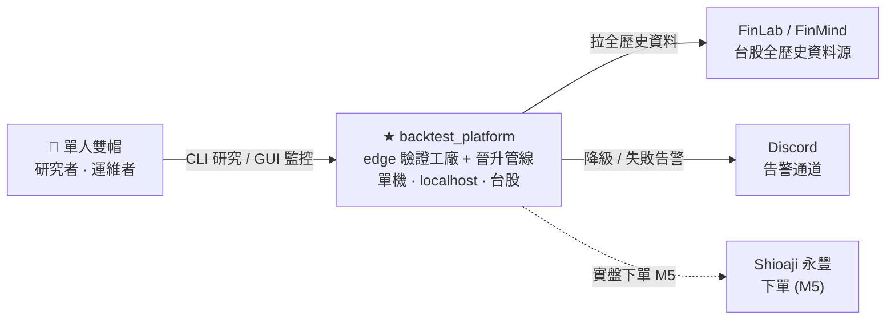
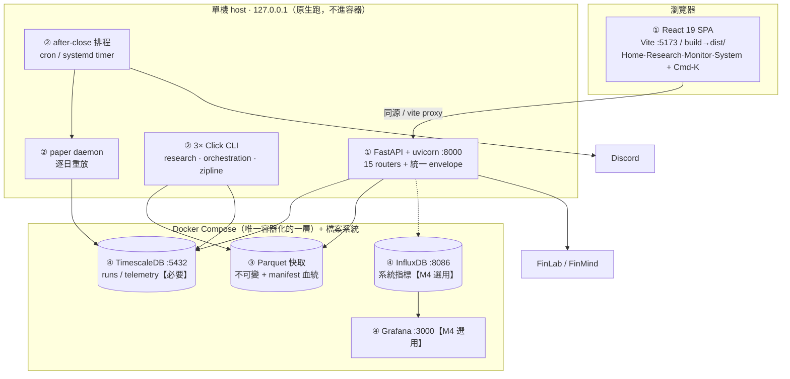
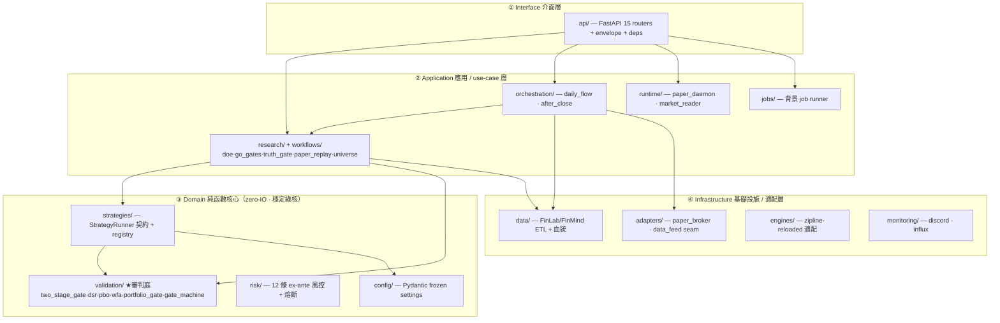
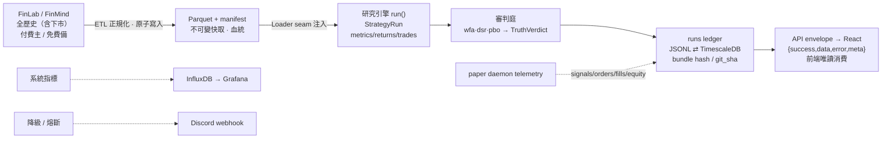
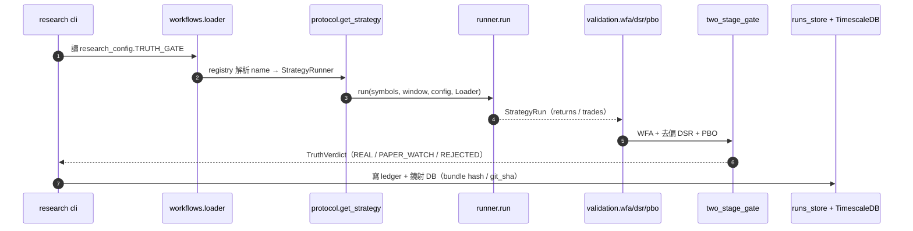
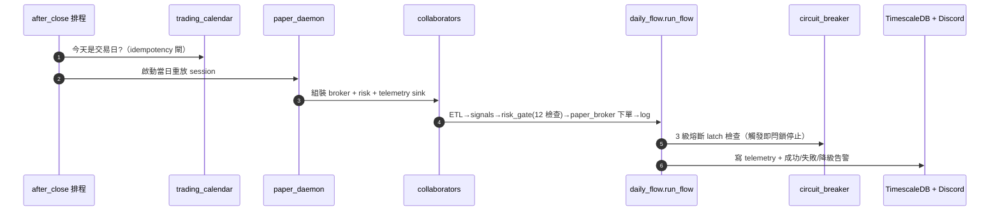

# backtest_platform — 系統脈絡、C4 與資料流

> **一句話定位**：這不是一支策略，而是一台**判斷策略有沒有真 edge 的機器** —— edge 驗證工廠 + 晉升管線（單人 · 單機 · localhost · 台股專用）。
>
> **用途**：給看不清「業務流程 / 架構脈絡 / 資料流」的人，一份由淺入深的地圖。
> **資料來源**：`dev_docs` 00 / 02 / 05 / 08 / 09 / 23 + 36 ADR ｜ **整理日期**：2026-07-03

---

## 0. 先建立心智模型

看架構圖前，先記住三句話。整套系統的每個模組、每條資料流，都是為了服務這三件事。

| # | 原則 | 說明 |
| :-: | :--- | :--- |
| 01 | **策略是消耗品，審判庭是資產** | 策略會一直被砍掉、換新的。真正的核心資產是那台**判它真偽的審判庭** —— PBO / DSR / WFA / 存活者校正的強制閘。 |
| 02 | **連續 NO-GO 是正常運作** | 成功 ≠ 找到會賺的策略（那是運氣）。成功 = **每個假設都拿到誠實、可複現、成本受控的判決**。策略死在閘門，是產品在正常工作。 |
| 03 | **唯一護城河是驗證信心** | 把抗過擬合做成**強制閘**，而非警告。存活者只能走一條**不可逆**的 backtest → paper → live 晉升管線。 |

---

## 1. 業務流程：一個策略的一生（9 步晉升管線）

作者的唯一入口是**一份宣告檔** `strategies/<name>/research_config.py`，宣告 `UniverseConfig / DOE / GO_GATES / TRUTH_GATE / PAPER_REPLAY`，就能零新腳本地跑完所有工作流（ADR-029）。

下表每步都標了**做什麼 / 為什麼**；`閘門` 欄標出決策點（🟡 軟閘、🔴 硬閘）。

| # | 步驟（指令） | 做什麼 | 為什麼 | 閘門 |
| :-: | :--- | :--- | :--- | :-: |
| 1 | **宣告策略** `research_config.py` | 寫一份 frozen Pydantic 宣告檔並註冊到 registry（`name → runner`）。 | 作者「只填參數、不寫工作流邏輯」。上層一律走 `get_strategy(name)`，絕不直接 import 策略。 | — |
| 2 | **建宇宙** `research build-universe` | 從 FinLab 全歷史建 survivorship-clean 點時間宇宙（含 369 檔下市股），寫 `universe_manifest.json` 血統。 | 不含下市股 = 存活者偏差 = 假 edge 頭號來源。硬性 hard-fail 條件。 | — |
| 3 | **參數掃描** `research doe` | 依 `DOE` 掃描整個參數網格，輸出**全網格 CSV**（每列 cagr/sharpe）。 | 強制輸出全部 N 列（防 cherry-pick）。挑過的 config 數計入 `n_trials`，稍後去偏 DSR。 | — |
| 4 | **GO 閘** `research go-gates` | 跑 WFA + PBO 過擬合機率，上審判庭前的預篩。 | 先擋掉明顯過擬合的候選，省下審判庭成本。 | 🟡 |
| 5 | **審判庭 · 真偽閘** `research truth-gate` | **Stage 1 真偽閘（二元）**：survivorship / PBO<30% / DSR≥0.95 / WFA OOS breadth≥60% / 滑價穩健，任一 fail 直接 REJECTED。**Stage 2 配置閘（連續）**：過關者依 Sharpe·相關性·容量映射成倉位。 | 整個產品的**核心資產**。Sharpe 0.9 是「小倉線」不是「淘汰線」。 | 🔴 |
| 6 | **逐日重放** `research paper-replay` | 把過閘候選逐日跑完整鏈：ETL → signals → risk → orders → log，寫真實 telemetry。 | ADR-025「Paper 前移」：live OOS 是品質最高的驗證資料。 | — |
| 7 | **驗證閘** `research validate` | 強制狀態機 IS→WFA→OOS：前一級 PASS 才解鎖下一級。**OOS 封存庫**前置閘未過就拒讀、讀取計數、狀態不可回退。 | 「OOS 用過一次就燒掉」，防反覆偷看 OOS 的隱性過擬合。錯誤以 `409`/`423` 回報。 | 🟡 |
| 8 | **晉升** `research promote-check` | 逐級推進晉升狀態機，每級強制對應閘 + 不可變稽核日誌。未達閘的 `advance` 回 `409`（前後端雙重防禦）。 | 只有 APPROVED 的 run 才 ELIGIBLE，晉升軌跡永久可稽核。 | 🟡 |
| 9 | **艦隊監控 + 上線** `orchestration after-close` | 收盤後排程產生訊號、比對成交、倒數觀察窗、偵測衰退；熔斷自動執行。GUI 艦隊看板顯示淨值/健康/相關性。 | paper live-OOS + 配置閘簽核 = 不可逆晉升 → M5 小倉實盤（目標 2027-Q2）。唯一需人拍板的閘。 | 🔴 |

### 真偽閘的三態判決（Step 5 產物）

| 判決 | 條件 | 後果 |
| :--- | :--- | :--- |
| 🟢 **REAL** | DSR ≥ 0.95，所有 hard-fail 通過 | 給資本 |
| 🟠 **PAPER_WATCH** | DSR ∈ [0.90, 0.95)，所有 hard-fail 通過 | 零資本觀察艙（ADR-033） |
| 🔴 **REJECTED** | 任一 hard-fail，或 DSR < 0.90 | 砍掉 |

> 判決優先序：`REJECTED ≻ INCOMPLETE ≻ PAPER_WATCH ≻ REAL`。

---

## 2. C4 Model：由遠而近三層放大

C4 的精神是**漸進放大**：先看系統跟外界的關係（L1）→ 再拆進程/容器（L2）→ 最後拆後端內部模組（L3）。四個架構層用固定顏色/編號編碼，三張圖一致：

- **① Interface 介面層** · **② Application 應用層** · **③ Domain 純函數核心** · **④ Infrastructure 基礎設施**

### L1 · System Context — 系統與外界

> **怎麼讀**：中間是「本系統」，左邊是唯一的人（就是開發者本人），右邊是它對接的外部服務。**對外只有出站流量**（拉資料 / 發告警 / 下單），沒有任何入站公開介面 —— 這就是它靠 `127.0.0.1` 綁定當安全邊界的底氣（ADR-031）。

### L2 · Container — 拆進程 / 容器

> **怎麼讀**：三個框 = 三個部署邊界。前端→後端是**同源**（dev 靠 vite proxy，瀏覽器只看到一個 origin，所以後端**完全不需要 CORS**）。**只有資料庫進 Docker**，App 層（FastAPI / CLI / 排程）都跑原生。
>
> ⚠️ **同源缺口**：prod 目前 `app.py` 沒有 `StaticFiles` 掛載 `dist/`，若把前端丟到另一個 port 就會變異源而失敗。維持同源的建議：在 `create_app()` 加 `app.mount("/", StaticFiles(directory="dist", html=True))`，或前面擺 reverse proxy。

### L3 · Component — 後端 4 層模組（`src/backtest_platform/`）

> **怎麼讀**：箭頭一律**由上往下**（依賴方向）。③ Domain 是「綠核」—— 純函數、不做任何 IO、最穩定；資料只透過上層注入的 `Loader` seam 送進來。這是整個系統可測試、可信任的根基。

#### 依賴鐵律（AST 測試強制）

- 上層永遠走 `get_strategy(name).run()` registry，**絕不直接 import 策略的 backtest 函數**（ADR-027/028）。
- `validation` **永遠不 import** `strategies` —— 斷開潛在循環依賴。
- 策略之間不互相 import、也不碰 `data/adapters`；`config` 不依賴任何東西。
- 前端 ↔ 後端**唯一耦合就是 REST 契約**（doc 25 / OpenAPI）。

---

## 3. 系統資料流：資料存在哪、怎麼從左流到右

一筆資料從外部 API 進來，到最後畫在前端畫面上，會經過這條主幹。

**產物一覽**：`universe_manifest.json`（宇宙血統）、全網格 DOE CSV、runs ledger 記錄、per-run series（equity/trades/candles/attribution）、quantstats tear-sheet、event-sourced 稽核日誌、凍結判決證據檔。

> **關鍵設計**：每筆 run 都記 **bundle hash + git_sha**，所以任何判決日後都可 100% 複現、可稽核。所有跑過的參數計入 `n_trials`，拿去**去偏 DSR**，避免低估過擬合稅。

---

## 4. 行為資料流：兩條關鍵時序

系統資料流講「資料在哪」，行為資料流講「呼叫怎麼發生」。以下是 doc 09 明列的兩條標準路徑。

### 路徑 A · 一次真偽閘審判 `research truth-gate --strategy inst_flow`

### 路徑 B · 收盤後一個 paper 交易日 `orchestration after-close`

---

## 5. 領域詞彙表

看圖時卡住的名詞，都在這。

| 名詞 | 定義 |
| :--- | :--- |
| **edge** | 真實、持續的統計優勢，相對於過擬合／存活者偏差／運氣。整個產品就是為了回答「是不是真 edge」。 |
| **審判庭 tribunal** | 驗證機器本身（PBO/DSR/WFA/存活者強制閘 + 兩段閘 + OOS 封存）。明確被定義為產品的**核心資產**。 |
| **run** | 一次執行/評估實例，以 `run_id` 為鍵持久化，帶假設、gate_status、metrics、IS/OOS 窗、equity/trades 與血統。 |
| **verdict（三態）** | 🟢 REAL（DSR≥0.95 給資本）／🟠 PAPER_WATCH（[0.90,0.95) 零資本觀察）／🔴 REJECTED（任一 hard-fail）。 |
| **PBO** | 回測過擬合機率（CSCV），hard-fail 門檻 <30%。衡量「從一堆掃描結果挑一個」帶來的過擬合。 |
| **DSR** | 去偏 Sharpe —— 用試驗次數 `n_trials` 打折 Sharpe，部署門檻 ≥0.95。 |
| **WFA** | Walk-Forward 分析；OOS breadth = OOS Sharpe>0 的 fold 比例，門檻 ≥60%。 |
| **survivorship-clean** | 含下市股的點時間宇宙（FinLab 全歷史 2753 檔含 369 下市）。強制 hard-fail 條件。 |
| **OOS sealed vault** | 樣本外資料在前置閘通過前封存不可讀、讀取計數、狀態不可回退 ——「用一次就燒掉」。 |
| **sleeve / pod（ADR-036）** | 把策略當獨立資金艙位：自帶配額、P&L、進出事件；季度再平衡 + 20% 遲滯 + 15% 回撤 pod-style 停損。 |
| **fleet 艦隊** | 已晉升策略的運維集合，統一監控淨值/健康/衰退/相關性。門檻是至少 1 策略完成 3 個月 paper。 |
| **promotion 晉升** | 不可逆的 draft → paper → live 狀態機，每級強制對應閘 + 不可變稽核日誌，未達閘回 409。 |

---

## 附錄 · Container 服務清單

整個 repo **只有一個 compose 檔**（`backtest_platform/docker-compose.yml`）、**沒有任何 Dockerfile** —— 後端與前端都跑原生，只有資料層/監控層被容器化。

| 服務 | Image | Port | 角色 | 必要性 |
| :--- | :--- | :--- | :--- | :-: |
| `timescaledb` | `timescale/timescaledb:2.14.2-pg16` | `5432` | runs ledger + telemetry；init.sql 首次啟動自建 13 張表 | **必要** |
| `influxdb` | `influxdb:2.7` | `8086` | 系統指標（`monitoring/influx_writer.py` 推送） | M4 選用 |
| `grafana` | `grafana/grafana:10.4.2` | `3000` | 4 張系統儀表板（auto-provisioned） | M4 選用 |

**App 層跑法**：後端 `uv run uvicorn backtest_platform.api.app:app --host 127.0.0.1 --port 8000`（本機 `:8000` 被占 → 改綁 `:8080`）；前端 dev `Vite :5173`，prod `npm run build → dist/`。
