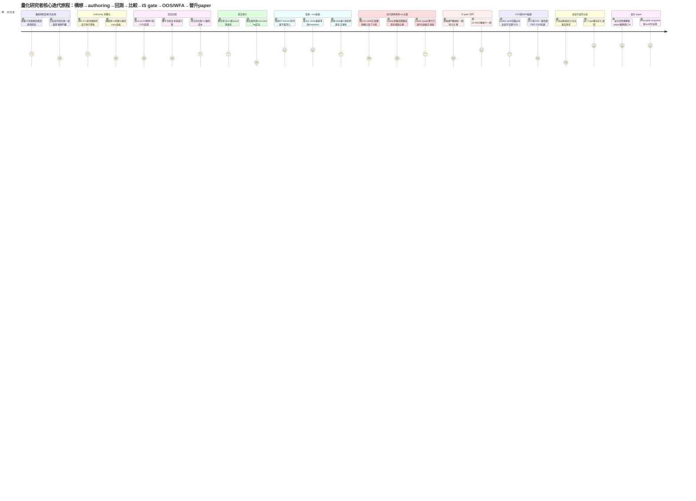
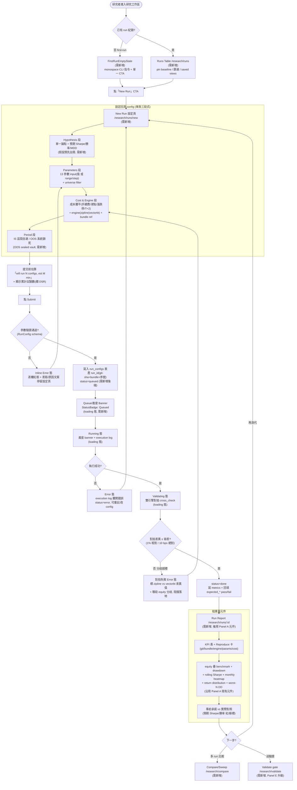
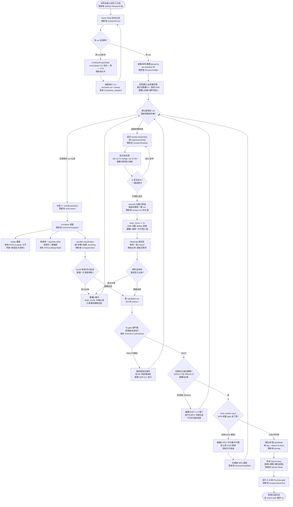
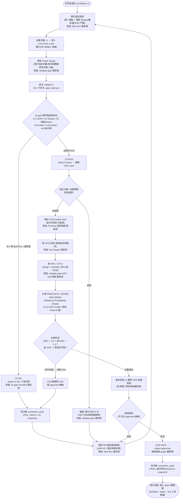
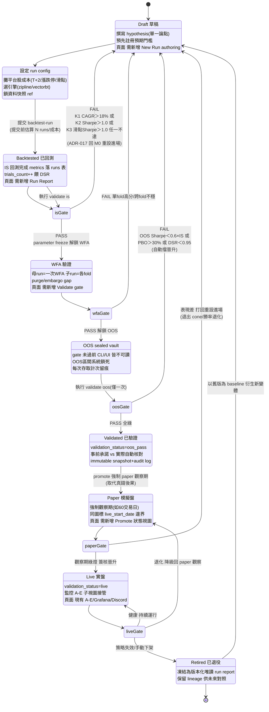
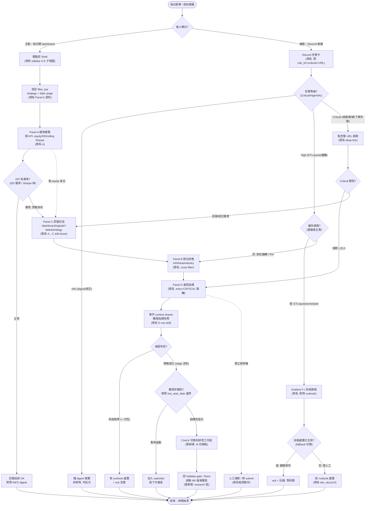
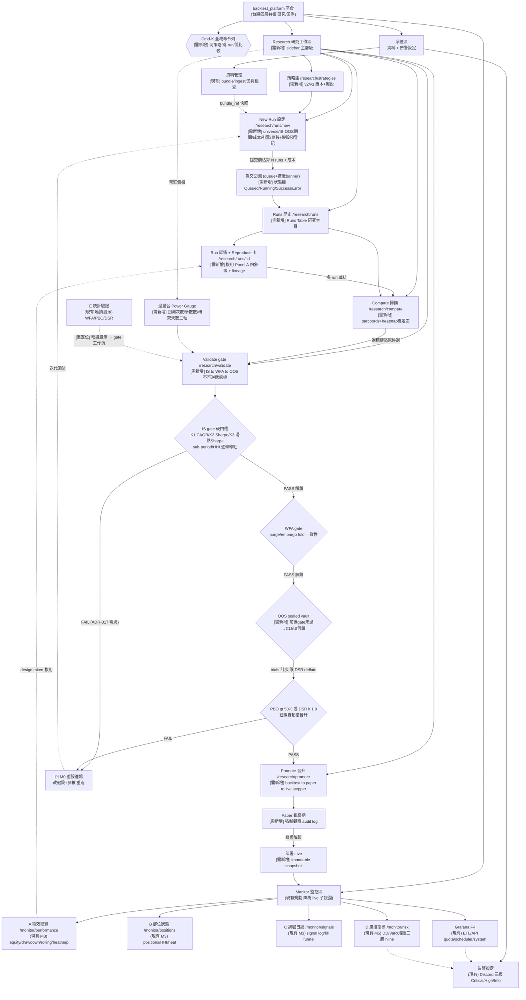

# 回測平台 UI/UX 大廠對標 + 使用者流程 + 補強規劃

> **產出**：2026-06-02 ｜ **方法**：deep-research 多 agent workflow（10 平台研究 + 模式彙整 + 10 維度差距分析 + 7 流程設計）
> **對象**：backtest_platform（台股個人量化 edge 驗證工廠 / 回測平台，單人開發、Python/CLI 後端、zipline+vectorbt 雙引擎、Grok 單色 dark）
> **脈絡**：M2 IS gate FAIL → 回 M0 重設進場（ADR-017）。目前無已實作前端。
> **性質**：設計研究 + 規劃草案，非實作承諾；標 [不確定] 處待拍板。**本文件未自動 commit**。
> **關聯**：`20_dashboard_specification.md`（面板真相源）、`02_backtest_dashboard_design_update.md`（React 化總綱）、`global/02_backtest_platform_brand_system.md`（設計系統）、ADR-015 / ADR-017。

> **怎麼讀**：§1 結論 → §3 差距總表（10 維度，8 CRITICAL）→ §4 七張 Mermaid 流程圖（含核心研究旅程）→ §5 補強 Roadmap。
> 附錄 A 為共用 UX 模式 taxonomy，附錄 B 為研究來源與引用。

---

## 1. 結論摘要（TL;DR）

**一句話核心發現**：當前設計是「監控優先」的產品——100% 服務「監控一支已部署/live 策略」，卻幾乎完全缺少「研究迭代迴圈」的 UX；而在當前 M0/M2 階段（策略尚無 edge、無前端、正密集重設進場），補上研究迴圈 UX 是**最高槓桿**的補強，監控面板反而是投資時序上放太前面的部分。

**最關鍵 takeaway（5 條）**：

1. **「一次回測」必須升格為一等公民 `Run` 物件**（config + 資料快照 + code/engine 版本 + metrics + status + lineage）。整個研究 UX 是圍繞 Run 的「生成 → 比較 → 守門 → 晉升」狀態機。這是所有大廠（QuantConnect / W&B / MLflow / BRAIN / Numerai）的共識基座，也是本專案後端目前最大的空白——`run_id` 已散落在 4 張時序表卻無主表承載，等於「插了鋼筋沒蓋樓」。

2. **唯讀展示 ≠ 工作流強制**。Panel E 把 PBO/DSR/WFA 畫成 KPI 卡，但不擋任何晉升動作——而 M2 IS gate FAIL 已親身證明「唯讀指標 + 人工紀律」這次靠人撐住、下次未必。真正有效的防過擬合是**流程鎖定（IS→WFA→OOS 不可逆狀態機）+ 資料封存（OOS sealed vault）+ 試驗次數→DSR deflate**，這三件可純後端 Python/CLI 實作、可 TDD、完全契合當前無前端現況。

3. **ADR-017 的痛點本質是「研究迴圈缺工具」的投射**。M0 重設進場（v2→v3）本質是一連串「改 13 參數 → 跑 run → 比較 → 守門」的密集迭代，但目前只能在 CLI + ADR 純文字裡硬撐：改了哪幾個輸入、跑了第幾次、IS gate 卡在哪一條，全靠人腦與散落 ADR。補上研究迴圈 UX 直接服務這個**正在進行中**的活動。

4. **IA 需要唯一一個關鍵重構**：sidebar 主層級從「strategy selector + A–E 監控平鋪」擴成兩段式——上段「研究工作區」（Runs / New Run / Compare / Sweep / Validate / Promote），下段「監控」（A–E 降為 live 策略子視圖，Panel E 重定位至 Validate gate）。配 Cmd-K command palette（ROI 最高的導覽層）+ saved views + CLI-first 工程化空狀態。

5. **既有資產基本可複用，不需推翻**。Grok 單色 dark / token / WCAG / 漲跌雙編碼 / Geist Mono 是合適底座；A–D 監控面板品質高、細節完整，只是時機錯置。策略是「複用優先 + 受控擴充」：Panel A 元件抽象成 run-scoped Run Report、單色 chrome 之上為 data-viz 內容區開一條「離散類別色盤 + 發散色階」的受控例外通道（compare/heatmap 需要），而非換掉單色基調。

**務實落地節奏**：後端契約先行（run 持久層 + IS→WFA→OOS 狀態機 + OOS sealed vault + 試驗次數計數，純 Python 可 TDD）落 M0/M2；最薄前端（Runs Table + Compare/Sweep + Validate gate + Promote）隨 React 化落 M3。**鐵律：在補齊研究迴圈前，切忌再擴張監控 panel。**

---

## 2. 大廠怎麼規劃量化/回測平台 UI/UX

### 2.1 核心工作迴圈：9 階段標準模型

big-tech 的共識是把回測研究組織成一條**單向迭代迴圈**，每階段是一等公民，gate 為不可逆關卡：

```
Ideate → Author → Configure → Backtest → Analyze → Compare/Optimize
        → Validate(IS→WFA→OOS) ═[gate]═> Promote(paper→live) → Monitor
                                  ↑ 失敗回流到 Author/Configure（ADR-017 即此回流）
```

| 階段 | 使用者目標 | 招牌頁面 | 關鍵反模式 |
| :--- | :--- | :--- | :--- |
| **Ideate** | 模糊想法收斂成單一可測試論點 + 預期門檻 | notebook 探索、空白 Run 卡 | 先跑回測再編故事（post-hoc rationalization） |
| **Author** | 把假設表達成可執行邏輯 | Cloud IDE、Pine/Expression Editor | 參數硬編碼進邏輯（無法 sweep/tracking） |
| **Configure** | 定義「這個 run 假設了什麼」 | Settings/Inputs、Properties | 成本假設隱藏、OOS 區間由研究者自由設 |
| **Backtest** | 以 Run 為原子單位異步提交 | 提交頁 + queue/進度 banner | 同步阻塞 UI、無 log、無進度回饋 |
| **Analyze** | 先看形狀秒判，再下鑽歸因 | Results 頁、tear sheet | 只看 equity 不看歸因、不疊基準 |
| **Compare/Optimize** | 在參數空間找穩健高原，不挑單點尖峰 | Runs Table、Optimization | 破壞式重跑、只報單一最佳參數 |
| **Validate** | 用不可逆狀態機證明 edge 真實 | gate 頁、Diagnostics | **唯讀展示 PBO/DSR**、對 OOS 反覆調參 |
| **Promote** | 每階段綠燈才解鎖下一階段主 CTA | Promotion 狀態頁、Deploy 精靈 | 三模式切換靠改一個 flag、無強制 gate |
| **Monitor** | 盯一支 live 策略的健康與退化 | 本專案現有 A–E / Grafana / Discord | 把監控當整個產品主軸 |

**價值重心在迴圈前半段**（authoring → run → compare → validate → promote）。tear sheet 與監控只是迴圈的**最後一站**。本專案目前 100% 投資在大廠**最不投資**的監控階段。

### 2.2 各大廠招牌對比

| 平台 | 招牌 UX | 核心啟示 |
| :--- | :--- | :--- |
| **QuantConnect** | 雲端 IDE 全迴圈：Monaco 編輯器 + Optimization（heatmap/parallel coords）+ overfitting power gauge（回測次數/參數數/研究時數三軸）+ PSR 內建 objective | 全迴圈一站式；power gauge 是「每跑一次就更靠近過擬合」的視覺摩擦——**直接抄、後端記計數即可** |
| **WorldQuant BRAIN** | alpha Expression Editor + **OOS gate**：提交後才 OOS 計分（不可回頭救）、correlation gate（self-correlation < 0.7） | L5 級不可逆強制；OOS 封存 + 提交後計分是「系統鎖死取代自律」的範本 |
| **Numerai** | diagnostics + **staking 真錢後果** + IS/OOS 25/75 評分權重 | 經濟後果讓過擬合「會痛」；單人平台用「鎖 OOS + 限提交 + 強制 paper 觀察期」替代真錢 |
| **W&B / MLflow** | run 管理：runs table（virtualization/column selector/group-by/pin baseline）+ parallel coordinates + lineage graph + Reproduce | run 物件化 + runs table 是研究者**每日真正的工作台**，價值高於 tear sheet |
| **TradingView** | 圖表中心 + Pine Editor + Properties 成本攤平 | 圖表/trade markers 強；但**破壞式重跑（新報表覆蓋舊）是反例**，跨 run 比較需外包腳本 |
| **Bloomberg** | 機構導覽 + BQNT notebook + 「單色 chrome + 彩色資料」雙層密集介面 | 密集數值用 monospace 對齊（對應 Geist Mono）；導覽分層成熟 |

**一句總結**：大廠各有招牌，但**沒有一家**把「比較/掃描本身會放大過擬合」的代價（試驗次數）反映進顯著性，也沒有同時做到「強制鎖 OOS + 限提交 + PBO/DSR 自動擋晉升」。這正是本專案可超越所有大廠的**差異化機會**。

### 2.3 防過擬合的 UX 專節（本專案 M2 FAIL 痛點）

跨平台歸納出**五種強度遞增、彼此互補**的防過擬合 UX。**核心教訓：唯讀展示 ≠ 工作流強制**——TradingView/OSS/Bloomberg/MLflow 全停在展示或自律，M2 IS gate FAIL 即證明唯讀無約束力。

| 層級 | 機制 | 大廠範例 | 強度 |
| :--- | :--- | :--- | :--- |
| **L1 計量可視化** | overfitting power gauge（三軸分級）+ 自動偵測硬編碼參數 | QuantConnect | 提示，不強制 |
| **L2 統計校正** | PBO(CSCV) / Deflated & Probabilistic Sharpe / MinBTL；試驗次數 deflate | 學術 + QC（PSR） | 算出數字，多唯讀 |
| **L3 參數帶視覺語言** | heatmap 穩定區、parallel coords brush「高原非尖峰」、Monte Carlo 重抽樣帶 | vectorbt / W&B / QuantStats | 視覺教育 |
| **L4 流程鎖定** | IS→WFA→OOS 協定：IS 後 parameter freeze、WFA purge/embargo、OOS 在 lock 下只跑一次 | AlgoXpert / 機構平台 | 工作流 gate |
| **L5 資料封存 + 後果** | OOS sealed vault（通過前不可讀）、提交後才計分、correlation gate、staking | Numerai / BRAIN | **不可逆強制** |

**本專案應補齊的「研究治理工作流」（7 件事，直接對應 M0 重設）**：

1. **IS→WFA→OOS 不可逆狀態機**——IS PASS 才解鎖 WFA，WFA PASS 才解鎖 OOS。把 ADR-017「IS gate FAIL → 回 M0」從散落 ADR 變成 UI/系統內明確狀態轉換 + 擋關。
2. **OOS sealed vault**——前置 gate 未過前，OOS 區段與 OOS 回測對 CLI 與 UI 皆不可執行/不可讀；每次存取計次留痕。
3. **試驗次數 → DSR 自動扣減**——比較表每多比一次就更新「有效試驗數 / DSR / PBO」，顯示「我已試 N 次，Sharpe 被扣到剩多少」。**這是 QC/MLflow 都沒做、直接命中本專案痛點的設計亮點。**
4. **power gauge 常駐**——累計回測次數 / 有效參數數 / 研究天數三軸 + 紅黃綠閾值。後端記計數即可。
5. **IS gate 硬門檻清單**——每條（K1 CAGR / K2 Sharpe / K3 滑點下 Sharpe / min trades / turnover / sub-period 穩健 / HHI）逐條綠/紅 + 差距值，研究者一眼知卡在哪、往哪改。
6. **PBO > 50% / DSR < 1.0 紅線自動擋晉升**——把學術指標變可操作 gate，而非裝飾。
7. **假設預先註冊為 run 必填欄位**——提交 OOS 前強制填「預期 Sharpe/勝率門檻 + 單一論點」，OOS 完成後系統自動比對事前承諾值，移除事後編故事空間。

---

## 3. 當前設計健檢（10 維度差距表）

> 嚴重度：CRITICAL（研究迴圈剛需且完全缺席）/ HIGH（缺漏或時機錯置）/ MEDIUM-LOW（補強項）。
> Effort：L（低，多為後端契約或文件）/ M（中）。

| # | 維度 | 嚴重度 | Effort | 里程碑 | 一句 gap | 一句建議 |
| :-- | :--- | :--- | :--- | :--- | :--- | :--- |
| 1 | 資訊架構與導覽 | **CRITICAL** | M | M0 | IA 只有監控區、研究區整段不存在；Cmd-K/saved views 全缺 | sidebar 改兩段式（研究/監控）+ Cmd-K + saved views，純文件改動先行 |
| 2 | 策略 authoring / 參數化 / 假設登記 | **CRITICAL** | L | M0(後端)/M3(前端) | idea→可回測 config 整段缺；無 run config 持久層、無假設預先註冊 | 後端 `run_configs` 表 + 假設欄位 + CLI run-new/run-list 先行 |
| 3 | 回測 run 設定與提交（queue/進度） | **CRITICAL** | L | M0/M2/M3 | CLI 只有單一 start/end，無 IS/OOS、無成本攤平、無 queue/狀態機 | 擴 RunConfig schema（IS/OOS+成本+引擎+range/step）+ 異步狀態機 |
| 4 | Experiment / run 追蹤與歷史 | **CRITICAL** | L | M0/M3/M5 | `run_id` 是孤兒鍵；無 runs 主表、無 lineage、無 reproduce | 新增 `runs` 主表為 single source of truth，孤兒 run_id 加 FK |
| 5 | 多 run 比較與參數掃描 | **CRITICAL** | L | M0/M2/M3 | 0% 覆蓋；無 runs table/heatmap/parallel coords/baseline diff | 後端 sweep 寫 DB + compare CLI；前端 heatmap+parcoords |
| 6 | 驗證/防過擬合工作流 | **CRITICAL** | L | M0/M3 | 停在「算數字 + 唯讀展示」，缺 L4 流程鎖定 + L5 資料封存 | gate_state.py 不可逆狀態機 + OOS sealed vault + 試驗次數 deflate |
| 7 | 晉升 gate 工作流 | **CRITICAL** | L | M0/M2/M5 | backtest→paper→live 靠改一個 flag，無狀態機/checklist/audit | PromotionState enum + promote check CLI + audit log |
| 8 | 既有監控面板 A–D 完整度 | **HIGH** | M | M0/M3 | A–D 品質高但時機錯置（live 專屬）；缺 run-scoped 複用 + 3 個 tear sheet 補件 | Panel A 抽象成 Run Report；補 distribution/worst-N DD/邊界線；凍結 D/B-live |
| 9 | 空狀態 / Onboarding / First-run | **HIGH** | M | M2/M3 | 平台級 first-run 死胡同（selector disabled、Panel E「無 CTA」） | 新增 FirstRunEmptyState（CLI 指令框 + 單一 CTA） |
| 10 | 設計系統對研究密集互動的適配 | **HIGH** | L | M0/M2/M3 | 單色原則排斥 N-run 比較圖；無編輯器/研究級表格元件 | 單色 chrome + 受控彩色資料區雙層；補 CodeEditor/ResearchTable/CompareChart |

### CRITICAL 項目展開

**#1 資訊架構與導覽**：唯一導覽真相源（`02_backtest_dashboard_design_update.md` §3）只有 5 條 route，全屬「監控一支已部署策略」視角；導覽殼 `Monitoring Shell` 的 sidebar 第一層級直接綁死 A–E 切換。研究 vs 監控分區、Runs Table 入口、Compare/Sweep 入口、Validate gate、Promote、Cmd-K、saved views、CLI-first 空狀態**全缺**。Panel E 把驗證放在監控區唯讀展示，是「應為 gate 的東西做成裝飾」的 IA 級錯位。這正是 ADR-017 痛點的 IA 投射——M0 重設是密集研究迭代活動，目前只能在 CLI + ADR 文字裡進行。

**#2–#5 研究迴圈入口與工作台（合併說明）**：這四個維度是同一條鏈的不同環節——authoring（#2）→ 提交（#3）→ 歷史追蹤（#4）→ 比較掃描（#5）。共同根因是**後端沒有把「一次 run」物件化**：`run_id` 只是秒級命名的散落檔案（`perf__<id>.pkl` 等），無 DB、無 lineage、無 code/engine/bundle 版本綁定。雙引擎（zipline+vectorbt）下尤其致命——無法回答「這條 equity 是哪版策略、哪個引擎、哪段資料跑的」。直接後果：ADR-017 已手動跑 box_only / 2-day confirm × 雙窗口的變體比較，但全靠 CLI 手敲、結果散落無持久化、無視覺化、無 baseline diff——正是 IS gate FAIL 痛點的放大器。

**#6 驗證/防過擬合工作流**：整套設計把防過擬合停在 L2（算數字）+ 展示，完全缺 L4（流程鎖定）與 L5（資料封存）。缺四件不可逆機制：(a) IS→WFA→OOS 狀態機（IS 沒過也能直接對 OOS 反覆跑）；(b) OOS sealed vault（研究者可隨時偷看 OOS 調參，台股資料有限風險更高）；(c) 試驗次數計數→DSR deflate（DSR 是「未 deflate」的假顯著）；(d) PBO/DSR 紅線無約束力。最深層是 IA 問題：Panel E 被歸在監控區，但防過擬合本質是研究迴圈中段的 gate——**畫了儀表盤卻沒接煞車**。

**#7 晉升 gate 工作流**：backtest→paper→live 切換只是「改一個 CLI flag」，任何時候都能跳過驗證直接 live。無 validation_status 欄位、無強制 checklist 擋關、無 OOS sealed vault、無累計試驗次數、無 audit log。ADR-008/016/017 的晉升條件以「人類紀律 + 散落文字」存在。與當前 M0 重設**直接相關且高度急迫**：這輪重設若無 gate 工作流與試驗次數計數，極可能在無系統約束下又掉進過擬合。

### HIGH 項目展開

**#8 既有監控面板 A–D 完整度**：A–D 的設計品質與細節**無 bug、無明顯不足**（四態/RWD/WCAG/雙編碼/drill-down 都到位），這是當前設計的真正強項。問題在三類結構性落差：(1) **時機錯置/局部過度設計**——A–D 100% 服務 live 監控，但專案目前無 edge、無前端、無 paper/live 部署；Panel D 全部、Panel B live WebSocket、Panel C fill funnel 在「連可部署策略都還沒有」的當下 ROI 趨近零。(2) **複用缺漏（最該補的縫）**——綁死 live 語境（"as of TWT"、即時 TTL），沒抽象出可餵給「一個 backtest run」的 run-scoped 版本。(3) **tear sheet 細節缺漏（低成本）**——缺 return distribution histogram、worst-N drawdown 表、IS/OOS/paper/live 邊界標記、四層共振歸因下鑽。

**#9 空狀態 / Onboarding**：設計系統只定義「區塊級 empty（filter 內無資料）」，全平台無「first-run / 全空引導」。Panel A filter_bar 在無策略時 selector **disabled**——第一次打開平台，唯一入口直接死路。Panel E 明文「無 CTA，唯讀面板」自承死胡同。諷刺的是 grok clone 現成有 P-G3 Three-path Onboarding 與「大圓角置中輸入框空狀態」資產，卻沒被繼承。錯誤態相對達標，是此維度唯一合格子項。

**#10 設計系統對研究密集互動的適配**：三層缺口。GAP-1（比較圖色彩語言衝突）——Global 明令「不引入鮮豔彩色、多序列用明度+線型」，但 N-run 比較圖與 optimization heatmap 物理上需要可區分 8–12 類別的離散色盤 + diverging colormap；反證已出現——Panel C 的 5 軌訊號散點被迫用 5 種鮮豔色，**單色基調在僅 5 類別就已破功**。GAP-2（編輯器零覆蓋）——無 Monaco/code editor token。GAP-3（研究級密集表格不足）——DataTable 只到 Sortable/Drill-row，缺 virtualization/frozen column/column selector/pin baseline；且「table→card @<1024px」對 runs table 是反模式。GAP-4（內部 drift）——panel A/E 殘留舊 teal token（#22D3EE/#243044）與 Global v2.0 單色矛盾。**正面結論**：單色 chrome 層是合適底座，不需推翻，只需擴充。

---

## 4. 使用者旅程與 User Flow（導讀）

> 本節 7 張 Mermaid 圖（journey / flowchart / stateDiagram）已內嵌於各小節；圖前文字為導讀與關鍵決策點說明。GitHub 與多數 Markdown 檢視器可直接渲染。

### 4.1 核心研究迭代旅程（情緒曲線）

研究者帶著「四層共振 v2 進場太嚴（IS gate FAIL）」的教訓，要重設進場假設成 v3（放寬 4 層全 AND 為 N-of-4），完整走一遍從構想到晉升 paper 的心路歷程。這張 journey 圖的價值在於用情緒分數（1–5）標出**目前 UX 完全缺席、研究者只能在 CLI + ADR 文字裡硬撐的低谷**，以及補上研究迴圈 UX 後的曲線改善。十個階段的情緒轉折：構想/假設註冊（3→2 谷底起點，逼研究者先承諾）→ authoring（3→2，最高頻最該結構化）→ 設定回測（2→3，終於有結構化入口）→ 提交（3→1，失敗時靠 log 定位是最痛死路）→ **看單一 run 結果（4，第一個高峰）** → 迭代比較（2→3，過擬合摩擦帶）→ **IS gate 守門（2→4，PASS 解鎖瞬間躍升）** → OOS/WFA（3→2，系統第一次「擋住人」）→ **過/不過分歧（1 vs 5，最大張力點）** → 晉升 paper（5，終點高峰）。關鍵敘事：回流是有方向的——不過時 gate_state 拒絕轉換並回流 Author/Configure，但研究者知道「往哪改、已試幾次」。



### 4.2 設定並執行一次回測

研究者對 v3 候選進場假設跑一次回測的端到端 flowchart：idea → config（三段式：Hypothesis 預先註冊 / 13 參數含 range-step / 成本+引擎+IS-OOS 區間）→ 提交前估算「will run N configs, est M min」→ queue 取得 run_id 與進度 banner → Run Report 結果頁。三個關鍵決策點：**(A) 參數驗證**（RunConfig Pydantic schema 失敗→inline error 留在設定頁不丟輸入）；**(B) 執行成功與否**（失敗→Error 態攤開 log，可重試）；**(C) 雙引擎對拍差異**（本流程差異化關卡——cross_check_vectorbt 容差 1% 相對 / 10 bps 絕對，超標→標 zipline vs vectorbt 分歧段，阻擋不可信數字進下游）。橋接真實後端：`backtest-run --stocks --start --end --bundle`。空狀態橋接 CLI 消除目前「selector disabled 整頁死白」的 first-run 死胡同。



### 4.3 多 run 比較與參數掃描（含防 cherry-pick 護欄）

把當前 ADR-017 M0 進場重設活動從「CLI 手敲 + 散落 ADR + 人腦記憶」升格成有護欄的視覺工作台。flowchart 從 Runs Table 多選分流為兩路徑：**路徑 A（多選比較）**——equity 疊圖 + 指標表 baseline delta + parallel coordinates brushing（決策點 brushHighland：穩健一片 vs 單點尖峰）；**路徑 B（參數掃描）**——range/step + vectorbt → 提交前估算 → heatmap 穩定區（決策點 highlandRead：顏色一致=robust vs 孤立尖峰=過擬合）。核心是**防 cherry-pick 三道護欄（強度遞增、彼此互補）**：(1) 試驗次數→DSR deflate（常駐計數 + 紅線擋釘選，攔截「多比一次就更接近假顯著」）；(2) heatmap/parcoords 高原 vs 尖峰視覺語言（挑選當下就教育「選寬廣高原不選尖峰」）；(3) OOS sealed vault（系統鎖死取代自律）。收斂時三道 gate 串聯（isGate→dsrGate→oosVault），全綠才能標記/釘選 candidate。



### 4.4 驗證/防過擬合 Gate 工作流

把目前唯讀的 Panel E 升級為「研究迴圈中段的 Validate gate 工作流」的 flowchart。主 persona 是研究者，次 persona 是風控（把關不可逆晉升、審計試驗次數）。鏈路：預先登記假設 → **IS gate**（ADR-016 K1/K2/K3 + sub-period/HHI/min-trades 逐條綠/紅 + 差距值；FAIL 不解鎖任何下游、計入試驗次數、退回 M0——本專案當前真實狀態）→ IS PASS 解鎖 **OOS sealed vault**（前置 gate 未過前對 CLI/UI 皆不可執行/不可讀）→ **WFA/CPCV**（purge+embargo，母 run 收子 fold）→ **PBO(CSCV) / DSR（吃累計試驗次數 deflate）/ Deflated & Probabilistic Sharpe** 與預先登記門檻自動對照 → PBO>0.5 或 DSR<1.0 自動標 FAIL 擋 approved 轉換 → pass/fail 寫進不可逆狀態機與 promotion_audit（誰、何時、憑哪組 metrics、哪個 run snapshot）。全程護欄：鎖 OOS、限提交次數、預先登記假設、試驗次數 deflate、power gauge 常駐摩擦。



### 4.5 晉升 gate 狀態機（backtest → paper → live，含回退路徑）

把 ADR-016/017 散落在 ADR 文字裡的人工 gate，升格為系統內可重複、可審計的不可逆狀態機。stateDiagram-v2 的狀態：`Draft → Backtested → Validated(IS→WFA→OOS) → Paper → Live → Retired`，每個轉換都有硬門檻 checklist、試驗次數計數、OOS sealed vault。**關鍵設計亮點是回退邊**——isGate/wfaGate/oosGate FAIL 全部回 Draft（這正是 ADR-017「IS gate FAIL → 回 M0」的系統化實現），paperGate 表現差回 Draft，liveGate 退化回 Paper；把「晉升」做成真正不可逆的單向閘門 + 明確降級路徑。Retired 凍結為版本化唯讀 run report，可作 baseline 衍生新變體（回到 Draft），形成 correlation gate 的對照基礎。刻意不做：跨人競賽 leaderboard、多人簽核、champion/challenger registry、staking 真錢——用三狀態 + 不可逆 gate + 強制 paper 觀察期替代。



### 4.6 日常監控與告警 triage

把專案三個既有強項（L7 監控 A–E、Discord 三級告警、Grafana F–I）串成完整 flowchart，並在結尾接上研究迴圈。**入口分岔**：主動（每日 1–2 次開 dashboard 巡檢，pull）vs 被動（收到 Discord 推播，push），兩條路匯流到同一組 A–E 下鑽鏈。Push 路徑依 tier 分流：Info（讀摘要即可）/ High（決策點 opsCheck：系統面→跳 Grafana 對 runbook；策略面→Panel B 部位下鑽）/ Critical（deep-link 直跳：熔斷類→Panel D、訊號成交類→Panel C）。**旅程價值收斂點是決策點 rootCause**：系統故障（依 runbook + ack 收尾）vs 策略退化（對照 equity 上 live_start_date 邊界判斷暫時波動 vs 結構性退化）。當 triage 結論是「結構性退化、非系統故障」→ 透過 Cmd-K（需新增）切到研究工作區 → 回 Validate gate / Runs Table 啟動 M0 進場重設。**這一步把監控 triage 結論直接餵回研究迴圈，正是 ADR-017「IS gate FAIL → 回 M0」在 UI 層的承接——目前完全缺，是本旅程刻意暴露的缺口接點。** 唯二「需新增」節點（Cmd-K、research 工作區）正是 gap 的 CRITICAL 缺口，其餘全是既有強項串接。



### 4.7 補強後整體 Sitemap / 資訊架構

把目前「100% post-deployment 監控」的 IA，重構為以「研究迭代迴圈」為 sidebar 主層級的三分層 flowchart。頂層：**Research**（策略庫 / New Run 設定 / Runs 歷史 / Compare 掃描 / Validate gate / Promote 晉升）+ **Monitor**（A–E live 子視圖 + Grafana F–I）+ **系統**（資料管理 bundle/ingest / 告警設定 Discord）。每個節點標「現有」或「需新增」。關鍵 IA 變動：(1) 頂層 Cmd-K 全域命令列取代深層 sidebar 樹；(2) 第一層級從被 A–E 佔滿讓位給研究迴圈六頁；(3) A–E 由 `/dashboard/*` 改名 `/monitor/*` 並標註 live 子視圖；(4) Panel E 不再屬監控而隸屬 Validate gate；(5) 系統區的 bundle_ref 快照回饋給 New Run，告警設定接收 Grafana 與 Panel D 事件。整體把「研究 → 比較 → 守門 → 晉升 → 監控」串成單一狀態機，監控降為迴圈最後一站。



---

## 5. 補強藍圖（Roadmap）

### 5.1 依里程碑排序的補強項

> 標記：【現有】= 已規劃頁面（可複用/重定位）；【需新增】= 全新頁面/元件/後端契約。
> 鐵律：後端契約先行（純 Python/CLI 可 TDD，契合無前端現況）；前端隨 React 化批次補。

#### M0（最高優先，直接服務正在進行的進場重設迭代）— 全部後端契約 + 純文件

| 補強項 | 類型 | 為何 M0 |
| :--- | :--- | :--- |
| `run_configs` / `runs` 主表（Run 物件化 + lineage） | 【需新增】後端契約 | run 升格一等公民，M0 變體比較立即受益；純 TDD |
| RunConfig schema 擴充（IS/OOS 區間 + 成本攤平 + engine + range/step + hypothesis） | 【需新增】後端契約 | 取代單一 start/end，當前重設活動的工作台 |
| 假設預先註冊欄位 + CLI `run-new`/`run-list` | 【需新增】後端 + CLI | 移除事後編故事空間，逼先承諾 |
| IS→WFA→OOS 不可逆狀態機 `gate_state.py` + OOS sealed vault | 【需新增】後端契約 | M2 FAIL 已證唯讀無效；擋關不靠紀律 |
| 試驗次數計數 → DSR deflate | 【需新增】後端契約 | 後端記 counter，低成本高槓桿，正中痛點 |
| IA 重構（sidebar 兩段式設計）+ 設計系統 token 擴充 | 【需新增】純文件 | 純文件改動、低風險，先收斂 teal drift + 開受控色盤 |

#### M2（後端契約落地 + 資料契約同步）

| 補強項 | 類型 |
| :--- | :--- |
| `backtest_runs` 持久層 + sweep CLI 寫 DB + compare CLI | 【需新增】後端 |
| validation_status / trials_count / is_oos_sealed 欄位 + promotion_audit 表（21 資料契約） | 【需新增】後端 |
| ResearchTable + CompareChart 元件規格 | 【需新增】規格 |
| FirstRunEmptyState 元件 + Panel E empty 態修文案（消除「無 CTA」死胡同） | 【需新增】規格 + 改 |

#### M3（最薄 React 前端，與 Panel A/B/C React 化同期）

| 頁面 | 類型 | 複用 |
| :--- | :--- | :--- |
| `/research/runs/new` New Run 設定頁 | 【需新增】 | DataTable/KPICard/StatusBadge/Button + CodeEditor |
| `/research/runs` Runs Table 研究主頁 | 【需新增】 | ResearchTable + saved views + CLI 空狀態 |
| `/research/runs/:id` Run Report | 【需新增】 | **複用 Panel A** equity/drawdown/rolling/heatmap + Reproduce 卡 |
| `/research/compare` + `/research/sweep` | 【需新增】 | CompareChart（heatmap + parcoords）+ power gauge |
| `/research/validate` Validate gate | 【需新增/重定位】 | **Panel E 從 `/dashboard/validation` 升級** |
| Panel A 補件（distribution / worst-N DD / 邊界線） | 【現有】改 | 沿用 ChartFrame/DataTable/ReferenceLine |
| Cmd-K command palette | 【需新增】 | Button Ghost + focus 白環，純前端 |

#### M5（晉升前端 + 監控降級收尾）

| 頁面 | 類型 |
| :--- | :--- |
| `/research/promote/:strategy_id` Promotion stepper | 【需新增】StatusBadge stepper + 硬門檻 checklist + 解鎖式 CTA |
| A–E 由 `/dashboard/*` 改名 `/monitor/*`、標 live 子視圖 | 【現有】重定位 |
| Panel D 全部 / Panel B live WebSocket | 【現有】**維持 M5 凍結，不提前** |

### 5.1.1 研究工作區 Page 規格索引（已建立）

> 以下 8 份 Page 規格依 `pages/page_template.md` 格式落地（繼承 Global v2.0 Grok 單色 dark），與 `02_backtest_dashboard_design_update.md` §3 的監控面板索引（已改名 `pages/monitor_{a-d}_*.md`、route `/monitor/*`）並列，構成三區 IA：**research_0N（研究 8）/ monitor_{a-d}（監控 4）/ system_{data,alerts}（系統 2）**。各頁的 Assembly Master Prompt（`assembly/<page>_integrated.md`，內嵌 Grok v2.0 壓縮 Tokens）已一併產出，可直接貼 Lovable；React 化時依里程碑取用。

| # | 頁面 | Route | M | Page 規格 | 複用/重定位 |
| :-: | :--- | :--- | :-: | :--- | :--- |
| 1 | 策略庫 | `/research/strategies` | M3 | [`pages/research_01_strategy_library.md`](./pages/research_01_strategy_library.md) | FirstRunEmptyState |
| 2 | New Run 設定頁 | `/research/runs/new` | M3 | [`pages/research_02_run_new.md`](./pages/research_02_run_new.md) | parameter form + CodeEditor |
| 3 | Runs Table 研究主頁 | `/research/runs` | M3 | [`pages/research_03_runs_table.md`](./pages/research_03_runs_table.md) | ResearchTable + power gauge |
| 4 | Run Report | `/research/runs/:id` | M3 | [`pages/research_04_run_report.md`](./pages/research_04_run_report.md) | **複用 Panel A** + Reproduce |
| 5 | Compare 多 run 比較 | `/research/compare` | M3 | [`pages/research_05_compare.md`](./pages/research_05_compare.md) | CompareChart parcoords |
| 6 | Sweep 參數掃描 | `/research/sweep` | M3 | [`pages/research_06_sweep.md`](./pages/research_06_sweep.md) | CompareChart heatmap |
| 7 | Validate gate | `/research/validate` | M3 | [`pages/research_07_validate_gate.md`](./pages/research_07_validate_gate.md) | **Panel E 升級/重定位** |
| 8 | Promotion stepper | `/research/promote/:strategy_id` | M5 | [`pages/research_08_promote.md`](./pages/research_08_promote.md) | StatusBadge stepper |

**系統區（System，2 頁）**——bundle_ref 快照回饋 New Run；告警設定接收 Grafana F–I 與 Panel D 事件：

| 頁面 | Route | M | Page 規格 | 對接 |
| :--- | :--- | :-: | :--- | :--- |
| 資料管理 | `/system/data` | M3 | [`pages/system_data.md`](./pages/system_data.md) | bundle/ingest/品質 → New Run bundle ref |
| 告警設定 | `/system/alerts` | M5 | [`pages/system_alerts.md`](./pages/system_alerts.md) | Discord 三級；接 Grafana F–I / Panel D |

**補強頁（3 頁，2026-06-04 補）**——填補首頁缺口 + 多策略艦隊營運 + 逐筆覆盤：

| 頁面 | Route | M | Page 規格 | 補的缺口 |
| :--- | :--- | :-: | :--- | :--- |
| 首頁 · 控制塔 | `/`（root landing）| M3 | [`pages/home_overview.md`](./pages/home_overview.md) | 缺首頁；跨三區總覽 + 艦隊 strip |
| 策略艦隊總控 | `/monitor`（Monitor zone home）| M4-M5 | [`pages/monitor_fleet.md`](./pages/monitor_fleet.md) | 多策略 live 看板 + 退化示警/換掉（**§5.3 原刻意延後的 champion/challenger，已由 [ADR-022](../adrs/ADR-022-multi-strategy-fleet-operations.md) 裁定為營運層 lite**）|
| 逐筆覆盤 | `/research/runs/:id/trades` | M3 | [`pages/research_trade_review.md`](./pages/research_trade_review.md) | 個股 K 線疊進/出場 marker + 四層共振歸因（展開 Run Report TradeListLink）|

> 全域元件（Cmd-K / Saved Views / FirstRunEmptyState）與研究級元件（CodeEditor / ResearchTable / CompareChart / parameter form / gate badge）規格見 §6.2，於各 Page 規格內以 element 引用。

### 5.2 建議的整體 IA

```
研究工作區（主軸，新增）                    監控（降為 live 策略子視圖）
├─ 策略庫 / Experiments                     └─ Strategy Monitor (/monitor/*)
├─ New Run 設定 (/research/runs/new)            ├─ A 績效總覽
├─ Runs Table  ← 研究主頁 (/research/runs)      ├─ B 部位狀態
├─ Compare / Sweep                             ├─ C 訊號日誌
├─ Validate (IS→WFA→OOS gate)                  ├─ D 風控指標 [M5]
└─ Promote / Registry                          └─ E 統計驗證 → 改隸屬 Validate gate
                                            系統區
全域：Cmd-K command palette + Saved Views    ├─ 資料管理 bundle/ingest
     + FirstRunEmptyState（CLI-first 空狀態）  └─ 告警設定 Discord 三級
```

既有 A–E 全數歸進 Monitor 區；Panel E 例外——從監控區唯讀展示重定位至 Validate gate。這是 taxonomy 點名的**唯一 IA 變動**。

### 5.3 對單人開發的務實取捨

**先做（高 ROI、與既有資產相容、可純 TDD）**：
- Run 物件 + runs 持久層 + IS→WFA→OOS 狀態機 + OOS sealed vault + 試驗次數計數——補齊整個 OSS 生態都缺的空白，最大可防禦優勢，且純後端 Python/CLI 可立即起步服務 M0。
- Cmd-K + saved views + CLI-first 空狀態——導覽層 ROI 最高，單人深度研究者提速最明顯。
- Panel A 抽象成 Run Report + tear sheet 三補件——複用既有高品質元件，低成本。

**可延後（M3+，有多策略候選池再加）**：
- 跨策略 run 比較——先走輕量 code-first（Python 讀 run 組 DataFrame 算相關性），再沉澱成 UI。
- Correlation gate / baseline factor library——屬 M3+，先有候選池。
- 四層共振歸因下鑽——Run Report 後續迭代項，非 MVP 阻塞。
- notebook 雙模式——只採「notebook 與回測共用同一 TimescaleDB 資料層」，不做完整 hosted notebook。

**不做（單人無需求，避免過度設計）**：
- 跨人競賽 leaderboard（runs table 排序即足）、群眾外包 / staking 經濟後果、Alpha marketplace、分散式掃描叢集（單機 vectorbt 向量化足夠）、24/7 hosted Diagnostics 服務化、no-code chart/dashboard builder、完整 champion/challenger Model Registry、多人簽核審批。

---

## 6. 對既有設計系統的影響

**核心策略：不推翻 Grok 單色 dark，採「單色 chrome + 受控彩色資料區」雙層結構**（Bloomberg/Datadog 的密集介面正是此雙層）。單色 chrome（外框/導覽/表格）保持不變；只在 data-viz 內容區開一條受控的「離散類別色盤 + 發散色階」例外通道。

### 6.1 token 擴充（解 GAP-1 / GAP-4，最低成本先做）

在 `global/02_backtest_platform_brand_system.md` §Data-viz 把規則從「禁鮮豔」改為「chrome 單色、資料區允許受控離散/發散色盤」，新增三組受控例外色盤：

| token 組 | 用途 | 來源建議 |
| :--- | :--- | :--- |
| **Categorical 8-色盤**（低飽和、dark 底 WCAG 達標） | parallel coordinates / 多 run equity overlay | 取現成（Observable/Tableau 10 低飽和版），不自調 |
| **Diverging 色階**（gain #22C55E ↔ 中性灰 ↔ loss #F87171） | optimization heatmap 穩定區 | **沿用既有漲跌語義，零新增語彙** |
| **Sequential 灰階** | 單變數密度 | 既有明度階延伸 |

同步收尾：Panel C 的 5 個臨時鮮豔色改引用 categorical token；清掉 panel A/E 殘留 teal（#22D3EE→單色白環、#243044→#2A2A2A）。

### 6.2 新增研究級元件（解 GAP-2 / GAP-3）

| 元件 | 規格要點 | 對應 taxonomy/缺口 |
| :--- | :--- | :--- |
| **CodeEditor** | Monaco，沿用 BG Code #161616 / Geist Mono / 單色語法高亮微調；input 面板與 code 分離；唯讀 diff 模式。**直接用 Monaco 預設 dark 微調，不自寫語法高亮** | Author/Configure 階段；GAP-2；服務 M0 進場重設 |
| **ResearchTable**（DataTable 研究強化版） | virtualization（千列 run）、frozen first column、column selector、density toggle、pin-baseline row、group-by、multi-select、inline sparkline cell；**RWD 改為「橫向捲動保欄位密度」而非 table→card** | Runs Table 研究主頁；GAP-3 |
| **CompareChart**（ChartFrame 變體） | parallel coordinates + brushing、optimization heatmap、多 run equity overlay 共用一個 frame，吃 categorical/diverging token | Compare/Optimize；§2.2 W&B/Optuna |
| **parameter form / stepper / gate badge** | 13 參數 input pill（值或 range/step toggle）；Promotion stepper（已過 gain 綠 / 當前 accent / 未解鎖灰）；IS gate checklist 逐條綠/紅 + 差距值 | New Run / Promote / Validate |
| **command palette (Cmd-K)** | Button Ghost + focus 白環觸發；動作集＝切策略/切期間/新建 run/跳 view/開比較/type-to-run by id；橋接既有 CLI 子命令名稱 | §2.2 導覽；ROI 最高 |
| **FirstRunEmptyState** | 置中大圓角卡 + 1px border（無陰影）+ monospace CLI 指令框（Geist Mono + bg-code #161616，可複製真實 `backtest-run` 指令）+ 單一白 pill CTA + Three-path（跑範例/看文件/貼 CLI） | 空狀態橋接 CLI；繼承 grok P-G3 |

### 6.3 相容性確認（一線驗證背書）

既有 Grok 單色 dark / token / WCAG（文字 AA、KPI AAA）/ 漲跌色+↑↓雙編碼 / flat 1px border / Geist Mono **與所有採用模式不衝突**：

- Datadog 用 monospace 精確對齊密集數值 → 對應 Geist Mono（runs table 數值欄）。
- Stripe 用 WCAG 演算法自動生色票 → 對應既有 WCAG token。
- gate 狀態用三色 hline 沿用熔斷視覺語言；IS/OOS 指標用漲跌雙編碼標 PASS/FAIL。
- heatmap 發散色階直接用既有 gain ↔ 灰 ↔ loss，**零新增語彙**。

**唯一需要的設計語言變動**：把「不引入鮮豔彩色」這條絕對規則，改為「chrome 單色、資料區受控彩色」的雙層規則。這是因為 N-run 比較圖與 optimization heatmap 在**物理上**無法用單色明度階區分 8–12 類別——Panel C 已用 5 個臨時色破例證明了缺口的真實性。

---

## 附：誠實標註的不確定處

- **里程碑切分** [不確定]：M0/M2/M3/M5 的歸屬沿用既有 16 WBS 與各維度差距分析的建議，但「後端契約 M0、前端 M3」的切點需與實際 sprint 容量對齊，可能需使用者拍板調整。
- **雙引擎對拍容差** [不確定]：flow-run-config-execute-001 採用「1% 相對 / 10 bps 絕對」，源自 cross_check_vectorbt 既有邏輯；若實測噪音偏大需放寬。
- **Categorical 色盤具體值** [不確定]：建議取現成低飽和盤，但 dark 底 WCAG 達標的精確 hex 需實際驗色，不在本報告範圍。
- **A–D 是否「過度設計」** [部分主觀]：判定為「時機錯置」而非「內部過度」——A–D 本身品質高，問題是投資時序。此判斷依賴「研究迴圈優先於監控」的核心假設成立；若使用者已有近期上 paper/live 的明確計畫，則 A–D 的優先序應上調。
- **本報告未做 codebase 直接探索**：所有判斷基於提供的 taxonomy + 10 維度差距分析 + 流程素材；引用的檔案路徑（如原 `02_panel_e_validation.md`，現已重定位為 `pages/research_07_validate_gate.md`）轉述自差距分析，未逐一回查原檔，使用前建議抽查核對。

---

## 附錄 A：回測研究平台 UX 模式 Taxonomy（共用詞彙）

> 後續差距分析、流程設計與 ADR 撰寫的共同詞彙。脈絡：backtest_platform（台股四層共振、單人、Python/CLI 後端、zipline+vectorbt 雙引擎、TimescaleDB、Grok 單色 dark）。M2 IS gate FAIL → M0 進場重設（ADR-017）。現有規劃 100% 為 post-deployment 監控（L7 A–E）。

---

### 0. 核心定位（先講結論）

10 份研究**一致驗證了關鍵缺口假設**：所有大廠平台（QuantConnect / BRAIN / Numerai / Bloomberg / 機構平台 / OSS / MLOps）的**價值重心都在「研究迭代迴圈」的前半段**（authoring → run → compare → validate → promote），tear sheet 與監控只是迴圈的最後一站。本專案目前 100% 投資在 OSS/機構平台**最不投資**的監控階段。

**單句 taxonomy 核心**：把「一次回測」升格為**一等公民 `Run` 物件**（config + data snapshot + code/engine version + metrics + status + lineage），整個 UX 是圍繞 Run 的「生成 → 比較 → 守門 → 晉升」狀態機。

---

### 1. 核心工作迴圈：9 階段標準模型

big-tech 共識階段模型（箭頭為主流程，gate 為不可逆關卡）：

```
Ideate → Author → Configure → Backtest → Analyze → Compare/Optimize
        → Validate(IS→WFA→OOS) ═[gate]═> Promote(paper→live) → Monitor
                                  ↑ 失敗回流到 Author/Configure（ADR-017 即此回流）
```

每階段詳述（使用者目標 / 典型頁面 / 必備元件 / 反模式）：

#### 1.1 Ideate（構想 + 假設預先註冊）
- **目標**：把模糊想法收斂成單一可測試論點 + 預期績效門檻。
- **典型頁面**：notebook 資料探索（QuantBook / BQNT）、Dataset Catalog、空白 Run 建立卡。
- **必備元件**：hypothesis 欄位（單一論點）、預期 Sharpe/勝率/最大 DD 門檻（pre-registration）、point-in-time 資料覆蓋預檢。
- **反模式**：先跑回測再編故事（post-hoc rationalization）；跳過資料品質檢查直接回測（look-ahead / 下市偏差污染）。

#### 1.2 Author（撰寫策略）
- **目標**：把假設表達成可執行邏輯。
- **典型頁面**：Cloud IDE（Monaco）、Pine Editor、notebook、Expression Editor。
- **必備元件**：邏輯與**參數分離**（input 面板 vs 程式碼）、IntelliSense、版本/commit 綁定。
- **反模式**：把參數硬編碼進邏輯（無法 sweep、無法 tracking）；authoring 與 backtest 用不同資料層（驗過的邏輯搬不進回測）。

#### 1.3 Configure（設定 run config）
- **目標**：定義「這個 run 假設了什麼」。
- **典型頁面**：Settings/Inputs 面板、TradingView Properties、QC Optimization 設定。
- **必備元件**：參數（值或 range/step）、universe filter、rebalance、objective、**成本假設攤平**（commission/滑價/漲跌停/借券/T+2）、引擎選擇（zipline/vectorbt）、資料快照 ref。
- **反模式**：成本假設隱藏 → 日後拿不同假設的 run 亂比；OOS 區間可在此被研究者自由設定（應由系統鎖）。

#### 1.4 Backtest（提交執行）
- **目標**：以 Run 為原子單位提交異步長任務，掌握進度。
- **典型頁面**：Run 提交頁 + queue/進度 banner。
- **必備元件**：狀態機（Queued / Running / Validating / Success / Error / Failed）、進度 banner（Completed/Running/Queued/consumed）、execution log、**提交前估算 run 數與成本**（抑制暴力搜參）。
- **反模式**：同步阻塞 UI、無 log（失敗不知為何）；無進度回饋。

#### 1.5 Analyze（分析單一 run）
- **目標**：先看形狀秒判要不要深入，再下鑽歸因。
- **典型頁面**：Backtest Results 頁（分頁：Overview/Equity/Orders/Trades/Logs/Code 快照/Report）、tear sheet。
- **必備元件**：頂部 runtime statistics banner → **業界慣例 tear sheet 順序**（KPI 表 → cumulative returns 疊 benchmark → drawdown underwater + worst-N DD 表 → rolling Sharpe → monthly heatmap → return distribution）；**逐筆 trade 表可回跳市場狀態**；**Code 快照分頁**（最便宜的 reproducibility）；**歸因下鑽**（哪一層共振貢獻多少 alpha）。
- **反模式**：只看 equity curve 不看歸因（不知為何 work）；只看絕對報酬不疊基準（無法判斷有無 alpha）；metrics dict 之前強迫 render 全套重圖（高延遲迴圈）。

#### 1.6 Compare / Optimize（多 run 比較 + 參數掃描）
- **目標**：在參數空間找穩健高原，不挑單點尖峰。
- **典型頁面**：Runs Table、Compare/Workspace、Optimization Results、Parallel Coordinates。
- **必備元件**：runs table（排序/篩選/group by/pin baseline/欄位選擇器）、parallel coordinates + brushing、heatmap（2 參數穩定區）/scatter（1 參數）/3D（3 參數）、parameter importance、equity overlay、參數 diff（本次相對上次改了哪幾個輸入）。
- **反模式**：破壞式重跑（新報表覆蓋舊，前次結果消失 — TradingView 反例）；只報單一最佳參數（幾乎必過擬合）；跨 run 比較外包給第三方腳本（BRAIN/TradingView 反例）。

#### 1.7 Validate（IS → WFA → OOS，gate 而非展示）
- **目標**：用不可逆狀態機證明 edge 真實存在。
- **典型頁面**：研究流程 gate 頁、IS gate pass/fail checklist、WFA fold 視圖、Diagnostics。
- **必備元件**：IS gate 硬門檻清單（逐條綠/紅 + 差距值）、**PBO/DSR/PSR 計算並設紅線**、IS-vs-OOS scatter、WFA purge/embargo gap、**OOS sealed vault（前置 gate 未過前對 CLI/UI 皆不可讀）**、累計試驗次數計數器餵進 DSR。
- **反模式**：**唯讀展示 PBO/DSR/WFA（本專案 Panel E 現況 — M2 FAIL 已證明無約束力）**；對著 OOS 反覆調參；單一 fold 高分當通過。

#### 1.8 Promote（backtest → paper → live）
- **目標**：每階段綠燈才解鎖下一階段主 CTA。
- **典型頁面**：Promotion 狀態頁（單一晉升切換點 + audit）、Deploy Live 精靈。
- **必備元件**：stage 狀態機（validation_status: pending/IS-pass/OOS-pass/approved）、晉升前置條件清單、強制 paper trading 觀察期（單人平台用此替代 Numerai 的真錢後果）、immutable snapshot + audit log。
- **反模式**：backtest→paper→live 無強制 gate 靠紀律（QC 反例）；晉升後仍可改參數污染已驗證結論。

#### 1.9 Monitor（部署後監控）
- **目標**：盯一支 live 策略的健康與退化。
- **典型頁面**：本專案現有 L7 A–E、Grafana F–I、Discord 告警。
- **必備元件**：equity/drawdown/rolling sharpe/monthly heatmap、部位/HHI/heat、訊號日誌、風控熔斷 hline、**同圖標記 live_start_date 退化即時可見**。
- **反模式**：把監控當成整個產品主軸（本專案現況）；監控與回測結果頁用不同 design token（應共用 equity/drawdown/turnover/cost 四象限）。

---

### 2. 跨平台招牌 UX 模式

格式：**是什麼 / 為何有效 / 對單人台股回測平台是否適用**。

| 模式 | 是什麼 | 為何有效 | 單人台股適用性 |
|---|---|---|---|
| **Runs Table** | 每列一個 run，欄=參數×指標×tag×狀態，可排序/篩選/group/pin baseline | 研究者每日真正的工作台；single source of truth | ✅ **核心剛需，最高優先**。TimescaleDB 天然適合落地。比 A–E panel 更該先做 |
| **Run 物件化 + lineage** | run = config+snapshot+code/engine version+metrics+status，可重現可追溯 | 解決「這條 equity 是哪版策略/哪個引擎跑的」 | ✅ **雙引擎下尤其必要**，鎖 engine + bundle 版本 |
| **Parallel Coordinates + brushing** | 每軸一參數/指標，每線一 run，框選穩健區間 | 看「穩定一片 vs 單點尖峰」=內建防過擬合教育 | ✅ 四層共振多參數，brush 找高原直接呼應 IS gate FAIL 教訓 |
| **Optimization heatmap 穩定區語言** | 2 參數熱圖，顏色一致=robust，單點尖峰=過擬合警訊 | 把「選寬廣高原不選尖峰」視覺化 | ✅ vectorbt 天生適合向量化掃描，做一張表+heatmap 即可 |
| **Notebook + dashboard 雙模式** | notebook 自由探索 + 結構化 dashboard 消費 | 研究態自由、晉升態凍結 | ⚠️ **部分採用**：notebook 與回測共用同一 TimescaleDB 資料層（值得學）；但完整雙模式對單人偏重 |
| **Command palette (Cmd-K)** | 全域動作/搜尋/跳轉單一入口 | 鍵盤優先、巨大動作空間不靠選單樹 | ✅ **ROI 最高的導覽層**，單人深度研究者提速明顯 |
| **Experiment lineage / Reproduce 卡** | 鎖 git commit + 資料快照 + 參數，一鍵還原 | 可信度底線 | ✅ 量化研究底線，後端已是結構化輸出 |
| **Leaderboard** | 依 metric 排序的 runs + tag best | 跨 run/跨策略相對比較 | ⚠️ **降級為 runs table 排序即可**，不必做競賽榜；單人無跨人競爭 |
| **OOS lock / sealed vault** | OOS 前置 gate 未過前對使用者與程式皆不可讀 | 系統鎖死取代自律，防偷看調參 | ✅ **必自建（市場無現成）**，台股資料有限更需要 |
| **Submission throttle / 試驗次數計數** | 限提交次數 + 顯示「此參數空間已測 N 次」 | 多重檢定計數餵進 DSR deflate | ✅ 後端記 run 計數即可，**低成本高槓桿** |
| **Overfitting power gauge** | 三軸量表（回測次數/參數數/研究時數）分級 Likely/Possibly/Probably | 「每跑一次就更靠近過擬合」視覺摩擦 | ✅ **直接抄**，後端記計數即可，正中 IS gate FAIL 痛點 |
| **Tear sheet 慣例順序** | KPI→returns→drawdown→rolling sharpe→monthly heatmap→distribution | 業界開箱即懂，降學習成本 | ✅ Panel A 已涵蓋大半，補 distribution + worst-N DD 表即對齊 QuantStats |
| **pyfolio live_start_date 標記** | 同一條 equity 曲線標 IS/OOS/paper/live 邊界 + 預期 cone | 退化一眼可見，不必分頁 | ✅ **比分 panel 更符直覺**，做 backtest→paper→live 邊界標記 |
| **Geist 式空狀態** | 無 run/無命中時給 monospace CLI 指令 + 單一 CTA + 逐字 quote 失敗查詢 | CLI-first 後端橋接最自然 | ✅ 直接橋接既有 CLI 命令 |
| **Saved views** | 「策略×期間×universe×欄位組態」存成具名 view | 每日 1-2 次深度檢視進入成本降到一鍵 | ✅ 符合主 persona 使用節奏 |
| **Properties 成本假設攤平** | 每個 run 旁攤開 commission/滑價/漲跌停 | 每個結果自帶「它假設了什麼」 | ✅ 台股特有成本（T+2/借券/漲跌停）必須攤開 |
| **Correlation gate** | 新策略對已晉升池 self-correlation < 0.7 | 防「換湯不換藥」重複 run；分散性 gate | ✅ 資金有限的台股實盤尤其需要，防 paper/live 池塞滿高相關變體 |
| **Nested/parent-child run** | 母 run = 一次 WFA，子 run = 各 fold | table 不被刷爆，逼看跨 fold 一致性 | ✅ WFA 多 fold 收納，防單 fold 高分自嗨 |
| **Trade markers 疊 K 線 + hover 回跳** | 進出場點疊價格圖，肉眼核對訊號合理性 | IS gate FAIL 後重設進場最直接 debug 工具 | ✅ **ADR-017 重設進場的研究視圖**，補在研究迴圈 |
| **Baseline factor library** | 內建台股經典 factor（動能/價值/規模）當對照組 | 新策略須 OOS 贏 baseline 才晉升，防自嗨 | ✅ 對照組門檻，避免絕對報酬假象 |

---

### 3. 防過擬合 / 研究紀律 UX 專節（本專案 M2 FAIL 痛點）

跨平台歸納出**五種強度遞增、彼此互補**的防過擬合 UX。**核心教訓：唯讀展示 ≠ 工作流強制**（TradingView/OSS/Bloomberg/MLflow 全停在展示或自律，M2 IS gate FAIL 即證明唯讀無約束力）。

#### 強度光譜（由弱到強）

| 層級 | 機制 | 大廠範例 | 強度 |
|---|---|---|---|
| L1 **計量可視化** | overfitting power gauge（回測次數/參數數/研究時數三軸分級）+ 自動偵測硬編碼參數 | QuantConnect Research Guide | 提示，不強制 |
| L2 **統計校正** | PBO(CSCV) / Deflated & Probabilistic Sharpe / MinBTL；試驗次數 deflate Sharpe | 學術 + QC（PSR 內建 objective） | 算出數字，多為唯讀 |
| L3 **參數帶視覺語言** | heatmap 穩定區、parallel coordinates brush「高原非尖峰」、Monte Carlo 重抽樣帶 | vectorbt/Backtesting.py/W&B/QuantStats | 視覺教育 |
| L4 **流程鎖定** | IS→WFA→OOS 協定：IS 後 parameter freeze、WFA purge/embargo gap、OOS 在 parameter lock 下只跑一次、限總假設數 | AlgoXpert / 機構平台 | 工作流 gate |
| L5 **資料封存 + 經濟/制度後果** | OOS sealed vault（通過前不可讀）；IS/OOS 評分權重 25/75；提交後才 OOS 計分（不可回頭救）；correlation gate；staking 真錢 | Numerai / WorldQuant BRAIN | **不可逆強制** |

#### 本專案應實作的「研究治理工作流」（超越所有大廠的差異化點）

所有大廠的共同缺口：**沒有一家把「比較/掃描本身會放大過擬合」的代價（試驗次數）反映進顯著性，也沒有強制鎖 OOS + 限提交次數 + PBO/DSR 自動擋晉升**。本專案應補齊：

1. **IS→WFA→OOS 不可逆狀態機**：IS PASS 才解鎖 WFA，WFA PASS 才解鎖 OOS。每關綠燈才亮下一關 CTA。對應 ADR-017「IS gate FAIL → 回 M0」應是 UI 內明確狀態轉換 + 擋關，而非散落 ADR。
2. **OOS sealed vault**：OOS 區段與 OOS 回測在前置 gate 未過前**對 CLI 與 UI 皆不可執行**；每次存取 OOS 計次留痕並反映到 DSR/晉升資格。
3. **試驗次數 → DSR 自動扣減**：比較表每多比一次就更新「有效試驗數 / DSR / PBO」，顯示「我已試 N 次，這個 Sharpe 被扣到還剩多少」。**這是 QC/MLflow 都沒做、直接對應本專案痛點的設計亮點**。
4. **power gauge 常駐**：對單支策略累計回測次數/有效參數數/研究天數三軸 + 紅黃綠閾值。後端記計數即可。
5. **IS gate 硬門檻清單**：每條（min Sharpe / max DD / min trades / turnover 範圍 / sub-period 穩健性 / sub-universe Sharpe / weight 集中度 HHI）逐條綠/紅 + 差距值，研究者一眼知卡在哪、往哪改 — 直接服務 ADR-017 的 M0 進場重設迭代。
6. **PBO > 50% / DSR < 1.0 紅線自動擋晉升**：把學術指標變可操作 gate 而非裝飾（Panel E 升級）。
7. **假設預先註冊為 run 必填欄位**：提交 OOS 前強制填「預期 Sharpe/勝率門檻 + 單一論點」，OOS 完成後系統自動比對事前承諾值，紅/綠標示，移除事後編故事空間。

---

### 4. 資訊架構與導覽共識

#### 4.1 研究 vs 監控的分區（最關鍵的 IA 重構）

大廠共識：sidebar 主層級應是**研究迭代迴圈**，監控是其中一個子視圖：

```
研究工作區（主軸，目前完全缺）          監控（降為 live 策略子視圖）
├─ Experiments / Projects               └─ Strategy Monitor
├─ Runs Table  ← 研究主頁                   ├─ A 績效總覽
├─ Compare / Sweep                          ├─ B 部位狀態
├─ Validate (IS→WFA→OOS gate)               ├─ C 訊號日誌
└─ Promote / Registry                       ├─ D 風控指標
                                            └─ E 統計驗證 → 改隸屬 Validate gate
```

- **研究者/消費者分離**：notebook/研究態自由探索；晉升後凍結成版本化唯讀 run report（防自己未來竄改歷史結論）。
- **回測結果頁 ↔ 監控頁共用 design token**：把「一支已部署策略」的 equity/drawdown/turnover/cost 四象限視角，複製一份給「一個 backtest run」。

#### 4.2 導覽元件共識
- **Command palette (Cmd-K)**：切策略/切期間/新建 run/跳 view/開比較，全域入口，取代深層選單。**先做這個 ROI 最高**。
- **Saved views / saved searches**：研究脈絡參數化掛 sidebar。
- **每個 run 穩定深連結**：type-to-run 跳任一 run/screen/strategy。
- **空狀態工程化**：monospace CLI 指令 + 單一主 CTA + 逐字 quote 失敗查詢。

---

### 5. 對本專案的取捨建議（單人 / Python 後端 / Grok dark）

#### 5.1 必採用（高 ROI，與既有資產相容）

| 大廠模式 | 為何採用 | 落地路徑 |
|---|---|---|
| **Run 物件 + runs table + 持久層** | 補齊整個 OSS 生態都缺的空白；最大可防禦優勢 | 先做後端契約（dev_docs 21 資料契約）：run config/metrics/code+engine version/seed → TimescaleDB。前端後補 |
| **IS→WFA→OOS 不可逆 gate + OOS sealed vault** | M2 FAIL 已證唯讀無效；可純 Python/CLI 驗證、符合 TDD、符合目前無前端現況 | CLI 子命令 + 狀態機，前端後補一頁 promotion 狀態視圖 |
| **power gauge + 試驗次數 deflate DSR** | 後端記計數即可，正中 IS gate FAIL 痛點 | run 計數 + DSR trials 參數 |
| **parallel coordinates + heatmap 穩定區** | vectorbt 天生適合 batch sweep；高原視覺=防過擬合教育 | 後端跑 sweep，前端只可視化 |
| **Cmd-K + saved views + 空狀態橋接 CLI** | 鍵盤優先研究者提速；CLI-first 天然契合 | React 前端（ADR-015） |
| **tear sheet 慣例順序 + live_start_date 標記** | Panel A 已涵蓋大半，補 distribution + worst-N DD + 基準對照線 | 沿用既有 panel，調整內容 |
| **metrics-dict-first 低延遲迴圈** | 後端 CLI 已是此形狀 | 先回結構化 metrics dict，重圖按需 render |

#### 5.2 部分採用 / 簡化

- **Run 比較跨策略**：先走輕量 code-first（QC notebook meta-analysis 式 Python 讀 run 組 DataFrame 算相關性），再逐步沉澱成 UI。不必一步到位做完整 leaderboard。
- **Notebook 雙模式**：只採「notebook 與回測共用同一 TimescaleDB 資料層」這一點，不做完整 hosted notebook 環境。
- **Correlation gate / baseline library**：值得做但屬 M3+，先有多策略候選池再加。
- **歸因下鑽**：對映四層共振做一等公民，但可在 run 結果頁迭代加深，非 MVP 阻塞項。

#### 5.3 過重 / 該略過（單人不需要）

| 大廠模式 | 為何略過 |
|---|---|
| **競賽 leaderboard（跨人排名）** | 單人無跨人競爭，runs table 排序即足 |
| **群眾外包 / staking 經濟後果** | 單人用「限提交次數 + 鎖 OOS + 強制 paper 觀察期」替代真錢後果 |
| **Alpha marketplace / fund dashboard** | 非單人研究平台需求 |
| **分散式 compute 平行掃描叢集** | 單機 vectorbt 向量化足夠；雲端 24 並行非必要 |
| **24/7 hosted Diagnostics 服務化** | CLI + 本地 run store 即可 |
| **no-code chart builder / dashboard 拼接** | 單人開發者直接寫 React，不需 no-code 層 |
| **完整 Model Registry stage 機（champion/challenger alias）** | 簡化為 backtest→paper→live 三狀態 + validation_status tag |

#### 5.4 設計系統相容性確認

既有 Grok 單色 dark / token / WCAG（文字 AA、KPI AAA）/ 漲跌色+↑↓雙編碼 / flat 1px border / Geist Mono 數值 **與所有採用模式不衝突**，且有一線驗證背書：

- Datadog 用 monospace 精確對齊密集數值 → 對應 Geist Mono（runs table 數值欄）。
- Stripe 用 WCAG 演算法自動生色票 → 對應既有 WCAG token。
- gate 狀態用三色 hline 沿用熔斷視覺語言；IS/OOS 指標用漲跌雙編碼標 PASS/FAIL。
- 互動性需對齊 notebook 期待（Plotly/Bokeh hover 精確值、時間軸縮放、參數 slider）— 與單色 dark + Geist Mono + 雙編碼不衝突，可直接套用。

**唯一 IA 變動**：把 sidebar 主層級從「strategy selector + A–E panel」擴成「research workspace：Experiments→Runs Table→Compare→Validate→Promote」，A–E 監控降為 live 策略子視圖。

---

### 附：落地節奏建議（與 16 WBS / TDD / 無前端現況對齊）

1. **後端契約先行**（純 Python/CLI 可 TDD 驗證）：Run 物件 schema（dev_docs 21）+ runs 持久層 + IS→WFA→OOS 狀態機 + OOS sealed vault + 試驗次數計數。
2. **最薄前端**：runs table + 比較頁（parallel coordinates/heatmap）+ power gauge + gate 狀態視圖。
3. **監控 panel 降級**：A–E 重定位為「迴圈最後一站」子視圖，Panel E 從唯讀展示改隸屬 Validate gate。
4. **切忌**：在補齊研究迴圈前先擴張監控 panel。

---

## 附錄 B：研究來源與引用（10 平台）

> 由 deep-research workflow 平行調研產出；confidence 為 agent 自評（high/medium/low）。

### QuantConnect (Cloud Platform / Algorithm Lab + LEAN engine)
- **類別**：retail cloud IDE → pro alpha marketplace（雲端演算法交易平台，涵蓋 authoring/backtest/optimization/live deploy/Alpha Streams 全鏈）
- **信心**：high
- **來源**：
  - [Backtest Results - QuantConnect Documentation](https://www.quantconnect.com/docs/v2/cloud-platform/backtesting/results)
  - [Optimization - QuantConnect Documentation](https://www.quantconnect.com/docs/v2/cloud-platform/optimization)
  - [Optimization Results - QuantConnect Documentation](https://www.quantconnect.com/docs/v2/cloud-platform/optimization/results)
  - [Research Guide - QuantConnect Documentation](https://www.quantconnect.com/docs/v2/cloud-platform/backtesting/research-guide)
  - [Making Models that Fit the Signal, Not the Noise - QuantConnect](https://www.quantconnect.com/announcements/15502/making-models-that-fit-the-signal-not-the-noise/)

### TradingView — Pine Script Editor + Strategy Tester (incl. Deep Backtesting & Bar Magnifier)
- **類別**：retail charting / chart-centric backtesting (mass-market browser-based)
- **信心**：high
- **來源**：
  - [TradingView Pine Script Docs — Concepts / Strategies（Strategy Tester、broker emulator、Bar Magnifier、Properties、防 lookahead/repaint）](https://www.tradingview.com/pine-script-docs/concepts/strategies/)
  - [TradingView Help — Performance Summary Tab（All/Long/Short 三欄資訊架構）](https://www.tradingview.com/support/solutions/43000681683-performance-summary-tab/)
  - [TradingView Help — Strategy Report: How to start（Overview/List of Trades/Properties 分頁）](https://www.tradingview.com/support/solutions/43000764138-tradingview-strategy-report-how-to-start/)
  - [TradingView Pine Script Docs — Profiling and optimization（Pine Profiler 為程式效能非參數最佳化）](https://www.tradingview.com/pine-script-docs/writing/profiling-and-optimization/)
  - [Quant Nomad — Backtesting Pine Script Strategies on entire history with Deep Backtesting](https://quantnomad.com/backtesting-pine-script-strategies-on-entire-history-with-deep-backtesting/)

### Bloomberg Terminal (PORT / BT / PRTU) + BQuant Enterprise (BQNT Jupyter + Equity Signal Lab)
- **類別**：institutional terminal + enterprise quant research environment (notebook-based)
- **信心**：medium
- **來源**：
  - [Bloomberg PORT — Portfolio & Risk Analytics (product page)](https://professional.bloomberg.com/products/bloomberg-terminal/portfolio-analytics/)
  - [Build a risk-parity strategy with the PORT optimizer (backtest workflow)](https://www.bloomberg.com/professional/insights/trading/build-a-risk-parity-strategy-with-the-port-optimizer/)
  - [Create a smart beta strategy with your own factors (PORT factor backtest)](https://www.bloomberg.com/professional/insights/trading/create-a-smart-beta-strategy-with-your-own-factors/)
  - [BQuant Enterprise: Equity Signal Lab (official PDF — signature screens)](https://assets.bbhub.io/professional/sites/41/BQuant-Enterprise-Equity-Signal-Lab-Jan-24-2.pdf)
  - [How to do factor backtesting using composite factor (BQfactor workflow)](https://medium.com/@BQuant/how-to-do-factor-backtesting-using-composite-factor-2d5d09c2e517)

### WorldQuant BRAIN (alpha 研究與群眾外包量化平台)
- **類別**：alpha tournament（群眾外包 alpha 研究平台 + 競賽 leaderboard），兼具 retail/教育 alpha IDE 性質
- **信心**：medium
- **來源**：
  - [WorldQuant BRAIN: Crowdsourcing Quantitative Research（官方產品頁）](https://www.worldquant.com/brain/)
  - [WorldQuant BRAIN Leaderboard / IQC University Rankings（官方，IS 25%/OOS 75% 權重）](https://www.worldquant.com/brain/leaderboard/)
  - [IQC Guidelines（官方，OOS 計分資格與 scoring 方法）](https://www.worldquant.com/brain/iqc-guidelines/)
  - [James T. Glazar — WorldQuant International Quant Championship（一手競賽體驗，fitness 公式）](https://jglazar.github.io/projects/wq_project/)
  - [jglazar/notes — worldquant_seminar.md（一手研討會筆記：IS 指標、調參範例）](https://github.com/jglazar/notes/blob/main/quant_interview/worldquant_seminar.md)

### Numerai / Numerai Signals (data-science crowdsourced hedge fund tournament)
- **類別**：alpha tournament / crowdsourced quant platform
- **信心**：medium
- **來源**：
  - [Model Uploads | Numerai Docs](https://docs.numer.ai/numerai-tournament/submissions/model-uploads)
  - [Scoring (validation diagnostics & overfitting caveat) | Numerai Docs](https://docs.numer.ai/numerai-signals/scoring)
  - [Feature Neutral Correlation (FNC) | Numerai Docs](https://docs.numer.ai/numerai-tournament/scoring/feature-neutral-correlation)
  - [Meta Model Contribution (MMC) | Numerai Docs](https://docs.numer.ai/numerai-tournament/scoring/meta-model-contribution-mmc)
  - [Staking | Numerai Docs](https://docs.numer.ai/numerai-tournament/staking)

### OSS quant backtesting visualization/reporting conventions — QuantStats, vectorbt, Backtrader, Backtesting.py, pyfolio (anchored to this project's zipline-reloaded + vectorbt stack)
- **類別**：oss reporting / charting (library-driven tear sheets + interactive notebook widgets, not a hosted product)
- **信心**：high
- **來源**：
  - [ranaroussi/quantstats — Portfolio analytics for quants (tear sheet sections, plots list, html report)](https://github.com/ranaroussi/quantstats)
  - [Generating Comprehensive Tear Sheets Using quantstats — Sling Academy](https://www.slingacademy.com/article/generating-comprehensive-tear-sheets-using-quantstats/)
  - [pyfolio — Single stock analysis example (returns tear sheet, live_start_date, OOS cone, 3-column stats)](https://quantopian.github.io/pyfolio/notebooks/single_stock_example/)
  - [pyfolio — Round Trip Tear Sheet Example](https://quantopian.github.io/pyfolio/notebooks/round_trip_tear_sheet_example/)
  - [pyfolio tears.py source (create_full_tear_sheet / simple / round_trip structure)](https://github.com/quantopian/pyfolio/blob/master/pyfolio/tears.py)

### Institutional quant research platforms (composite study: Two Sigma Beacon, Man AHL, JPMorgan Athena, Deephaven, Goldman Sachs Marquee / GS Quant)
- **類別**：institutional research platform (notebook-centric, catalog-driven, research→production promotion)
- **信心**：medium
- **來源**：
  - [Engineering Athena: Building a Scalable, Resilient, and Compliant Financial Platform at J.P. Morgan (Conf42)](https://www.conf42.com/Platform_Engineering_2025_Aroma_Rodrigues_morgan_athena_compliant)
  - [Python Software Engineering — Athena Jupyter Platform at JP Morgan (WORK180)](https://work180.com/en-gb/for-women/employer/jpmorgan/job/383912/python-software-engineering---athena-jupyter)
  - [Exploring your trading dashboard in the Deephaven UI (Deephaven Blog)](https://deephaven.io/blog/2025/12/12/trading-dashboard-ui-guide/)
  - [Deephaven Enterprise Overview](https://deephaven.io/enterprise/docs/enterprise-overview/)
  - [deephaven.ui — reactive UI framework](https://deephaven.io/community/oss/ui/)

### MLOps Experiment Tracking 平台群（Weights & Biases / MLflow / Neptune / Comet）— 以「回測 run = ML experiment」類比研究
- **類別**：mlops
- **信心**：high
- **來源**：
  - [ML Experiment Tracking | MLflow AI Platform](https://mlflow.org/docs/latest/ml/tracking/)
  - [ML Model Registry | MLflow AI Platform](https://mlflow.org/docs/latest/ml/model-registry/)
  - [Accelerate your model development with the new MLflow Experiments UI | Databricks Blog](https://www.databricks.com/blog/accelerate-your-model-development-new-mlflow-experiments-ui)
  - [Compare MLflow runs and models using graphs and charts | Databricks](https://docs.databricks.com/aws/en/mlflow/visualize-runs)
  - [Enhanced hyperparameter optimization with W&B Sweeps](https://wandb.ai/site/sweeps/)

### Developer-tool design language cluster: Linear, Stripe Dashboard, Datadog, Grafana, Sentry, Vercel (Geist) — cross-referenced with ML/quant research tooling (Weights & Biases, MLflow, QuantConnect) for the research-iteration loop
- **類別**：developer-tool / observability design language (IA + command palette + dense data) cross-referenced with mlops experiment-tracking & quant alpha tooling
- **信心**：medium
- **來源**：
  - [Linear — keyboard-first command palette & sidebar IA (Productivity Stack guide)](https://productivitystack.io/guides/linear-app-complete-guide/)
  - [Command Palette UI Design best practices — Mobbin](https://mobbin.com/glossary/command-palette)
  - [Datadog Saved Views (Logs Explorer docs)](https://docs.datadoghq.com/logs/explorer/saved_views/)
  - [How Datadog uses Datadog — monospace for dense data (engineering blog)](https://www.datadoghq.com/blog/engineering/how-datadog-uses-datadog-to-gain-visibility-into-the-datadog-user-experience/)
  - [Sentry Saved Searches (docs)](https://docs.sentry.io/concepts/search/saved-searches/)

### 研究紀律 / 防過擬合 UX 橫向研究（QuantConnect 最佳化 + Research Guide「power gauge」、MLflow/W&B 實驗追蹤、Numerai 鎖 OOS 競賽、學術 IS→WFA→OOS 協定 + PBO/DSR/PSR）
- **類別**：institutional terminal / alpha tournament / mlops / oss reporting（跨類別防過擬合 UX 模式比較）
- **信心**：medium
- **來源**：
  - [QuantConnect — Walk Forward Optimization (Docs)](https://www.quantconnect.com/docs/v2/writing-algorithms/optimization/walk-forward-optimization)
  - [QuantConnect — Optimization Results UI (Docs)](https://www.quantconnect.com/docs/v2/cloud-platform/optimization/results)
  - [QuantConnect — Research Guide (overfitting power gauge: backtest count / parameter count / research time)](https://www.quantconnect.com/docs/v1/key-concepts/research-guide)
  - [Bailey, Borwein, Lopez de Prado, Zhu — The Probability of Backtest Overfitting (PBO via CSCV)](https://papers.ssrn.com/sol3/papers.cfm?abstract_id=2326253)
  - [Bailey & Lopez de Prado — The Deflated Sharpe Ratio (PDF)](https://www.davidhbailey.com/dhbpapers/deflated-sharpe.pdf)
