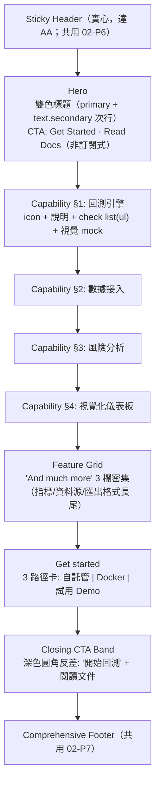

# 03_Templates — 頁面模板規格

> Templates 是「半成品模型」。
> 做新功能頁，不是從空白開始，而是從模板改。

---

## 來源與差異化（Provenance）

> §2–§7 為 backtest_platform 自有的後台/行銷模板。**§8 Product Capability Page 萃取自 `cloning/clones/grok`（x.ai/grok 產品頁）**——grok 與 xai 共用 foundations/components/patterns（見 [`00`](./00_foundations_spec.md)/[`01`](./01_components_spec.md)/[`02`](./02_patterns_spec.md)），僅貢獻此產品頁 Template + Sitemap。
>
> grok 差異化（`clones/grok/differentiation.md`）：借其**資訊組織骨架**（能力分區 + 密集 feature grid + 三路徑上手 + 深色收尾），套 xai 已定的 teal/dark-first token。
> - **KEEP**：Capability Stack（統一節奏列能力）、Three-path Onboarding、Feature Grid 密集長尾、Closing CTA Band。
> - **DROP** `[override]`：訂閱式 CTA（Try Grok / SuperGrok）→ 改 `Get Started / Docs`；大量留白 → 收緊間距（工具受眾要密度）。
> - **IMPROVE**：每 capability section 語意 `<section aria-labelledby>`、check 列表用真 `<ul>`、三路徑卡整卡可 focus + Enter。

---

## 目錄

1. [模板使用原則](#1-模板使用原則)
2. [Dashboard Template](#2-dashboard-template)
3. [List Page Template](#3-list-page-template)
4. [Detail Page Template](#4-detail-page-template)
5. [Settings Page Template](#5-settings-page-template)
6. [Form / Wizard Template](#6-form--wizard-template)
7. [Landing Page Template](#7-landing-page-template)
8. [Product Capability Page Template（產品能力頁，grok 萃取）](#8-product-capability-page-template產品能力頁grok-萃取)
9. [Auth Page Template](#9-auth-page-template)
10. [Error Page Template](#10-error-page-template)
11. [Template Selection Guide](#11-template-selection-guide)

---

## 1. 模板使用原則

```
原則 1：模板是「約束」不是「裝飾」
  - 模板定義的是資訊架構和區塊排列，不是視覺風格
  - 視覺風格來自 00_Foundations 的 tokens

原則 2：模板可嵌套
  - Dashboard Template 內可嵌入 Data Table Pattern
  - Detail Template 內可嵌入 Form Pattern

原則 3：模板有 RWD 行為
  - 每個模板定義 Desktop / Tablet / Mobile 的 reflow 規則

原則 4：模板可組合
  - Sidebar Layout + List Template = 後台列表頁
  - Full Width + Landing Template = 行銷頁
```

---

## 2. Dashboard Template

### Layout

```
Desktop：
┌──────────────────────────────────────────────────┐
│ [Header: Logo + Nav + User Menu]          64px   │
├────────┬─────────────────────────────────────────┤
│        │ Page Title          [Action Button]     │
│        ├─────────────────────────────────────────┤
│ Sidebar│ ┌─────┐ ┌─────┐ ┌─────┐ ┌─────┐       │
│ 240px  │ │Stat │ │Stat │ │Stat │ │Stat │       │
│        │ │Card │ │Card │ │Card │ │Card │       │
│        │ └─────┘ └─────┘ └─────┘ └─────┘       │
│        ├─────────────────────────────────────────┤
│        │ ┌───────────────────┐ ┌───────────────┐ │
│        │ │                   │ │               │ │
│        │ │   Main Chart      │ │  Side Panel   │ │
│        │ │                   │ │               │ │
│        │ └───────────────────┘ └───────────────┘ │
│        ├─────────────────────────────────────────┤
│        │ ┌─────────────────────────────────────┐ │
│        │ │         Recent Activity Table       │ │
│        │ └─────────────────────────────────────┘ │
└────────┴─────────────────────────────────────────┘

Tablet：Sidebar 收合為 icon-only (64px)
Mobile：Sidebar 隱藏為 hamburger, Stat Cards 2→1 col, Side Panel 移到下方
```

### Spec

| 區塊 | 元件 | 規則 |
|------|------|------|
| Stat Cards | Card (4 個) | `grid-cols-4` → `grid-cols-2` → `grid-cols-1` |
| Main Chart | Chart Container | 佔 2/3 寬度，高度 320px |
| Side Panel | Card | 佔 1/3 寬度，放 Top 5 list 或 quick actions |
| Activity Table | Data Table | 最近 5-10 筆，有「查看全部」link |
| Page Title | text.heading.lg | 包含 Breadcrumb（若需要） |

### 內容規則

```
Stat Card 結構：
  ┌──────────────────┐
  │ 📊 Revenue       │ ← Label (caption)
  │ $12,580          │ ← Value (heading.lg, tabular-nums)
  │ ↑ 12.5%          │ ← Trend (success/error color)
  └──────────────────┘

  - 數字使用 tabular-nums（等寬數字）
  - Trend：正數綠 ↑ / 負數紅 ↓ / 持平灰 →
  - 比較期間寫在 tooltip 或 caption（vs 上月）
```

---

## 3. List Page Template

### Layout

```
Desktop：
┌──────────────────────────────────────────────────┐
│ [Header]                                         │
├────────┬─────────────────────────────────────────┤
│        │ Page Title           [+ Create] [⚙️]    │
│        ├─────────────────────────────────────────┤
│Sidebar │ [🔍 Search] [Filter ▼] [Sort ▼]         │
│        ├─────────────────────────────────────────┤
│        │ ┌─────────────────────────────────────┐ │
│        │ │ [Table / Card Grid]                 │ │
│        │ │                                     │ │
│        │ │                                     │ │
│        │ │                                     │ │
│        │ └─────────────────────────────────────┘ │
│        ├─────────────────────────────────────────┤
│        │ Showing 1-10 of 156   < 1 2 3 ... >    │
└────────┴─────────────────────────────────────────┘
```

### Spec

| 區塊 | 元件 | 規則 |
|------|------|------|
| Page Header | Title + CTA + Settings | CTA 用 Primary Button |
| Toolbar | Search + Filter + Sort | 水平排列，mobile 收合為 icon buttons |
| Content Area | Data Table 或 Card Grid | 使用 02_Patterns 的 Data Table Pattern |
| Pagination | Pagination component | 底部固定 |

### View 切換

```
某些列表支援 Table View ↔ Card Grid View 切換：
  ┌────────────────────────────────┐
  │ [☰ List] [▦ Grid]   View      │
  └────────────────────────────────┘
```

---

## 4. Detail Page Template

### Layout

```
Desktop：
┌──────────────────────────────────────────────────┐
│ [Header]                                         │
├────────┬─────────────────────────────────────────┤
│        │ ← Back to List                          │
│        ├─────────────────────────────────────────┤
│        │ [Avatar] Title          [Edit] [⋮]      │
│Sidebar │ Status: Active  |  Created: 2024-01-01  │
│        ├─────────────────────────────────────────┤
│        │ ┌──────────┬──────────┬──────────┐      │
│        │ │Overview ▬│ Activity │ Settings │      │
│        ├─┴──────────┴──────────┴──────────┤      │
│        │                                   │      │
│        │   Tab Content                     │      │
│        │                                   │      │
│        │   ┌────────────┐ ┌──────────────┐ │      │
│        │   │ Main (2/3) │ │ Aside (1/3)  │ │      │
│        │   └────────────┘ └──────────────┘ │      │
└────────┴───────────────────────────────────┘      │
```

### Spec

| 區塊 | 元件 | 規則 |
|------|------|------|
| Back link | Text link + ← icon | `← Back to {List Name}` |
| Header | Avatar + Title + Metadata + Actions | Actions 用 icon buttons 或 dropdown |
| Tabs | Tab component | 2-5 個 tabs |
| Main Content | 寬 2/3 | 主要資訊區 |
| Aside | 寬 1/3 | Metadata、Related items、Quick actions |
| Mobile | Aside 移到 main 下方 | 單欄 stack |

---

## 5. Settings Page Template

### Layout

```
Desktop：
┌──────────────────────────────────────────────────┐
│ [Header]                                         │
├────────┬─────────────────────────────────────────┤
│        │ Settings                                 │
│        ├──────────┬──────────────────────────────┤
│Sidebar │ Settings │ Section Title                │
│        │ Nav      │ Section description           │
│        │          │                              │
│        │ General ▬│ ┌──────────────────────────┐ │
│        │ Profile  │ │ Form Fields...           │ │
│        │ Team     │ └──────────────────────────┘ │
│        │ Billing  │                              │
│        │ Notif.   │ Section Title 2              │
│        │ Security │ ┌──────────────────────────┐ │
│        │          │ │ Form Fields...           │ │
│        │          │ └──────────────────────────┘ │
│        │          │                              │
│        │          │ ┌────────┐ ┌──────────────┐  │
│        │          │ │ Cancel │ │ Save Changes │  │
│        │          │ └────────┘ └──────────────┘  │
└────────┴──────────┴──────────────────────────────┘
```

### Spec

| 區塊 | 元件 | 規則 |
|------|------|------|
| Settings Nav | Vertical nav links | 左側 200px，sticky |
| Content | Form sections | 每個 section 有 title + description |
| Form Layout | 2/3 寬度 form | 不要佔滿全寬（太寬不好讀） |
| Save | Sticky bottom bar 或 section-level save | 顯示 unsaved changes indicator |
| Mobile | Settings Nav 轉為頂部 select 或 accordion | |

### Unsaved Changes

```
用戶修改後未儲存，離開前：
  ┌─────────────────────────────┐
  │ 你有未儲存的變更              │
  │                             │
  │ 離開此頁面將丟失你的變更。     │
  │                             │
  │  ┌──────────┐ ┌──────────┐  │
  │  │ 不儲存   │ │ 儲存並離開 │  │
  │  └──────────┘ └──────────┘  │
  └─────────────────────────────┘
```

---

## 6. Form / Wizard Template

### Single Page Form

```
┌──────────────────────────────────────────────────┐
│ [Header]                                         │
├──────────────────────────────────────────────────┤
│               max-width: 640px                   │
│                                                  │
│  Create New {Item}                               │
│  Fill in the details below.                      │
│                                                  │
│  ┌────────────────────────────────────────────┐  │
│  │ Form Section 1                             │  │
│  │ [Fields...]                                │  │
│  │                                            │  │
│  │ Form Section 2                             │  │
│  │ [Fields...]                                │  │
│  └────────────────────────────────────────────┘  │
│                                                  │
│  ┌──────────┐ ┌────────────────────────────────┐ │
│  │ Cancel   │ │        Create {Item}           │ │
│  └──────────┘ └────────────────────────────────┘ │
│                                                  │
└──────────────────────────────────────────────────┘
```

### Multi-Step Wizard

```
┌──────────────────────────────────────────────────┐
│ [Header]                                         │
├──────────────────────────────────────────────────┤
│                                                  │
│  ① Basic Info ── ② Configuration ── ③ Review     │
│                                                  │
│  ┌────────────────────────────────────────────┐  │
│  │ Step 1: Basic Info                         │  │
│  │                                            │  │
│  │ [Fields...]                                │  │
│  └────────────────────────────────────────────┘  │
│                                                  │
│            ┌──────────┐ ┌──────────────────┐     │
│            │ 上一步   │ │    下一步 →      │     │
│            └──────────┘ └──────────────────┘     │
│                                                  │
└──────────────────────────────────────────────────┘
```

### Spec

| 屬性 | 值 |
|------|-----|
| Form 最大寬度 | 640px（置中） |
| Section 間距 | `space.8` (32px) |
| Field 間距 | `space.5` (20px) |
| Footer | Sticky bottom（mobile）或 page bottom（desktop） |

---

## 7. Landing Page Template

### Layout

```
Full Width (no sidebar)：
┌──────────────────────────────────────────────────┐
│ [Top Nav]                                        │
├──────────────────────────────────────────────────┤
│                                                  │
│                   HERO SECTION                   │
│              Headline + Subline                  │
│           [Primary CTA] [Secondary]              │
│               Hero Image / Video                 │
│                                                  │
├──────────────────────────────────────────────────┤
│                                                  │
│               SOCIAL PROOF                       │
│         Logo bar / Testimonial strip             │
│                                                  │
├──────────────────────────────────────────────────┤
│                                                  │
│              FEATURES SECTION                    │
│       ┌──────┐ ┌──────┐ ┌──────┐                │
│       │Feat 1│ │Feat 2│ │Feat 3│                │
│       └──────┘ └──────┘ └──────┘                │
│                                                  │
├──────────────────────────────────────────────────┤
│                                                  │
│              HOW IT WORKS                        │
│          Step 1 → Step 2 → Step 3                │
│                                                  │
├──────────────────────────────────────────────────┤
│                                                  │
│             PRICING SECTION                      │
│       ┌──────┐ ┌──────┐ ┌──────┐                │
│       │Free  │ │Pro ★ │ │Enterp│                │
│       └──────┘ └──────┘ └──────┘                │
│                                                  │
├──────────────────────────────────────────────────┤
│                                                  │
│            TESTIMONIALS                          │
│     ┌──────┐ ┌──────┐ ┌──────┐                   │
│     │Quote │ │Quote │ │Quote │                   │
│     └──────┘ └──────┘ └──────┘                   │
│                                                  │
├──────────────────────────────────────────────────┤
│                                                  │
│                FAQ SECTION                       │
│           [Accordion items]                      │
│                                                  │
├──────────────────────────────────────────────────┤
│                                                  │
│            FINAL CTA SECTION                     │
│          Headline + [CTA Button]                 │
│                                                  │
├──────────────────────────────────────────────────┤
│ [Footer: Links + Social + Legal]                 │
└──────────────────────────────────────────────────┘
```

### Section 規格

| Section | Padding | 背景 | 寬度 |
|---------|---------|------|------|
| Hero | `space.20` (80px) top/bottom | 可有背景色/漸層/圖片 | Full width |
| Features | `space.16` (64px) | 白色或淺灰 | Container (1280px) |
| Pricing | `space.16` (64px) | 對比背景色 | Container |
| Testimonials | `space.12` (48px) | 白色 | Container |
| FAQ | `space.12` (48px) | 淺灰 | Container (max 768px) |
| Final CTA | `space.16` (64px) | Brand color bg | Full width |

---

## 8. Product Capability Page Template（產品能力頁，grok 萃取）

> 來源：`cloning/clones/grok/analysis/L3_templates.md` + `L4_sitemap.md`。對應原型「AI Product Capability Page」。
> 用途：backtest_platform 的**功能介紹頁 / 上手引導頁**——用能力分區 + 密集網格 + 三路徑上手，向量化開發者展示「這個回測平台能做什麼」並促轉換。
> 與 §7 Landing 的差異：Landing 賣「廣度」（公司、多區塊交替）；本模板賣「深度」（單一產品能力堆疊 + 轉換）。

### Layout（區塊堆疊順序）



### Section 規格

| 區塊 | Pattern 引用 | 規則 | 來源 / 差異 |
|------|--------------|------|------------|
| Header | 02-P6 Sticky Glass | **實心/加深底色達 AA**（非毛玻璃） | `[override]` |
| Hero | 02-P1 Typography-led | 雙色標題：主行 `color.text.primary` + 次行 `color.text.secondary`（≥ AA，**非 x.ai .45 淺灰**）；CTA 一對 8px-radius 按鈕 | `[override]` |
| Capability ×4 | 02-P2 Alternating Feature | 統一結構：line icon + h3 + 說明 + `<ul>` check list + 右側視覺；逐段左右對調；每段 `<section aria-labelledby>` | `[inspired by: grok]` + IMPROVE |
| Feature Grid | 02-P4 Card Grid 變體 | 3 欄密集（icon + 短標 + 說明），flat 卡、hover 邊框加深 | `[inspired by: grok]` |
| Get started | 三路徑 Gateway（02-P5 變體） | 3 卡：**自託管 / Docker / 試用 Demo**（取代 grok 的 Open Grok/Sign in/Start chatting）；整卡可 focus + Enter 觸發主 CTA | `[override]` + IMPROVE |
| Closing CTA Band | grok CTA Band | 深色圓角反差條，收尾導向「開始回測 / 閱讀文件」 | `[inspired by: grok]` |
| Footer | 02-P7 | 共用 | `[inspired by: xai]` |

### 內容映射（grok → backtest_platform）

| grok 能力分區 | 我方對應能力 |
|---------------|-------------|
| Chat | 回測引擎（zipline event + vectorbt vector） |
| Multi-agent | 數據接入（FinLab / FinMind bundle） |
| Search | 風險分析（PBO / DSR / WFA 統計驗證） |
| Imagine | 視覺化儀表板（Streamlit + Grafana 面板 A–E） |

### RWD

```
Capability section：desktop 左右兩欄 → <1024px stack（視覺在上或下）
Feature grid：3 → 2 → 1 欄
Get started：3 → 1 欄堆疊
留白：section 間距採 data-dense 48px（非 grok/xai 的 96–128px）[override]
```

### 對應 Sitemap（L4）

```
/features（產品總覽）
  ├── 能力分區 ×4（錨點 in-page）
  ├── Feature grid
  └── Get started（自託管 / Docker / Demo）
開發者出口 → /docs（Read Docs）、CLI 範例
```

---

## 9. Auth Page Template

```
┌──────────────────────────────────────────────────┐
│                                                  │
│  ┌───────────────────┬────────────────────────┐  │
│  │                   │                        │  │
│  │    Brand Visual    │    Auth Form           │  │
│  │    / Illustration  │    (Login / Register)  │  │
│  │                   │                        │  │
│  │    [Logo]         │    [Form Component]    │  │
│  │    [Tagline]      │                        │  │
│  │                   │                        │  │
│  └───────────────────┴────────────────────────┘  │
│                                                  │
└──────────────────────────────────────────────────┘

Mobile：隱藏 Brand Visual，只顯示 Logo + Form
```

---

## 10. Error Page Template

```
┌──────────────────────────────────────────────────┐
│ [Header (minimal)]                               │
├──────────────────────────────────────────────────┤
│                                                  │
│              ┌──────────────┐                    │
│              │  [Illustration]                   │
│              └──────────────┘                    │
│                                                  │
│               404 / 500                          │
│           找不到這個頁面                           │
│     你要找的頁面可能已被移動或刪除。                  │
│                                                  │
│         ┌──────────┐ ┌──────────┐                │
│         │ 回首頁   │ │ 回上一頁  │                │
│         └──────────┘ └──────────┘                │
│                                                  │
└──────────────────────────────────────────────────┘
```

### Error 頁面文案

| 代碼 | 標題 | 說明 |
|------|------|------|
| 400 | 請求有誤 | 請檢查你輸入的資訊是否正確。 |
| 401 | 需要登入 | 請登入後再試。 |
| 403 | 權限不足 | 你沒有存取此頁面的權限。 |
| 404 | 找不到頁面 | 你要找的頁面可能已被移動或刪除。 |
| 500 | 系統錯誤 | 我們正在處理中，請稍後再試。 |
| 503 | 維護中 | 系統正在進行維護，預計 {time} 恢復。 |

---

## 11. Template Selection Guide

**白話版：你要做什麼頁面 → 用什麼模板**

| 你要做的頁面 | 用這個模板 | 搭配的 Patterns |
|-------------|-----------|----------------|
| 後台總覽 / 首頁 | Dashboard | Stat Cards + Chart + Recent Table |
| 用戶列表 / 訂單列表 / 商品列表 | List Page | Data Table + Search + Filter |
| 用戶詳情 / 訂單詳情 / 文章內容 | Detail Page | Tabs + Content Sections |
| 系統設定 / 個人設定 / 偏好 | Settings Page | Sidebar Nav + Form Sections |
| 新增項目 / 編輯項目 | Form | Single/Multi Column Form |
| 多步驟流程（註冊、結帳） | Wizard | Stepper Form |
| 產品首頁 / 行銷頁 | Landing Page | Hero + Features + Pricing + CTA |
| **功能介紹頁 / 上手引導頁** | **Product Capability Page** | Capability Stack + Feature Grid + 三路徑 Onboarding + Closing CTA |
| 登入 / 註冊 / 忘記密碼 | Auth Page | Auth Form Pattern |
| 404 / 500 / 維護中 | Error Page | Error State Pattern |

---

## Figma 結構建議

```
📁 03_Templates（Figma Page）
├── 📄 Dashboard Template
│   ├── Desktop layout
│   ├── Tablet layout
│   └── Mobile layout
├── 📄 List Page Template
│   ├── Table view
│   ├── Card Grid view
│   └── Mobile card list
├── 📄 Detail Page Template
├── 📄 Settings Page Template
├── 📄 Form Templates
│   ├── Single Page Form
│   └── Multi-Step Wizard
├── 📄 Landing Page Template
│   └── All sections
├── 📄 Auth Page Template
│   ├── Login
│   └── Register
└── 📄 Error Pages
    ├── 404
    ├── 500
    └── Maintenance
```

---

**版本**：v2.0（2026-06-02：新增 §8 Product Capability Page Template，萃取自 grok clone）
**最後更新**：2026-06-02
**來源**：`cloning/clones/grok/analysis/L3_templates.md` + `L4_sitemap.md` + `clones/grok/differentiation.md`
**相關文件**：`02_patterns_spec.md`（Pattern 引用）、`pages/page_template.md`（Page Spec 模板）
