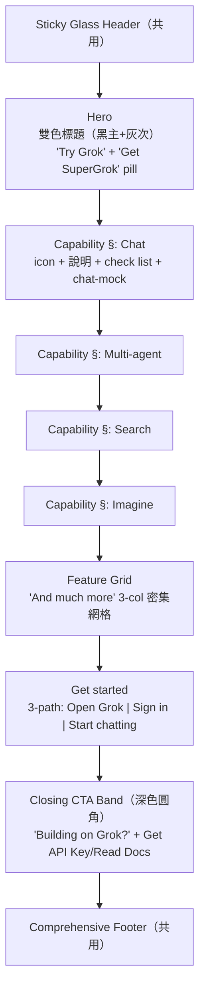

# L3 Templates — grok

> 對齊 `03_templates_spec.md` ｜ 來源：https://x.ai/grok ｜ 2026-06-01
> 共用 foundations/components 見 ../../xai。本檔為**產品能力頁**模板（與 xai 首頁的 corporate-landing 不同）。

---

## Template：Product Capability Page（產品能力頁）

### 區塊規格

| 區塊 | Pattern | 備註 |
|------|---------|------|
| Hero | xai-P1 變體 | 雙色標題（primary + muted 次行） |
| Capability ×4 | P-G1 | 統一結構，左右可交替 |
| Feature Grid | P-G2 | 3 欄密集，icon+短標+說明 |
| Get started | P-G3 | 3 路徑卡 |
| CTA Band | P-G4 | 深色圓角，反差收尾 |
| Footer | xai-P7 | 共用 |

### 與 xai Landing 的差異
- xai 首頁：交替大區塊 + stat band + news grid（**廣度**，賣公司）。
- grok 產品頁：能力分區堆疊 + 密集 feature grid + 三路徑上手（**深度**，賣產品 + 促轉換）。

### RWD
- Capability section：desktop 左右兩欄 → <1024px stack。
- Feature grid：3 → 2 → 1 欄。
- Get started：3 → 1 欄堆疊。

## 覆蓋度
≥ 1 template 含 Mermaid ✅。
