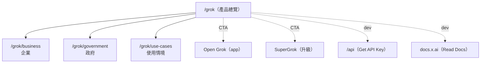

# L4 Sitemap — grok

> 來源：https://x.ai/grok 內部連結 ｜ 2026-06-01

---

## Grok 產品分區

## 功能分區

| 區 | 路由 | 受眾 | 轉換目標 |
|----|------|------|----------|
| 產品總覽 | `/grok` | 一般使用者 | Try Grok / SuperGrok |
| 垂直市場 | `/grok/business`, `/grok/government` | 企業/政府採購 | Contact Sales |
| 情境 | `/grok/use-cases` | 評估者 | 教育 → 轉換 |
| 開發者出口 | `/api`, `docs.x.ai` | 開發者 | Get API Key |

## 對應 `WEBSITE_MODULE_MATRIX.md` 原型
- 對應原型：**「Product Capability / Feature Page」** — 單一產品的能力展示 + 多受眾分流 + 三路徑上手。
- 可作為 `references/website_recipes.md` 新增原型：**"AI Product Capability Page"**。

## 信心度
| 項目 | 信心度 |
|------|--------|
| 路由 | high（DOM 連結） |
| 分區/轉換目標 | med（依語意推斷） |
