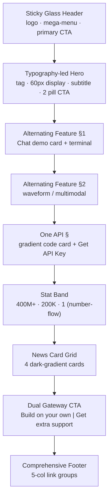

# L3 Templates — xai

> 對齊 `03_templates_spec.md` 結構
> 來源：https://x.ai/ ｜ 擷取日期：2026-06-01
> Template = page-level 區塊組合骨架。

---

## Template A：Corporate / Product Landing（首頁）

頁面層級的區塊堆疊順序：

### 區塊規格

| 區塊 | Pattern 引用 | 關鍵 token |
|------|--------------|-----------|
| Header | L2-P6 | `--site-header-h:64px`, glass blur 12px |
| Hero | L2-P1 | `font.display 60/500`, pill CTA |
| Feature ×N | L2-P2 | `grid-cols-2`@lg, line icons |
| One API | L2-P8 | codeblock #121212, GeistMono, sunset gradient |
| Stat Band | L2-P3 | display 大數字 + number-flow |
| News | L2-P4 | card grid, 16:9 dark thumb |
| Gateway | L2-P5 | dual card + check list |
| Footer | L2-P7 | 5-col, 14px muted |

**留白哲學**：每個 section 之間 96–128px（desktop）空白；內容寬度受限置中，兩側留白佔比高 → 「呼吸感」是此模板的靈魂。

## Template B：Stat / Trust Section（可重用片段）

3 欄量級數據，可嵌入任何頁。對應後續產品的「績效指標」場景。

## 狀態 / RWD 規則

- 所有 section：desktop 多欄 → <1024px stack。
- Header：>1024px mega-menu → 以下 hamburger drawer。
- CTA pill：尺寸不變，僅排列由橫→直。

## 覆蓋度

≥ 1 個 template 含 Mermaid ✅。
