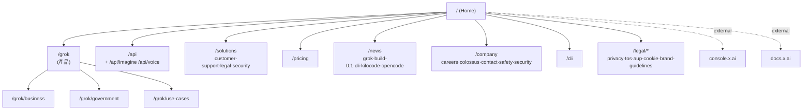

# L4 Sitemap — xai

> 新增層（無對應 00–03 spec），記錄頁面層級 + 路由 + 功能分區
> 來源：https://x.ai/ 內部連結擷取 ｜ 擷取日期：2026-06-01

---

## 路由地圖（從 dom.html 內部連結抽取）

## 功能分區

| 區 | 路由 | 受眾 |
|----|------|------|
| 產品 | `/grok`, `/grok/business`, `/grok/government`, `/grok/use-cases` | 終端/企業/政府 |
| 開發者 | `/api`, `/cli`, `console.x.ai`, `docs.x.ai` | 開發者 |
| 解決方案 | `/solutions/*` | 企業決策者 |
| 商務 | `/pricing`, `/contact-sales` | 採購 |
| 公司 | `/company`, `/careers`, `/colossus`, `/safety`, `/security` | 求職/媒體 |
| 法務 | `/legal/*` | 合規 |
| 內容 | `/news/*` | 全體 |

## 對應 `WEBSITE_MODULE_MATRIX.md` 原型

- 本站對應原型：**「AI 產品公司官網 / Developer-product Landing」** — 結合 marketing landing + developer portal 入口 + 企業 solutions。
- 可作為 `references/website_recipes.md` 新增原型：**"Frontier-AI Company Site"**（typography-led landing + console/docs 外連 + 多受眾分流）。

## 信心度

| 項目 | 信心度 | 說明 |
|------|--------|------|
| 路由清單 | high | 直接從 DOM 連結抽取 |
| 功能分區 | high | 路由語意明確 |
| 原型對應 | med | 需對照 matrix 既有原型確認命名 |
