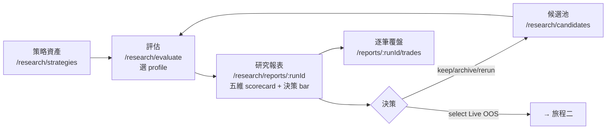
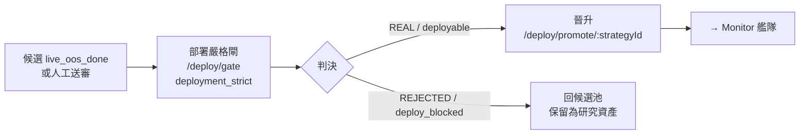

# Rebuild IA 規格 — 五 zone 三旅程資訊架構

> **日期**：2026-07-03 · **rebuild Goal 1**（Product IA / UX Redesign Specification，純文檔）
> **Worktree / 分支**：`docs/rebuild-ia-spec` @ base `6e29e1a`（origin/main）
> **上游規格**：`rebuild_goal_spec_ai_requirements_2026-07-03.md` Goal 1（Target IA 表）+ §5–§7（rebuild 工作區文件，未入 repo）
> **輸入**：
> - 產品重定位報告 `product_repositioning_research_plan_2026-07-03.md`（rebuild 工作區文件）
> - FinLab teardown `finlab_studio_feature_teardown_2026-07-03.md`（rebuild 工作區文件）
> - Goal 0 audit：[`dev_docs/ui_audit/current_2026-07-03/ux_findings.md`](../ui_audit/current_2026-07-03/ux_findings.md) + `manifest.json`（每頁 reuse 建議，已入 repo）
> - 現有 IA：`frontend/src/app/nav.ts`、`frontend/src/router.tsx`、[`04_finlab_studio_benchmark_plan.md`](./04_finlab_studio_benchmark_plan.md)
> - 契約：[`dev_docs/contracts/README.md`](../contracts/README.md)（候選池狀態機、evaluate/report/candidate/live-oos 端點）
>
> **交付形態**：本檔是 IA 藍圖，供 Wave B/C 前端實作「照抄」。不動程式碼、不畫 mockup。每個新頁的資料需求都錨定到**已存在端點**或 `dev_docs/contracts` 契約；尚未有後端者標 `待 Goal N`。

---

## 0. 設計原則錨定（不可違反）

新 IA 沿用既有四條原則，任何頁面設計與此衝突即為錯誤：

| # | 原則 | IA 落地要求 |
| :-: | :--- | :--- |
| 1 | **Grok 單色 dark** | 全站單一深色主題、數字用 Geist Mono 右對齊（`MetricCell`）。不引入彩色儀表板風。 |
| 2 | **Gate 不消費化** | 部署判決留在 Deployment zone 的 `deployment_strict`。Report Viewer 的五維 scorecard **只呈現 per-metric `pass/warn/fail/not_available`，不用 FinLab 式單一 0–100 分數取代 gate**（契約 §4.1、重定位 §7.4）。scorecard 是「弱在哪一維」的診斷，不是可炫耀的總分。 |
| 3 | **Authoring-first** | 資料卡=策略作者字典（`/system/data` 維持現狀）；策略/候選=研究資產。快取、staleness、血統 hash **不進 UI**（04 §2.3）。 |
| 4 | **驗證判決導向，非報酬排行** | 艦隊與候選池以 verdict / 多維狀態排序，**不是 Sharpe leaderboard**（ADR-022 反跨人排行；自家策略體檢表是另一物種）。 |

新增第 5 條（本次重定位核心）：

| 5 | **研究資產不是消耗品** | 好、壞、負向、失敗教材策略全部保留可查（`archived` 仍可搜尋，永不刪除）。三旅程明確分離，嚴格 gate 不再是研究第一體驗（global acceptance #4/#8）。 |

---

## 1. 目標 sitemap（五 zone）

zone 順序：**Research（研究分流主軸）→ Live OOS（人工勾選昂貴驗證）→ Deployment（部署級嚴格閘）→ Monitor（已配資本艦隊）→ System**。首頁為 root cockpit。

> **URL 命名**：UI route 以 zone 為前綴（`/research/…`、`/live-oos/…`、`/deploy/…`、`/monitor/…`、`/system/…`），與 nav zone 一一對應。**API 端點路徑不變**（仍為契約命名空間，如候選池 API 是 `/research/candidates`，OOS 佇列 API 是 `/research/live-oos/queue`）—— UI route ≠ API path 是既有慣例（如 `/monitor` 頁呼叫 `/monitor/fleet` API）。
>
> **資料源標記**：`存在` = Goal 0 audit 已確認後端在跑；`契約` = `dev_docs/contracts` 已有 schema/fixture，前端可先吃 fixture；`待 Goal N` = 尚無後端亦無契約。

### 1.0 Root

| Route | Nav label（zh / en） | 目的 | Primary action | Secondary actions | 資料需求 | 四態 |
| :--- | :--- | :--- | :--- | :--- | :--- | :--- |
| `/` | 首頁 / Home | 跨 zone cockpit + 「跑第一個策略」onboarding | 進入 Candidate Pool 或 Evaluate | 最近 runs、研究狀態卡、跳各 zone | `GET /home/recent`、`/home/research-status`（**存在**） | E: onboarding 引導卡；L: skeleton；X: 降級為靜態捷徑；D: 最近評估 + 候選摘要 |

> Home ribbon 由 `假設→回測→比較→守門→晉升`（工作流軸）改為 `資產→評估→報表→候選→OOS/部署`（資產/報表/候選軸）—— audit finding #5 指出舊 ribbon 與重定位任務相悖。

### 1.1 Research zone — 研究分流（Triage）

主 nav 項：策略資產、評估、候選池、評估設定檔、比較。其餘為 context/detail route。

| Route | Nav label（zh / en） | 目的一句話 | Primary action | Secondary actions | 資料需求 | 資料源 |
| :--- | :--- | :--- | :--- | :--- | :--- | :--- |
| `/research/strategies` | 策略資產 / Strategy Assets | 以策略為軸的研究資產清單（假設、機制、最新報表、候選狀態、下一步） | `Evaluate` 某策略 | 搜尋/篩選、開詳情、開 notebook | `GET /strategies`（**存在**，dev proxy 404 見 §4）× `/runs` × `/monitor/watch` | 存在 |
| `/research/strategies/:name` | 策略資產詳情 / Strategy Detail | 單策略聚合：型錄 header + 假設/機制 + 判決時間線 + 候選生命週期 + runs 證據 | `Evaluate`（選 profile） | 看 report、看 runs、Open-in-notebook、決策紀錄 | `GET /strategies`、`/runs`、`/research/candidates/:id`（**契約 待 Goal 4**）| 存在 + 契約 |
| `/research/evaluate` | 評估 / Evaluate | 選 strategy + evaluation profile + overrides，一鍵送評估 | 送出 `evaluate` | 存草稿、切 profile、進 sweep（grid 時） | `GET /research/profiles`（**契約 待 Goal 2**）、`POST /research/evaluate`（**契約 待 Goal 3**）；過渡期 `POST /runs`（**存在**）| 契約（過渡吃既有）|
| `/research/candidates` | 候選池 / Candidate Pool | 粗掃後的半自動決策中心：所有評估結果（含失敗）多維排序、批次決策、勾選 Live OOS | keep / archive / rerun / **select Live OOS** | 篩選 state、開 report、開策略詳情 | `GET /research/candidates`（**契約 待 Goal 4**，fixture `candidate_pool.example.json`）、`POST …/decision`、`POST …/select-live-oos` | 契約 |
| `/research/reports/:runId` | 研究報表 / Report Viewer | FinLab-style 研究證據包：headline banner + 五維 scorecard + sheet 分頁 + 交易連動 + gate 證據 + 決策 bar | 決策（keep/archive/rerun/select Live OOS/開嚴格閘） | 切 scorecard sheet、跳 Trade Review、Open-in-notebook | `GET /research/evaluations/:id/report`（**契約 待 Goal 3**）；**現可吃** `GET /runs/:id/report`（**存在**，v1 超集相容 契約 §5）+ `/runs/:id/equity` | 存在 + 契約 |
| `/research/reports/:runId/trades` | 逐筆覆盤 / Trade Review | 報表底下的證據 drilldown：K 線 + equity + 逐筆交易，與報表共用 filter context | 點年月/回撤區段篩交易 | 匯出、回報表 | `GET /runs/:id/candles`、`/runs/:id`（**存在**）；per-trade MAE/MFE 欄 **待 Goal**（trades schema P1 blocker，契約 §11 #8） | 存在（部分待補欄）|
| `/research/compare` | 分支比較 / Compare | 多 run / 分支 delta 比較（從 report/candidate 進入，非裸 nav） | 選 run_ids 比較 | 加入比較、切指標 | `?run_ids=` 驅動、`/runs/:id`（**存在**）| 存在 |
| `/research/runs` | 判決總帳 / Verdict Ledger | 時序 run/判決總帳（審計與血統索引，降為次要證據） | 開某 run 的 report | 篩 strategy/verdict、匯出 | `GET /runs`（**存在**）| 存在 |
| `/research/sweep` | 參數掃描 / Parameter Sweep | `grid_search_selection` profile 的 optional DOE 原語（脫離主 nav，由 Evaluate 情境進入） | 估算/送 sweep | 看 grid、heatmap | `GET /runs/estimate`（**存在**）| 存在 |
| `/research/profiles` | 評估設定檔 / Evaluation Profiles | 四內建 profile 型錄（quick_triage / fixed_hypothesis_oos / grid_search_selection / deployment_strict）+ 各 severity/門檻檢視 | 選 profile 去 Evaluate | 看 gate 規則、看哪些策略在用 | `GET /research/profiles`、`/profiles/:name`（**契約 待 Goal 2**，fixture 由 schema examples）| 契約 |
| `/research/branches` | 分支實驗 / Branch Experiments | 策略改動＝可比較分支（parent-child lineage + diff + 對照）| 建分支跑 quick_triage | 看 diff、比對 parent | `待 Goal 9`（branch model 尚未定義）| 待 Goal 9 |

**四態驗收（Research zone 新頁）**

| Route | Empty | Loading | Error | Data |
| :--- | :--- | :--- | :--- | :--- |
| `/research/strategies` | 顯示「尚無策略資產，去建立」引導；**不得**紅色錯誤 banner（audit finding #1）| 卡牆 skeleton | proxy/404 降級為「型錄暫不可用」+ 重試，仍可列本地 registry | 每卡：名稱、假設短名、最新 profile、候選 state、下一步 |
| `/research/evaluate` | profile picker 預設 `quick_triage`，strategy 未選時 disable 送出 | profile/strategy 型錄 skeleton | profile API 失敗 → fallback 四內建（fixture）；strategy 型錄失敗仍可手填 | 選定後顯示 profile 摘要（跑什麼、產什麼、severity）|
| `/research/candidates` | 「尚無候選；先 Evaluate 一個策略」引導 | 表格 skeleton | 契約未落地 → 明示 fixture/示範模式 banner | 多維表：state、label、Sharpe/MDD/trades/turnover、survivorship flag、報表連結、Live OOS checkbox |
| `/research/reports/:runId` | 有 run 無 report pack → 顯示 v1 相容欄 + 未產區塊標 `not_available`（規則 #6，不留無說明 placeholder）| headline + scorecard skeleton | run 不存在 → 優雅 404「找不到資源」；不白屏 | 第一屏答三問：哪個策略/run、表現如何、建議下一步；scorecard per-metric pass/warn/fail |
| `/research/profiles` | fixture 恆有四內建 → 不會真空 | 卡片 skeleton | API 失敗 → 吃內建 fixture，標示離線 | 四卡：定義、wraps_primitives、gates severity、runtime 量級 |

### 1.2 Live OOS zone — 人工勾選昂貴驗證

主 nav 項：OOS 佇列、觀察艙。Review 為 detail route。

| Route | Nav label（zh / en） | 目的一句話 | Primary action | Secondary actions | 資料需求 | 資料源 |
| :--- | :--- | :--- | :--- | :--- | :--- | :--- |
| `/live-oos/queue` | OOS 佇列 / Live OOS Queue | 所有被人工勾選、待跑/正跑昂貴驗證的佇列（paper_replay / paper_watch_berth / after_close），帶勾選 audit | 開佇列項覆核 | 篩 state、暫停/取消、回候選 | `GET /research/live-oos/queue`（**契約 待 Goal 10**，fixture `live_oos_queue.example.json`）| 契約 |
| `/live-oos/queue/:id` | OOS 覆核 / OOS Review | 單佇列項詳情＝觀察進度（window/days_remaining）→ 完成後的覆核報表入口 | 觀察完 → 重評 / 送嚴格閘 | 看 audit reason、回報表、回策略 | `GET /research/live-oos/queue`、`GET /monitor/watch`（berth，**存在**）| 存在 + 契約 |
| `/live-oos/watch` | 觀察艙 / Watch Sessions | ADR-033 Paper-Watch berth 觀察艙（DSR band、90 天、≤2 席）—— 由 Monitor 移入 | 看 berth 進度 | 排程總覽、回佇列 | `GET /monitor/watch`（`watch_registry`，**存在**）| 存在 |

**四態驗收**

| Route | Empty | Loading | Error | Data |
| :--- | :--- | :--- | :--- | :--- |
| `/live-oos/queue` | 「尚無勾選；到候選池 select Live OOS」引導 | 表格 skeleton | 契約未落地 → fixture 示範 banner | 每項：strategy、observation.kind、state、選擇理由、override 標記、回報表連結 |
| `/live-oos/queue/:id` | 佇列項不存在 → 404 | 進度 skeleton | 降級為佇列摘要 | 觀察窗進度條 + 到期日 + 完成後覆核 CTA |
| `/live-oos/watch` | 「無觀察艙席位」空態（既有） | 既有 skeleton | 既有降級 | berth 卡：DSR 標尺、enrolled/expiry、observed_days |

### 1.3 Deployment zone — 部署級嚴格閘

主 nav 項：部署嚴格閘。Promote 為 per-strategy detail。

| Route | Nav label（zh / en） | 目的一句話 | Primary action | Secondary actions | 資料需求 | 資料源 |
| :--- | :--- | :--- | :--- | :--- | :--- | :--- |
| `/deploy/gate` | 部署嚴格閘 / Strict Gate | `deployment_strict` profile：two-stage gate 規格 + 對某策略跑嚴格判決（survivorship/PBO/DSR/WFA/slippage/sizing）—— 由 Research 移入，不再是研究第一體驗 | 對候選跑嚴格閘 | 看門檻規格、看歷次判決 | `GET /gate/spec`（**存在**）、`GET /research/evaluations/:id`（profile=deployment_strict，**契約 待 Goal 3**）| 存在 + 契約 |
| `/deploy/promote/:strategyId` | 晉升 / Promote | 通過嚴格閘後的資本配置晉升流程 + audit trail | 執行晉升 | 看 audit、回策略 | `GET /research/promote/:id`、`/research/promote/:id/audit`（**存在**）| 存在 |

**四態驗收**

| Route | Empty | Loading | Error | Data |
| :--- | :--- | :--- | :--- | :--- |
| `/deploy/gate` | 未指定策略 → 顯示門檻規格（唯讀）| 規格 skeleton | `/gate/spec` 失敗降級靜態文案 | 四條 hard-fail 燈號 + DSR 標尺 + 判決卡 |
| `/deploy/promote/:strategyId` | roster 空 → 預設「晉升流程」說明（既有）| audit skeleton | 既有降級 | 晉升步驟 + audit trail |

### 1.4 Monitor zone — 已配資本艦隊（telemetry）

| Route | Nav label（zh / en） | 目的一句話 | Primary action | Secondary actions | 資料需求 | 資料源 |
| :--- | :--- | :--- | :--- | :--- | :--- | :--- |
| `/monitor` | 策略艦隊 / Fleet | 已配資本策略體檢表（verdict-first，非報酬排行）| 開策略詳情 | 自訂排序、篩選 | `GET /monitor/fleet`、`/portfolio-summary`（**存在**，daemon 餵資料才亮）| 存在 |
| `/monitor/performance` | 績效總覽 / Performance | live equity/KPI 總覽 | — | 切期間 | `GET /performance/equity`、`/performance/kpi`（**存在**）| 存在 |
| `/monitor/positions` | 部位狀態 / Positions | 當前部位快照 | — | 篩 sleeve | `GET /positions/snapshot`（**存在**）| 存在 |
| `/monitor/signals` | 訊號日誌 / Signals | 訊號 / 成交日誌 | — | 篩日期 | `GET /signals`、`/fills`（**存在**）| 存在 |
| `/monitor/risk` | 風控指標 / Risk | 風控指標與熔斷狀態 | — | — | `GET /risk/metrics`（**存在**）| 存在 |

**四態**：五頁皆 telemetry-backed，目前 `data_source: pending`（無 daemon）。空態＝現行四態頁模式（audit：皆乾淨空態，無問題）；data 態待 daemon 餵。維持現狀，本 IA 不改。

### 1.5 System zone

| Route | Nav label（zh / en） | 目的一句話 | Primary action | Secondary actions | 資料需求 | 資料源 |
| :--- | :--- | :--- | :--- | :--- | :--- | :--- |
| `/system/data` | 資料字典 / Data Dictionary | 資料卡牆（authoring-first：全目錄 + 本地有無 + 策略反向索引）| 複製 `data.get(...)` / 下載到本地 | 搜尋、分類篩 | `GET /system/datasets`、`/system/bundles`（**存在**）| 存在 |
| `/system/alerts` | 告警設定 / Alerts | 告警規則 + 通道 + 風控規格 | 編輯規則 | 測試通道 | `GET /alerts/rules`、`/alerts/channels`、`/risk/spec`（**存在**）| 存在 |
| `/system/settings` | 門檻設定 / Threshold Settings | evaluation profile 門檻/severity 編輯器（gate policy 資料化）| 編門檻 | — | `待 Goal`（重定位 Phase 6 gate 資料化）| 待 Goal 6 |

**四態**：`/system/data` 為 audit 最豐富的 data-state 頁，維持現狀；`/system/settings` 為 deferred 節點，落地前不出現在 nav。

### 1.6 Sitemap 統計

| Zone | 主 nav 頁 | detail/context/deferred | 合計節點 |
| :--- | :-: | :-: | :-: |
| Root | 1（Home）| 0 | 1 |
| Research | 5（策略資產/評估/候選池/設定檔/比較）| 6（策略詳情、報表、逐筆、判決總帳、掃描、分支實驗†）| 11 |
| Live OOS | 2（佇列/觀察艙）| 1（覆核 detail）| 3 |
| Deployment | 1（嚴格閘）| 1（晉升 detail）| 2 |
| Monitor | 5（艦隊/績效/部位/訊號/風控）| 0 | 5 |
| System | 2（資料/告警）| 1（門檻設定†）| 3 |
| **合計** | **16** | **9** | **25** |

† = deferred（`待 Goal`），不進 Wave B/C 首批 nav。

---

## 2. 現有 20 路由 migration mapping

裁決碼：**保留**（原樣）／**改造**（同 path 升級）／**移 zone**（換 URL 前綴）／**併入/重導**（退役 path→ 新 path）／**退役**（移除）。

| # | 現有 route | 現況（audit） | 裁決 | 目標 | 理由 |
| :-: | :--- | :--- | :--- | :--- | :--- |
| 1 | `/` | Home cockpit + onboarding | **改造** | `/` | shell/onboarding 佳，僅 re-point ribbon CTA 到資產/報表/候選軸 |
| 2 | `/research/strategies` | StrategyHubListPage（策略軸型錄）| **改造** | `/research/strategies` | F 波已把軸從 run→策略；補假設/機制/next-action（Goal 7）|
| 3 | `/research/strategies/:name` | StrategyHubDetailPage（F 波新增）| **改造** | `/research/strategies/:name` | 作策略資產詳情，**吸收候選生命週期**（見 §2.1 裁決 B）|
| 4 | `/research/runs/new` | NewRunPage（表單強）| **併入/重導** | → `/research/evaluate` | 表單復用為 Evaluate 內的 run config；加 profile 層在其上 |
| 5 | `/research/runs` | 判決 ledger 表 | **保留（降級）** | `/research/runs` | 續作審計/血統總帳，改為次要證據，脫離主 nav 前排 |
| 6 | `/research/runs/:id` | RunReportPage（flagship）| **併入/重導** | → `/research/reports/:runId` | 見 §2.1 裁決 A：Report Viewer 為主，`runs/:id` 重導 |
| 7 | `/research/runs/:id/trades` | TradeReviewPage（K 線）| **移路徑/重導** | → `/research/reports/:runId/trades` | 逐筆＝報表底下的證據 drilldown，跟報表同 id 空間 |
| 8 | `/research/compare` | ComparePage（裸 mount 無 API）| **改造** | `/research/compare` | 保留，但改由 report/candidate 進入，非裸 nav（audit #P2）|
| 9 | `/research/sweep` | SweepPage（grid 原語）| **保留（降級）** | `/research/sweep` | optional grid_search 原語；脫離主 nav，Evaluate 情境進入 |
| 10 | `/research/validate` | ValidateGatePage（two-stage gate）| **移 zone** | → `/deploy/gate` | audit：嚴格閘不該是研究第一體驗（spec §6/§8），移 Deployment |
| 11 | `/research/promote/:strategyId` | PromotePage（晉升+audit）| **移 zone** | → `/deploy/promote/:strategyId` | 晉升屬資本配置，歸 Deployment zone |
| 12 | `/monitor` | FleetPage（艦隊）| **保留** | `/monitor` | Monitor 為已配資本艦隊，維持 |
| 13 | `/monitor/board` | **DEAD ROUTE → 404**（bug）| **退役** | —（移除 nav+route）| 不在 target IA Monitor 列；以移除解掉 audit #2 破鏈（或折入 Fleet）|
| 14 | `/monitor/watch` | WatchPage（Paper-Watch 艙）| **移 zone** | → `/live-oos/watch` | Paper-Watch 是零資本 OOS 觀察，語義屬 Live OOS 非 live 艦隊 |
| 15 | `/monitor/performance` | PerformancePage | **保留** | `/monitor/performance` | live 績效，維持 |
| 16 | `/monitor/positions` | PositionsPage | **保留** | `/monitor/positions` | live 部位，維持 |
| 17 | `/monitor/signals` | SignalsPage | **保留** | `/monitor/signals` | live 訊號，維持 |
| 18 | `/monitor/risk` | RiskPage | **保留** | `/monitor/risk` | live 風控，維持 |
| 19 | `/system/data` | DataPage（資料卡牆）| **保留** | `/system/data` | audit 最強 data-state 頁，authoring-first，維持 |
| 20 | `/system/alerts` | AlertsPage | **保留** | `/system/alerts` | 維持 |

**新增（不在 20 之列）**：`/research/evaluate`、`/research/candidates`、`/research/reports/:runId`(+`/trades`)、`/research/profiles`、`/research/branches`(†)、`/live-oos/queue`(+`/:id`)、`/deploy/gate`（承接 validate）、`/system/settings`(†)。

### 2.1 兩個關鍵裁決（明確理由）

**裁決 A — `runs/:id` vs `reports/:runId`：Report Viewer 為主，`runs/:id` 重導**

- Report pack 以 `run_id` 為鍵（契約 §5：`reports/research_runs/<run_id>/`），故 `reports/:runId` 與 `runs/:id` **共用同一 id 空間**，重導無損。
- 一個「run」和它的「report」是同一 artifact 的兩種視圖；為避免兩個報表頁，`/research/runs/:id` **client 重導** → `/research/reports/:runId`。
- F 波 `RunReportPage` v1 **原地升級**成新 path 的 Report Viewer（加 scorecards/sheets/decision bar）。
- `/research/runs`（**ledger 保留**）續作時序索引與審計；ledger 每列連到 report。逐筆 `runs/:id/trades` 同步移到 `reports/:runId/trades`（舊 path 重導）。

**裁決 B — 候選詳情不另開頁，折入策略資產詳情**

- 重定位報告 §8.3 曾提 `/research/candidates/:id`，但 audit 確認 `/research/strategies/:name` 已存在為「單策略聚合（型錄 header + 判決時間線 + watch pod）」。
- MVP 下 1 candidate ≈ 1 strategy asset；另開候選詳情頁會與策略詳情**打架**。
- 裁決：**候選池 `/research/candidates` 只作 pool 清單（決策 surface）**；候選生命週期（state、decisions[] trail、Live OOS recommendation）**折入策略資產詳情**的一個 section。`/research/candidates/:id` 若需要，作為 alias 導向策略詳情，不建第二個 detail 頁。此舉守 authoring-first（策略資產為唯一 detail 中心）。

---

## 3. 三段旅程明確分離（global acceptance #4）

三旅程各有獨立 zone、獨立入口、獨立頁面序列，互不前置綁死。**嚴格 gate 只出現在旅程三**，不擋研究第一步。

### 3.1 旅程一 — Research Triage（evaluate → report → candidate 決策）

> **一句話**：對任何策略跑可配置粗掃、立即取得五維報表、把好壞策略都放進候選池做人工決策。

頁面序列：`策略資產` →（選 profile）`評估` →`研究報表`（scorecard/sheet/交易連動）→ `決策`（keep/archive/rerun/select）→`候選池`。**失敗/負向策略同樣落 report 與候選池**（global #5），永不丟棄。

### 3.2 旅程二 — Live OOS（queue → watch → review）

> **一句話**：只有被候選池人工勾選的策略，才消耗昂貴的 paper replay / Paper-Watch 觀察資源，且留勾選 audit。

頁面序列：`候選池勾選` →`OOS 佇列`（待跑/正跑）→`觀察艙`（berth 進度）→`OOS 覆核`（窗口完成、待重評）。未勾選者**不自動跑** paper replay（global #7、契約 §7）。

### 3.3 旅程三 — Deployment（strict gate → promote）

> **一句話**：只有經人工挑選的候選，才進部署級嚴格閘；通過才配置資本。嚴格閘只管資本與 live queue，不刪研究資產。

頁面序列：`候選/送審` →`部署嚴格閘`（survivorship/PBO/DSR/WFA/slippage/sizing）→`判決` →（通過）`晉升` →`Monitor 艦隊`。`deploy_blocked` 者回候選池**保留**（不刪、可續研究）。

---

## 4. 與 F 波已落地資產的關係 + 過時假設修正

### 4.1 F 波資產 → 新 IA 節點的銜接

| F 波已落地資產 | 現況 | 新 IA 角色 | 銜接決策 |
| :--- | :--- | :--- | :--- |
| **Run Report v1**（`RunReportPage` + `GET /runs/:id/report`）| 判決卡 + 分段 equity/DD + 月熱圖（04 §3）| **Report Viewer**（Goal 5）| 原地升級：`RunReportPage` 搬到 `/research/reports/:runId`，v1 端點 **超集相容**新 report pack（契約 §5），先渲染既有欄、scorecard/sheet/decision bar 增量疊加；未產區塊標 `not_available` |
| **資料卡牆**（`DataPage` + `/system/datasets`）| authoring-first 資料字典（04 §2）| System/Data（**不動**）| 直接升級為新 IA System 節點，維持現狀；快取/血統續留 UI 外 |
| **策略中心**（`StrategyHubListPage`/`DetailPage` + `/strategies`）| 策略軸型錄 × runs × watch（#181 已退役舊 StrategyLibrary）| **策略資產**（Goal 7）+ 策略資產詳情 | List 補假設/機制/next-action；Detail 吸收候選生命週期 section（§2.1 裁決 B）|
| **判決 ledger**（`RunsTablePage` + `/runs`）| 判決總帳表 | 判決總帳（降級次要）| 保留為審計/血統索引，脫離 nav 前排 |
| **逐筆覆盤**（`TradeReviewPage` + candles）| K 線證據 drilldown（ADR-034 lightweight-charts）| Report Viewer 底下 Trade Review | 移到 `reports/:runId/trades`，作報表證據層（per-trade MAE/MFE 待 trades schema 補欄）|
| **Paper-Watch 觀察艙**（`WatchPage` + `watch_registry`）| ADR-033 零資本觀察艙 | Live OOS/觀察艙 | 移 zone 到 `/live-oos/watch`，作 Live OOS 佇列的 berth enforcement 層（契約 §7）|

> **Goal 7 落地實作註記（策略資產「Evaluate」CTA 過渡路由）**：策略資產清單/詳情的主要動作「Evaluate」目前**導向既有 `/research/runs/new?strategy=<name>`**——因 evaluate 後端目前僅 CLI（Goal 3 orchestrator），`/research/evaluate` UI 尚未落地（§1.1 標「契約 待 Goal」、§5.6 列為新增 route）。此路由與 §2 migration mapping #4「`runs/new` 併入/重導 → `/research/evaluate`」一致：New Run 表單即 evaluate 的過渡承載。待 `/research/evaluate`（加 profile 層）落地後，本 CTA 改導該新 path。候選生命週期 section 的資料源為 `GET /research/candidates`（#188 已上線真後端，非 fixture）。

### 4.2 過時規格假設修正記錄（來自 Goal 0 audit）

上游 spec §2.2 / §3.3 早於 F 波 merge，以下假設須修正：

1. **spec §3.3「Strategy Library 是 registry/run projection」** → **已過時**。F 波 hub 現為策略軸/型錄驅動，IA 位移**已開始**；但仍缺假設/機制/next-action，故 Goal 7（策略資產化）**仍有效**。
2. **spec §3.3「Run Report 只有 6 KPI + pending tear sheet」** → **部分過時**。Run Report **端點 v1 已存在**（判決卡 + 分段 equity/DD + 月熱圖）；但因 backend **零 seeded run**，其 data-state 強度 **無法從 baseline 驗證**。Report Viewer 重建照做，但需先 seed 一個 run 或用 fixture（spec §4.3）才有可比 before-image。
3. **spec §2.2 路由清單早於 F 波** → `/research/strategies/:name` 是 spec **未列的新路由**（策略資產詳情雛型已在）；`/monitor/board` 是 **DEAD ROUTE（bug）**，本 IA 裁決退役。
4. **`/strategies` dev-proxy 404**（audit top defect #1）→ 端點**存在**（後端正常回 11 KB），是 `vite.config.ts` `API_PREFIXES` 缺 `/strategies` 前綴的**設定 gap**，非 IA 問題。本 IA 假設 Wave B 修 proxy 後策略入口恢復；在此之前 `/research/strategies` 空/錯態須優雅降級（§1.1 四態），**不得**紅色錯誤 banner。

---

## 5. 導航結構改動清單（供 Wave B/C 照抄）

`nav.ts` 現為三 zone（`research | monitor | system`）；新增為**五 zone**。以下為逐項改動，實作時 `NavZone.zone` union 型別擴為 `'research' | 'live-oos' | 'deployment' | 'monitor' | 'system'`，i18n `nav` namespace 補對應 `zone.*` 與 `item.*` key（zh-TW + en）。

### 5.1 Research zone（items 改）

| 動作 | key | to | 說明 |
| :--- | :--- | :--- | :--- |
| 改 label | `item.strategies` | `/research/strategies` | 「策略中心」→「策略資產 / Strategy Assets」|
| **新增** | `item.evaluate` | `/research/evaluate` | 承接 `runsNew`，加 profile 層 |
| **新增** | `item.candidates` | `/research/candidates` | 候選池（新主畫面）|
| **新增** | `item.profiles` | `/research/profiles` | 評估設定檔型錄 |
| 改 label/降級 | `item.runs` | `/research/runs` | 「Runs Table」→「判決總帳 / Verdict Ledger」，排後 |
| 保留 | `item.compare` | `/research/compare` | 「分支比較 / Compare」 |
| **移除** | `item.runsNew` | ~~`/research/runs/new`~~ | 併入 Evaluate（path 重導）|
| **移除** | `item.sweep` | ~~`/research/sweep`~~ | 脫離主 nav，Evaluate 情境進入（route 保留）|
| **移出 zone** | `item.validate` | ~~`/research/validate`~~ | → Deployment zone（見 5.3）|

### 5.2 Live OOS zone（**全新**）

| 動作 | key | to | 說明 |
| :--- | :--- | :--- | :--- |
| **新增 zone** | — | — | `zone: 'live-oos'` |
| **新增** | `item.liveOosQueue` | `/live-oos/queue` | OOS 佇列 / Live OOS Queue |
| **新增（移入）** | `item.watch` | `/live-oos/watch` | 觀察艙 / Watch Sessions（由 monitor 移入）|

### 5.3 Deployment zone（**全新**）

| 動作 | key | to | 說明 |
| :--- | :--- | :--- | :--- |
| **新增 zone** | — | — | `zone: 'deployment'` |
| **新增（移入）** | `item.strictGate` | `/deploy/gate` | 部署嚴格閘 / Strict Gate（承接 validate）|
| detail（非 nav item）| — | `/deploy/promote/:strategyId` | 晉升，per-strategy 進入 |

### 5.4 Monitor zone（items 減）

| 動作 | key | to | 說明 |
| :--- | :--- | :--- | :--- |
| **移除** | `item.board` | ~~`/monitor/board`~~ | 退役 DEAD ROUTE（解 audit #2 破鏈）|
| **移出 zone** | `item.watch` | ~~`/monitor/watch`~~ | → Live OOS zone |
| 保留 | `item.fleet` | `/monitor` | 「策略艦隊 / Fleet」 |
| 保留 | `item.performance`/`.positions`/`.signals`/`.risk` | `/monitor/*` | 維持 |

### 5.5 System zone

| 動作 | key | to | 說明 |
| :--- | :--- | :--- | :--- |
| 保留 | `item.data` | `/system/data` | 「資料字典 / Data Dictionary」 |
| 保留 | `item.alerts` | `/system/alerts` | 「告警設定 / Alerts」 |
| deferred（暫不加）| `item.settings` | `/system/settings` | 門檻設定，待 Goal/Phase 6 |

### 5.6 router.tsx 改動摘要

- **新增 REAL/route**：`research/evaluate`、`research/candidates`、`research/reports/:runId`、`research/reports/:runId/trades`、`research/profiles`、`live-oos/queue`、`live-oos/queue/:id`、`live-oos/watch`、`deploy/gate`、`deploy/promote/:strategyId`。
- **重導（client redirect）**：`research/runs/new`→`research/evaluate`；`research/runs/:id`→`research/reports/:runId`；`research/runs/:id/trades`→`research/reports/:runId/trades`；`research/validate`→`deploy/gate`；`research/promote/:strategyId`→`deploy/promote/:strategyId`；`monitor/watch`→`live-oos/watch`。
- **移除**：`monitor/board`（連同 `BoardPage` import 與 nav item）。
- **降級（route 留、離 nav）**：`research/runs`、`research/sweep`。
- 契約未落地的新頁（candidates/queue/profiles/reports pack）先吃 `dev_docs/contracts/*.example.json` fixture（spec §4.3），標示示範模式，後端 Goal 3/4/10 落地後切真端點。

---

## 6. 現實錨定：資料需求分級總表

| 分級 | 端點/契約 | 對應頁 |
| :--- | :--- | :--- |
| **存在**（audit 確認在跑）| `/home/*`、`/strategies`、`/runs*`、`/gate/spec`、`/research/promote/:id(+/audit)`、`/monitor/*`、`/performance/*`、`/positions/*`、`/signals`、`/fills`、`/risk/*`、`/system/datasets`、`/system/bundles`、`/alerts/*` | Home、策略資產(+詳情)、報表(v1)、逐筆、判決總帳、比較、掃描、嚴格閘(spec)、晉升、Monitor 全部、System 資料/告警、觀察艙 |
| **契約**（`dev_docs/contracts`，fixture 可先吃）| `/research/profiles(+/:name)`、`/research/evaluate(+/status)`、`/research/evaluations/:id(+/report)`、`/research/candidates(+/:id/decision,/select-live-oos)`、`/research/live-oos/queue` | 評估、候選池、報表(pack)、評估設定檔、OOS 佇列(+覆核) |
| **待 Goal N**（無端點無契約）| branch model（Goal 9）、gate 門檻編輯（Phase 6）、per-trade MAE/MFE 欄（trades schema P1 blocker，契約 §11 #8）| 分支實驗、門檻設定、逐筆 MAE/MFE 欄 |

> **每個新頁至少有一個可渲染資料源**：Report Viewer 現可吃既有 `/runs/:id/report`；候選池/佇列/設定檔先吃契約 fixture。無任何來源者（分支實驗、門檻設定）明確標 deferred，不進 Wave B/C 首批。

---

## 7. Goal 1 驗收對照

| Goal 1 Acceptance | 本檔對應 |
| :--- | :--- |
| `rebuild_ia_spec_2026-07-03.md` 存在 | 本檔 |
| 每 target route 有 purpose / main actions / data needs / acceptance states | §1（五 zone 表 + 四態表）|
| 現有 routes 有 migration mapping | §2（20 列 + 兩裁決）|
| 新 IA 明確分離 Research Triage / Live OOS / Deployment | §3（三旅程 mermaid + 序列）|
| （global #8）嚴格 gate 保留但非研究第一體驗 | §1.3 + §2 裁決（validate→`/deploy/gate` 移 zone）|
| （原則）Grok mono / gate 不消費化 / authoring-first / 判決導向 | §0 錨定 + 全篇貫穿 |

---

_本檔為 IA 藍圖，實作在 Wave B（backend Goal 2–4/10 契約落地）與 Wave C（frontend Goal 5–7 新頁）。狀態真相源見 [16 WBS](../16_wbs_development_plan.md)；契約見 [contracts/README](../contracts/README.md)。_
